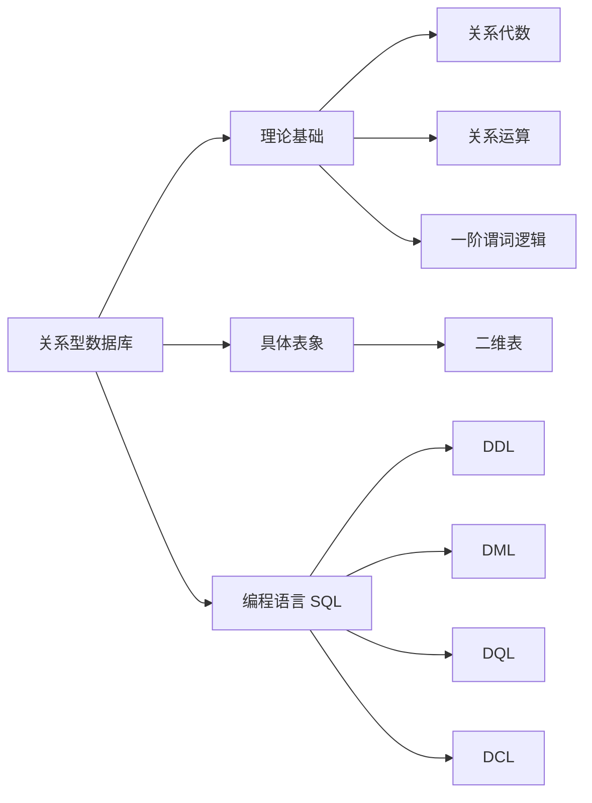

# 前言

本博客学习自：黑马程序员 mysql 入门网课，b站 骆昊jackfrued 老师 mysql 网课，以及博主自己课内学习的数据库课程，侵删！

课内学习的课程内容因为是英方课，包括一些不常用的概念和英文，更注重整体框架的理解，大致了解即可。

# 安装配置

MYSQL 的安装配置网上一搜一大把，博主就不在此发表拙见了，安装太久了自己也记不是很清具体方法了。这里指跟随课程学习了 Command Line Client 的安装（说实话，这玩意我自认为没啥用）。

Mysql Command Line Client 是官方提供的客户端。之前一直直接用 Windows 的命令提示符窗口输入 Mysql 语句，不知道两者具体区别在哪里。不过还是重新安装了一个尝试一下。

如果选择的是 zip 下载，应该只会安装一个 mysql 文件包，在程序终端可以使用。

如果是选择 msi 文件安装，MYSQL 文件夹里自带有 Installer，在里面选中对应电脑版本的 Mysql Server 下载即可。

由于安装目录和 Mysql 不一致，缺少配置文件 my.ini 导致 Mysql Command Line Client 一开始无法使用。直接把 Mysql 里的 my.ini 复制到 Mysql Server 目录下就可以了。

# 常用命令

其实在 cmd 窗口中登录 mysql 时也会给出相应的命令提示，只是当时没有仔细研究。正好借使用 Mysql Command Line Client 的机会了解一下常用的命令。

开始菜单中出现了两种不同的 Mysql Command Line Client 窗口，区别只是其中一种支持 Unicode ，一种不支持。打开后即会提示输入登录密码，登录后就和 cmd 窗口中操作基本一致。

| 命令                              | 作用                                                |
| --------------------------------- | --------------------------------------------------- |
| \h, \?, ?                         | 获取帮助                                            |
| \c                                | 清除前面输入的内容（内容输入有误时使用）            |
| \R                                | 修改 每次输入命令前左侧的提示样式（默认：'mysql>'） |
| ? 需要查看帮助的命令;             | 显示该命令的帮助（如：? show）                      |
| show databases; show databases(); | 查看所有数据库，查看当前所在数据库                  |
| use '数据库名';                   | 选中某个数据库                                      |
| （选中某个数据库后）show tables;  | 查看当前数据库中所有表                              |
| exit / quit                       | 退出                                                |

# 关系型数据库

数据库有很多种结构，mysql 学习的是关系型数据库，说白了就是二维表的结构。



DDL: create / drop / alter （database 或 schema 数据库名 / table 表名）

DML: insert / update / delete

DQL: select …… from

DCL: grant（授权） / revoke（召回权限）

| 正式的关系模型术语 | 非正式的日常用语                     |
| ------------------ | ------------------------------------ |
| 关系（relation）   | 表（table）                          |
| 元组（tuple）记录  | 行（row）或记录（record）            |
| 势（cardinality）  | 行数（number of rows）               |
| 属性（attribute）  | 列（column）或字段（field）          |
| 度（degree）       | 列数（number of columns）            |
| 定义域（domain）   | 列的取值集合（pool of legal values） |

# ER 和 EER 模型

## 介绍

为什么要有 ER 图和 EER 图的存在？

**真正做项目、设计数据库时，**实际并没有这么简单，比如还有很多用户看不到、但为了方便 DBA 使用而创建的字段。如 id，一般还会有两条 Date 字段（一表示这条记录被创建的时间，二表示这条记录最后更新的时间），以及预留一个 VARCHAR / json 字段；还有一些其他注意事项（比如 auto-increment 约束其实开发中不常用，更多使用算法比如分布式 ID 生成算法（如 SnowFlake……）当然对课程来说这并不重要）**是不可能一上来就写 SQL 语句的，需要先设计表的结构和表之间的关系。**

### ER 模型

ER 图（Entity Relationship, 实体关系）因此出现。下图是一个 ER 图的示例，其中矩形框代表：表（也就是实体），椭圆框代表：表中的字段（实体的属性），菱形框代表：关系，在连接线上表明了关系的重数。


相较于大段的 SQL 建表语句，只要能看懂 ER 图，表的结构、关系一目了然。

### EER 模型

以下部分内容有参考自文章：[为了彻底搞清楚数据库 E-R 模型设计，我肝了这篇万字长文 - 知乎 (zhihu.com)](https://zhuanlan.zhihu.com/p/356216273)

关于两者的具体区分我还有去问b站up主 骆昊jackfrued 老师，老师表示：不用太纠结这个问题，ER图更抽象，可以理解为概念模型图（PowerDesigner）。

相较 ER 模型多了泛化层次、汇集层次、弱实体等概念。

#### 泛化层次

包括 generalization 和 specialization （泛化和特化）、父类（superclass）和子类（subclass）的概念。

**子类父类**就是类似 Java 的继承，如动物是父类，猫、狗是其子类。**子类父类是一对一的关系！**

**泛化**又叫归纳，就是将几个类的共同属性提取出来作为父类；

**特化**又叫演绎，就是在父类的基础上添加各自特殊的属性作为子类。

其中，子类和超类又有两个关系属性：mandatory 和 optional、disjoint 和 overlapping。

**mandatory / optional**：父类中的所有属性都必须包含在每一个子类中 / 不用全部继承，选择部分继承即可（完全性限制）

**disjoint / overlapping**：继承同一个父类的几个子类之间是否可以有相交的属性（相交性限制）


图中 运输工具是父类，飞机、火车、汽车是子类。圆圈中写 D / O，表示 disjoint / overlapping。父类和圆圈之间是双实线，表示是 mandatory 完全性继承。

#### 汇集层次

Aggregation, 汇集层次不再有父类子类的区别，而是由……组成的区别。


如图，房间、门窗、电脑、投影仪等是教室的组成部分，不是继承关系。

#### 弱实体

一种实体只有另一种实体存在的时候才有意义。如父母和子女，少了一方另一方就没有意义了。


Workbench 等工具支持画 ER 图，甚至画好后可以自动生成 SQL 语句建表。 Workbench 中的图是 EER 图（扩展的ER 图）


在 EER 图下，点击 DATABASE - FORWARD ENGINEER 正向工程，可以选择要生成的表、字段，生成 SQL 语句建立表。

*自动生成的 SQL 语句中，外键下方有两句话`ON DELETE NO ACTION` `ON UPDATE NO ACTION`，意为：当外键参考的主键修改/删除时，外键所在的表会受到什么样的影响？——不采取任何行动。建议去掉这两句话。如果去掉，就不能随便修改/删除外键在使用的主键。*

同样地，在 SQL 语句页面，点击DATABASE - REVERSE ENGINEER 反向工程，可以根据表的结构生成 EER 图。

*Power Designer 建模工具，也支持正 / 反向工程，可以生成 SQL 方言。完整版付费。*

# 数据类型

数据类型可以通过 `? data types` 查看说明，每种数据类型也可以通过 `? 数据类型` 查看。

*除了data types 其他可以用?查看的内容可以输入 `? contents` 查看。*

| 数据类型                                            | 作用                                                         |
| --------------------------------------------------- | ------------------------------------------------------------ |
| 整数 (tinyint, smallint, mediumint, int, bigint)    | 都是整数型，表示范围为1,2,3,4,8 B（结尾还可以加 unsigned）   |
| 字符串 (char(位数), varchar(位数), text)            | char 长度固定，varchar 长度可变                              |
| 小数 (float, double, decimal(总位数, 小数点后位数)) | 不要用 float, double！                                       |
| 时间日期 (year, date, time, datetime, timestamp)    | date：年月日<br />time：时间<br />datetime：年月日时分秒<br />timestamp：时间戳，现在距离 1970-1-1 的毫秒数 |
| Mysql 中的枚举类型 (enum, boolean)                  |                                                              |

PS: 

1. 虽然 text 等类型可以存储很大的数据，不过大数据一般还是不会直接往数据库里存储。如图片，数据库中一般存储其路径、链接。如果非要存储，有 blob (binary large object)。

2. 金额等小数一般不会用小数的数据类型存储，而是整数类型/100使用。因为小数形式有误差，比如0.1+0.2=0.30000000004.

3. decimal 这种变长的数据，使用时速度比定长数据慢。而且 decimal 表示范围也有限，不如直接用 bigint。

4. 时间戳是有表示范围的，毕竟是个有上限的数，到2038年左右就不好用了。

这里了解到了一个很有趣的“千年虫”问题 ([漫画：什么是“千年虫”问题？ - 知乎 (zhihu.com)](https://zhuanlan.zhihu.com/p/305603895))。

   >Grace Murray Hopper，最早的现代编译器、商用编程语言发明者，Bug 和 Debug词汇的流行使用也与她有关。
   >
   >早期计算机资源十分稀缺，内存空间必须精打细算。Grace Murray Hopper 采用6位数字组合来存储日期信息 （比如2022/04/19，就是22/04/19）
   >
   >尽管节约了内存空间，但是40年后1999->2000年时，问题就出现了……对计算机来说，相当于99->00年，年份倒退了。小到银行存款利息变成负的，大到飞机、发电厂运作、核弹发射……都可能出现故障，后果不堪设想。
   >
   >如果修改所有程序，是改不过来的。于是程序员们主要采取两种方法：
   >
   >1.只修改核心关键的医疗、航空、金融、军事领域的程序；
   >2.对于大多数不那么核心的程序，采用时间窗口的方式。1910年代表2010年，1920年代表2020年，暂缓问题。在这20年期间，大多数程序设备都已更新换代，现如今千年虫问题已经不那么严重了。

回到刚才的话题，因此时间戳也并不推荐使用。

5.7 之后版本的 Mysql 支持 json 属性，以键值对的方式存储，内容相对灵活。因为虽然数据库结构相对严谨，但是很多时候并不是所有属性都能考虑得到（如二手交易平台，不同的售卖品属性差的很多，如自行车和冰箱）加入相对灵活的 json ，一定程度上就能解决这类问题。包括以前 Mysql 没有这个功能的时候，许多公司也会建一个 varchar() 字段来存储 json 字符

# DDL

| SQL 语句 | 作用                | 使用示例                                                     |
| -------- | ------------------- | ------------------------------------------------------------ |
| create   | 创建数据库 / 表     | create database \`数据库名\`; / create table \`表名\` ( 字段描述 ); |
| drop     | 删除数据库 / 表     | drop database \`数据库名\`; / drop table \`表名\`;           |
| use      | 选中数据库          | use \`数据库名\`;                                            |
| alter    | 更改数据库 / 表信息 | alter table \`表名\` add constraint \`约束名\` unique (\`字段名\`); |

PS： 

修改表的引擎 / 更改自增约束初始值是在 create table \`表名\` () 后面添加的。

```mysql
create table `表名`(

)engine = innodb auto_increment=2 comment '表示例';
```

## 约束

### 主键约束

```mysql
primary key (`列名`),
```

*复合主键语法上没错，但是开发使用时非常不好用，因为需要至少两条字段才能唯一确定一条记录。一般不会用。*

*如选课表，有课程号和学生学号字段，合在一起作为复合主键可以唯一确定记录。但是一般会在新建一个选课id之类的可以唯一确定所有选课记录的字段作为主键。*

### 默认约束

`default val;` 设置默认值。

### 自增约束、非空约束

都在字段描述后面写即可

```mysql
`col_name` int auto_increment not null comment '列名',
```

```mysql
# 创建表时：
create table(
    id int primary key comment 'id';
	age int check (age>=0 && age<=100) comment '年龄',
	gender char(1) default 'm' comment '性别'
);

# 修改表时，主键，unique，check，外键用 add，其他用 modify
alter table add primary key(列名);
alter  table table_name modify 列名 数据类型  not null;# 如果是 null，就是取消非空约束
```

### 唯一约束

```mysql
constraint `uk_col_name` unique (`col_name`),
```

类似主键约束，唯一约束也可以设定多个字段，再括号里多写几个字段就行（如选课记录，一个学生不能重复选课，学生学号和课程编号不能重复）

### 检查约束

检查约束可以帮忙检查数据合法性，但是相对的，肯定对性能有损耗。

```mysql
constraint `ck_col_sex` check (`col_sex`='M' or `col_sex`='F'),
```

### 外键约束

首先在需要加外键的表中添加和另一个表的主键一样格式（名称可以不一样）的字段。

外键约束也会损耗性能，要检查对应表中对应字段是否对应。很多公司都不用外键约束，会通过其他方法确定两表特定字段是否对应。

```mysql
# 外键需要先创建一个字段，然后给这个字段添加外键。原外键的字段和新的要添加外键的字段数据类型要一样。
alter table 子表名 add constraint 外键名 foreign key (要添加外键的字段) references 父表名(父表字段);

alter table 表名 drop foreign key 外键名;
```

*一对多时，多的一方需要加外键约束。*

之后子表引用了父表，父表被引用的记录就不能随便删除了。子表也不能随便写外键的值，必须要在父表中存在才可以引用。

| 外键删除更新行为   | 说明                                                         |
| ------------------ | ------------------------------------------------------------ |
| no action/restrict | 父表要删除/更新的记录如果在子表中存在关联记录，则不删除/更新 |
| cascade            | 父表要删除/更新的记录如果在子表中存在关联记录，则子表中的记录也删除/更新 |
| set null           | 父表要删除/更新的记录如果在子表中存在关联记录，则子表中的记录对应字段设为空值（前提：该字段可以为 null） |
| set default        | 父表要删除/更新的记录如果在子表中存在关联记录，则子表中的记录也删除/更新对应字段设为默认值 |

```mysql
alter table 子表名 add constraint 外键名 foreign key (要添加外键的字段) references 父表名(父表字段) on update cascade on delete cascade;
```

# DML

## 插入

```mysql
insert into `表名` values (对应字段值)(对应字段值)(对应字段值);//写多个括号，可以一次填写多行
insert into `表名` (要填写的字段) values (对应字段值); //省略不写的一定是有默认值的或者可以非空的
```

注意：对应字段值一定要和字段相匹配。如果有默认值的字段也不要省略不写，要写上 `default` ，不然系统也难以分辨哪一项使用默认值。

*日期可以写字符串 2002-01-01，会自动转换*

插入完后显示：1 row(s) affected（如果写了多个括号，一次插入多行，会显示多个 row(s) affected）是影响了几行的意思。

**如果主键、unique 的记录重复会报错。**报错显示： `duplicate key for key '定义的约束键名称'`

**填写了规定的 check 以外的内容会报错。**报错显示：`check constraint '定义的约束键名称' is violated.` 不过字符串不区分大小写，规定性别只能填 'F' 'M' 的话，填 'f' 'm' 也行。

**如果对应的外键在原表中没有对应的记录会报错。** 报错显示：`cannot add or update a child row: a foreign constraint fails` 比如学生表的学院号参照了学院表，但是有学院表中不存在的学院号时。

**如果没有给 NOT NULL且没有默认值的字段赋值时会报错。** 报错显示：`Field '字段名' doesn't have a default value.` 尽量不要出现空列，之后处理空值会带来很多麻烦。哪怕用空字符串、0、1代替也更好一些。

## 删除

```mysql
delete from `表名`;//这可不兴用啊！
delete from `表名` where `字段名`='要删除的记录的对应字段值';//不等于可以用<>，有的 DBMS 支持!=
delete from `表名` where `字段名` = '字段值' or `字段名` = '字段值';//根据多个条件删除语句
delete from `表名` where `字段名` in ('字段值','字段值');//删除多条语句
```

但是如果要删除的这条记录在其他表里是外键，就无法删除。报错显示： `Cannot delete or update a parent row` 。

删除了外键约束之后就可以随意修改两个表对应的值而不报错了。

另一种删除表的方式是：

```mysql
truncate table `表名`;
```

截断表，这个比 delete 还要危险。delete 了表之后，如果有日志，还是可以找回原数据的。截断就算有日志也没法恢复。

## 更新

```mysql
update `表名` set `列名` = '值';//把这一列的数据全都改成这个值，不常用
update `表名` set `列名` = '值',`列名` = '值',`列名` = '值' where `字段`='值';//限制条件，只修改某几个记录
```

# DQL

学习自b站骆昊jackfrued 老师的网课以及黑马网课。

查询语句。

*本节中使用到的例子：主要包含 tb_student 学生表（学号 stu_id，姓名 stu_name，地址 stu_address,所属学院号 col_id）*

*tb_record 记录表，连接学生和所选的课 id 及课程成绩（学号 stu_id，课程号）*

## 编写顺序、执行顺序

编写顺序如下：`select from where group by having order by limit;`

执行顺序：

1. from 表名

2. where 条件（where 可以用表别名，但是不能用 select 中的字段别名）
3. group by 分组
4. having 分组条件
5. select 投影
6. order by 排序
7. limit 分页

## Select

查询所有学生的所有信息

```mysql
select * from `表名`;-- * 号表示所有字段
```

但是这样有一点影响效率，会先查出学生表中有哪些列，再查询这些列的数据。

实际使用一般都是手动写上所有要查询的字段。（投影 Projection，只查询某几列）

```mysql
select `stu_id`,`stu_sex`,`stu_name`,`stu_address` from `tb_student`;
```

如果只查询部分列，就只写那几列就行。

## 联合 Union

Union 会把查询结果联合起来。

union all：结果可能重复。

union：重复的结果合并。

**想做union操作，两个要联合的表必须字段数相同，字段类型匹配。**

## 别名

给字段或表起别名—— alias，简写为 as。

```mysql
select `stu_id` as `学号` from `tb_student`;
```

as 可以省略，不过还是写上可读性高一些。***一般字段不省略，表省略**。具体还得看公司编程规范的要求，没有就看个人喜好了。*

## 条件

限制查询记录的条件——where（选择 Selection，只查询某几行）

```mysql
select * from table where `stu_sex`='M' or `stu_name`='Jingqing';
```

多个条件之间用 or 连接就是或者的关系，满足一个即可；用 and 连接就是和的关系，同时满足。

*性能问题，一般不用 or 而使用 union，结果取并集。*

```mysql
select * from table where `stu_sex`='M' 
union
select * from table where `stu_name`='Jingqing';
```

***如果在 union 后面加 all，意思是并集不会去掉重复的部分，相交的部分会显示两遍。***

类似 10<x<30 的形式不可以直接写两个等式，要拆成 x>10 and x<30 。

这里的字段如果是数字类型的，也可以进行 + - * / % mod（也是取余）以及 < >  = >= <= <> 等形式的运算。

还有一种条件写法是 `between …… and ……` 

```mysql
select * from table where `stu_age` between 10 and 30;-- 相当于 <=30 and >=10
```

## 分支结构

如果 sex 是布尔值，1代表男，0代表女，怎么把0和1处理成对应的性别？

```mysql
select if(`stu_sex`,'男','女') as '性别' from `tb_student`;-- 有点类似三目运算符 ?:
```

if 中第一项可以是表达式，如 age > 10.

**这个是 Mysql 数据库的方言，只能在 Mysql 数据库中生效。**比如 Oracle 数据库中对应的函数是 decode，不能通用。

通用的分支结构：

```mysql
select case `sex` 
when 1 then '男' 
elseif 0 then '女' 
else '未知'
end as '性别' from `tb_student`;-- end 表示条件判断结束
```

## 模糊查询

如：查询所有姓王的学生。

```mysql
select * from `student` where `stu_name` like '王%';-- % 代表零个或多个任意字符，表示查询姓的且名字只有2个字的学生
select * from `student` where `stu_name` like '王_';-- _ 代表一个任意字符，表示查询姓王的且名字只有2个字的学生
```

这里和正则表达式有一定联系，之后会单独学习。

2023-01-23 补档：我后来确实学习了正则表达式~学习笔记在这里：[Regex_灰海宽松的博客-CSDN博客](https://blog.csdn.net/jtwqwq/category_11807727.html?spm=1001.2014.3001.5482)

事实上 Mysql 语句也支持正则表达式的，正则表达式也比这两种模糊查询的通配符功能强大很多。

```mysql
select * from `student` where `字段名` regexp '正则表达式';
```

模糊查询，特别是 % 在左侧的时候，性能还是比较差的，尽量避免。

## 空值处理，以及三值逻辑

**下面两种写法是错误的！**

```mysql
select * from `student` where `stu_address` = null;
select * from `student` where `stu_address` <> null;
```

因为表达式产生的值有三种（三值逻辑），true, false, unknown。和空值做运算的时候，就会得到 unknown 的结果。

正确做法：

```mysql
select * from `student` where `stu_address` is null;
select * from `student` where `stu_address` is not null;
```

## 去重

```mysql
select distinct `字段名` from `表名`;
```

## 排序

```mysql
 select `字段名` from `表名` order by `字段名1` asc, `字段名2` desc; -- asc: 默认，ascending，升序；desc：descending，降序
```

order by 后面跟多个字段，就是先按字段1排序，字段1相等时再按字段2排序。

## 当前日期

curdate()获取当前日期，使用 datediff(datepart, date1, date2) 函数可以和出生日期做差获取年龄。

now()获取当前年月日时分秒（datetime）。

## 取整

floor() 函数是下取整。floor(3.99) = 3.

ceil() 函数是向上取整，ceil(3.1) = 4.

round() 函数是四舍五入，第二个参数是保留几位小数的意思，round(3.5,0)=4

```mysql
select floor(datediff(curdate(),`date`)/365) from `staff`;
```

*可以通过? functions 查看函数一览。还会有相应的例子提示~*

## 聚合函数

描述性统计信息：包括集中趋势和离散趋势。

集中趋势：平均值，中位数等。

离散趋势：方差，标准差等。

聚合函数属于 SQL 语句，所有 DBMS 都能用。

- min(字段名)

- max(字段名)

- avg(字段名) *做计算的时候会忽略 null 值*

- sum(字段名)

- count(字段名) *做计算的时候会忽略 null 值*

  ***如果利用 sum()和count() 做除法求平均值，要考虑空值对结果的影响。***

  *比如有10个学生，但有一个学生的成绩为空，如果忽略掉成绩为空的学生， sum(score) / count(stu_id) 就是错误的，因为是9个人的成绩 / 10.* 

  *如果成绩为空的学生视为 = 0，就要用 sum(score) / count(stu_id)，或者对 avg() 函数做如下处理：*

  ```mysql
  select avg(ifnull(`score`,0)) from student;-- 如果第一个表达式!=null，则返回第一个表达式
  ```

  *ifnull() 函数也是 mysql 的方言，类似 if。在 Oracle 中就是 nvl。*

  coalesce() 也可以处理空值，是标准数据库的函数，它会取第一个非空值。如：coalesce(score, 0)。

- std(字段名)，计算标准差，越小说明越稳定。

  + std(), stddev() 和 stddev_pop()：所有数据总体的标准差
  + stddev_samp()：样本标准差，抽样计算。

- variance(字段名)，计算方差，标准差的平方。

  - variance(), var_pop()
  - var_samp()

## 分组

聚合函数通常和分组一起使用。分组是非常重要的操作。

```mysql
select avg(`score`) from `student` group by `sex`;
```

PS： Excel 的数据透视表有同样功能：

插入-数据透视表-选择所有数据范围（选中左上角的单元格，Ctrl + Shift + →，Ctrl + Shift + ↓选中所有有数据的单元格）-选择放置数据表的位置（选择某一列的第一行的单元格，如 J1 或 K1 ）-确认

行里选择要分组的列（如：销售区域）值选择要分组运算的对应值（如：销售额），值默认做的就是求和运算。

```mysql
select * from `student` group by `sex` with rollup; -- with rollup: 在最后一列求个总和
```

group by 后面也可以跟多个字段，先按第一个分组，然后在每个组里再按第二个分组。

**如果进行了条件查询，用到了 group by 得到的结果，不能直接用 where，要使用 having.**

```mysql
select `stu_id`,avg(score) from `Score` where avg(score)>90 group by `stu_id`; -- 错误
select `stu_id`,avg(score) from `Score` group by `stu_id` having avg(score)>90; -- 正确
```

分组以前的筛选： where, 写在分组后

分组以后的筛选： having, 写在分组后。

*其实这里个人有一个小误区：select 不用非得查出 avg() 才能做 having 条件判断。比如要查询平均成绩大于90分的学生学号，就可以改成：*

```mysql
select `stu_id` from `tb_record` group by `stu_id` having avg(score)>90;
```

*也是没有问题的。*

查询 1111,2222,3333三门课程平均成绩大于90分的学生的平均成绩：

```mysql
select `stu_id`,avg(score) from `Score` where `cou_id` in (1111,2222,3333) group by `stu_id` having avg(score)>90;
```

## 子查询

子查询 (subquery) 的用途：

- 集合成员资格，判断某一元素是否是某一个集合的成员
- 集合之间的比较，某一个集合是否包含另一个集合等
- 集合基数的测试，测试集合是否为空，测试集合是否存在重复元组。

查询年龄最大的学生的姓名。

可以先查询出最大年龄，再查询学生表中年龄等于这个值的学生姓名。

一种方法是嵌套子查询：

```mysql
select `stu_name` from `tb_student` 
where `stu_birth` = (
    select min(`stu_birth`) from `tb_student`
);
```

另一种方法是定义变量：mysql 定义变量，需要加@（但是不能把多个值赋给一个变量！）

```mysql
set @a =(select min(`stu_birth`) from `tb_student`);
select @a; -- 可以查看一下 @a 的值。
```

如果子查询有很多结果，满足其中一个即可：不能用等号，要用 **in** 。

```mysql
select `name` from `tb_student` 
where `stu_id` in (
    select `stu_id` from `tb_record` group by `stu_id` where count(*)>=2
); -- 查询出所有至少选了2门课的学生姓名
```

如果用了等号，报错： subquery returns more than 1 row.

标量子查询：结果为一个。可以做> < =操作。

列子查询：结果为一列。可以做 IN NOT IN SOME ALL ANY 操作。（ANY SOME 等价）

行子查询：结果为一行。可以做 = <> IN NOT IN 操作。

表子查询：结果为多行多列。最常用 IN NOT IN 操作。

## 多表连接

一对一，一对多，多对多（两个一对多）

一对一：其中一方设置unique的外键。

一对多：多的一方设置外键。

多对多：建立中间表，设置两个外键。

### 笛卡尔积

```mysql
select `stu_name`,`stu_id`,`col_name`,`tb_college`.`col_id` from `tb_student`,`tb_college`;
```

如果不加条件的从两个表中投影出数据，就会获得两个表中所有记录的笛卡尔积，即排列组合。

本例中，学生表和学员表中都有学院号 col_id 字段，因此投影该字段的时候需要指明是从那个表中得到的，用 表名.字段 指定。

### 自然连接

1. 有外键约束：利用外键连接，不用加条件，自动连接。

```mysql
select `stu_name`,`stu_id`,`col_name`,`tb_college`.`col_id` 
from `tb_student` natural join `tb_college`;
```

2. 没有外键，但是两个表中有同名的列（如本例中两个表中都有 col_id 列）也可以进行自然连接。*注意：不管有几个同名的列，所有列都会作为连接的条件！*
3. 如果没有外键也没有同名列，就只会得到笛卡尔积的结果。

### 内 / 外连接

另一种连接方式是 inner join / outer join 

或者用 `where A.id=B.id` ，这种内连接方式叫做隐式内连接。

```mysql
select `stu_name`,`stu_id`,`col_name`,`tb_college`.`col_id` 
from `tb_student` inner join `tb_college` 
on `tb_student`.`col_id`=`tb_college`.`col_id`; -- 查询所有学生的姓名、学号、对应的学院名、学院号
```

inner join：只有左表中有的记录，而且在右表中能找到对应的记录才会呈现出来。

left outer join：左表中所有内容都会呈现出来，右表中如果没有对应的内容补 null。

right outer join：右表中所有内容都会呈现出来，左表中如果没有对应的内容补 null。

full outer join：左右表数据全拿出来，没有对应的内容都补 null。但是 mysql 并不支持全外连接，可以用左外连接 union 右外连接代替。

### 自连接

```mysql
select * from A AS1 inner join A AS2 where 条件;-- 自连接可以是内或外连接。必须起别名！！！
```

### θ 连接

添加条件使得两个表中的数据相互对应：

```mysql
select `stu_name`,`stu_id`,`col_name`,`tb_college`.`col_id` from `tb_student`,`tb_college` 
where `tb_student`.`col_id`=`tb_college`.`col_id`; -- 查询所有学生的姓名、学号、对应的学院名、学院号
```

### 三表连接

链接条件用多个条件筛选。

```mysql
select `stu_name`,`tb_student`.`stu_id`,`tb_course`.`cou_name`,`tb_course`.`cou_id` from `tb_student`,`tb_course`, `tb_record`
where `tb_course`.`cou_id`=`tb_record`.`cou_id` 
and `tb_student`.`stu_id`=`tb_record`.`stu_id`;

select `stu_name`,`tb_student`.`stu_id`,`tb_course`.`cou_name`,`tb_course`.`cou_id` from `tb_student`
inner join `tb_record`
on `tb_student`.`stu_id`=`tb_record`.`stu_id`
inner join `tb_course`
on `tb_course`.`cou_id`=`tb_record`.`cou_id`
where `tb_course`.`cou_name` is not null; -- where 写在最后

select `stu_name`,`tb_student`.`stu_id`,`tb_course`.`cou_name`,`tb_course`.`cou_id` from `tb_student`
natural join `tb_record`
natural join `tb_course`;
```

## 查询小技巧

百度搜索：filetype:pdf python 搜索带 python 名的 pdf 文件

python -推广链接 不想看到广告推送

site:zhihu.com python 只搜索知乎里的 python 内容

2023-01-23 补充：关于信息检索，博主也有开一个新坑：[信息检索_灰海宽松的博客-CSDN博客](https://blog.csdn.net/jtwqwq/category_12158048.html?spm=1001.2014.3001.5482)。目前更新还不完全，不过对于搜索引擎部分应该足够用了。

## 分页查询

limit 是 mysql 的**方言**。

limit 查询最值有个缺陷，就是只能查出一条。如果有两个最大值就只能显示一个。

```mysql
select * from `tb_student` order by `stu_id` desc limit 5;-- 只显示前五条数据.如果不足5条，就有几条显示几条。
select * from `tb_student` order by `stu_id` desc limit 5 offset 3;-- 只显示4-8条数据(跳过前3条数据)
select * from `tb_student` order by `stu_id` desc limit (3,5);-- 只显示4-8条数据(跳过前3条数据)
```

## 派生表

select 的返回值也是一个关系。（关系运算的封闭性，关系的运算仍然是关系）

查询学生姓名和平均成绩。

查询学生学号和平均成绩的话，可以在 tb_record 表里根据学生学号分组，然后投影出来。但查询学生姓名有需要拿着对应的学号去学生表里连接，要怎么把学生姓名和学生平均成绩关联起来呢？

先通过一个查询，得到一个派生表：

```mysql
select `stu_id`,avg(score) from `tb_record` group by `stu_id`;
```

然后把其结果作为一个新表，和学生表做关联。

```mysql
select `stu_name`,`avg(score)`from `tb_student`
natural join (select `stu_id`,avg(score) from `tb_record` group by `stu_id`) `tb_derived`;-- 最后是起别名的意思
```

**临时表必须要起别名！！！**不然报错。

**注意：查询学生姓名和选课数 和 查询每个学生姓名和选课数的区别！**因为有的同学没有选课，如果用 natural join，inner join，就只能查询到选了课的学生，**没选课的学生就不会查出来。**

如果要查询每个学生，就要用到外连接。没选课的学生选课数显示 null。（当然可以用 ifnull(字段, 0) 把 null 替换成 0。记得 ifnull 是 mysql 方言）。

# DQL 例题及注意事项

## 简单排序——查询最大值、次大只

1. 员工表中含有员工号、姓名、薪水、职位、补贴 、所在部门等信息。查询薪水最高的员工姓名和薪水值。

   做法①：最普通的子查询，先查出最大工资值，再筛选出员工表中工资值等于这个数的员工。

   做法②：limit 做法。先按薪水降序排序所有员工，再只 limit 1 取第一条员工信息。这种做法的局限性在 limit 介绍的时候我也有写，就是当最值不只一位的时候，这种方法只能查出1位员工。

   做法③：查询一名没有人薪水比他大的员工（即：薪水大于这名员工的员工数=0）。

   ```mysql
   select `ename`,`salary` from `tb_employee` t1 where(
       select count(*) from `tb_employee` t2 where `t2`.`salary`>`t1`.`salary`
   )=0;-- 结尾改成1，就是工资第二高的人
   ```

2. 查询除了 boss 外工资最高的人。

   在题1的基础上，用 where 排除掉 boss。

   ```mysql
   select `ename`,`salary` from `tb_employee` 
   where `salary`=(
       select max(salary) from `tb_employee` where `position`<>'boss'
   );
   ```

3. 查询月薪 top 3的人。

   这时出现了和题1一样的情况。用 limit ，可能会漏掉工资并列的第四人；因此，这里用题1的方法③最合适。

   ```mysql
   select `ename`,`salary` from `tb_employee` t1 where(
       select count(*) from `tb_employee` t2 where `t2`.`salary`>`t1`.`salary`
   )<3 order by `salary` desc;
   ```

4. 查询所有员工的姓名和年薪。年薪计算公式：月薪*12+补贴。

   题目很简单，但是**遇到计算一定要注意数据是否 Not Null，如果出现 Null 数据结果也会变成 Null。**要用 ifnull() 或 coalesce() 函数限制一下。

5. 查询所有部门名称及员工人数。

   部门名称在部门表中，每个部门的人数则需要根据员工表中部门号统计。显然这里要先查出员工表的员工号和统计员工信息，再把结果表和部门表做连接。**重点注意几种连接的不同，思考一下题中哪个信息要全部展示出来。**比如此题，即便有的部门没有员工，也要显示出来，因此应该部门表 left join 派生表。

   ```mysql
   select dname,total from `tb_department` t1
   left join (
       select dname, count(*) as total from `tb_department` t2 group by `dno`
   ) on t1.`stu_id`=t2.`stu_id`;
   ```

6. 查询每个部门比本部门平均薪水高的员工名及薪水。记得说清楚列属于哪个表，不然报错 ambigious

   先按部门分组，查询出平均成绩和员工号表；再通过部门号和员工表连接，并筛选出薪水值大于平均值的。

   ```mysql
   select sname,salary from `tb_employee` t1
   inner join (
   	select avg(salary),dno from `tb_employee` group by dno;
   )t2 on t1.dno=t2.dno and t1.salary > t2.avg(salary);-- 两个连表条件
   ```

7. 查询每个部门中薪水最高的员工的用户姓名、薪水、部门名称。

   派生表通过薪水值、部门号和员工表、部门表相连接。

8. 查询薪水排名4-6员工的薪水、姓名、**排名**。

   问题1：怎么查出排名？

   问题2：这题并没有想象中的简单。比如员工薪水前8名是5000,5000,4000,4000,3000,3000,3000,2000，那么其实第三、第四人两个人并列第三，4-6显示的排名值就应该是3，5，5

   解决：mysql 8的窗口函数可以解决排名 / top N 问题。

   ①不用窗口函数：

   系统变量一般不写@或写两个@@（可以通过 show variables 查询），自己定义的变量写一个@，赋值的方法：`set @a=0;`或`select@a:=0;`而且变量也可以通过 as 起别名。

   我们先定义一个变量，变量从0开始，每次选择＋1，就可以当做序号用了。

   ```mysql
   set @a=0;
   select row_num,ename,salary from (
   	select @a=@a+1 as `row_num`,ename,salary,(select @a:=0) -- @a 重新赋值为0
       from `tb_employee` order by salary desc
   ) where `row_num` between 4 and 6;-- 子查询中做了几次查询，@a 就加几次
   ```

   注意不要在括号里用 limit 3 offset 3，因为这样的话子查询就只会进行3次，@a 的值就只会从1到3.

   另外，每次查询时都要重新给@a 赋值为0，不然其值会累加。

9. 查询每个部门薪水排名前两名的员工。

   Top N 问题通过题1的做法③解决。

   ```mysql
   select eno,ename,salary,dno from `tb_employee` t1
   where (
   	select count(*) from `tb_employee` t2 where t1.`dno`=t2.`dno` and t2.salary>t1.salary
   )<2 order by t1.dno asc, t1.salary desc;
   ```

## 窗口函数

内容来自：[通俗易懂的学会：SQL 窗口函数 - 知乎](https://zhuanlan.zhihu.com/p/92654574)

应用于组内排名和 Top N 类问题。 一般是处理 where 和 group by

窗口函数不光是函数，有一套完整的语法。

```mysql
<窗口函数> over (partition by <用于分组的列名>
                order by <用于排序的列名>)
```

<窗口函数> 处放聚合函数或专用窗口函数。

窗口函数是以一个列的形式使用的。

### 专用窗口函数

rank、dese rank、row_number

看图即知区别。


### partition by 和 group by 的区别

partition by 是把所有数据分成绩一个窗口，而并不汇总。比如上图中，如果按班级号分窗口再进行排序，就会在每个班级内部从1到无穷排序。不写的话就默认整个表是一个大窗口。

group by 是分组后汇总。


使用：

```mysql
select `ename`,`sal`,
rank() over (order by `sal` desc)as `r1`,
dense_rank() over (order by `sal` desc)as `r2`,
row_number() over (order by `sal` desc)as `r3`
from `tb_emp`;
```

第八题窗口函数做法：加一个 where r between 4 and 6 的条件。

第九题窗口函数做法：因为产生了分组，因此不能直接用 where r <=2。但是**窗口函数的分窗口后的列做筛选，既不能直接用 where 也不能用 having**。应该把窗口函数的查询结果作为一个派生表，再用 where 做选择。

```mysql
select `ename`,`sal`,`dno`
from(
    select `ename`,`sal`,`dno`,
    rank() over (partition by `dno` order by `sal` desc)as `r`
    from `tb_emp`
) `temp` where `r`<=2;-- 不能在派生表里直接筛选
```

*窗口函数性能还是比较差的，业务中不应使用，数据分析师可能会常用一些。*

# DCL

Data Control Language，给用户授权，不同用户能操作数据权限也是不一样的。主要是 DBA 使用。

```mysql
select * from user;
create user '人名'@'域名' identified by '密码';-- 添加一个用户，并且限制这个人只能通过这个域名访问。域名如 localhost，%代表任意路径
alter user '人名'@'域名' identified with mysql_native_password by '新密码';-- with mysql_native_password 是 mysql 的修改方式
drop user '人名'@'域名';
```

如果数据库本来就是在局域网里，那么即便改了权限，公网也是访问不到的。

查看权限：

```mysql
select grants for '用户名'@'主机名';
```

授权：

```mysql
grant 权限 on 数据库名.表名 to '用户名'@'主机名';
```

数据库名和表名可以用通配符 * 代替。

权限包括： all (privileges), select, insert, update, delete, alter, drop, create

```mysql
grant select on hrs.* to '人名'@'%';-- 这个人对 hrs 数据库下所有表都有查询权限，但是不能增删改
grant insert, delete, update on hrs.* to '人名'@'%';
grant all privileges on *.* to '人名'@'%';-- 这个人对所有数据库所有对象拥有所有权限
grant all privileges on *.* to '人名'@'%' with grant option;-- 这个人不仅有所有权限，还能授予权限给别人
```

召回权限：revoke

```mysql
revoke 权限 数据库名.表名 from '人名'@'%';
```

添加权限之后最好 Reconnect 刷新一下。或者执行：

```mysql
flush privileges;
```

Workbench - Administration - Management - Users and privileges - 选中某个用户 - Schema Privileges，可以查看这个人的权限。

至此，SQL 语句基本内容就已经学完啦~接下来涉及 Python 数据持久化的内容。

# 函数

很多内容其实在 DQL 早就介绍过。

## 字符串函数

| 函数                       | 说明                                                         |
| -------------------------- | ------------------------------------------------------------ |
| CONCAT(s1, s2, sn)         | 字符串拼接                                                   |
| LOWER(str)                 | 转小写                                                       |
| UPPER(str)                 | 转大写                                                       |
| LPAD(str, n, pad)          | 用 pad 对 str 左边n个字符长度进行填充                        |
| RPAD(str, n, pad)          | 用 pad 对 str 右边n个字符长度进行填充                        |
| TRIM(str)                  | 去掉头尾的空格                                               |
| SUBSTRING(str, start, len) | 返回 str 从指定位置 start 开始 len 长度的子字符串（从0开始） |

如：所有员工的工号都必须是五位数，不足的话在左端补0：

```mysql
update 表名 set 字段名 = lpad(字段名,5,'0');
```

## 数值函数

| 函数       | 说明                         |
| ---------- | ---------------------------- |
| CEIL(x)    | 向上取整                     |
| floor(x)   | 向下取整                     |
| mod(x,y)   | 返回x/y的模                  |
| rand()     | 返回0~1内的随机数            |
| round(x,y) | 返回x四舍五入值，保留y位小数 |

例：生成6位验证码。

首先靠随机数生成，然后*1000000并四舍五入，然后还要考虑开头为0的情况，因此不足六位补0。

```mysql
select lpad(round(rand()*1000000,0),6,'0');
```

## 日期函数

| 函数                               | 说明                                                        |
| ---------------------------------- | ----------------------------------------------------------- |
| curdate()                          | 返回当前日期                                                |
| curtime()                          | 返回当前时间                                                |
| now()                              | 返回当前日期和时间                                          |
| year(date)                         |                                                             |
| month(date)                        |                                                             |
| day(date)                          |                                                             |
| date_add(date, interval expr type) | date 加时间间隔 expr，可以是年月日时间，如`interval 70 day` |
| datediff(date1, date2)             | 求两个日期相差天数                                          |

## 流程函数

| 函数                                           | 说明                                      |
| ---------------------------------------------- | ----------------------------------------- |
| if(value, t, f)                                | true 返回t， false 返回f                  |
| ifnull(value1, value2)                         | value1 为 null 返回 value1，空返回 value2 |
| case when val1 then res1 else default end      | switch case                               |
| case expr when val1 then res1 else default end | 表达式形式的 switch case                  |

```mysql
(case workaddress 
 when '北京' then '一线城市' 
 when '上海' then '一线城市' 
 else '二线城市' 
 end) as '工作地';
 
(case score 
 when score=100 then '满分' 
 when score>=90 then '优秀' 
 else '懒得写了' 
 end) as '成绩所在段';
```

# 事务

事务是一组不可分割的操作集合，要么都成功执行，要么都失败。如银行账户数据库操作，一个人给另一个人转账1000元，那么这两个人的update操作就是不可分割的，不然如果有一个操作成功执行另一个没有，就可能银行平白无故少了1000或者收款人没收到钱。

事务的步骤：

1. 开启事务
2. 执行一条条操作。这期间如果有失败则事务回滚。或者手动进行事务回滚。
3. 全部执行完后提交事务。默认mysql是自动提交事务的，每执行一条语句就会提交一条。

## 开启事务

```mysql
select @@autocommit;-- 1：自动提交；0：手动提交
```

```mysql
set @@autocommit=0;-- 开启手动提交

rollback;-- 回滚

commit;-- 提交
```

或者在`@@autocommit=1`时临时开启事务：

```mysql
start transaction;-- 开启事务
```

## 事务四大特性 ACID

atomicity 原子性：事务是不可分割的最小操作单元。

consistency 一致性：所有数据保持一致状态。

isolation 隔离性：事务不受外部干扰，独立进行。

durability 持久性：提交或回滚后，事务对数据库的操作就是永久的。

## 并发事务问题及解决办法

多个事务同时进行时会出现的问题。

以下是数据库事务可以设置的几种隔离级别，分别是应对不同问题用的。


```mysql
select @@TRANSACTION_ISOLATION;-- 查看数据库隔离级别
set session/global TRANSACTION ISOLATION LEVEL SERIALIZABLE;-- 设置当前会话/全局事务隔离级别为serializable
```

read uncommitted 是数据库最低隔离级别，即：一个事务中的数据还未提交别的事务就可以读得到。

**问题1**：脏读：一个事务读到另一个事务未提交的数据（Read uncommitted会发生）


**解决办法**：read committed 限制一个事务修改的数据要等到提交后别的数据才能读得到。解决了脏读问题，但是没有解决不可重复读问题，事务2第一次读和第二次读数据可能值不一样。

解决后：（给要读取的左边的窗口设置 read-committed 隔离级别）


**问题2**：不可重复读：一个事务前后读了同一个数据两次，两次值不一样。因为其他事务在这中间提交过一次。


**解决办法**：repeatable 使得事务2开启后事务1才提交的数据事务2读取不到，避免了不可重复读的问题。但是没有解决串行化问题，即事务2再对数据的修改会覆盖事务1的修改。

**问题3**：幻读：每个事务开启时把数据读入缓存内，这样重复读取的时候直接从缓存中读取，避免了重复读取数据不一样。但是数据不及时更新，比如事务1删库了，事务2还能读；或者事务1新增了一条主键为i的数据提交了，事务2随后也想新增一条主键为i的数据，提交的时候发现1已经写过了，交不进去了。


**解决办法**：serializable 让事务1在操作当前数据库时，别的事务直接操作不了。

**问题4**：开启序列化后，其他事务插入会卡住，等待当前事务插入完成后再执行插入操作。会导致用户体验差，需要等待。所以序列化等级还是很少使用的。

# 存储引擎

## Mysql 体系结构


连接层：连接池部分，与客户端连接，并检查授权认证、权限、最大连接数等。

服务层：SQL接口一行，绝大部分核心功能如SQL解析优化、所有跨存储引擎的实现都在这一层。

引擎层：可插拔存储引擎一行，**索引**在这一层实现，决定数据库数据如何存、取、组织。如果当前引擎不满足需求还可以拓展，因此被称作可插拔。

存储层：最下面一行，存取数据库的相关数据。

## 存储引擎简介

存储数据、建立索引、更新/查询数据等技术的实现方式。存储引擎是基于表的，而不是基于库的。

查询建表语句：`show create table 表名;`时在结尾就可以看到该表的存储引擎。

`show engines;`查询当前数据库支持的所有引擎。

创建指定引擎的表：`create table (...) engine=指定引擎;`

修改表引擎：`alter table 表名 engine=指定引擎;`

## InnoDB

高性能存储引擎，Mysql 5.5后的默认引擎。

支持事务、行级锁、外键。

文件后缀.ibd是InnoDB存储引擎的表空间文件，每个表有一个，存储表结构数据和索引。*表结构早期是frm，后来变成sdi，sdi又融入了ibd格式中。*

有一个系统变量`innodb_file_per_table`，可以通过`show variables like 'innodb_file_per_table'`查看，ON则表示每张表都对应一个表空间文件ibd。

ibd文件在mysql文件夹-data文件夹-对应数据库文件夹里。

ibd文件直接打开是看不了的，都是二进制。可以进入目标文件夹后，通过命令行`ibd2sdi 指定表名.ibd`，就可以查看该表的json文件信息了。


表空间文件逻辑存储结构如图所示，段-区-页-行，每一行就是表中的一行数据。

一个区大小固定为1M，一页大小固定为16K。（大概了解，SQL优化部分还要涉及）

## MYISAM

数据库早期的默认存储引擎。（现在功能几乎可以被NoSQL的Mongodb取代）

不支持事务和外键，支持表锁，不支持行锁，访问速度快。

存储文件包括：

.MYD：数据

.MYI：索引

.sdi：表结构，可以直接打开，里面装的是json格式内容（可以通过json.cn格式化）。

## Memory

存放在内存中，数据是临时的。（现在功能几乎可以被NoSQL的Redis取代）

访问速度快，支持hash索引。

存储文件只包括：.sdi，因为数据索引都存在内存里了。


## 三种存储引擎的选择


# 索引

索引是高效获取数据的数据结构。

## Linux中安装Mysql

首先在Linux中安装Mysql。还好前两天接触了一点虚拟机。

[Mysql 下载地址](https://downloads.mysql.com/archives/community/)

FinalShell可以直接点击上传标志上传下载的压缩包：


```shell
mkdir mysql

tar -xvf 压缩包名 -C mysql //解压到该文件夹内

//安装其中的所有rpm文件
rpm -ivh mysql-community-common-8.0.26-1.el7.x86_64.rpm 

rpm -ivh mysql-community-client-plugins-8.0.26-1.el7.x86_64.rpm 

rpm -ivh mysql-community-libs-8.0.26-1.el7.x86_64.rpm 

rpm -ivh mysql-community-libs-compat-8.0.26-1.el7.x86_64.rpm

yum install openssl-devel

rpm -ivh  mysql-community-devel-8.0.26-1.el7.x86_64.rpm

rpm -ivh mysql-community-client-8.0.26-1.el7.x86_64.rpm

rpm -ivh  mysql-community-server-8.0.26-1.el7.x86_64.rpm
```

启动：安装好mysql后，linux会自动提供mysqld服务。

```                      shell
systemctl start mysqld //启动mysql

mysql -uroot -p //然后去日志文件里找密码~
```

```shell
systemctl restart mysqld
```

```shell
systemctl stop mysqld
```

查找密码可以执行：

```shell
grep 'temporary password' /var/log/mysqld.log
```

也可以直接打开该文件看。登录后就是用熟悉的SQL改密码.

linux密码默认校验规则等级为Medium，要求>8位，包括数字，大小写字母和符号。可以设置强度为：

```mysql
set global validate_password.policy = 0;
set global validate_password.length = 4;
```

然后可以设置个简单点的密码：

```mysql
alter user 'root'@'localhost' identified by '1234';
```

然后为了DataGrip可以访问，创建一个可以远程访问新用户：

```mysql
create user 'Windows'@'%' identified with mysql_native_password by '1234';

grant all privileges on *.* to 'Windows'@'%';
```

可以通过ifconfig查看ip地址。查看后就可以在DataGrip中链接啦。


## 索引介绍

是帮助Mysql高效**获取数据**的有序数据结构。


比如查找age=45的记录，如果age采用二叉树的存储方式，很明显右边比左边更高效。

索引使得查询和排序成本降低，但是增删改成本增加，而且索引也要占用空间（MYI文件）。


## B树

二叉树比较简单，小数插在左子树，大数插在右子树。


但是如果一直往左或右插，树就变成一边倒的形状了，查询效率大大降低。

红黑树可以解决平衡问题。但是大数据情况下还是层级较深，检索速度较慢。

B树：又名多路平衡查找树。

首先每个节点的子节点个数叫度数。

以最大度数为5的5阶B树为例：


一开始插入4个数以内，都在一个节点里


然后插入第五个数，就开始分裂，中间的数作为父节点，左右两组数作为子节点


然后插入数还是往子节点里插入


如果子节点够5个，中间的提到父节点处。


一直插入到父节点达到5个，父节点再次分裂。


## B+树

就是B树的所有叶子节点会形成一个单向链表


Mysql里的B+树就是叶子结点变成了双向循环链表，提高区间访问性能。


## Hash 索引

通过一定的Hash算法，把值都归到对应hash值的槽位上。如果出现槽位冲突，采用链表的方式解决。


只能用于=等值查询，不能查询范围(>< between)，不能排序。

效率很高，通常一次查询就找得到。

只有Memory存储引擎支持。但是InnoDB具有自适应hash功能，可以在给定的条件下将B+树构建为hash索引。

## 索引分类


有主键，主键就是聚集索引；

没有主键，第一个unique是聚集索引；

没有主键和unique唯一索引，则表会自动生成一个rowid作为隐藏的聚集索引。


`select ... where name='Arm';`会先在二级索引中找到对应节点，然后根据id去聚集索引B+树中找主键，进而找到对应的row行数据。

因此直接`select ... where id=10;`效率会更高，哪怕name有索引也需要回表查询（回id表）。

## 创建索引

```mysql
CREATE [UNIQUE|FULLTEXT] INDEX index_name ON table_name (col_name,...);
-- 查看表中索引：
SHOW INDEX FROM table_name;
-- 删除索引
DROP INDEX index_name ON table_name;
```

## 性能分析

`show global status like 'Com_______';`查看当前数据库增删改查等操作的频次。如 Com_commit Com_select。

慢查询日志：记录了所有查询时间超过10s（long_query_time）sql语句的日志。查询变量：slow_query_log 可以看是否开启。

默认没有开启，需要到/etc/my.cnf中开启 slow_query_log。

开启后/var/lib/mysql/主机吗名-slow.log中就会生成慢查询日志。

```shell
vi /etc/my.cnf

// 编辑，添加：

slow_query_log=1
long_query_time=10

:x//保存退出

systemctl restart mysqld//重启

show variables like 'slow_query_log';//查询是否开启
```

但是慢查询查询不到少于它规定秒数的语句。

show profiles 可以帮助我们了解每条sql语句耗时。首先通过：have_profiling参数 查看当前数据库是否支持profile操作

```mysql
select @@have_profiling;

select @@profiling;-- 默认关闭

set profiling=1;

show profiles;-- 查看刚才执行的所有sql耗时

show profile for query 数字序号;-- 查看某一条特定的sql具体查询耗时，从start到cleaning up

show profile cpu for query 数字序号;-- 还可以查看cpu占用情况
```

然而时间并不是准确的判定性能方法。explain才是更好的方法。explain可以查看select的详细执行状况。在任意select语句前加上explain或 desc 就可以了。

属性含义：

id：select查询的序列号，表示select或操作表的顺序，从大到小，相同id值从上到下。

比如查询学生表、成绩表、学生成绩表 id 都是1，但从上到下顺序是s, sc, c。子查询 id 会更大。

select_type：查询类型。

​	simple：简单类型

​	subquery：子查询

​	primary：主查询，外层查询

​	union：联合的后半部分

**type**：连接类型，性能由好到坏分别为：null（不查询表，查询常量时）, system（系统表）, const（主键约束查询，唯一性约束查询）, eq_ref（子查询的 const）, ref（非唯一性约束查询）, range, index（用到了索引，但也是全表索引扫描）, all（全表扫描）

尽量往前靠。

**possible_key**：这张表中可能用到的索引。

**key**：实际用到的索引。

**key_len**：使用到的索引中的最大可能字节数。越短越好。

rows：Mysql认为必须要执行查询的行数（估计值）。

filtered：返回的行数/读取的行数百分比，越大越好。比如查主键就不用遍历，查一条就查得出来。

## 使用索引

通过 create index 给某个属性添加索引。

*查询结果结尾加 /G ，可以把列转换为行显示。*

### 使用规则

1. 联合索引的**最左前缀法则**。比如一个索引要关联多列，那么查询从最左列开始，且不跳过索引中的列。比如我们给 profession age status 三列添加了一个索引，那么查询时就该写：`select * from table where profession="" and age="" and status=""; ` 不写 profession 查询或者只写 profession 和 status 查询会出错，会出现有 null 的列。（好像8.0可以不写最左列）原理大概是复合属性的索引是先按第一个排序，再按第二个，再第三个……所以只按后面的排序查找就出错。当然这三个查询顺序无所谓，关键是左边的一定得有。（这里的左指的是创建索引的时候的顺序，比如 `create index index_name on table_name(left_column, right column);`）
2. 联合索引中如果出现范围查询（< >），范围查询右侧的属性失效。比如 `select * from table where profession="" and age>30 and status=""; `  status 查询就会失效。解决办法是尽量用 >= <=。
3. 索引列上不要做运算，否则会失效。 比如查询姓名三个字以“松”结尾的学生，姓名有索引，但是 `select * from students where substring(name,3,1)="松";` 不走索引。
4. 查询字符串没加单引号也失效。
5. 尾部模糊匹配（"abc%"）不会失效，头部模糊匹配（"%abc"）失效。
6. or 的失效情况：`有索引列条件 or 无索引列条件` ，结果是所有索引都不会被用到。处理办法就是右边的属性也建立索引。

总结就是，mysql 评估说全表扫描比索引查找快，那么就决定用全表。比如当前列 null 值比较多，`is null` 查询就会全表查询，`is not null` 是索引查询。

### SQL 提示

有的列可能用了多个索引。可以人为提示指明用哪一个。

`explain select * from table use index(index_name) where 条件;`

`explain select * from table ignore index(index_name) where 条件;`

`explain select * from table force index(index_name) where 条件;` use 可能不接受。force 是强制使用这个索引。

### 覆盖索引

查询使用了索引，且查询返回的列都在该索引当中。

覆盖索引效率高于 select *。

如果查询多列，包括有索引列和没索引列，explain 中 extra 显示 using index condition，意为使用了索引查找，但是最后又回表查询非索引列。

如果查询的多列只包含索引列，explain 中 extra 显示 using where; using index 意为只使用了索引查找，因为要查询的列只在索引列中就找得到。


比如上例，如果 `select * from table where id=2;` 先去聚集索引表中找 id=2 的行，然后回表找到这一行，找到这一行的所有数据。

如果 `select id, name from table where name='Arm';` 先去辅助索引表中找到 Arm，辅助索引表中也会存储其 id 信息。这样就已经能查到所有字段了，就不用回表了。

但是如果查询的字段是 `id, name, gender` ，gender 不在辅助索引表中，因此还是用回表的。先根据 arm 对应的 id 值，去聚集索引表中找到相关的行信息，再回表查询 gender。这就超出了覆盖索引的范围。

例：`select id, username, pwd from user where username='jingqing';` 怎样设置索引使得查询最优？

答：id 是主键索引，为了达成覆盖索引，我们要给 username pwd 建立复合索引。

### 前缀索引

varchar int 等类型可能是很长的字符串，导致索引变得很大，查询时浪费大量磁盘 IO。

创建索引时可以只选择一定长度的前缀建立索引。如：

`create index index_name on table_name(column(n));` 表示前n个字符建立前缀。

至于n取多少合适，可以根据索引的选择性决定，选择性=不重复的索引值/记录总数，越大越好，1是最好的唯一索引。（count(distinct column)/count(column)）

我们可以用 substring(column, 1, n) / count(*) 来计算前n个前缀的选择性。

### 单列索引和联合索引

包含多列的是联合索引。

多个查询条件时推荐使用建立联合索引。因为比如 column a 和 column b 建立了两个单列索引，同时查询两者时 mysql 也只会选择其中一个索引查询，另一个字段回表查询（如果 mysql 自动选择了单列索引，可以用 use index() 限制）。


## 设计原则

1. 什么时候用索引？数据量比较大，且查询比较频繁的表要建立。
2. 哪几列建立索引？常作为查询条件的列（where, order by, group by)。
3. 建议区分度高的列建立唯一索引。
4. 太长的列可以建立前缀索引。
5. 尽量用联合索引而不是单列索引，避免回表。
6. 索引也会影响维护，因此并不是多多益善。
7. 如果索引列不能存储 null，建表的时候请用 not null 约束该列。当优化器知道每列是否有 null 值时，可以更好的决定用哪个索引查询。

# SQL 优化

## 插入优化

`insert into table values(1,1...);`

1. `insert into table values(1,1...),(1,1...),(1,1...);` 使用批量插入，和数据库之间建立连接也不用每条数据插入一次，效率会高。建议500~1000条数据使用批量插入。

2. 插入的时候是自动开启和关闭事务的，插入前开启，插入后关闭。太频繁了性能也不高，我们可以手动开启和关闭事务。

   ```mysql
   start transaction;
   insert into table values(1,1,1);
   insert into table values(2,2,2);
   insert into table values(3,3,3);
   commit;
   ```

3. 主键顺序插入，这个和 mysql 的数据组织结构有关系。
