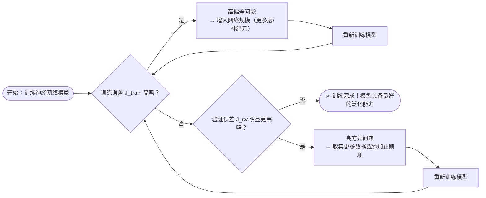

## 前言

学习自 Coursera 的吴恩达老师机器学习系列。https://www.coursera.org/specializations/machine-learning-introduction

## 机器学习定义

计算机不经过明确编程的情况下进行学习的研究领域。比如相比直接编程告诉计算机怎么下棋更容易取胜，让计算机自己经过多次尝试总结形成一个具有较高胜率的下棋模型，每一步自行预测下一步棋怎么走让最终胜率更大。

> [!NOTE]
>
> 在 KCL 机器学习笔记中我们学习过：推理（Inference）和学习（Learning）的区别。推理是已知模型和对应的概率（现实生活中很少），而学习是不知道对应的模型和概率需要统计数据训练得到一个近似值。比如投硬币，我们统计了 100 次投硬币概率，30 次正面 70 次反面，那么学习结果就是 0.3 概率正面。

### 监督学习

给定输入 x 和有标签标注的输出 y，如对于天气预报机器学习案例：（昨天有鱼鳞状云，今天下雨）这样一条数据，昨天的云是输入数据 x，今天下雨是输出 y（知道确切的结果），让计算机由输入到输出的映射训练模型。再比如：输入是一栋房子的基本信息（几室几厅，面积……）输出是其价格。

监督学习主要分为两种：

- 回归问题（Regression）：从无限多的数字中预测一个数字，如房价推测。
- 分类问题（Classification）：如判断这张图片里的动物是猫还是狗，明天是否下雨，预测结果有限可确定。比如可能 0 代表照片里动物是猫，1 代表是狗，2 代表是老鼠……

### 无监督学习

没有对应的有标注的输出 y。比如找到一些潜在的分类（把现有用户分为几种，分类之前我们并不知道有哪些最终的用户类，是计算机帮我们划分的）。这叫做聚类（Clustering）。除此之外的应用还有异常情况检测，新闻关键词组合提取等。

## 监督学习

### 线性回归模型

> [!NOTE]
>
> 模型，就是机器学习算法所需要的最终产物。通过数据和算法得到。比如 DeepSeek 模型，GPT 模型。使用模型很简单其实，我们不需要关心模型内部原理，就像一个黑盒子，我们只要输入数据进去得到输出数据就好。不过这门课程我们主要学习“训练模型的过程”，了解学习原理。

线性回归模型是一种非常基础的回归模型。比如根据输入数据（房子面积）预测输出数据（房价）公式：y = 20000x+100000（我瞎写的）这就是一个简单的线性回归模型。

#### 简化版训练过程

线性回归模型训练过程（无敌简化版）：

1. 首先我们有一个训练数据集，里面只有两条数据（0,100000）和（2,140000）。训练数据集数据总数一般用 m 表示。
2. 线性回归模型我们设置成 `y=wx+b`，w 一般用于表示模型参数，b 表示线性回归模型后面加的常量。
3. 带入数据，得到 w = 20000，b = 100000. 完成训练。得到的模型用 `f_wb` 表示。

#### 代价函数

不过，一般真实数据都不是那么有规律的，我们的模型并非可以完美拟合（fit）所有数据点。比如下面这个情况。


这些红叉数据点就不在一条直线上，我们怎么可能找到一个完美拟合的线性回归模型经过他们全部呢，做不到。只能尽可能找到一个线性回归模型让这些点离我们模型的偏差尽量小一些。

这就引入了一个机器学习重要概念：代价（cost）也就是我们的模型预测值和真实值的偏差。对于单个数据点偏差一般用损失（loss）表示，比如我预测这栋有 100m^2 的房子房价是 100 万元，实际价格是 110 万元。而代价一般是形容模型整体，所有预测数据和所有训练数据的偏差。

一种成本函数计算公式（成本函数有很多很多选择，就像模型一样，我们也可以不选线性回归模型学习问题）：
$$
J(w, b)=\frac{1}{2m}\sum^{m}\_{i = 1}(f\_{w, b}(x^{(i)})-y^{(i)})^2
$$
$y^{(i)}$ 是第 i 个训练数据的输出（110 万真实房价），$f_{w,b}(x^{(i)})$ 是将第 i 个训练数据输入带入我们的模型得到的预测输出（100 万预测房价）。我们的模型预测目标就是找到合适的模型参数 w，b 让代价函数最小化。

>[!NOTE]
>
>这里前面的参数为什么是 1/2m，因为后续我们要求导来找到让代价函数下降最快的方式，求导的时候就会把 2 约掉，计算更简洁。

下图是一个代价函数可视化案例：


对于这个例子我们要找到的代价函数最小值点就是中间那个凹进去的地方对吧。

另一种绘制方式是这样的等高线图：


#### 梯度下降

根据当前训练数据，通过求偏导更新 w，b 让代价函数下降最快（Gradient Descent）。

计算公式：
$$
w = w-\alpha \frac{d}{dw}J(w, b)=\frac{1}{m}\sum^{m}\_{i = 1}(f_{w, b}(x^{(i)})-y^{(i)})x^{(i)}\\\\
b = b-\alpha \frac{d}{db}J(w, b)=\frac{1}{m}\sum^{m}\_{i = 1}(f_{w, b}(x^{(i)})-y^{(i)})
$$
α 是学习率，α 越大每一轮学习的时候我们根据上一轮的代价函数所做的调整就越大。

α 太小的话，会导致需要很多轮才能找到一个比较靠近极小值的模型：


α 太大有可能总是“迈步迈过头”到达不了极小值点。


另外，一个学习问题可能会有多个局部极小值点。选择不恰当大小的学习率也会导致无法到达最小值。


下图是一个梯度下降参数可视化：


> [!NOTE]
>
> 另外，每轮学习的时候我们可能会只选取部分训练数据进行迭代更新或者全部数据。如果每次都用全部数据计算代价函数，叫做批梯度下降（Batch Gradient Descent BGD）.
>
> 卷积神经网络（CNN）训练不会每次都看整个图像数据，每次只会取出一部分。这样可以加快计算速度而且更不容易出现过拟合。

> [!TIP]
>
> 老师提出的一种寻找学习率的方式：
>
> 如 0.001, 0.003, 0.01, 0.03, 0.1, 0.3, 1, 3, ....
>
> 此外，还可以使用 Adam 算法寻找合适的学习率。原理上和自己试应该差不多，从小到大试，loss 快速下降时停止增加学习率。

#### 多维度特征

特征（features）指的就是输入数据多维度的参数，比如：如果只根据房屋面积计算房屋价格，特征就只有一个就是面积。如果根据房屋面积，几室几厅，楼层数，房屋年龄等作为输入数据，就是多特征学习。

我们用 n 表示特征总数，那么输入数据其实就是一个 m*n 的矩阵，m 表示有 m 条数据，n 表示每条数据里面有 n 个特征。$x_j^{(i)}$ 表示第 i 条数据的第 j 个属性。

同时模型参数也会改变，$w=[w_1, w_2, ... w_n]$ 和 $x^{(i)}$ 进行向量乘法得到一个标量数据，再和标量 b 求和得到预测结果。
$$
f_{w, b}(\mathbf{x}) = \mathbf{w}\cdot \mathbf{x} +b = w_1 x_1 + w_2 x_2 + \cdots + w_n x_n + b
$$
在 python 代码实现中，不需要手动循环相乘求和，可以使用 `numpy` 库：

```python
w = np.array([1, 2.5, -3.3])
b = 4
x = np.array([10, 20, 30])

f = np.dot(w,x)+b
```

而且计算机底层会使用带有矢量化的计算机硬件实现，并行加速计算。

同长度向量可以直接做减法。

```python
w = w - 0.1 * b
```

> [!NOTE]
>
> 如果特征量太大，使用正态方程法可以快速求解 w，b。但是这种方法几乎只适用于线性回归学习方法。

> [!NOTE]
>
> 有的时候可能还需要我们自行设计特征，比如根据房子长宽推导房子面积，如果使用二维度线性回归模型效果就不会太好，但是如果将长*宽作为一个新维度特征输入的一维线性回归模型训练就会好一些。

#### 特征缩放

多维度特征尽可能采取范围近似的值，让彼此参数差距不大，否则可能导致梯度下降缓慢。


简单的特征缩放方法就是（每个数据-平均值）/（最大值-最小值）。但是分母可能是 0，而且对异常值敏感。

z-score normalization 方法是（数据-平均值）/标准差 σ。转换为均值 0，方差 1 的标准正态分布区间。

#### 梯度下降收敛

当每轮迭代的梯度下降小于等于收敛值 ε（如 0.001）时，可以称之为收敛。这个时候就可以不用再学习了，再学习的成本与对模型精确度的提升相比不那么合适了。

#### 扩展到多项式回归

$$
f_{\vec{w}, b}({x}) = 
{w_1} {x} + 
{w_2} {x^2} + 
{w_3}{x^3} + 
{b}
$$

### 分类

比如：预测一个邮件是否为垃圾邮件，0 false 1 true。

预测方法：比如线性回归模型得到的结果是 0 到 1 范围内，我们将 0-0.5 视作 0,0.5-1 视作 1.

不过相比线性回归模型，下面这个回归模型更适合分类问题：

#### 逻辑回归

1. 首先还是得到一个线性回归模型 $z=wx+b$。
2. 然后不直接把这个模型作为预测输出，而是将其传入 sigmoid 函数：$g(z)=\frac{1}{1+e^{-z}}$

为什么用这个函数？因为其范围 0-1，符合我们的分类需求，而且在 0.5 附近斜率比较大，所以更难预测到 0.5 的不确定概率情况。


#### 逻辑回归的损失函数

不能再使用之前的平方代价函数了，因为转换得到的代价函数并不是一个凸函数（convex，比如 y = x^2 这样的），而可能是一个波浪线状的有多个极小值点的丑陋函数。

所以要使用下面这个损失函数。
$$
L\left( f\_{\vec{w}, b}(\vec{x}^{(i)}),\ y^{(i)} \right) =
\begin{cases}
    -\log\left( f\_{\vec{w}, b}(\vec{x}^{(i)}) \right), & \text{if } y^{(i)} = 1 \\\\
    -\log\left( 1 - f\_{\vec{w}, b}(\vec{x}^{(i)}) \right), & \text{if } y^{(i)} = 0
\end{cases}\\\\
L\left( f\_{\vec{w}, b}(\vec{x}^{(i)}),\ y^{(i)} \right) =
- y^{(i)} \log\left( f\_{\vec{w}, b}(\vec{x}^{(i)}) \right)
- (1 - y^{(i)}) \log\left( 1 - f\_{\vec{w}, b}(\vec{x}^{(i)}) \right)
$$
逻辑回归损失函数图像如下：


y = 1 预测值 = 0 的时候导数非常大，y = 0 预测值 = 1 的时候导数非常大，促使预测值向另一端靠近。

相应的代价函数公式：
$$
\begin{aligned}
J(\vec{w}, b) &= \frac{1}{m} \sum_{i = 1}^{m}
L\left( f\_{\vec{w}, b}(\vec{x}^{(i)}),\ y^{(i)} \right)\\\\
&= -\frac{1}{m} \sum_{i = 1}^{m} \left[
y^{(i)} \log\left( f\_{\vec{w}, b}(\vec{x}^{(i)}) \right)
+ (1 - y^{(i)}) \log\left( 1 - f\_{\vec{w}, b}(\vec{x}^{(i)}) \right)
\right]
\end{aligned}
$$
至于梯度下降，公式和之前一样。不过别忘记现在 f 函数的定义不一样了。
$$
w = w-\alpha \frac{d}{dw}J(w, b)=\frac{1}{m}\sum^{m}\_{i = 1}(f_{w, b}(x^{(i)})-y^{(i)})x^{(i)}\\\\
b = b-\alpha \frac{d}{db}J(w, b)=\frac{1}{m}\sum^{m}\_{i = 1}(f_{w, b}(x^{(i)})-y^{(i)})
$$

#### 过拟合及解决方法

如下图，左边的模型欠拟合（underfit）因为模型复杂度不够；而右边的模型过拟合（overfit）因为参数太多模型过于复杂了，导致模型能非常好地拟合训练数据，但是对于训练数据之外的数据预测效果不好。


过拟合的解决方式：

1. 增加训练数据量；
2. 只选择部分对输出数据影响更大的特征作为训练模型的特征，减小模型复杂度；
3. 模型正交化（Regularization），将模型复杂度也列入代价函数公式中，这样模型过于复杂的时候虽然可以很好地拟合训练数据，代价函数仍然很大。比如加上 $\frac{\lambda}{2m}\sum^{n}\_{j=1}w\_j^2$ ，λ 是正交化参数。

$$
J(w, b)=\frac{1}{2m}\sum^{m}\_{i = 1}(f\_{w, b}(x^{(i)})-y^{(i)})^2+\frac{\lambda}{2m}\sum^{n}\_{j = 1}w\_j^2\\\\
w\_j = w\_j - \alpha 
\frac{\lambda}{m} w\_j - \alpha 
\frac{1}{m} \sum_{i = 1}^{m}
\left( f\_{w, b}(\vec{x}^{(i)}) - y^{(i)} \right) x\_j^{(i)}\\\\
b =\frac{1}{m}\sum^{m}\_{i = 1}(f_{w, b}(x^{(i)})-y^{(i)})
$$

对梯度下降的影响其实就是 w 更新的时候前面一项由 wj 变成 (1-αλ/m)wj 了。这个东西 < 1 ，作用是每次迭代都让 wj 尽可能小一些。

### 神经网络

模拟人脑，分为多层对输入数据进行处理，每层有多个神经元，处理完输出给下一层，最后汇总输出。

在更大数据量或者更复杂的问题上表现更好。


比如人脸识别学习案例：如下图，第一层神经网络可能着重识别边缘部分，第二层神经网络可能着重识别人脸的某一部分比如眼睛鼻子嘴巴，第三层则是匹配对应的整张人脸。


输入数据被称为输入层（input layer），一般不计入总层数。中间的层都叫隐藏层（hidden layer），最后一层叫输出层（output layer）计入总层数，比如上面这个例子是一个 4 层神经网络。

每个神经元的输入 -> 输出处理函数叫做激活函数（activation function），比如我们可能第一层选用线性回归函数，第二层选用 sigmoid 函数……

比如假设第三层是 sigmoid 激活函数，第三层有三个神经元，那么第三层就会输出三个特征，第三层输出向量计算公式为：
$$
a\_1^{[3]}= g(\vec(w)\_1^{[3]}\cdot \vec{a}^{[2]}+b\_1^{[3]})\\\\
a\_2^{[3]}= g(\vec(w)\_2^{[3]}\cdot \vec{a}^{[2]}+b\_2^{[3]})\\\\
a\_3^{[3]}= g(\vec(w)\_3^{[3]}\cdot \vec{a}^{[2]}+b\_3^{[3]})\\\\
$$
这里会涉及到一些矩阵乘法的知识。

例学习问题：输入数据是烘焙咖啡豆温度和时间，输出数据是咖啡豆烘焙结果（刚好或糊了）。


比如在 TensorFlow 中配置模型的步骤如下：

```python
# 定义模型
model = Sequential(
    [
        tf.keras.Input(shape=(2,)),
        Dense(3, activation='sigmoid', name = 'layer1'),
        Dense(1, activation='sigmoid', name = 'layer2')
     ]
)

# 查看每层参数
W1, b1 = model.get_layer("layer1").get_weights()
W2, b2 = model.get_layer("layer2").get_weights()

# 配置损失函数
model.compile(
    loss = tf.keras.losses.BinaryCrossentropy(),
    optimizer = tf.keras.optimizers.Adam(learning_rate=0.01),
)

# 自动训练
model.fit(
    Xt,Yt,            
    epochs=10, # 用输入数据重复训练10次
)

# 预测
predictions = model.predict(X_testn)
```

使用起来非常简单，调库有啥难的？不过重点还是在于原理理解。

这个例子中，输入数据是 2 维特征的，第一层隐藏层是 3 维的，第二层输出层是 1 维的，我们最终会得到一个预测结果值。

对于第一层的模型参数：

```python
W = np.array([
    [1, -3,  5],
    [2,  4, -6]
])

b = np.array([-1, 1, 2])     # 偏置项，形状为 (3,)
a_in = np.array([-2, 4])     # 输入向量（也记作 a^[0] 或 x），形状为 (2,)
```

这样计算完得到的是一个 1\*3 形状的矩阵，供第二层输入。

在 python 中利用 numpy 做向量矩阵快速乘法的实现公式：

```python
def g(z):
    # 示例激活函数
    return 1 / (1 + np.exp(-z))  # Sigmoid

def dense(A_in, W, B):
    Z = np.matmul(A_in, W) + B
    A_out = g(Z)
    return A_out
```

#### ReLU 激活函数

如下图，ReLU 函数公式很简单，输入 <0 时输出=0，输入 > 0 时输出和输入成正比。


sigmoid 函数只有在 0 附近的输入值才能取得比较好的梯度结果，如果输入数据太大了，那么梯度下降特征不明显，可能会造成梯度消失的情况，而且计算复杂；

以及，ReLU 会使一部分神经元的输出为 0，这样就造成了网络的稀疏性，并且减少了参数的相互依存关系，缓解了过拟合问题的发生。

最常见的四种激活函数就是：线性激活函数，sigmoid，ReLU，softmax 后面介绍。

#### 激活函数的选择

二元分类问题推荐使用 sigmoid，因为最终推导结果介于 0~1 之间。

回归问题建议使用线性回归激活函数。

回归问题且输出 > 0 推荐使用 ReLU。

比如一个二元神经网络问题，采用的激活函数可能是：前两层是 ReLU，最后一层是 Sigmoid。

此外，隐藏层尽量不要使用线性函数（ReLU 可以用），因为根据公式推导，隐藏层放多个线性回归最后得到的输出也是一个线性回归函数，使得这个神经网络解决不了更加复杂的问题。

#### 多分类问题

比如手写数字识别，我们预测的结果介于 0~9 之间。

softmax 常用于解决多分类问题，可以得到多个特征的输出结果。比如对于手写数字识别问题，可能得到的结果是：预测是数字 0 的概率为 0.09,1 的概率是 0.11,2 的概率是……最后选择一个最有可能的结果。

算法公式：
$$
z\_j = \vec{w}\_j \cdot \vec{x} + b\_j, \quad j = 1, \dots, N\\\\
a\_j = \frac{e^{z\_j}}{\sum\limits_{k = 1}^{N} e^{z\_k}} = \mathbb{P}(y = j \mid \vec{x})
$$


所有预测概率加起来 = 1.

损失函数：
$$
\text{loss}(a\_1, \dots, a\_N, y) =
\begin{cases}
-\log a\_1 & \text{if } y = 1 \\\\
-\log a\_2 & \text{if } y = 2 \\\\
\quad \vdots & \\\\
-\log a\_N & \text{if } y = N \\\\
\end{cases}
$$


损失函数只有对应真实值的预测概率 = 1 时 = 0，否则预测正确结果的概率越小，损失值越大。

在多分类预测问题中，通常使用 softmax 来作为输出层的激活函数。

#### 改进 softmax 函数

根据 python 的一些精度特性，如果不是先计算出概率 a 再带入损失函数，而是直接把 z 带入损失函数计算公式，精度更高。

不要：
$$
\text{Loss} = L(\vec{a}, y) = 
\begin{cases}
  -\log a\_1 & \text{if } y = 1 \\\\
  \vdots \\\\
  -\log a\_{10} & \text{if } y = 10 \\\\
\end{cases}
$$
而是：
$$
L(\vec{z}, y) = 
\begin{cases}
  -\log \left( \frac{e^{z\_1}}{e^{z\_1} + \cdots + e^{z\_{10}}} \right) & \text{if } y = 1 \\\\
  \vdots \\\\
  -\log \left( \frac{e^{z\_{10}}}{e^{z\_1} + \cdots + e^{z\_{10}}} \right) & \text{if } y = 10 \\\\
\end{cases}
$$

在 TensorFlow 中的实现方法应该是：最后一层不再声明为 softmax 层，而是 linear 层，取而代之的是在模型参数设置的时候声明计算逻辑损失。

```python
preferred_model = Sequential(
    [ 
        tf.keras.Input(shape=(2,)),
        Dense(25, activation = 'relu'),
        Dense(15, activation = 'relu'),
        Dense(4, activation = 'linear')   #<-- Note
    ]
)
preferred_model.compile(
    loss=tf.keras.losses.SparseCategoricalCrossentropy(from_logits=True),  #<-- Note
    optimizer=tf.keras.optimizers.Adam(0.001),
)
```

#### 多标签分类问题

比如：判断下面这张图片里面有没有汽车？有没有行人？有没有树？

和多分类问题的区别在于，多分类的结果是互斥的，比如预测出数字应该是 5 就不会是 7 了。

而多标签分类问题的多个结果可以共存，比如既有树，也有人。

多标签分类也会得到多个维度的特征，不过类似 sigmoid 单维度处理方式，每个维度的预测值在 0-1 之间，如果 > 0.5 视作 true。比如对有汽车的概率预测为 0.6，有人的概率预测为 0.7，那么就判断这张图片里有人有车。

#### 反向传播

说实话有点太难描述，但是这部分十分重要。读者如果感兴趣一定要去学习一下，其实不难，就是求导反推。

可以快速推导出 w 的变化对最终代价函数 j 的影响。

### 机器学习应用问题

#### 解决误差大问题

如果模型误差很大，下一步怎么做？

1. 获取更多数据。
2. 减少或者增加特征。
3. 增加多项式参数。
4. 调整正则化参数 λ。

#### 评估模型

如何评估模型性能？通常我们会将输入数据拿出 30%作为测试集，其余 70%作为训练集。先用训练集训练，然后用测试集和训练集评估误差。

**注意：测试集和训练集评估误差的时候不要加上正交参数，这个时候最小化参数不是我们想要的结果，我们是在评估模型性能。**

如果模型对训练数据表现良好，对测试数据表现差，说明过拟合。

但其实，**测试集仅仅是我们对模型误差的一种“乐观估计”**。因为测试集通常来自与训练集相似的分布，而且在整个建模过程中，它是提前准备好的。如果我们在调参过程中频繁查看测试集的表现，实际上已经“间接使用”了测试集的信息。这会导致模型过拟合到测试集本身，最终得出的泛化能力评估并不可靠。

取而代之的方案是 60%数据作为训练集，20%数据作为交叉验证集（Cross Validation），20%数据作为测试集。对于不同模型（如一次线性，二次线性，三次线性……）我们统一用训练集训练，然后用 **交叉验证集** 计算代价，注意这里也不要考虑参数正交化项。然后选出交叉验证误差最小的模型。最终我们用测试集评估模型泛化性能。以多项式拟合为例：我们可以用训练集分别训练一次线性、二次多项式、三次多项式等模型，然后在验证集上评估它们的预测误差（此时评估用的 cost 函数不需要包含正则化项），选出在验证集上表现最好的模型。最后，再用测试集来评估这个最终模型在未见数据上的表现。

比如下面这个学习案例：


degree = 4 的时候训练集和交叉验证集误差都最小，5 变化不大，6 开始回升了。所以最佳选择 4.

分类问题和神经网络学习问题同样。

#### Bias and Variance

underfit 模型的 bias 很大，overfit 模型的 variance 很大。

下图是随着多项式回归模型项数增加，训练代价和交叉验证代价的变化，在中间训练和交叉验证代价都比较小的模型才比较合适。


对于参数 λ 的选择也是类似。正交化参数应该多大比较好？我们先设置不同大小的正交化参数，对训练集进行训练得到模型参数 w，b，然后带入交叉验证计算损失，绘图如下，λ 让两个损失都比较小的值更为合适。


具体 bias and variance 的判断方法：我们使用三个参数进行判断，基准表现（baseline performance）如人类自己对语音的识别准度，训练误差，交叉验证误差。

基准表现和训练误差差的较大：偏差（bias）很大。

训练误差和交叉验证误差差距较大：方差（variance）很大。

训练数据 m 增加，交叉验证损失和训练集损失如下：


如果两者最后汇总的误差仍然很大，说明 bias 很大。

如果两者最后没有汇总，差距比较大，说明 variance 很大。方差大的情况增加训练数据确实有助于减少交叉验证损失。

构建机器学习应用的时候，比如有 1000 个训练数据，可以先拿出 100 个用于训练集和 CV 集，然后绘制学习曲线判断 bias 和 variance。

#### 解决正交化后误差仍然大问题

- 更多训练数据：减小方差
- 减少特征：减小方差
- 增加特征：减小偏差
- 增加多项式项数：减小偏差
- 减少 lambda：减小偏差
- 增加 lambda：减小方差

方差和偏差很好理解，但是可能需要很长时间才能深入把控。

#### 神经网络解决偏差方差过大问题

对于神经网络，有一种思想是：只要网络够大，训练数据够多，就能解决偏差和方差问题。



至于过拟合问题，只要神经网络层中有合适的正交化参数就能解决。

#### 机器学习开发过程

1. 选择架构：如模型，数据集等。
2. 训练模型。
3. 诊断（解决方差，标准差等问题）。
4. 重复如上步骤。

##### 误差分析

对于错误分类的例子进行人工分析（如果太大了就按比例抽取），比如错误分类的非垃圾邮件。

##### 添加更多数据的技巧

数据增强：比如扭曲图像数据。


给音频数据添加噪声。

数据合成：一般用于计算机视觉干扰。利用计算机模拟或者算法生成的带有标注的信息。比如自己利用电脑字体库合成带有字的图片的数据供 OCR 进行训练。

##### 迁移学习

用不同任务的数据来解决当前的任务。

比如动物识别迁移到手写数字图片识别。

因为两个网络本质都是图像分类，所以在隐藏层的大部分工作都是相似或者一样的，所以将其中一个训练好的网络的隐藏层拿过来用，对输出层重新训练就可以实现新的功能（相当于螺丝刀换刀头）。

#### 偏置数据集


精度（Precision）：预测为 true 的输出数量中真实值为 true 的样本数占比（True Positive / Positive，上边第一行）

召回率（Recall）：真的阳性的样本中被预测到了的占比（True Positive / Actual Positive，左边第一个纵列）

高精度意味着准确（检测结果为阳性的病人很大概率是真阳性）；高召回率意味着阳性案例很大概率会被检测到，很少漏掉。

提高 True 案例的判断阈值（比如：预测结果大于 0.7 的才预测为 positive，而不是 0.5），会提高精度 降低召回率；反之，降低判断阈值会降低精度，提高召回率。

我们需要手动调整判断阈值来找到权衡精度和召回率的点。一种常见的权衡方法是谐波均值（Harmonic Mean F1 Score），计算公式如下：
$$
F1\ Score\ =\frac{2PR}{P+R}
$$
然后我们选择谐波均值更高的模型。

### 决策树

根据数据训练出一个多分类组成的决策树模型。

比如下面是一个可能的决策树模型（判断动物是不是猫）：


#### 纯度

如何选择决策树的分支特征？一个很重要的因素是左右子树的纯度（purity）。比如我们挑了一个特征：是否为黑色。那么就导致左右子树都有猫，因为猫有黑的有非黑的。这就是一个不纯的分支。每一个分支点尽量让猫全在一个子树里面。

#### 停止分支条件

什么时候停止分支？

- 当一个节点 100%是同一种类时（没必要分了）。
- 再分树就超过最大深度了。
- 分支让纯度的提升太小（小于一定阈值）。
- 分支分出去的一部分子树节点太少（小于一定阈值）。

纯度用熵来衡量，熵的图表对应如下（p 是一个集合里面目标分类的个数，比如：这个集合里面猫占比）。


所以从图中可以看出 p = 0.5 的时候熵最高 = 1.

熵的曲线近似计算公式如下（不完全符合，比如下面这个公式 = 0 的时候应该是负无穷，但是曲线里面值 = 0）：
$$
H(p\_1) = -p\_1 \log\_2(p\_1) - (1 - p\_1) \log\_2(1 - p\_1)
$$

#### 信息增益

应用熵判断纯度：如下例，我们计算信息增益 = 根节点熵-左右两个节点的熵的加权平均值。


下图是更为通用的公式。p 表示这个节点里面 true 占比（是猫），w 表示这个根分支分出去的动物数量占根节点总动物数量比。


拆分过程：

1. 汇总根节点数据。
2. 计算不同拆分特征的信息增益，选择最大的一项进行拆分。
3. 依次对左右子树继续拆分，直到满足我们之前说的停止拆分的条件为止（递归）。

> [!NOTE]
>
> 树的深度效果类似于多项式的度数。深度越深对训练数据拟合性越好，但是可能出现过拟合问题。

#### 离散特征划分：独热编码

如果一个特征可以取出 k 个值，我们可以用独热编码用 k 位二进制位表示。

比如猫耳朵有尖耳圆耳折耳，这三个特征可以分别记作 [1,0,0] [0,1,0] [0,0,1]

不过显而易见独热编码不适合处理可以取任意值的情况，比如：尾巴长度，3cm~10.0cm（我乱说的）。

#### 连续特征划分：阈值

比如猫的体重，有 10 个值，我们从大到小排列，按 10 个点的中点选择 9 个阈值进行划分尝试，并计算信息增益。如果最大的信息增益还不错，就选择这个阈值作为一个决策树的节点划分依据。

#### 决策树回归问题

比如我们要利用决策树，根据猫咪特征，预测猫咪体重。输出值是一个连续数值。

仍然是类似信息增益的算法，不过要借助方差判断划分的两个子树的数据的离散性，选择结果最大的。


#### 决策树集合：投票

决策树模型其实对数据非常敏感。可能改一个数据，同样算法生成的决策树就完全不同。

所以比较保险的方法是我们构建多个决策树，对于一个预测问题多个树都预测并给出自身的预测结果，最后投票决定。

##### 替换采样

如何构建决策树集合？

假设有 m 条数据，我们现在随机抽取 m 次获取 m 条数据组成训练集（放回，也就意味着同一条数据可能被抽到多次，但是没关系），然后用这个训练集进行训练得到一个树。然后再抽再训练，继续循环。重复 B 次建立 B 棵树。

> [!WARNING]
>
> 一般 B 选 100 左右，再大未必会获得更好的结果。

##### 随机森林

进一步提升随机性的方法是：在每个树的节点分类选择的时候，假设有 n 个特征可以选择，我们随机挑选 k < n 个特征，规定该节点只能从这些特征里面选分类方法。k 一般选根号 n。这样可以进一步探索随机森林的更多随机性，防止数据的细微变化对预测正确率的影响。

##### XGBOOST 训练方法

和之前随机森林差不多，不过在选择 m 条数据组成训练集时，会更容易选择那些之前预测表现不那么好的数据。就像练习钢琴曲，总是练整首歌不如先优先练好不熟悉的部分。

此外，该算法也有很好的节点划分，停止划分，正交化等配置。在 kaggle 比赛中比较突出。

#### 什么时候用决策树？

决策树的特点：

- 适合结构化数据（如表格）；
- 不适用于非结构化数据（图片，音频）；
- 小决策树的可解释性强；
- 训练快。

神经网络：

- 适用于所有结构数据；
- 训练慢；
- 可迁移性好；
- 多模型协同工作表现好。

## 无监督学习

没有标注的输出数据，只有输入数据，比如对现有数据进行聚类，让算法玩游戏，图片压缩，异常检测等。

### 聚类

比如下面这些无标注点，将他们分为几类。


#### K-means

1. （假设要分为两个聚类）随机选择两个点作为质心。
2. 计算其他点到这两个点的距离哪个更近，从而分为两类。
3. 再找到这两个类的质心（所有点位置求平均值）。
4. 再重新按所有点到两个新质心的距离分两类。
5. 重复上述步骤直到质心位置不再发生变化时，说明收敛。

换言之，就是让代价函数值最小：
$$
J(c^{(1)}, \ldots, c^{(m)}, \mu\_1, \ldots, \mu\_K)
= \frac{1}{m} \sum\_{i = 1}^{m} \left\| x^{(i)} - \mu\_{c^{(i)}} \right\|^2
$$
k：目标要分为多少个聚类。

c_k：第几个聚类。

μ_k：质心。

$\mu ^{(i)}\_c$：xi 点被分配到的质心。

这个函数被称作：失真函数（Distortion）。

#### 局部最小值问题

虽然根据失真算法，我们每次更新质心都会让失真函数值下降，但是可能会达到局部极小值而并非最小值，如下图三种情况都收敛。


这和我们最开始随机选训练数据作为质心起始点有关，所以一般来说训练需要随机选多轮质心然后训练得到收敛的聚类模型，再比较选出失真函数值最小的最优解。

#### K =？

我们要将训练数据分为多少个聚类更为合适？

从训练角度上来说：选择 elbow 点，k 再增加对降低损失作用不大。


同时我们也需要考虑实际解决方案，比如 T 恤分成 3 类和 5 类，随之带来的运输成本问题，客户满意度等都会影响营收。公司需要分别尝试两种解决方案并分析其带来的经济效益进行决定。

### 异常检测

比如我们学习统计了 m 个训练数据（飞机发动机的热量和振动量，并且这些训练数据都是正常工作的飞机发动机，甚至可能表现更好一些），然后用一台飞机发动机的参数和这个模型分布进行对比，如果偏差比较大可能就说明这个发动机比较容易发生故障。


#### 高斯分布

异常检测的概率计算基于高斯分布。

1. 统计每个特征的期望 方差 获取高斯分布概率；
2. 对于一个需要预测的数据，累乘其所有特征的高斯分布概率后判断是否大于阈值 ε，如果大于说明正常，小于说明异常。


#### 实时评估

一种可以在训练的时候评估学习算法的好坏并实时修改参数（如 ε）的方法。

可以借助少量有标签的异常数据构建交叉验证和测试集。比如 10000 台发动机，其中 20 个是异常的，一种数据集划分方式是 6000 个正常发动机作为训练集，2000 正常+10 异常发动机作为交叉验证集，2000 正常+10 异常发动机作为测试集。如果异常样本太少就放弃交叉验证集，异常样本全放到测试集。

#### 什么时候用监督学习，什么时候用异常检测？

监督学习场景：

- 正例负例都够多。
- 未来要处理的正例和训练集正例相似。
- 我们更关心已知种类的识别，而并非未知种类的检测。

如垃圾分类检测（垃圾邮件类型固定），天气预测（天气种类固定且容易判断），疾病诊断，单一异常检测（比如：该器件是否过度拉伸）。

异常检测场景：

- 正例极少。
- 异常种类多样。
- 未来异常种类和现有历史数据可能完全不同。

如数据中心黑客入侵安全监测，飞机引擎检测，金融欺诈检测。

#### 特征选择

在异常检测问题中，特征选择比监督学习中更为重要。因为监督学习再怎么说是有标注输出数据的，所以无关特征可能被弱化，但是异常检测是肯定会根据我们选择的特征项进行建模。

特征预处理：对特征数据预处理使其尽可能接近高斯分布。

对于错误分析案例，人为对误检案例进行分析，并寻找能检测这些漏检案例的新特征。

### 协同过滤

推荐系统常用。比如基于用户对电影的评分，将用户划分为某一类用户群体，并且给用户推荐该类群体喜欢的作品（基于用户）；或者基于该用户以往看过的电影的打分，预测一部该用户没看过的电影该用户会打多少分，从而推荐给用户（基于商品）。

#### 已知特征求模型

比如如下案例，我们想根据每个用户过往给看过的电影打分，预测其会给没看过的电影打多少分。


n_u：用户数量 = 4

n_m：电影数量 = 5

n：特征数量 = 2（一部电影百分之多少是浪漫，百分之多少是动作）

r(i, j) 表示用户 j 是否给电影 i 打过分，有 1 无 0.

y(i, j) 是用户 j 给电影 i 打多少分。

$x^{(i)}$ 表示第 i 部电影的特征列向量，比如第一个就是 [0.9, 0]

对于每个用户我们会生成一个预测模型，比如用户 1 生成的模型是 $w^{(1)}x^{(i)}+b^{(1)}$

代价函数公式：
$$
\min\_{w^{(j)}, b^{(j)}} J(w^{(j)}, b^{(j)}) =
\frac{1}{2m^{(j)}} \sum\_{i: r(i, j)= 1} \left( w^{(j)} \cdot x^{(i)} + b^{(j)} - y^{(i, j)} \right)^2 + \frac{lambda}{2m^{i}}\sum^{n}\_{k = 1}(w\_k^{(j)})^2
$$

$$
J\left(w^{(1)}, \ldots, w^{(n\_u)}, b^{(1)}, \ldots, b^{(n\_u)}\right) =
\frac{1}{2} \sum\_{j = 1}^{n\_u} \sum\_{i: r(i, j)= 1} \left( w^{(j)} \cdot x^{(i)} + b^{(j)} - y^{(i, j)} \right)^2 
+\frac{\lambda}{2} \sum\_{j = 1}^{n\_u} \sum\_{k = 1}^{n} \left(w_k^{(j)}\right)^2
$$

#### 已知模型求特征值

假设我们现在知道 wb 但是不知道特征值，可以利用如下代价函数反向计算：
$$
J(x^{(i)}=\frac{1}{2} \sum\_{j: r(i, j)= 1} \left( w^{(j)} \cdot x^{(i)} + b^{(j)} - y^{(i, j)} \right)^2
+\frac{\lambda}{2} \sum\_{k = 1}^{n} \left( x\_k^{(i)} \right)^2
$$

$$
J(x^{(1)}, x^{(2)}, \ldots, x^{(n\_m)}) =
\frac{1}{2} \sum\_{i = 1}^{n\_m} \sum\_{j: r(i, j)= 1} 
\left( w^{(j)} \cdot x^{(i)} + b^{(j)} - y^{(i, j)} \right)^2
+\frac{\lambda}{2} \sum\_{i = 1}^{n_m} \sum\_{k = 1}^{n} \left( x\_k^{(i)} \right)^2
$$

公式和之前基本一样 就是把正交化部分由 x 替换了 w 参数。

这个应用场景比如根据推荐系统我们可以推测出这部电影的特征成分，我爱看动作片，算法给我推荐这个电影说明动作成分高。

#### 二元标签问题

比如 1 表示用户接触这部电影后选择看了，0 表示其接触这部电影后选择不看，预测一部用户没接触过的电影他会不会看。或者推荐给用户的商品会不会买，会不会点击，视频会不会看 30s 以上。

这些就是把协同过滤回归问题改成二元标签分类问题了。使用 sigmoid 函数，逻辑代价函数等。
$$
f\_{w, b, x}(x) = g(w^{(j)} \cdot x^{(i)} + b^{(j)})\\\\
L(f\_{w, b, x}(x), y^{(i, j)}) = 
-y^{(i, j)} \log(f\_{w, b, x}(x)) - (1 - y^{(i, j)}) \log(1 - f\_{w, b, x}(x))\\\\
J(w, b, x) = \sum\_{(i, j): r(i, j)= 1} L(f\_{w, b, x}(x), y^{(i, j)})
$$

#### 均值归一化预测新用户问题

对于根据用户喜好预测一部电影用户会打多少分的问题，没法推广到新用户，因为我们不知道新用户的喜好模型（w b = 0），只能预测出 0 分的结果。

一种解决方法是，我们根据已有用户的喜好求出每部电影的评分均值，然后每个用户的评分都减去均值在进行训练（正态化 Normalization）。

预测模型变为 y = wx+b+μ. 这样对于新用户对一部电影的打分就不是 0 分，而是这部电影的均值评分了。

#### 协同过滤的 Tensorflow 实现

和之前有一些区别，比如参数不是层的权重而是嵌入矩阵的值（X w b）；代价函数要自己写而不能 forward 自动使用（因为矩阵是稀疏矩阵 并不是所有数值都有的，而且预测是线性并非神经网络层）。

#### 找到和当前商品最相近的商品

比如用户在浏览一部电影，这部电影的 action 特征是 0.1，romantic 特征是 0.9，推荐系统可能会推荐类似这个特征比例的电影在该电影的下面（猜你想看）。
$$
\sum\_{l = 1}^{n} \left( x\_l^{(k)} - x_l^{(i)} \right)^2
$$

#### 协同过滤的局限

推荐算法可能会遇到一些“冷启动”问题（cold start）。比如，一部新发布的电影，可能还没有多少用户打分，我们不知道它怎么样没法推荐；以及对于一个没发表过几次评论的用户，我们也不知道其喜好。

我们可以使用一些辅助信息（side information）来解决此类问题，比如用户没发表过什么评论也可以根据其年龄性别地域等猜测其喜好；电影也可以根据其关键词，电影类型等进行推荐。

### 基于内容的过滤

基于用户判断其喜好获得一个向量（比如：基于该用户的年龄，性别等内容判断其对浪漫电影的喜好程度为 0.9）乘以基于物品内容对物品成分的判断向量（比如：这部电影的浪漫成分为 0.3）两个向量相乘+b 预测该用户对该电影的喜好。

比如通过神经网络学习，获取用户喜好向量和电影成分向量：


$$
J = \sum_{(i, j):\ r(i, j) = 1} \left( \mathbf{v}_u^{(j)} \cdot \mathbf{v}_m^{(i)} - y^{(i, j)} \right)^2\ +  \ NN \  Regularization
$$
第 j 个 user 的特征向量是 $x^{(j)}\_u$，第 i 部电影的特征向量是 $z^{(i)}\_m$. 求两个用户喜好相似度或者两部电影相似度还是用特征向量距离平方的方法。

#### 大型目录

但是商品数量可能过多（比如电影成千上万部），挨个放入模型判断用户预测满意度并不合适。这样可能可以获得更好的性能但是太浪费时间和计算资源

主要分为两步：

- 检索（Retrieval）：比如先基于用户最近观看的 10 部电影找最相似的 10 部，然后基于用户最喜欢的三类电影找较为匹配的前十部电影；再找用户特定规则集中评分最高的电影（比如用户所在国家的电影排行榜），从中去掉重复和用户已观看的项目。
- 评分（Ranking）：再从这些电影中利用基于内容过滤推荐算法进行评分排行。

#### 道德伦理问题

要善用推荐算法，负面例子比如为了吸引流量引战行为，或者旅游公司形成压榨客户-> 赚更多的钱-> 投资广告来压榨更多的客户这样的循环，排行榜中加入很多广告，售卖用户喜好隐私等。

### PCA 主成分分析

可以将大量特征降维为少数特征。

比如为了衡量汽车大小，我们需要汽车长度和宽度两维特征。不过根据汽车生产经验其实长宽一般是呈现一定比例的（比如，我是说比如 长度 = 2\*宽度），那么这样我们就可以只保留一个特征宽度。

其实从图像角度上来说，宽度是 x 长度是 y 的话，长宽大致呈现 y = 2x 的直线，那么我们可以让 y = 2x 这条直线变成新的一维特征，所有宽高的二维点都垂直投影到这条直线上降维。

> [!WARNING]
>
> PCA 比较容易和线性回归混淆。线性回归的 y 是标注输出数据，我们要根据 x 预测 y 并根据和真实值之间的差距迭代修改算法。而 PCA 是无监督学习，我们要找到一个维度让原数据二维坐标投影到上面的距离平方和最小。
>
> 

PCA 应用：比如数据可视化（人顶多能看懂 2-3 维度数据），以及数据压缩（不常用）。

sk-learn 可以将原始数据训练得到降维后的数据，还可以还原原数据（当然会丢失一部分信息）。

## 强化学习

不直接给予模型标注输出结果 y，而是给予一个奖励函数指导每一步的收益。

比如我们期望吃豆人赢得游戏，但是吃豆人在一局游戏里面有上百步可以走，如果我们用吃豆人这一局的上百次决策作为输入，是否赢得游戏作为输出，不知道要训练到猴年马月。

奖励函数是某一步会有一点奖惩机制，比如吃到豆子+奖励，离鬼近了减奖励，被鬼吃掉奖励减为零等，多次训练后让吃豆人自己做出更偏向于获得高奖励的结果：赢得游戏。

除了玩游戏，其他应用还有控制机器人，金融股票交易，工厂设备自动优化等。

比如一个简单的强化学习案例：火星探测器。


我们将 1-6 这些机器人可以到达的位置称作 state。机器人起始位于 state 4 的位置，每次可以选择向左走或者向右走的行动（action）。位置 1 和位置 6 各有两个科学家很感兴趣的地形，所以被赋予了很高的奖励值（Reward）鼓励探测器去探测。但是只能选择一个

假设探测器采取的行动是左左左，那么它就会最终获得 100 点奖励。假设采取的行动是右右，就会获取 40 点奖励（当然这里我们简化了代价函数，探测器能源并不是无尽的。后面会补充）。

每次行动我们用 (s, a, R(s), s') 表示，s 是当前探测器所处状态，a 是探测器下一步采取的行动，R(s) 是当前探测器的奖励（4 位置，奖励为 0），s' 是采取行动 a 后会到达的 s 新状态。

汇报（Return）则是从一个状态到一个状态的所有奖励值相加。

### 折扣因子

为了限制探测器尽快解决问题，我们引入折扣因子 γ（discount factor）。γ < 1，让探测器随着时间推移能获得的奖励值逐渐下降。

比如探测器采取往左走 3 步的行动，获得的回报是 0+0.9\*0+0.9\*0.9\*0+0.9\*0.9\*0.9\*100.（初始位置 reward 不用乘折扣因子）

这样可以减小探测器采取“左右左右左右”这种无限耗时间的策略的情况发生，因为越早到达 1 地点获得的回报越高。不然探测器会不着急到达 1 和 6 地点，反正早到晚到回报一样。

引入折扣因子后探测器采取的最佳行动是左左左到达 state1，这样比到达 6 损失少。

### 策略

策略（policy）用 π 表示，代表在某一状态下智能体（Agent）根据其策略会采取什么行动。$\pi(s)=a$

### 马尔科夫链

Agent 采取 action a 后，根据 environment 读取到当前 state s 以及获得的 reward r。

### Q 函数

$$
Q^{\pi}(s, a)= E\_{\pi}[G\_t | s\_t = s, a\_t = a]
$$

表示在状态 s 采取动作 a，并遵循策略 π，未来能获得的期望回报。

> [!Note]
>
> Return 是采样数据，相当于根据过往经验我们知道这个 Agent 现在往左走能获得多少回报。Q 函数则是我们要预测的模型。

如下例，假设探测器当前位于位置 2，下一步 action 往右走，之后采取最优策略，γ = 0.5. Q = 0（当前奖励）+0\*0.5（下一步奖励）+0\*0.5\*0.5 + 100 \* 0.5 \* 0.5 \* 0.5（最优策略就是一直往左）。


根据 Q 函数我们可以标注出处于每个位置，采取不同 action 的不同 Q 值：


这样就比较显而易见了，在 1-4 位置的 action 最好是往左，5-6 是往右（1,6 已经结束游戏了其实）。

>[!NOTE]
>
>Q\* 表示最优策略。

### 比尔曼方程

用于计算 Q 函数。
$$
Q(s, a) = R(s) + \gamma \max\_{a'} Q(s', a')
$$

### 随机环境

由于一些随机环境因素影响，智能体的行动并非百分百能执行的。比如探测器往左走，结果左边的地面打滑导致方向偏移等情况。所以需要引入随机因素。

比如探测器 90%的概率往指定的方向走，10%的概率会往反方向走。所以采取一个行动的 Q 就变成求采取这个行动后的期望 Q，即 0.9\*往左走的 Q+0.1\*往右走的 Q。

相应的比尔曼方程计算公式变为：
$$
Q(s, a) = R(s) + \gamma \, \mathbb{E}\left[ \max\_{a'} Q(s', a') \right]
$$

### 连续状态空间问题

上面的只是一个非常简单的离散状态空间问题。现实生活中的问题大多数是连续的。比如一辆汽车的状态空间可能包括 $[x, y, \theta, \dot{x}, \dot{y}, \dot{\theta}]$ ，x y 是位置坐标，θ 是当前角度，求导是水平垂直方向上的速度和角速度。三维空间如无人机会更加复杂，还可能引入加速度等。

#### 小游戏：Lunar Lander

调整月球登陆器的左，中，右推进器（或不采取行动）让其能平稳落在黄旗中间。


状态空间：$[x, y, \dot{x}, \dot{y}, \theta,  \dot{\theta}, l, r]$，l r 是二进制表示左腿右腿是否着地。

如下是一些奖励函数，是否落在登陆区域；距离登陆区域的左右偏移量；坠毁；软着陆；腿着陆；以及避免消耗太多燃料。折扣因子 0.985.


我们计划建立一个神经网络 计算 Q 函数：


然后在每个时刻比较 Q(s, nothing)  Q(s, left)  Q(s, main)  Q(s, right) 哪个奖励最高。

#### DQN

如下循环迭代更新 Q 函数。


改进的训练方式如下，同时训练4个 Q 函数。


#### ε-贪心算法

在训练过程中引入了我们之前说的随机环境问题。比如ε=0.05，那么推进器右95%的概率使用我们制定的 action，5%概率使用其他随机行为。

比如主推进器，可能我们的策略并不会经常性尝试使用它（作用不明显），但是引入一些随机尝试后也许就发现主推进器在某些情况下会取得不错的效果，那么 Q 函数就会更新这一部分让其获得更大的权重。95%的指定行动部分就是贪心部分，而5%的部分是探索部分。

### 小批量训练

之前的训练方法基本都是探索所有点求代价函数然后再修正。比如线性回归，我们定义了一个模型，然后求所有数据点到这个线的距离的平方和求和作为代价，再调整模型。

但是如果数据量非常大，这个方法就并不适用。我们可以先取小批量（mini batch）部分点，比如随机选择1000个点进行训练并更新参数，然后再取1000个。

上面这个连续状态空间问题中的10000个缓存也可以用同样的方法优化一下，我们可能每次只取1000个数据进行缓存然后迭代更新。

这样的缺点在于更新可能并不准确，并非一定是沿着梯度下降的方向进行的，如下图：


所以，我们也可以不完全更新参数权重。比如一次小批量后得到的新参数是 w_new 和 b_new，那我们就更新参数 w = 0.99w+0.01 w_new, b = 0.99b+0.01 b_new 这样避免突变带来一些大影响。这种更新策略叫做软更新（soft update）

