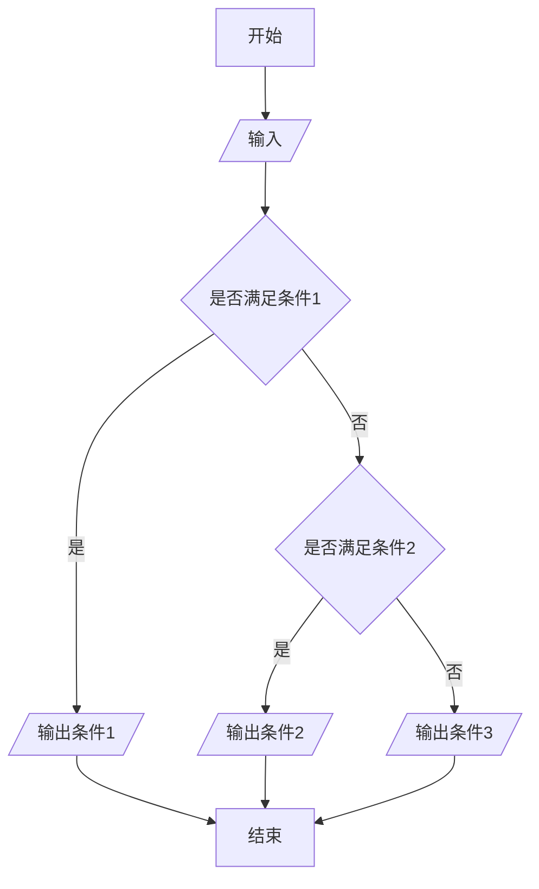
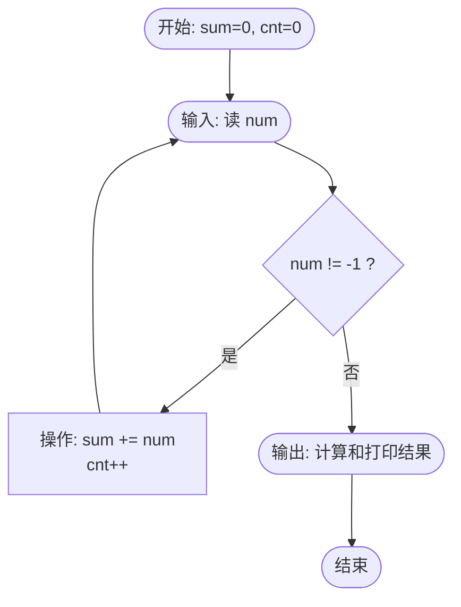

## 前言

是翁恺老师的 132PC 语言程序设计网课。

链接：[【C 语言】翁恺 C 语言程序编程全系列](https://www.bilibili.com/video/BV1sJ411E7St?p=1)

是 C 语言入门的地方~还是希望多多指正！

## 背景

### 计算机和编程语言

学习目的：理解计算机是怎样工作的

计算机是生活中的必需品。 如果我们想要自己设计一些功能和行为，让计算机按照自己的意图做事，就需要写程序了。
本课程的主要目的是通过学习编程，来理解计算机是如何解决问题，计算机的能与不能，pros and cons.

计算机怎样解决问题？把大问题拆分成小问题分步进行

人：what to do。*比如告诉同桌开一下灯，他去把灯打开。*

计算机：how to do。*同桌不知道如何开灯，你要和他说：走到开关前，按下开关，走回来……*

程序是用特殊的编程语言写出来表达如何解决问题的。

**我们不是在用编程语言和计算机交谈，而是要求它如何做事情，向它描述做事情的过程和方法。**

```c
//例：hello world!
#include<stdio.h>
int main()
{
	printf("Hello World!\n");//输出“Hello World!（换行）”引号内的部分
	return 0;
}

```

| 普通人能读懂的东西 →                                          | 程序员能懂的东西 → | 计算机能懂的东西 |
| ------------------------------------------------------------ | ----------------- | ---------------- |
| 计算机                                                       | 程序              | 算法             |
| （算法：我们想让计算机做计算，先要写出计算的步骤，然后用编程语言写出来。计算机做的所有事情都是计算；计算的步骤就是算法。） |                   |                  |

### 计算机的思维方式

例：解方程 2x+6 = 20 ，    x∈(1,10）直接解方程对计算机来说太难理解了。

计算机的思维：

1) **枚举法**
   代入 x = 1，不行；代入 x = 2，不行；代入……
2) **二分法**
   代入 x = 5，小了；代入 x = 7……

计算机执行程序有两种方案：

1) **解释**：借助一个程序，那个程序可以试图 **理解你的程序**，然后按照你的要求执行
2) **编译**：借助一个程序把你的程序 **翻译成机器语言** 写的程序，然后计算机就可以直接执行了。

解释语言 vs 编译语言：语言本无解释与编译之分，只是常用的执行方式不同。

解释型语言有特殊的计算能力；

编译型语言有确定的运算性能。

### 为什么编程入门从 C 学起？

[语言排行

[](https://www.tiobe.com/tiobe-index//)


1) 在很多场合，C 语言是唯一的选择
2) 现代编程语言在语法上差异很小，基本都和 C 接近
3) 语言的能力、适用领域主要是由 **库** 和 **传统** 决定的。

### C 的简单历史

1969 诞生。

FORTRAN→BCPL→B 语言 →C 语言

*1967 年，剑桥大学的 Martin Richards 对 CPL 语言进行了简化，于是产生了 BCPL（Basic Combined Pogramming Language)语言。*

1970 年，美国贝尔实验室的 Ken Thompson。以 BCPL 语言为基础，设计出很简单且很接近硬件的 B 语言（取 BCPL 的首字母）。并且他用 B 语言写了第一个 UNIX 操作系统。

在 1972 年，美国贝尔实验室的 D.M.Ritchie 在 B 语言的基础上最终设计出了 C 语言。

因为 B 和 BCPL 都支持指针间接方式，所以 C 语言也支持了。

C 语言还受到了 PL/I（和底层系统很接近，可以拿来做操作系统等）的影响，还和 PDP-II 的机器语言有很大关系

1973/3，第三版的 Unix 上出现了 C 语言的编译器

1973/11，第四版的 Unix 完全用 C 语言重新写的。


*经典 C，又叫 K&R the C*

1989 年，ANSI 发布了一个标准：ANSI C

1990 年，ISO 接受了 ANSI 的标准：C89

C 的标准在 1995 年和 1999 年两次更新：C95 和 C99。现在的编译器都基于 C99 了，因此本课程也是。

### 编程软件用什么

C 语言的用途：写操作系统、嵌入式系统、驱动程序（用来驱动 U 盘）、底层驱动、图形引擎、图像处理、声音效果（直接给我们提供数据的代码不是用 C 语言写的）一些底层的东西。

C 语言是一种工业语言，由基础人员使用。所以：

**开发效率 >> 学习过程
开发效率 >> 开发乐趣**

而在日常的应用中，很少直接用 C 语言编写。学习 C 的过程主要是写练习代码，而不是写真实软件。

C 语言需要被编译才能运行，所以需要：编辑器和编译器

（或者 IDE，Integrated Development Environment 集成开发环境，一个顶俩）

推荐的编程软件：Dev C++。免费，安装简单，还不用建工程。


## 入门：从 Hello World 开始

### 第一个 C 程序

在 Dev C++中：文件-> 新建-> 源代码

**输入之前确保是英文输入！！！**

```c
#include<stdio.h>
int main()
{
	printf("Hello World!\n");
	return 0;
}
```

梦开始的地方。
可以先自己敲进去运行玩玩
**上端显示星号，说明没有保存。Ctrl + S 保存并且记得选择.c 格式。
编译之后再运行。**运行后出现黑色的终端，上面显示了结果。

### 详解第一个 C 程序

```c
#include<stdio.h>
int main()
{
	
	return 0;
}
```

本课程中所有的程序都需要用到这一段框架（直到学函数之前）
printf()会把 " " 内的内容（字符串）原封不动地输出，\n 表示换行。
如果出现编译错误，会在下面用红色的 error 显示出来，而具体错误原因在下方窗口里。

### 简单计算

```c
printf("%d",23+43);
```

%d 是占位符，说明后面会有一个整数输出到这个位置上。

```c
printf("23+43=%d",23+43);
```

| 四则运算 | C 符号 | 意义 |
| -------- | ----- | ---- |
| +        | +     | 加   |
| -        | -     | 减   |
| ×        | *     | 乘   |
| ÷        | /     | 除   |
|          | %     | 取余 |
| ( )      | ( )   | 括号 |

## 变量

### 变量定义

找零钱问题：100-(用户输入)物品的价格 = 找你的钱
我们需要：

1) 有办法输入数字；
2) 有地方放输入的数字；
3) 输入的数字参与计算。

```c
	int price=0;//定义了整形变量price，类型是int，初始值=0
	printf("请输入金额（元）：");
	int change=100-price;
	printf("找您%d元。\n",change);
```

**变量** 是一个保存数据的地方。
变量定义的一般形式就是：
<类型名称> <变量名称>
变量的名字叫“标识符”，基本原则只能由字母、数字、下划线构成，**数字不能出现在第一个位置上**。C 语言的关键字（又叫保留字）不可用作字符。
如何输入：
输入也在终端窗口中。输入以行为单位进行，敲下回车，行结束。
（敲下回车之前，程序不会读到任何东西。）

### 变量赋值与初始化

```c
	int price=0;//其中=是赋值运算符，把右边的值赋给左边的变量。
```

和数学中不同，b = a 和 a = b 在程序中有着相反的含义。
当赋值发生在刚定义变量时，就叫程序的初始化。虽然 C 语言并没有强制要求所有的变量在被定义的地方做初始化，但所有变量在第一次被使用（出现在 = 等号右边）前都应该被赋值一次。
如果没有初始化呢？
就是使用这个变量在内存中的那个值。
变量初始化：<类型名称> <变量名称> = <初始值>
也可以在组合变量定义中给单个变量单独赋初值，如

```c
	int a=0,b=1;
```

有运算符的式子就叫表达式（比如 = 是赋值运算符）
C 语言是有类型的语言，所有变量在使用前必须先定义或声明；所有变量必须有确定的数据类型（表示在变量中可以存放什么样的数据），变量中也只能存放指定类型的数据，程序运行过程中也不能改变变量的类型。
`int charge=100-price;`
*比较 C 和 ANSI C*

```c
//C语言
	int price=0;
	printf("请输入金额（元）：");
	scanf("%d",&price);
	int change=100-price;
	printf("找您%d元。\n",change);
```

```c
//传统的ANSI C只能在开头的地方定义变量
	int price=0;
	int change=0;
	
	printf("请输入金额（元）：");
	scanf("%d",&price);
	change=100-price;
	printf("找您%d元。\n",change);
```

### 变量输入

`scanf()` 函数，读到的结果赋值给后面的变量
**（注意变量前的&）**
如果输入非整数（比如找钱一例中：输入字母，找我 100 元）应该怎么处理？这种情况后面再说。

### 常量 vs 变量

固定不变的数，是常数。直接写在程序里的，叫直接量。


```c
	const int amount=100;
```

其中 const 是个修饰符，加在 int 前面，给这个变量加上一个 const（不变的）属性，表示这个变量的值一旦初始化，就不能再更改了。

 好处：1.便于理解 2.修改的时候好找

编译时会显示：read-only variable is not assignable

（一般 const 的变量全大写）

scanf 的空格有讲究，以后再说。输入时如果要两个数，在中间、最后敲空格或回车，计算机读到两个数字时停止

当 scanf 扫描数字时输入字母，可能会出来很多奇怪的数字。（应该是 ASCII 码吧？）后面再细说。

### 浮点数

C 语言中两个整数做运算得到的结果也只能是个整数（去掉小数部分）。而 10 和 10.0 在 c 中是完全不同的两个数字，10.0 是浮点数（浮点数指小数点时可以浮动的，是计算机中表示分数和无理数的一种方式。人们用浮点数来称呼有小数点的数）（其实还有定点数。但是在 c 语言中无）

当浮点数和整数放在一起运算时，计算机会自动把整数转化为浮点数计算（如：

```c
int a,b;
printf("a/b*3");//改进为a/b*3.0
```

*有一次尝试 printf("%f",3/2); 输出的是整数。应该是先进行整数运算再以%f 形式输出，而不是以%f 形式输出。所以应该改进为 3/2.0*

有单精度 float(%f)和双精度 double(%lf)

(计算机里会有这种纯粹的整数，是因为运算快、占地小。而且日常生活中大多也是整数运算。)

### 表达式

一个表达式是一系列运算符和算子的结合，用来计算一个值

运算符(operator)是指进行运算的动作，比如加/减法运算符+-

算子(operand)是指参与运算的值，可能是常数/变量/一个方法的返回值


计算时间差：这里只记录分钟错位的情况（1:40 和 2:10）

方法：全部记为分钟（小时*60）

```c
	int hour1,min1;
	int hour2,min2;
	
	scanf("%d %d",&hour1,&min1);
	scanf("%d %d",&hour2,&min2);
	
	int t1=hour1*60+min1;//把小时转化为分钟单位
	int t2=hour2*60+min2;
	
	int t=t2-t1;
	printf("时间差是%d小时%d分。“,t/60,t%60);//t/60是小时部分；t%60取余，是分钟部分
```

### 运算符优先级

（double 输入的时候用 `%lf`，输出的时候用 `%f` 就行）

运算符优先级

| 优先级                                       | 运算符 | 运算     | 结合关系 | 举例 |
| -------------------------------------------- | ------ | -------- | -------- | ---- |
| 1                                            | +      | 单目不变 | 自右向左 | a*+b |
| 1                                            | -      | 单目取负 | 自右向左 | a*-b |
| 2                                            | *      | 乘       | 自左向右 | a* b  |
| 2                                            | /      | 除       | 自左向右 | a/b  |
| 2                                            | %      | 取余     | 自左向右 | a%b  |
| 3                                            | +      | 加       | 自左向右 | a+b  |
| 3                                            | -      | 减       | 自左向右 | a-b  |
| 4                                            | =      | 赋值     | 自右向左 | a = b  |
| （a+b, a-b 是双目；+a,-a 是单目，相当于正负号） |        |          |          |      |
| 赋值也是运算，也有结果。                     |        |          |          |      |
| `a=6` 的结果就是 a 被赋予的值，也就是 6          |        |          |          |      |
| 如 `a=b=6`：自右向左，a =(b = 6)。              |        |          |          |      |

嵌入式赋值：`int c=1+(b=a)`

缺点：不利于阅读；容易产生错误

运算符的结合关系一般自左向右；单目 `+-` 和赋值 `=` 自右向左

下面的式子过于复杂，不利于阅读和理解。

```c
	result=a=b=3+c;
	result=(result=result*2)*6*(result=3+result);
```

所以应该把它拆开来计算。

（C 语言没有幂次，所以只能一个个乘。）

### 交换变量

交换 a 和 b 的值（a = 6, b = 5）

**错误** 示例

```c
a=b;
b=a;
```

程序表达的是顺序执行的动作，而不是关系.所以这样做先把 b 赋给 a，然后再把 a 赋给 b，都是 5.

方法：再找一个变量 c，c = a 储存一下 a 的值，然后 a = b, b = c

```c
c=a;
a=b;
b=c;
```

断点


DEV C++中，在左边数字那里点击一下，然后程序运行时就会在这一行停止。


 运行也只能到这一行

点下一行，就会运行到下一行。

这样可以方便排 bug

[C 语言：使用 Dev C++断点调试](https://blog.csdn.net/qq_45660901/article/details/109129667)

### 复合赋值

`a+=5` 表示 `a=a+5`(注意两个运算符之间无空格)

类似有 `-=`，`*=`，`/=`

（`a*=b+5` 表示 `a=a*(b+5)`, 如果想先算 `a=a*b` 记得加括号）

INC 递增、DEC 递减运算符：`++`，`--`：单目运算符，只能有一个算子，这个算子还只能是变量（如 `a++` 后缀形式，`++a` 前缀形式）让该变量+1/-1；

`a++` 运算式的值是 a+1 以前的值；`++a` 运算式的值是 a+1 以后的值。无论哪个，a 的值都+1 了


`++` 和 `--` 可以单独使用，但不要把它组合进表达式，复杂。

## 判断（选择结构）

if 条件判断

```c
	if(条件){
		要执行的语句，只有条件成立时才会执行
	}
```

### 判断的条件

计算两个值之间的关系，叫做关系运算

== 判断相等

!= 不相等

还有 >；>=；<；<=，当两个值的关系复合这些关系运算符的预期时，关系运算的结果为整数 1，否则为整数 0

```c
printf("%d\n",5>3);
printf("%d\n",5==3);
```

输出结果: 1（换行）0

所有关系运算符的优先级都比算数运算低，比赋值运算高

(编程语言都是可以人为验证的)

如 `int r=a>0;` 先判断 a 是否 > 0, 再把 0/1 的值赋给 r

`==` 和 `!=` 优先级比其他的低

连续的关系运算是从左到右进行的

`5>3==6>4` → `1==1` 成立

`6>5>4` → `1>4` 不成立

### 找零计算器 

```flow
st=>start: 开始
i1=>inputoutput: 输入购买的金额
i2=>inputoutput: 输入支付的票面
o1=>operation: 计算找零
c=>condition: 判断余额是否充足
o2=>inputoutput: 打印找零
o3=>inputoutput: 告知用户余额不足以购买
e=>end: 结束

st->i1->i2->o1->c
c(yes)->o2->e
c(no)->o3->e
```


```c
	//初始化
	int price=0;
	int bill=0;
	//读入金额和票面
	printf("请输入金额：");
	scanf("%d",&price);
	printf("请输入票面：");
	scanf("%d",&bill);
	//计算找零
```

`//` 是（单行）注释，把程序分成了三个部分：初始化，读入金额和票面，计算并打印找零；

c99 可以，ASCII 不支持

comment 对程序的功能没有任何影响，但是往往能使程序更容易被人类读者理解。

`/* */` 中间可以有多行注释。

### 否则

比如刚刚的找零计算器：金额 < 票面

`else{  }` 是 `if` 的补集

输入两数，找最大者：

方案一

```c
	int a,b;
	printf("请输入两个整数：");
	scanf("%d %d",&a,&b);
	int max=0;
	if(a>b)max=a;
	else max=b;
	printf("大的那个是%d\n",max);
```

方案二

```c
	int a,b;
	printf("请输入两个整数：");
	scanf("%d %d",&a,&b);
	int max=b;
	if(a>b)max=a;
	printf("大的那个是%d\n",max);
```

可以对比两种方案，方案二绝绝子

### 没有大括号的 if 语句

if 语句可以不加大括号

```c
if（a>b）
	max=a;
```

If 这行结束并没有语句结束的标志 `;` 而后面的赋值语句写在下一行且缩进了，结束时有“；”。这表明这条赋值语句是 if 语句的一部分，if 语句拥有和控制这条赋值语句，决定他是否要被执行。

就是说，没有大括号，后面一句话是有效的，也只能这一句是有效的（包含在 if 里）。

### 嵌套的 if-else

找三个数中的最大数：先比较两个数谁更大，较大的再和 c 比较。

```c
if(a>b)
{
	if(a>c)max=a;
	else max=c;
}
else
{
	if(b>c)max=b;
	else max=c;
}

```

### 级联的 if-else if

如分段函数。这时可以用级联的 else if 表达多种情况

每个 else 是前一个 if 的 else，但是前面两个都不满足的话就只剩下第三个了



其实相当于：

```c
else
{
	if()
	else
}
```

比较该分段函数的两种写法

```c
if(x<0)f=-1;
else if(x==0)f=0;
else f=1;
printf("%d",f);
```

```c
if(x<0)printf("%d",-1);
else if(x==0)printf("%d",0);
else printf("%d",1);
```

更建议上面的方法，有单一出口（都是输出 f），因为代码要降低重复性，出问题的时候才好统一处理。

### if-else 的常见错误

1.	忘记写大括号的话，条件成立时只执行后面一句
2.	If 后面无分号
3.	== 和 =：if 只要求括号里是 0 或非 0
4.	使人困惑的 else
   **尊重 warning！**
   大括号内的语句加 tab 缩进是代码风格。
   3.2.4 多路分支


```c
switch(print){
	case 1:
		printf("1");
		break;
	case 2:
		printf("2");
		break;
	case 3:
		printf("3");
		break;
	default:
		printf("0");
}
```

与 if 的自顶向下判断不同，`switch` 从几个 `case` 中找出 3 后执行, 就是说几个 case 的判断是同时的.

但是 switch 语句只能判断 int 整形变量, 而且 case 后面的必须是常量（如 `mon=1`，case 1）

Switch 是先跳到对应的 case 处，然后一条条向下执行直到遇到 break 跳出 switch

如果进入下一个 case 前还没有碰到 break，那就进入下一个 case

按成绩分等级的题：可以先/10，再分 case。

**注意一定要在每个 case 后加上 break.**

```c
int i=1;
switch ( i%3 ) {
case 0: printf("zero");
case 1: printf("one");
case 2: printf("two");
}
```

结果输出的是 onetwo。

 解释：switch 是一个路标牌，计算控制表达式的值后，就知道跳转到哪了（在哪里上车），但是分支符号只是说明 switch 内部位置的路标，在执行完分支后，如果后面没有 break（下车提示），就会顺序执行到下面的 case，直到遇到 break，或者 switch 结束（终点站）

 也就是说，程序跳到了 one 那个 case，然后因为没有 break 就继续往下顺延，又输出了 two。

## 循环（循环结构）

写程序在写的是步骤，一步一步走。

W 判断一个数的位数

人 vs 计算机

人一看就出来了，很快啊

计算机：判断数的范围来确定数的位数（100~999 范围内是三位数）但人对数字处理比文字弱

但是位数太多也不能用这种方法了。改用一步步查位数的方法。

所以从最左边开始约，每次约一位，

```c
if(n!=0)
{
	n/=10;i++;
}
if(n!=0)
{
	n/=10;i++;
}
```

……不过这样也是无限循环。

所以我们可以引入新函数，while。条件满足，就会不断重复大括号里的内容。

（尝试的时候不要拿太大的数去试，计算机里的整数是有范围的。）

### while 循环

数字位数的算法

1.	用户输入 x；
2.	初始化 n 为 0；
3.	X/= 10，去掉个位；
4.	cnt++;
5.	如果 x > 0，回到 3；
6.	否则 cnt 就是结果。

do-while 循环：进入循环的时候不做检查，而是执行完一轮循环体的代码之后再来检查循环条件是否满足，满足的话继续，不满足的话结束循环

(while(); 最后一定要有分号！！！)

while 和 do while 很像，区别在于 do while 在循环体执行结束时才来判断条件。也就是说无论如何，循环都会执行至少一遍。

### do-while 循环

if 和 while 的区别在于，if 判断只一次，不管结果如何都结束了。

**While 一定要有结束循环的条件！！** 否则会一直循环，超时

While 可以翻译为当。循环有可能一次都没有被执行。条件成立是循环成立的条件。

如何看出程序运行结果？

人脑模拟计算机的运行，在纸上列出所有变量，随着程序的进展不断重新计算变量的值。当程序运行结束时，留在表格最下面的就是程序的最终结果。

测试程序常常使用边界数据，如有效范围两端的数据、特殊的倍数等等。

（此题求位数，特殊数据可以是个位数、10、0、负数）

然后可以发现，0 是 1 位数，但是用 while 算法的话算出来是 0 位数。那我们可以用 do-while 就能得到 1 位数了。

或者 if(x > 0), 做 while；else 位数 = 1，单独列出 x = 0 的情况。

另一种调试方法：在适当的位置加上 printf 输出

作用不只有输出数据。比如在 while 括号内加一个 printf(“in loop”); 证明程序到这个地方了，也就是进入 while 循环了（还可以看循环了几次）

### 循环计算

编程难在小问题。

如：有的时候可能需要保存原始数据。

求 log2x：x/= 2，计数（当 x > 1 时）

但是如果 printf（“log2 of %d is %d.”, x, 计数）；最后输出的 x 总是 1，因为循环算完的时候 x 总是 1

所以我们开始要把原始的 x 保存一下。又是一个小细节~诸如此类，还有很多。

如：

 - While 可以用 do while 吗？
 - 为什么计数从 0 开始，可以从 1 开始吗？
 - 为什么 while 判断条件是 x > 1?
 - 循环最后输出的是多少？

```c
#include<stdio.h>
int main()
{
	int x,ret=0;
	scanf("%d",&x);
	int t=x;
	while(x>1){
		x/=2;
		ret++;
	}
	printf("log2 of %d is %d.",t,ret);
	return 0;
}
```

其实都是相互牵扯的。

1、	当 x = 1 的时候，结果是 0.也就是说我们希望当 x = 1 时不要进入这个循环。

2、	计数 ret 是我们希望进入这个循环是最小的数。

如果想改成 while(x > 2)，那我们的计数 ret 就要相应改成初始值 = 1.但是 x = 1 时条件不满足。为了兼顾两种情况，还得用上面的方法。

也可以 ret =-1，while(x > 0)

编程肯定会有很多不同的方法。

对于很大次数的循环，我们可以模拟较少的循环次数，然后做出推断，解决上面提到的四个问题。因为很多小细节，要多加注意。

### 猜数游戏

计算机想一个数，用户来猜，猜不对的话告诉用户大了还是小了，最后猜中了告诉用户猜了多少次。

1)	 因为要不断重复去猜，所以我们要用到循环
2)	 实际写出程序之前，我们可以先用文字描述出程序的思路。
3)	 核心重点是循环的条件。
4)	 人们往往会考虑循环终止的条件。

```flow
st=>start: 开始
i=>inputoutput: 用户输入猜的数
ocnt=>operation: count++
o=>operation: 计算机随机想一个数，记在number里
c=>condition: 判断a是否等于number
e=>end: 结束
o2=>inputoutput: 告诉用户大了还是小了
oe=>operation: 输出cnt猜的次数

st->o->i->ocnt->c
c(yes)->oe->e
c(no)->o2(right)->i
```

循环的条件是 a!= number

用函数 rand()召唤随机整数

使用方法：

```c
//先加入两个头文件#include<stdlib.h>和#include<time.h>
#include<stdio.h>
#include<stdlib.h>
#include<time.h>
int main()
{
	srand(time(0));//Main里加上srand(time(0));  先不用管什么意思
	int a=rand();//如果想要a是100以内的整数：用取余即可（a%=100）
	int number=rand()%100+1;//这样召唤出来的数范围是1~100
	//不管怎样用户都要进入这个循环，输入至少一个数；所以应该用do-while循环。
}
```

### 算平均数

读入一系列正整数，输入-1 时终止。然后输出他们的平均数

变量-> 算法-> 流程图-> 程序

num: 我们需要读到的那一个数。

sum(总和)：每读到一个数把他加到 sum 里就完事了

另一个变量 count 记录累加的次数，最后算平均数 ÷count




 注意转化成浮点数来求平均值。

浮点数转化方法： 1.0*sum/count

### 整数逆序

整数分解方法：%10 得到个位数，/10; 再%10 得到十位数……

整数逆序问题注意结尾 0 的处理；

如果不用考虑 0 的话，我们可以每得到一位就输出一位。%10 一下输出一下，/10，再%10 输出一下，很快啊

考虑 0：那就应该把逆序数算出来在输出了。搞一个 ret = 0, 每次 ret = ret*10+n%10;

### for 循环

阶乘 `n!=n*(n-1)*(n-2)*……*2*1`

程序：输入 n，输出 n!

需要借助一个变量 i 从 1~n.这里的循环，我们用 for 来处理。

for 循环像一个计数器。达到一个数之前一直进行循环，在过程中 `i++` 或 `i--`

`for(int i=0;i<n;i++)` n 次循环

求和时，初始值为 0；求积时，初始值为 1

still, 可以尝试细节。

比如阶乘，第一项是 1，乘不乘不变。如果去掉的话，可以吗？对 all n 有影响吗？

或者把方向反过来，从 n 乘到 1 可以吗？

### 循环的计算和选择

循环的起点终点对结果都有影响

有固定次数，明确起点与终点：for

至少执行一次: do while

可能一次不执行：while

### 循环控制

设定判定变量 isprime = 1;

如果出现可以整除，isprime = 0; break;

break: 结束循环

continue: 可以跳过此循环剩下的部分，进入下一轮循环


### 嵌套的循环

如：输出 100 内的素数，for 里有 for（第一个 for 遍历 1~100，第二个检验该数是不是素数）

```c
int x;//再scan x
int isprime=1;
for(int i=2;i<x;i++){
	if(x%i==0){
		isprime=0;
		break;
	}
}//再根据isprime是不是1判断x是不是素数
```

除了特别设计，每一层循环的控制变量应该不一样（i），要注意。所以在第一层循环每层开始的时候重新赋值或定义 int i，免得上次循环完的 i 这次拿来接着用，乱套了。

/t 可以对齐，具体以后再讲

### 从嵌套的循环中跳出

凑硬币：用 1,2,5 元凑出 100

如果我们想，发现了一种合适的就结束：在 if 内加 break 跳出（下图是错误示例）

```c
for(one=1;one<x*10;one++)
{
	for(two=1;two<x*10/2;two++)
	{
		for(five=1;five<x*10/5;five++)//break跳出的是这层循环，而没有跳出上面的两层循环
		{
			if(one+two*2+five*5==x*10)
			{
				printf("可以用%d个一角加%d个两角加%d个五角得到%d元\n",one,two,five,x);
				break;
			}
		}
	}
}
```

但是图中的 break 只跳出了第三层 for 循环；接着又进到了第二层 for 循环（图中蓝色位置），Break 和 continue 都只能在他那一层循环里做；

如何一直跳出呢？

方法一：连环跳

加一个判定变量 `exit=0;`

if 内写 `exit=1;`

在两个 for 后面都写上 `if(exit)break;`

```c
//接力break
int x,one,two,five,x;
int exit=0;
scanf("%d",&x);
for(one=1;one<x*10;one++)
{
	for(two=1;two<x*10/2;two++)
	{
		for(five=1;five<x*10/5;five++)
		{
			if(one+two*2+five*5==x*10)
			{
				printf("可以用%d个一角加%d个两角加%d个五角得到%d元\n",one,two,five,x);
				exit=1;
				break;
			}
		}
		if(exit==1)break;
	}
	if(exit==1)break;
}
```

方法二：`goto out`

```c
//goto
int x,one,two,five,x;
int exit=0;
scanf("%d",&x);
for(one=1;one<x*10;one++)
{
	for(two=1;two<x*10/2;two++)
	{
		for(five=1;five<x*10/5;five++)
		{
			if(one+two*2+five*5==x*10)
			{
				printf("可以用%d个一角加%d个两角加%d个五角得到%d元\n",one,two,five,x);
				goto out;
			}
		}
	}
}
out:
return 0;
```

（除了这种多重 break 的结构建议使用 goto，别的地方不建议。）

## 补充：PTA 例题

### 前 n 项和

求 1+1/2+1/3+……+1/n.

在这个循环里，起点数字 1，终点数字 n 都是明确的

```c
#include<stdio.h>
int main()
{
	int n;
	double sum=0.0;
	scanf("%d",&n);
	for(int i=1;i<=n;i++)
	{
		sum+=1.0/i;
	}
	printf("f(%d)=%f",n,sum);
	return 0;
}
```

例 2：1-1/2+1/3-1/4+……

解决方案：定义一个 `sign=1;`

```c
sum+=sign*1.0/i;
sign=-sign;
```


技巧：如果我们 `double sign=1.0`，算式中就出现小数了，就不用*1.0 了。

### 整数分解

比如输入：12345

输出：1 2 3 4 5

考虑之前逆序输出的方法，我们可以先把这个数逆过来之后再逆序输出（鬼才）

即：

1. 先求 x 的逆序数 t
2. 逆序逐位输出 t

这种方法的缺陷在于：对于末尾有 0 出现的数字（如 700）只能得到 7

我们可以回想 3 位数的题，我们用三位数/100 得到最高位数字。

所以我们知道位数之后，可以正序逐位得到每一位的数字。

可以先一个 while 循环求出 x 的位数和 mask（位数），（还是记得提前把 x 保存下来）然后正序输出。

123456 / 100000 = 1

123456%100000 = 23456

23456 / 10000 = 2

……

### 求最大公约数

算法 1：枚举。

```c
循环t++
if(u/t==0&&v/t==0)gcd=t;//不断刷新gcd
if(t==u||t==v)break;//并输出gcd;
```

效率更高的算法 2：辗转相除

    1. 如果 b = 0，计算结束，a 就是最大公约数；
    2. 否则，让 a = b，b = a%b；
    3. 回到第一步
       （可以使用之前提到过的变量表格法来人工运行）

### 求符合给定条件的整数集

 给定 <= 6 的正整数 A，从 A 开始的连续四个数字，请输出所有由它们组成的无重复数字的三位数。

 输出满足条件的三位数，从小到大，且每行 6 个整数，行末无多余空格。

 如：输入 A = 2

 234 235 243 245 253 254
 324 325 342 345 352 354
 423 425 432 435 452 453
 523 524 532 534 542 543

 ```c
int i,a,j,k,cnt=0;
    scanf("%d",&a);
    i=a;
    //思路：i,j,k都从a开始，从小到大逐渐增加到a+3，三者不能相等
    
    while(i<=a+3){
        j=a;
        while(j<=a+3){
            k=a;
            while(k<=a+3){
               if(i!=j&&j!=k&&i!=k){
                   printf("%d%d%d",i,j,k);
                   cnt++;
                   if(cnt==6){
                       printf("\n");
                       cnt=0;
                   }
                   else printf(" ");
               }
               k++;
            }
            j++;
        }
        i++;
    }
 ```


### 水仙花数

 水仙花数指一个 N 位正整数（N >= 3)，它的每位上的数字的 N 次幂之和等于它自己。如：153 = 1^3^+3^3^+5^3^;

 给定一个 N（3 <= N <= 7），按顺序输出所有 N 位水仙花数。

 输入：3
 输出：
 153
 370
 371
第一个循环：遍历所有 N 位数。

第二个循环来求和，循环里面第三个循环来求每一位的 N 次幂（N 次循环），最后 if 判断是否 == sum。

### 打印乘法口诀表 


a*b，a、b 两重循环。

还要注意对齐问题。如果结果是一位数，输出两个空格；两位数输出一个空格。

### 统计素数并求和

 给定 M 和 N 区间内的素数的个数并对它们求和。

读题后得知: 包含两头 [M, N]

先定义 `isprime=1;` 当可以被比他小的数整除的时候就 isprime = 0。

这道题很好做。注意特殊情况，如 m = 1 时，循环直接不判断，`isprime=1`

可以在 m~n 循环开始前判断，`if(m==1)m++;`

### 猜数游戏

输入要猜的数字和猜的最大次数，大了输出 too big, 小了输出 too small，直到猜对或者次数用光或者用户输入负数为止
还有就是注意不同次数猜到的输出结果也有区别。

一次猜到：BINGO！

两次猜到：LUCKY YOU！

三次以上猜到：GOOD GUESS!

//也不难，1.考的是语文的阅读理解；2.你是否有足够的耐心。（文中条件太多）

### n 项求和

2/1+3/2+5/3+8/5+……的前 n 项之和（从第二项开始，每一项的分子是前一项的分子和分母之和，分母是前一项的分子）


```c
dividend=2;//分母
divisor=1;//分子
for(i=1;i<=n;i++){
	sum+=dividend/divisor;
	t=dividend;
	dividend+=divisor;
	divisor=t;
}
printf("%.2f/n",sum);
```

因为分子分母变大的相当快，所以出于范围考虑，也建议使用 double 储存 dividend（分子）和 divisor（分母）

(inf 是越界，即无穷；nan 是无效数字)

### 约分最简分式

输入一个分式，如 32/45，输出最简形式。

1. scanf("%d/%d")这样处理输入
2. 辗转相除法寻找最大公约数；
   念数字：比如输入-12：fu yi er
   先判断-的情况之后 switch case 很好办。以后学会数组之后会有更优解。

### 求 a 的连续和

输入 a, n，计算 a+aa+aaa+……+n 个 a 的和

循环的每一轮 a1 = a1*10+a。

## 数据类型

C 语言是有类型的语言。C 语言的变量，必须：

1. 在使用前定义;
2. 确定类型.

如果我们一开始直接说 a = 6: 使用了未定义的标识符 a。

C 语言之后语言朝着两个方向发展：

1. C++和 Java 更强调类型，对类型的检查更加严格
2. JavaScript、Python、PHP 不着重类型，甚至不需要事先定义。
   支持强类型的观点认为明确的类型有助于尽早发现程序中的简单错误；
   反对强类型的观点认为过于强调类型，迫使程序员面对底层，实现而非事务逻辑

总的来说，早期语言、面向底层的语言强调类型。

C 语言需要类型，但是对类型的安全检查并不足够：
（以下斜体的是 c99 类型）

整数：char、short、int、long、*long long*；

浮点数：float, double, *long double*；

逻辑：*bool*；

指针；

以及自定义类型。

类型的不同之处在于：

1. 类型名称：int, long, double……
2. 输入输出时的格式化（占位符）：%d,%ld,%lf……
3. 所表达的数的范围：char < short < int < float < double
4. 内存中占据的大小：1~16 个字节

内存中的表达形式：二进制数（补码）、编码（浮点是编码形式）

编码形式不能直接进行运算，而两个整数可以。

Sizeof()是一个运算符，给出某个类型或变量在内存中所占据的字节数。如：

`sizeof(int)`

`sizeof(i)`
(1 个字节是 8 个比特，所以 `int` 4 个字节 32 个比特)

sizeof 是一个静态运算符，在编译时其结果就已经决定了

比如上一行写 sizeof(a++), 但输出 a 之后会发现 a 其实没有++。

### 整数类型

```c
sizeof(char)=1;//char1字节（8比特）
sizeof(short)=2;//short2字节
sizeof(int)=4;//由编译器决定，通常代表“1个字”
sizeof(long)=4;//由编译器决定，通常代表“1个字”
sizeof(long long)=8;//long long 8字节
```


说一台计算机的字长的时候，我们指的是寄存器 RAM 是多少字长（比特）的。

每一次从 CPU 中取数据取 32 个比特

所以说 int 就是用来表达寄存器的，不同计算机可能得到不一样的 `sizeof(int)`。

### 整数的内部表达

计算机内部，一切都是二进制的，**只是说我们以不同的方式去看待它**。
十进制：18→ 二进制：00100010
十进制用负号来表示负数，运算一般在结果上再加负号。
而二进制怎么表示负数呢？
一个字节（8 位）可以表达的数：00000000 ~ 11111111（0~255）

三种方案：

1. 像十进制一样，有一种特殊的标志（类似符号）来表示负数（缺陷：计算机做加减法的时候，要像判断十进制的负号一样，我们需要一个东西去控制加号还是减号。不过每次计算机都要特别地去判断这个符号的正负，这样就会比较复杂。）

2. 从 0000 0000 到 1111 11111，取中间的数为 0，如 1000 0000 表示 0，比他小的是负数，比他大的是正数，各一半（缺陷：所有数都要和这个数做减法来计算其值，会比较复杂）

3. **补码**
   思路：本质上来看，（互为相反数的）负数+正数 = 0。这是提供思路的一种方法。
   比如我们希望-1+1→0，如何能够做到？
   如 0→0000 0000，1→0000 0001，我们让一个数+1 得到 0。这个数字选谁？
   全 1 的数字 1111 1111。因为 0000 0001+1111 1111→1 0000 0000 多出来的一位（溢出）那一位被丢掉了，相加结果即是 00000000。妙啊
   或者换个角度：-1 = 0-1 =(1)0000 0000-0000 0001→1111 1111
   （1111 1111 被当作纯二进制看待时是 255，被当做补码看待时是-1）
   所以对于-a 来说，他的补码就是 0-a，实际就是 2^n^-a，n 是该种类型的位数
   补码的意义就是拿补码和原码可以加出一个溢出的 0。
   另一个好处是这样我们做计算的时候，不需要调整加减，全部都是加法（+补码就是-原码）。

### 整数的范围：如何推算整数类型所能表达的数的范围，越界了会怎样？

一个字节（8 位）：0000 0000~1111 1111
其中 0000 0000→0
0000 0001 ~ 0111 1111→1~127（纯二进制数）
1000 0000 ~ 1111 1111→-128 ~ -1（用补码表示的数）
还是那句话，关键在于我们以什么样的方式去看待这个数。当成纯二进制数，1111 1111 就是 255；当成整数，就是-1 

```c
char c=255;
int i=255;
printf("%d%d",c,i);
```

输出结果：c =-1, i = 255。
因为对于字符 c 来说，255→1111 1111
而对于整形变量 i 来说，266→0000 0000  0000 0000  0000 0000  1111 1111

| 类型      | 大小         | 范围           |
| --------- | ------------ | -------------- |
| char      | 1 字节        | -128~127       |
| short     | 2 字节        | -2^15^~2^15^-1 |
| int       | 取决于编译器 | -2^31^~2^31^-1 |
| long      | 4 字节        | -2^31^~2^31^-1 |
| long long | 8 字节        | -2^63^~2^63^-1 |


比如 char 长度 256，会被分成三部分：`-128~-1,0,1~127`
所有整数类型范围都是-2^(n-1)^~2^(n-1)^-1
如果我们希望一个数据从计算机中拿出来时我们将其视为纯二进制看待，我们要在其前面加上一个关键字 unsigned.

```c
unsigned char c=255;
```

unsigned 使得这个类型在正整数表达部分范围扩大一倍，但是不能表达负数了。
如果一个字面量常数想要表达自己是 unsigned，可以在后面加 u/U：`255U`
Similarly, 想表达自己是个 long, 后面加 `l`
unsigned 的初衷不是为了扩展数能表达的范围，而是为了做纯二进制运算，主要是为了移位。
整数是以纯二进制方式进行运算的。 


补码就是顺时针-，逆时针+

```c
char c=127;
c++;
```

然后 c 变成了-128。

Similarly，-128-1 变成了 127。

unsigned（无符号）则是直接加减。

但是

```c
unsigned char c=255;
c++;
```

并不像预想中的得到 256，我们得到 c = 0，因为 256 在 8 比特里是全 0，第九位是 1 被丢掉。

```c
c=0;
c--;
```

得到 255。

所以对于 unsigned，也是顺时针-，逆时针+


```c
int a=0,b=1;
while(++a>0);
printf("int数据类型的最大数是：%d\n",a-1);
while((a/=10)!=0)b++;
printf("int数据类型最大的数的数位是:%d",b);
```

可以用这种方法推算 int 的最大范围。`while(++a>0)` 使得 a 加到 127→-128 越界后变成负数，然后 `printf("%d",a-1);` 再返回到 127，得到 int 可以表达的最大数

同理，如果想得到 unsigned 的最大范围，参考上面的表，`while(a!=0);`

### 整数的格式化：如何格式化地输入输出整数，如何处理 8 进制/16 进制

整数的输入输出只有两种形式：int 和 long long

%d：int

%u: unsigned

%ld: long long

%lu: unsigned long long

若 int i =-1; 储存在计算机中是二进制形式，即全 1，若以%u 即 unsigned 形式输出，得到的结果就是 int 型的最大值（4294967295）

如此仍然可见，重点在于我们以什么样的正确的方式去看待这个结果。

8 进制（octal）：一个以 0 开始的数字字面量

16 进制（Hexadecimal）：一个以 0x 开始的数字字面量

```c
 char c=012;
 int i=0x12;
 printf("c=%d,i=%d\n",c,i);
```

得到结果（%d 转化为十进制）：c = 10, i = 18

（计算机内部同样还是二进制的形式）

想要输出 8 进制：`%o` 或 `%O`

想输出 16 进制: `%x` 或 `%X`, 小写的 x 输出小写的字母，大写的输出大写的

(但是这样输出的结果前面是没有 0 和 0x 的。所以可以写 `printf(“c=0%o,i=0x%x\n”,c,i);`

8 进制和 16 进制只是如何把数字表达为字符串，与内部如何表达数字无关。

`scanf` 中也可以用%o，表示读进来的数我们把其当做 8 进制来读。

16 进制很适合表达二进制数据，因为 4 位二进制正好是一个 16 进制位（0001 0010→1 2）

八进制的一个数字正好表达 3 位二进制，因为早期计算机的字长是 12 的倍数，并非 8。

### 整数类型的选择

`char, short, int, long, long long

每种类型有不同大小，不同范围，内部是什么样，表达出来是什么样，……

C 语言这些又多又复杂的原因：1.C 语言的严谨性，为了准确表达内存，做底层程序的需要

2.C 语言要和硬件打交道，要准确表达计算机里的东西（内存、寄存器、接口……）

建议：没有特殊需要，就选择 int

原因 ：

1) 现在 CPU 字长（CPU 和内存之间的通道。如果 char 可能会从 32 位中先挑出来 8 个，可能会花费时间）普遍是 32 位/64 位，一次内存读写、一次计算都是 int，选择更短的类型不会更快，甚至可能会更慢
2) 现代编译器一般会设计内存对齐，（比如这个东西虽然占据 8bit，在内存中仍然占据了一个 int。这个事等到结构再讲）所以更短的类型实际在内存中也可能占据一个 int 的大小。除非在做顶层的硬件，告诉你硬件多大你就要用多大去运算
   至于 Unsigned 与否，只是输出的形式不同，内部的计算还是一样的

### 浮点类型

`float，double`

32 位，64 位

10^38^,10^308^

7 位有效数字，15

但是 float 靠近 0 的部分（0~10^38^）有很小一部分不能表达（这应该是之前的题目为什么 if 判断浮点数不写做差 == 0，而是写做差 < 1e-6）

float 还能表达 0，+-inf（无穷），nan（非有效数字）

%e/%E: 科学计数法

1234.56789 输出得到：1.234567e+03

-5.67E+16，科学计数法可选的有：+-号，e 或 E，小数点，E 后面的符号+-

Double ff = 1E-10；

输出精度：`%.数字f` 可以指定输出小数点后几位，这样输出的结果是做四舍五入的

%.3f,-0.0045→-0.004

%.30f→ 后面输出 30 位，-0.0049→-0.00489999……（计算机最终只能用离散的数字来表示数字，这就是浮点数的误差。Double 更准确，但可能依然不精确）

%.3f，-0.00049→-0.000

### 浮点数的范围和精度

Inf 无穷，nan 输出不存在的浮点数

正数除 0.0→inf

负数除 0.0→-inf

0.0/0.0→nan

(如果是整数，12/0 编译不过)

浮点数范围不包括无穷大，但它可以表示。

 ```c
float a,b,c;
a=1.345f;
b=1.123f;
c=a+b;
if(c==2.468)printf("相等");
else printf("不相等，c=%.10f，或%f",c,c);
 ```

加 f: 表明身份，让它是 float

结果：不相等！c = 2.4679999352，或 2.468000

f1 == f2 不一定成功，应该写 `fabs(f1-f2)<1e-12`

所以浮点数不能做精确计算，最后误差会累积起来的。只能在一定范围内相信小数点

[Android 计算器低级错误？都是二进制惹的祸！](https://www.guokr.com/article/27173/)

而传统计算器直接用整数做运算

而浮点数内部是编码形式


从左到右分别表示正数负数、指数、小数

如果没有特殊需要，就用 double

现代 cpu 能直接对 double 做硬件计算，性能不会比 float 差，而且在 64 位的机器上数据存储的速度也不会比 float 慢 

### 字符类型：char 是整数也是字符

char 是整数，也是字符。（character）

原因 1：我们可以用单引号表示字符的字面量 `'a'`, `'1'`

`''` 也是字符

我们可以在 printf 和 scanf 里用%c 来输入和输出字符。 

计算机内部每一个值都有一个字符去表达它（ASCII）如 1 对应的码是 49

输入 1 给计算机的方法：`scanf("%c",&c);` 输入 1

或者 `scanf("%d",&c);` 输入 49

输出同样，因为 `49=='1'`

注意空格的问题。

```c
scanf("%d%c",&i,&c);
scanf("%d %c",&i,&c); 
```

这样中间几个空格回车都没关系，中间的空格会全部被读掉

从 A 到 Z 的 ASCII 码都是连着的

一个字符加一个数字可以转到后面那个对应 ASCII 码的字符处

`int i='Z'-'A';`//两个字符相减，得到它们在表中的距离

字母在 ASCII 表中顺序排列，且大小写字母分开排列

`'a'-'A'` 可以得到小写字母与大写字母之间的距离，所以 `'a'+('A'-'a')` 可以转小写为大写


### 逃逸字符

用来表达无法印出来的控制字符或特殊字符，由一个反斜杠\开头，后面跟着一个字符

```c
printf("请分别输入身高的英尺和英寸，""如输入\"5 7\"表示5英尺7英寸：");
```

| 字符 | 意义           | 字符 | 意义       |
| ---- | -------------- | ---- | ---------- |
| \b   | 回退一格       | \"   | 双引号     |
| \t   | 到下一个表格位 | \'   | 单引号     |
| \n   | 换行           | \\   | 反斜杠本身 |
| \r   | 回车           |      |            |

（作业时就会有最后结尾多个空格，使用/b 来删掉的情况，但其实应该说是覆盖了吧，总之这样运行的时候是不正确的，还是要想办法控制输出的空格等的格式正确）

例子

```c
printf("123\b\n456\n"); 
```

 得到结果：


但是到了其他程序那边运行

123
456

原因：dev c++那个黑框框，是别人写的程序(shell)来帮助我们运行的；部分东西是经过它处理的，比如\b\n，不同 shell 对此处理不一样。如 dev c++用 **BS** 字符来表示。

\b\n 都是控制字符

BS 是回到上一格，没输出东西就什么结果都没有，输出了就把他盖住了

也不能否认有的程序，输出的时候把\b 翻译成删除

\t: 到下一个表格位（在每一行中有一些固定的位置，\t 代表输出的固定的位置）

比如

 ```c
printf("123\t456\n");
printf("12\t456\n");
 ```


\n 换行\r 回车，源自打字机的动作

一直敲键盘，打字机的轴就往左移

敲一下回车就回到右边，这叫回车

然后往上调一下纸，这叫换行。

不过 dev c++把回车就当做回车+换行了。

### 类型转换

自动类型转换：当运算符两边出现不一样的类型时，会自动转成较大的类型，即能表达的数范围更大的类型。

`char->short->int->long->long long`

`int->float->double`

对于 printf，任何小于 int 的类型都会被转换成 int；float 会被转换成 double。所以 printf 输出 double 的时候写%f 就也行。
但 scanf 不会，想输入 short 时，需要%hd。

强制类型转换：(类型)值

 如：

 ```c
(int)10.2;
(short)32;
 ```

但是注意安全性，小的变量不总能表达大的量。如 `(short)32768`，因为 short 最大范围是 32767，所以会被转化为-32768
**只是从那个变量计算出了一个新类型的值，他并不改变那个变量的值或类型。**

```c
int i=32768;
short s=(short)i;
printf("%d\n",i);
```

i 输出仍然是 32768。强制类型转换不会改变这个变量自身的类型或值。

如果想计算 a，b 的 int 型相除得到的 i 的 int 型的值：

 ```c
double a=1.0;
double b=2.0;
int i=(int)a/b;
 ```

实际上是先 int a，再/浮点数 b, **强制类型转换的优先级高于四则运算。**
所以正确的写法是

```c
int i=(int)(a/b);
(double)(a/b);
```

### 逻辑类型：表示关系运算和逻辑运算结果的量

bool 类型

首先要包含头文件#include <stdbool.h>，然后可以使用 bool，true, false。

```c
bool b=6>5;
```

只要 bool 量不是 0，都 = 1.

### 逻辑运算：对逻辑量进行与、或、非运算

 逻辑运算是对逻辑量进行的运算，结果只有 0 或 1。

 逻辑量是关系运算或逻辑运算的结果。

| 运算符 | 描述   | 示例   | 结果                            |
| ------ | ------ | ------ | ------------------------------- |
| !      | 逻辑非 | ! a     | a 的 true 或 false 反转              |
| &&     | 逻辑与 | a&&b   | 只有 a&b 都是 true 时结果才是 true   |
| \|\|   | 逻辑或 | a\|\|b | 只有 a&b 都是 false 时结果才是 false |

例：表达数学区间时，(4,6)或 [4,6]：

同样像之前 if 一样，不可以写 4 < x < 6 这种式子。因为 4 < x 的结果是一个逻辑值（0 或 1）

`x>4&&x<6` 或 `x>=4&&x<=6`

判断一个字符是大写字母：`c>='A'&&c<='Z'`

优先级：!>&&>||

例：`!done&&(count>MAX)`：done 是 0 且 `count>MAX` 时结果为 1

所有的优先级

| 优先级 | 运算符                | 结合性                 |
| ------ | --------------------- | ---------------------- |
| 1      | ()                    | 从左到右               |
| 2      | !，+，-，++，--       | 从右到左（单目的+和-） |
| 3      | *，/，%               | 从左到右               |
| 4      | +，-                  | 从左到右               |
| 5      | <，<=，>，>=          | 从左到右               |
| 6      | ==，!=                | 从左到右               |
| 7      | &&                    | 从左到右               |
| 8      | \|\|                  | 从左到右               |
| 9      | =，+=，-=，*=，/=，%= | 从右到左               |

**短路：逻辑运算自左向右，如果左边足以决定结果，就不会进行右边的计算了**

`a==6&&b==1` 如果左边 `a!=6` 就终止了。

即：&&左边 false 就不做右边了；||左边是 true 就不做右边了。就算右边是赋值的话右边也不会做了。

 ```c
int a=-1;
if(a>0&&a++>1){
	printf("OK\n");
}printf("%d\n",a);
 ```

这样输出结果 a =-1，没有进行右边的 a++。

**所以不要把赋值和复合赋值组合进表达式！**

### 条件运算符

条件运算符 1：问号

 ```c
cnt=(cnt>20)?cnt-10:cnt+10;
//格式：条件?条件满足时的值:条件不满足时的值
 ```

相当于 

```c
if(cnt>20)cnt-=10;
else cnt+=10;
```

这种条件运算符 `?` 的优先级高于赋值运算符，但是低于其他运算符，但是这样会很麻烦。

条件运算符自右向左，先计算右边的分支

不建议使用嵌套的条件表达式！太复杂，太难理解

条件运算符 2：逗号

逗号是个运算符，连接两个表达式，并且以右边的表达式的值作为其结果。

逗号的优先级是最低的，所以两边的表达式会先运算，而右边的表达式的值留下来作为运算的结果。

```c
i=3+4,5+6;//编译时会提示warning。因为赋值的优先级也要高于逗号，该式子其实是
(i=3+4),(5+6);//右边编译错误,i=7
如果写作i=(3+4,5+6);//编译时同样会warning，因为3+4没有用到;i=11
```

逗号表达式主要在 for 中使用

```c
for(i=0,j=10;i<j; i++,j--)
```

目前来说，逗号表达式只有这一个用处。

## 函数

### 初见函数

回想起区间 [m, n] 内素数求和的例子，对于每个数我们定义 `isPrime=1`，如果最后仍然 = 1 的话 `sum+=i`.

这样让这一层循环显得很大，而这一层代码的功能很单纯

我们可以以函数的形式把这一堆代码取出来

```c
int isPrime(int i)
{
	int ret=1;
	int k;
	for(k=2;k<i-1;k++){
		if(i%k==0){
			ret=0;
			break;//有1~i-1间的因数就可以判断i不是素数了，break节约时间
		}
	}
	return ret;
}
```

我们之前从第一个程序 `printf` 开始就是在用函数。只不过这次我们在自己定义了一个函数。

这样 `main` 里面很简洁，而且 `isPrime` 可以很方便地多次使用

PS: 程序中出现几段几乎完全相似的代码（除了字母不同），“代码复制”是程序不良的表现。因为将来做修改、维护的时候要维护很多处。

（吓得我立刻就去改大作业了）我们用函数替换，可以把重复的代码提出。

 ```c
//闭区间内所有数求和的函数
 void sum(int begin,int end)
 {
 	int i,sum=0;
 	for(i=begin;i<=end;i++){
 		sum+=i;
 	}
 	printf("%d到%d的和是%d\n",begin,end,sum);
 }

int main()
{
	sum(1,10);
	return 0;
}
 ```

### 函数的定义和调用

函数是一块代码，接收 0 个/多个参数做一件事情，并返回 0 个/1 个值。

可以先想象成数学中的函数 y = f(x)。

调用函数时要写出 函数名(参数值);

（）起到了表示函数调用的重要作用，即使没有参数我们也需要（）。

不给括号的话，会给 warning，而且函数不会被调用。

如果有参数，参数的数量、顺序都必须正确。而且函数知道每一次是哪里调用它，还会返回到正确的地方。

### 从函数中返回

`int` 函数会有返回值 `return`

`return` 停止函数的执行，并返回一个值

`return;`

`return 一个值;`

可以写 ` c=函数()`；这样 c = 函数的返回值。

可以把这个值赋给变量/传给函数/丢掉。

没有返回值的函数: `void`，不能使用带值的 `return` ，可以没有 `return `。调用的时候也不可以做返回值的赋值。

### 函数原型：用来告诉编译器这个函数长什么样

使用函数的先后顺序：先写函数再调用。


可以先想象成数学函数 `y=f(x)`

C 的编译器自上而下分析你的代码，它会记住函数 `sum()` 长什么样子要几个参数，每个参数的类型如何，返回什么类型
如果把函数放在后面，C 语言可能会猜，你在 `main` 函数里使用的这个函数是什么类型。如果后面发现后面的函数类型和它猜测的不符，就输出 `error` 。

因此也可以先不用写完函数，光把一句函数头放到前面编译也能通过。

（事先声明了函数的样子)

下面函数还会判断一下和你之前的声明是否一致

```c
void sum(int begin,int end);//声明

int main()
{
	//略去不表，其中用到了sum(a,b)
}

void sum(int begin,int end)//定义
{
	int i,sum=0;
 	for(i=begin;i<=end;i++){
 		sum+=i;
 	}
 	printf("%d到%d的和是%d\n",begin,end,sum);
}
```

函数头以分号结尾，就构成了函数的原型；

在函数里定义的参数类型与输入的变量的类型不一样，会发生自动类型转换。

 ```c
double max(double a,double b);
 ```

在以前是把函数原型写在调用它的函数(main())里面的。

函数的原型里可以不写参数名，但一般仍然写上。

```
Void sum(int ,int)
```

不过对于人类读者，一般来说写上会更好理解。

### 参数传递：调用哪个函数的时候，是用表达式的值来初始化函数的参数

传递给函数的值可以是表达式的结果 `(max(a+b,c))`

包括字面量、变量、函数返回值（函数调用里有函数）、计算结果

当调用函数的值与参数类型不匹配：编译器总是悄悄替你把类型转换好，但是这很可能不是你所期望的。这是 C 语言传统上最大的漏洞。

后续语言如 c++/java 在这方面会很严格。

 这样的函数代码能交换 a, b 的值吗？

 ```c
  void swap(int a,int b)//形参

int main()
{
	int a=5;
	b=6;
	swap(a,b);//实参
}
 void swap(int a,int b)//形参
 {
 	int t=a;
 	a=b;
 	b=t;
 }
 ```

不能。

C 语言在调用函数时，永远只能传值给函数。

每个函数有它自己的变量空间，参数也位于这个独立的空间中，和其他函数没有关系。

后面递归还会再提。

过去对于函数参数表中的参数叫做形式参数。调用函数时给的数值叫做实际参数。

（见上图）

由于易误会，我们不再这么称呼。我们把参数表中叫做参数，调用函数的叫做值。

### 本地变量：定义在函数内部的变量是本地变量，参数也是本地变量

函数每次运行都会产生一个独立的变量空间，其中的变量是函数这一次运行所独有的。（本地变量）

所有我们定义在函数内部的变量就是本地变量。（我们现在学过的都是定义在函数内部的）我们写在函数参数表里的参数也是本地变量。

#### 变量的生存期和作用域

生存期：这个变量出现和消亡的时间

作用域：在（代码的）什么范围内可以访问这个变量（这个变量可以起作用）

对于本地变量，这两个答案都是：大括号内（块）

  ```c
  void swap(int a,int b)//形参

int main()
{
	int a=5;
	b=6;
	swap(a,b);//实参
}
 void swap(int x,int y)//形参
 {
 	int t=x;
 	x=y;
 	y=t;
 }
  ```

比如仍然是上例，进入 swap 函数之后（离开了自己的变量空间）a, b 就没了。还在生存，但是不在当前的作用域了（显示：Not found in current context)

而回到原函数中之后，x, y, t 就不存在了

所以在 swap 函数里交换 a, b 不会影响到原函数

本地变量的规则

1.	本地变量定义在块内。可以是函数的块内，语句的块内，如：
   if (a < b)int i = 10;
   离开 if 语句之后未定义使用 i 编译错误。（没声明）
   程序运行进入这个块前，其中的变量不存在。离开后就消失了。
    如果在块里定义了块外已经定义过的变量，就把块外的变量掩盖了；出来之后又回到块外的值。（C 语言）
   但是不能在块里面定义同名变量（多次定义）
   本地变量不会被默认初始化，不会得到一个初始值。而参数进入函数的时候被初始化了。

### 函数庶事：一些细节，`main()` 的解释

函数没有参数的时候写 void f(void)。而写 void f()在传统 C 语言中表示 f 的函数的参数表未知，并不表示没有参数。（编译器可能会猜测什么类型）

所以不要写空的括号

调用函数时的逗号和逗号运算符怎么区分？再加一层括号就是逗号运算符 f((a, b))

C 语言不允许函数嵌套定义。

（也最好不要写 return (i); 虽然意思上没变，但是会让人误会 return 是个函数）

`int main(void)` 也是个函数，所以 `return 0;` 也是有意义的。

## 数组

### 初试数组

之前提到过如何计算用户输入的数字的平均数？

之前的做法：每读到一个数（!=-1）加到 sum 里，cnt++, 最后 sum/cnt

这样我们不需要记录每一个数

如果题目还要求：输出所有大于平均数的数？这样就必须记录每一个数了，因为我们是最后才计算平均数的，要最后再用每个数和平均数做判断

如何记录很多数？int num1, num2……？不好。这样下去无穷无尽。

使用数组

```c
int number[100];//定义数组，表示数组可以放100个int
scanf(“%d”,&x);
while(x!=-1){
	number[cnt]=x;//对数组中的元素赋值
	cnt++;
	scanf(“%d”,&x);
}
```

最后再加个 cnt 长度的循环，判断每一个数与平均数比较大小

 ```c
if(cnt>0){
	int i;
	double average=sum/cnt;
	for(i=0;i<cnt;i++){
		if(number[i]>average){//使用数组中的元素
			printf("%d ",number[i]);//遍历数组
		}
	}
}
 ```

这个程序的安全隐患在于没有考虑使用的数组下标是否会超过 100.定义的时候注意要求。

### 数组的使用：如何定义和使用数组，数组的下标和下标的范围

定义数组：

<类型> 变量名称 [元素数量];//方括号表示这是个数组

```c
int grades[100];
double weight[20];
```

元素数量必须是整数。在 c99 之前，元素数量必须是编译时确定的字面量。(a [n] 不行)vscode 中好像就不行，提示 `variable-sized object may not be initialized`

数组是一种容器，特点是：

其中所有元素具有相同的数据类型；

一旦创建，不能改变大小；

其中元素在内存中连续依次排列（从 0 开始）；

如：定义十个单元 a [10] →a [0]~a [9]


每个单元就是一个 int 类型的变量。像普通变量一样可以出现在赋值的左边或右边。*左边的叫左值，右边的叫右值。*

数组的每个单元就是数组类型的一个变量。使用数组时 [] 中的数字/变量叫下标或索引，从 0 开始计数

（要习惯数数从 0 开始到 n-1）

但编译器和运行环境不会检查数组下标是否越界，无论读、写数组单元。

不过数组越界时可能出问题: `segmentation fault`，运气好的话不会造成严重的后果。

所以这是程序员的责任来保证程序只适用有效的下标值（范围：[0, 数组大小-1]）

防止读入数字超过 100 个的方法：

方法一：cnt = 100 之后停止读数；

方法二：利用 c99 数组大小可以是动态的的特性，定义 `number[cnt];//用户先输入cnt`

可不可以 int a [0];?

可以，但是没用。

### 数组的例子：统计个数

不停输入 0~9 范围内的整数，读到-1 停止，统计每种数字出现的次数。

和上一道题不同的是，不用记录每次输入的数字，我们需要记录的是每种数字出现的次数。

学到了定义数组为 0 的方法：

```c
for(int i=0;i<10;i++)count[i]=0;
```

和打印方法：

```c
for(int i=0;i<10;i++)printf(“%d\n”,count[i]);
```

该题中出现多次数字 10。根据之前学到的方法，我们可以定义 const number = 10（c99 才能用）; 每一个 10 用 number 代替。

通常用到数组的程序都需要的环节：

1. 确定数组大小；
2. 定义数组；
3. 初始化数组；
4. 数组参与运算；
5. 遍历数组输出。

### 数组运算

搜索：在一组给定数据中，怎样找出某个数据是否存在？

（往函数中传数组：int sum(a [])）

数组的集成初始化：

 ```c
int a[]={2,4,6,7,1,3,5,9}
/*直接用大括号给出数组所有元素的初始值；
不需要给出数组的大小，编译器替你数了。*/
 ```

依次初始化数组的每一个单元

如果 `a[13]={2};` 只有 a [0] 是 2，后面的单元都是 0

所以如果想定义一个数组全为 0：`a[13]={0};`

C99 还可以在大括号里给指定的位置赋值。

用 [n] 在初始化数据中给出定位，没有定位的数据接在前面的位置后面；其他位置的值补 0.

`int a[0]={[0]=2,[2]=3,6};`

这个例子里，a [0] = 2，a [2] = 3，a [3] = 6

我们也可以不给出数组大小，让编译器计算。比如上例可写为：

`int a[]={[0]=2,[2]=3,6};`

这样会根据大括号里最大的数字下标来算数组的大小。即下标最大为 3

这样特别适合初始数据稀疏的数组。

### 数组的大小

sizeof 给出整个数组所占据的内容的大小，单位是字节。（n*4，sizeof(a)/sizeof(a [0])就能得到数组元素个数）
不能直接把一个数组赋给另一个数组 `b[]=a;`

==数组变量本身不能被赋值==。如果想把一个数组的值全部交给另一个数组，必须遍历。

### 遍历数组

通常使用 for 循环，从 0 开始到 < n，这样循环体最大的 i 正好是数组最大的有效下标。

常见错误：1.循环结束条件是 <= 数组长度

2.离开循环之后继续使用 i 作为数组元素下标。

数组作为函数参数时，往往需要另一个参数来传递数组大小。

原因：1、数组传入函数之后我们不能用 sizeof 来计算数组的元素个数；

2.不能在 [] 中给出数组的大小。

具体原因后面再说。

### 数组例子：素数

之前找素数的例子。我们可以定义 isPrime()函数来判断一个数是否是素数。

isPrime()函数：我们从 2 到 x-1 都拿去除 x，循环要走很多遍，重复执行的次数很多（程序很差）。

优化：当 x 是!= 2 的偶数，一定不是素数，就直接不用判断。

因为剩下需要判断的书都是奇数，肯定%2 = 1，这样我们判断接下来的数时 for 循环除数就可以从 3 开始的奇数判断。

```c
for(int i=3;i<x;i+=2)
```

再次优化：我们不需要走到 x。我们只要走到 sqrt(x)就够了。

```c
for(int i=3;i<=sqrt(x);i+=2)
```

引入：当我们想了解一个函数时，在编译器中输入 man 函数名称（man sqrt）就能得到其相关信息。（man: manual 手册）
Windows 用户：打开浏览器搜索。

再再次优化：我们不需要拿比 x 小的数字来测试 x 是不是素数，我们只需要拿比 x 小的素数就够了。

 ```c
int isPrime(int x,int knowsPrimes[],int numberofKnownPrimes)
int main()
{
	const int number=100;
	int prime[number]={2};
	int count=1;
	int i=3;
	while(count<number){
		if(isPrime(i,prime,count)){
			prime[count++]=i;
		}
		i++;
	}//prime数组装着所有素数
	for(i=0;i<number;i++){
		printf("%d",prime[i]);
		if((i+1)%5)printf("\t");
		else printf("\n");
	}
	return 0;
}
 int isPrime(int x,int knowsPrimes[],int numberofKnownPrimes)
 {
 	int ret=1;
 	int i;
 	for(i=0;i<numberofKnownPrimes;i++){
 		if(x%knownPrimes[i]==0){
 			ret=0;
 			break;
 		}
 	}
 	return ret;
 }
 ```

一边构造素数表，一边利用表来证明素数。

其中 `prime[cnt++]=i`; 一举两得，`cnt++` 的同时还把 i 的值放到了对应的数组位上。

```c
while(count<number){
	if(isPrime(i,prime,count)){
		prime[count++]=i;
	}
	{
		printf("i=%d \tcnt=%d\t",i,count);
		int i;
		for(i=0;i<number;i++){
			printf("%d\t",prime[i]);
		}
		printf("\n");
	}
	i++;
}
```

这样加个括号在里面 `int i` 之后，我们使用 i 就不会影响到外面的 i 的值了（但是我宁愿重新定义个变量 j = i。因为太绕了）

 同样的方法，我们可以先输出一个表头。

 ```c
{
	int i;
	printf("\t\t\t\t");
	for(i=0;i<number;i++){
		printf("%d\t",i);
	}
	printf("\n");
}
 ```


换一个思路，使得最后这张表里留下来的数都是素数。

欲构造 n 以内的素数表：

1.	令 x = 2
2.	将 2x,3x……直到 ax < n 的数标记为非素数
3.	令 x 为下一个没有被标记为非素数的数，重复 2；直到所有的数都已经被尝试完毕。
   （从 2,3,4,5,6,7,8……删掉 2 的所有倍数，再删掉 3 的所有倍数，再删掉 5 的所有倍数……）
4.	先开辟数组 prime [n]，初始化其所有元素为 1，prime [x] = 1 表示 x 是素数，prime [x] = 0 表示 x 不是素数
5.	令 x = 2
6.	如果 x 是素数，则 `for(int i=2;x*i<n;i++)` 令 `prime[i*x]=0`
7.	x++，重复 3 直到 x == n，否则结束。

 ```c
int main()
{
	const int maxNumber=25;
	int isPrime[maxNumber];
	int i,x;
	for(i=0;i<maxNumber;i++)
	{
		isPrime[i]=1;
	}
	for(x=2;x<maxNumber;i++)
	{
		if(isPrime[x])
		{
			for(i=2;i*x<maxNumber;i++) isPrime[i*x]=0;
		}
	}
	printf("\n");
	return 0;
}
 ```


如此可见，算法的思考方式不见得与人相同。

### 二维数组

`int a[3][5];` 通常理解为 a 是一个 3 行 5 列的矩阵


最好先行号再列号，和线性代数也是相对应的。

二维数组的遍历需要两个 for 循环

```c
int a[][5]={
	{0,1,2,3,4},
	{2,3,4,5,6},
};
```

`a[i][j]` 表示一个 int

`a[i,j]` 是逗号运算符（等于逗号右边的值），表示 `a[j]`，不是正确表达二维数组的方式。

二维数组的列数必须给出，行数可以交给编译器来数。

给数的时候每行一个{}，用逗号分隔。如果省略表示 0。

也可以用定位（注意只能是 c99）

二维数组是逐行填满的，所以也可以不加大括号，当做一维数组去初始化

PS: tic-tac-toe 井字棋判断输赢问题：行列对角线分开检查。

```c
const int size = 3;
int board[size][size];
int i,j;
int num0fX;//X是一方
int num0fO;//O是一方
int result=-1;//-1：平局，1：X方赢，0:O方赢

//读入矩阵
for(i=0;i<size;i++){
	for(j=0;j<size;j++){
		scanf("%d",&board[i][j]);
	}
}

//检查行
for(i=0;i<size&&result==-1;i++){
	num0fO=num0fX=0;
	for(j=0;j<size;j++){
		if(board[i][j]==1)num0fX++;
		else num0fO++;
	}
	if(num0fO==size)result=0;//O方赢
	else if(num0fX==size)result=1;//X方赢
}
```

类似的，遍历 j 检查列。

其实这样代码是重复的，我们可以想个办法用一个两重循环遍历行与列。

对角线就是 `board[i][i]` 和 `board[i][2-i]` 两种情况。

## 指针

### 取地址运算：&运算符取得变量的地址

scanf 里一定要加&（运算符）作用：取得变量的地址，其操作数必须是变量

C 语言的变量是放在内存里的，&是取出该变量的地址

```c
printf("0x%x",&i);//%x是以16进制输出；&i是一个地址

printf("%p",&i);

p=(int)&i;
printf("0x%x",p);
```

上面几条得到的是一样的结果。（前提是 `%lu`, `sizeof(int)` 和 `sizeof(&i)` 的值相等，在 32 位编译器中满足，而 64 位中不满足）

%p：会把值作为地址以十六进制输出，前面加 0x

地址的大小是否与 int 相同取决于编译器。所以输出地址时应该用 `%p`，而不要把地址转化为 int 类型后输出。

&不能对没有地址的东西取地址（`&(a+b)`，`&(a++)`，`&(++a)`）；&右边必须有一个明确的变量，才能去取这个地址。

```c
int a;
int b;
```

连续定义的 a 和 b 之间的地址差了 4。说明他们是相邻相邻地址之间差了 4（因为 int 占据了四个字节）先定义的变量地址值更高。他们都是本地变量，分配在一个叫做堆栈的地方（stack）自顶向下。

数组 a [1] 的地址比 a [0] 大 4.

数组的地址：`printf` 输出 `%p` 时，`&a`，`a`，`&a[0]` 输出的地址相同。

### 指针 就是记录地址的变量

如果我们能够取得一个变量的地址传给一个函数，能否在那个函数里通过这个地址访问这个变量？

`scanf` 的原型就是个函数，他一定有办法可以接收到该地址。（就是这个&）

经过之前的尝试我们知道如果我们把这个地址交给一个整数，不太靠谱。所以我们需要一个新参数可以保存别的变量的地址，如何表达能够保存地址的变量？

指针就是保存地址的变量。

`*` 是一个单目运算符，用来访问指针的值所表示的地址上的变量。*可以做右值也可以做左值。

 ```c
int i;
int *p=&i;//（p指向了i）*p理解为指向p指针地址所存在的值=i的地址。
int* p,q;
int  *p,q;
 ```

上面两种一样。这告诉我们，**其实我们是定义了 `*p`，而不是 `int *` 型变量。**

所以第四种不是定义了 p，q 的地址，只定义了 p 的地址，要想都定义需要 `*p`, `*q`

普通变量的值是实际的值。

而指针变量的值是具有实际值的（别的）变量的地址。

我们在函数里可以通过指针访问外面的普通变量。

 ```c
void f(int*p);
int main()
{
	int i=6;
	printf("&i=%p\n",&i);
	f(&i);
	return 0;
}
void f(int *p)
{
	printf("p=%p\n",p);
}//该函数在被调用的时候得到了某个变量的地址
 ```

void f(int *p);

p 是地址，*p 是该地址中的数。

```c
//我们调用的时候可以这么写：
int i=0;f(&i);
```

在函数外面可以通过这个指针访问外面的这个 i。如在 f 函数中输入 `*p=26;` 再输出 i 时会发现 i 变成 26 了。虽然传进来的是地址值，但可以通过这种方法在函数中访问 p 地址中的 i 的值，还可以通过地址改变 i 的值。

*左值为什么叫左值？因为出现在赋值号左边的是值，可以接收值。*

指针的运算符&和*是起相反作用的，

 `*&yptr->*(&yptr)->*(yptr的地址)->得到那个地址上的变量，即yptr`

 `&*yptr->&(*yptr)->&(y)->得到y的地址，即yptr`

有的时候 `int i; scanf("%d",i);` 没有报错的原因：C 语言把你传入的那个值当成地址了。尽管没有报错，但运行一定会出错。

### 指针的用处

1. 现在在函数里利用指针就能使交换两个变量成为可能。可以直接对该地址的变量改变值。和之前的 swap 函数（传递的是两个值）不一样。

 ```c
void swap(int *pa,int *pb)
{
	int t=*pa;
	*pa=*pb;
	*pb=t;
}
 ```

**函数要返回多个值的时候，某些值就只能通过指针返回。**

传入的参数实际上是 需要保存带回的结果 的变量。传入的这些参数的作用是得到结果。

```c
写一个求最大值最小值的函数，要返回最大值和最小值两个值。
int a[10],min,max;
minmax(a,sizeof(a)/sizeof(a[0]),&min,&max);


void minmax(int a[],int len,int *min,int *max)
/*
sizeof(a)/sizeof(a[0])是数组元素个数。
函数内部：一个len次的循环来比较每一个a[i]和*min,*max大小，然后令*min,*max不断改变主函数中min和max的值
```

2. 函数要返回运算的状态，结果通过指针返回。

比如函数计算得不到有效结果，让函数返回不属于有效范围内的特殊值来表示出错：比如作业中在 str1 数组中找 str2 数组，如果找不到的话返回 NULL

状态用 return 返回值；实际的值通过指针参数返回，这样可以把 return 返回值放到 if 里判断。

```c
给你两个数做除法，当分母等于0时返回0，分母不等于0的时候要返回1和除法的结果。
int divide(int a,int b,int *result)
{
	int ret=1;
	if(b==0)ret=0;
	else{
		*result=a/b;
	}
	return ret;
}
如果返回1再输出a/b结果。
```

后续语言采用了异常机制来解决这样的问题。

指针最常见的错误：定义了指针变量，还没有让它指向任何变量，就开始使用。比如一上来就 `int *p=12;` 这就不行。

一定要先让他先得到实际的变量的地址！

### 指针与数组：为什么数组函数之后的 sizeof 不对了


sizeof(a)（a 是个数组）返回的是 int*的 sizeof，而不是 int [] 的 sizeof

如果我们在 minmax 函数中改变 a [0] 的值，在 main()函数中 a [0] 的值也会被改变，和指针一样。

可以看出函数参数表中 int a [] 这其实是个指针！（在函数的注释中可以写 `int a[]`，也可以写 `*a`）

但我们仍然可以用数组的运算符 [] 进行运算

所以下面这四种函数原型是等价的

```c
int sum(int *ar,int n);
int sum(int *,int);
int sun(int ar[],int n);
int sum(int [],int);
```

数组变量是特殊的指针，因为数组变量本身表达地址，所以 int a [10]; int *p = a;//无需用&取地址。但是数组的单元表达的是变量，需要用&取地址。如：

`a==&a[0]`

[] 运算符可以对数组做，也可以对指针做

`P[0]` 就相当于 `*P`

 ```c
pritnf("min=%d,max=%d\n",min,max);
int *p=&min;
printf("*p=%d\n",*p);
printf("p[0]=%d\n",p[0]);//得到的是一样的结果。
 ```

虽然 min 是个数，但是 p [0] 实际上就是 min.不过普通变量 min 没有 min [0].

同样，*运算符也可以对数组做。

`*a=a[0]`

数组变量是 const 的指针，所以不能通过指针的方式被赋值。

`int b[]->int * const b;`

所以（a，b 是两个数组）不能写 `b=a;` 他是个常量指针，不能被赋值。

### 指针与 const：指针本身和所指的变量都可能 const（本节只适用于 c99）

如果指针是 const，表示指针一旦得到了某个变量的地址，不能再指向其他变量。

```c
int * const q=&I;//q是const
*q=26//可以改变i的值
q++//error

const int *p=&I;
*p=26;//error!(*p)是const，不能通过p做赋值。
I=26;//可以直接改i
P=&j;//改变p指向的地址，可以
```

辨析意思

```c
int I;
const int*p1=&I;
int const*p2=&I;
int *const p3=&I;
```

加 const 只有两种意思：1. 地址不可改变；2.不能通过该地址来赋值。

判断谁被 const 的标志是：*在 const 前面还是后面。

转换：总可以把一个非 const 的值转化成 const 的

```c
void f(const int*x);
int a=15;
f(&a);//可以
const int b=a;
f(&b);//可以
b=a+1;//不行！
```

当我们要传递的参数类型比地址大的时候，这是常用的手段：既能用比较少的字节数传递值给参数，又能避免函数对外面的变量的修改。

`Const int a[]={1,2,3,4,5,6};`

数组变量已经是 const 的指针了，这里的 const 表示数组的每个单元都是 const int。所以必须通过初始化进行赋值。
因为把数组传入函数时传递的是地址，所以那个函数内部可以修改数组的值。

为了保护数组不被函数破坏，可以这样设置参数为 const。

`int sum(const int a[],int length);`


### 指针运算

指针加一，会发生什么？

```c
char a[]={0,1,2,3,4,5,6}
char *p=ac;
printf("p的地址是%p\n",p);
printf("p+1的地址是%p\n",p+1);
```

输出
0xbffbbd5e
0xbffbbd5f
当我们把 `char` 换成 `int` 时，输出
0xbffbad2c
0xbffbad30（加了 4）
因为 `sizeof(char)=1,sizeof(int)=4`，可见对指针+1 会让指针指向下一个单元。*(p+1)也就是从 ac [0] 跳到了 ac [1]。
**注意是 `*(p+1)` 而不是 `*p+1`，因为 `*` 号是单目运算符，优先级高。**
由此可以猜测如果指针不是指向一片连续的空间（比如数组），那这种运算是没有意义的。

这种运算可以+，+=，-，-=，++，--，指针做差(p1-p 得到的是两个指针之间的距离，即地址差/sizeof()，int 和 char 结果都是一样的)
`*p++`：取出 p 所指的数据，之后顺便把指针移动到下一个位置。（++的优先级比 `*` 高）不需要括号，常常用于数组类连续空间。

```c
p=ac;
while(*p!=-1)
{
	printf("%d\n",*p++);
}
```

（在某些 CPU 上，`*p++` 被直接翻译成一条指令，使得取得 p 地址内的值之后，p 指针++。）
`>,>=,<,<=,!=` 也都可以对指针做，比较指针在内存中的地址。数组中单元的地址是线性递增的。

0 地址
有，但是通常不随便碰，所以指针最好不要有 0 值。
因此我们可以用 0 地址来表示特殊的事情：
1.返回的指针是无效的
2.指针没有真正被初始化（先初始化为 0 地址）
NULL 是一个预定定义的符号，表示 0 地址，建议使用，因为有的编译器不接受用 0 来表示 0 地址。
所有指针大小都是一样的，不管指向什么类型，因为他们都是地址。但指向不同类型的指针之间不能互相赋值，避免用错。

指针的类型转换
`void*` 表示不知道指向什么东西的指针，计算时与 `char*` 相同。
指针也可以转换类型

```c
int *p=&i;void*q=(void*)p;
```

并没有改变 p 所指的变量的类型， 而是让后人用不同的眼光通过 p 看他所指的变量。（初学者可以不用做）
指针的用处
需要传入较大的数据时指针用作参数
穿如数组后对数组进行操作
函数返回不止一个结果
需要用函数来修改不止一个变量
动态申请的内存……

### 动态内存分配

输入数据时先读入个数 n，再输入 n 个数，并且要记录每个数据
C99 可以用变量做数组定义的大小。C99 之前该怎么做？
动态内存分配

```c
int *a=(int*)malloc(n*sizeof(int));
```

另：编译时输入 man malloc 可以查看使用方法

```c
#include<stdlib.h>
{
	int n;
	int *a;
	scanf("%d",&n);
	a=(int*)malloc(n*sizeof(int));
	//用完之后
	free a;
}
```

向 malloc 申请的空间的大小是以字节为单位的
如果申请失败会返回 0，或称作 NULL
free()：把申请的空间还给系统，只能还该空间的首地址。**一定要还。**
习惯养成：定义指针的时候就先初始为 0
`void *p=0;` 之后再 `free(p)`，不管有没有使用 malloc，free()都没有问题。
常见问题就是申请了没有 free，长时间运行内存逐渐下降。做大程序时问题显现出来。
新手：忘了
老手：找不到合适的 free 的时机
问题 2：free 了又 free
问题 3：地址变过了，直接去 free()。
纸上得来终觉浅。

## 字符串

```c
char word[]={'H','e','l','l','o','!'};
```

得到的字符数组应该是这样子的

|                                                              |      |
| ------------------------------------------------------------ | ---- |
| word [0]                                                      | H    |
| word [1]                                                      | e    |
| word [2]                                                      | l    |
| word [3]                                                      | l    |
| word [4]                                                      | o    |
| word [5]                                                      | !    |
| 不过这只是字符数组而不是字符串。因为他不能用字符串的方式做运算。 |      |
| 定义一个 C 语言的字符串，结尾要加上 word [6] ='\0'。              |      |
| 对 C 语言来说，字符串就是以 0（整数 0）结尾的一串字符数组。      |      |
| 0 和'\0'是一样的，但是和'0'不同。0 标志着字符串的结束，但他自己不是字符串的一部分，计算字符串长度的时候不包含这个 0。 |      |
| 字符串以数组的形式存在，以数组或指针的形式访问（更多以指针的形式） |      |
| PS: string.h 里有很多处理字符串的函数。                        |      |

```c
char *str="Hello";//一个指针指向了一个字符数组
char word[]="Hello";//字符数组，结尾0
char line[10]="Hello";//字符数组，结尾0
```

字符串常量
"Hello" 双引号括起来的叫做字符串的字面量/常量，我们在 scanf 和 printf 里已经见过很多次了。"Hello" 会被编译器变成一个（长度为 6 的）字符数组放在某处，结尾自动添上个 0。
两个相邻的字符串常量会被自动连接起来。
比如 `printf` 里出现连续两个 `" "` `" "`，会接起来输出。

```c
printf("123456789"
"10111213");
```

另一种连接方法：

```c
printf("123456789\
10111213");
```

会输出 12345678910111213，回车可以用反斜杠的方式搞定。**不过这种方法连换行开头的 Tab 也会输出**，要小心使用。
*人的眼睛横向是有极限的 hh。所以程序员喜欢把显示器转过来*
C 语言的字符串是以字符数组的形态存在的，因为是个数组，所以不能用运算符对字符串做运算。但可以通过数组的方式遍历字符串。（后面会有很多应用）
字符串唯一特殊的地方是字符串字面量可以用来初始化字符数组。

### 字符串变量

```c
char *s="Hello";
s[0]='B';//尝试把H替换为B，然后输出s[0]
```

编译无问题，但是运行时没法输出 s [0]，出错了。
再做另一个尝试

```c
int i=0;
char *s="Hello";
char*s1="Hello";//两个一样的字符串变量
printf("i的地址是%p\n",&i);
printf("s的地址是%p\n",s);
printf("s1的地址是%p\n",s1);
```

比较得到的地址结果我们可以得出的结论：

1.i 的地址相对很大，s 和 s1 的地址相对很小。
2.s 和 s1 的指向了同一个地址。

其实 s 和 s1 指向的地址是程序的代码端，他是 **只读的**。
因此，实际上 s 是 `const char*s;` 由于历史的原因，编译器接受不带 `const` 的写法（所以编译通过了）。但试图对 s 所指的字符串做写入会导致严重的后果。
如果需要修改字符串，应该用数组：

```c
char s[]="Hello!";
```

尝试输出 s 的地址会发现，s 的地址和上例中的 i 的地址一样较大（也就是说在本地变量那里），而且 s 可以修改。
需要使用字符串的时候，我们要把它写成指针的形式还是数组的形式呢？
数组：

1. 字符串有确定的地址；
2. 作为本地变量，空间会自动被回收。

指针：这个字符串不知道在哪；所以通常用来

1. 只读的，不可写的字符串
2. 处理函数的参数（前面知道如果数组作为指针，函数的参数实际上和指针是一样的）；
3. 动态分配空间 malloc。

因此，如果要构造一个字符串：数组
如果要处理一个字符串：指针。

因此，字符串可以表示为 `char*` 的形式，而 `char*` 不一定是字符串。
他可能是指向字符的指针，可能指向的是字符的数组。只有当 `char*` 所指的字符数组有结尾的 0，才能说他所指的是字符串。

### 字符串输入输出

所以字符串的地位如此。尽管相较之前的语言，C 语言有很多处理字符串的方法，但比起现在的新语言，C 语言对字符串的处理还是不足。

```c
char *t="title";
char *s;
s=t;
```

只是让指针 s 指向指针 t 所指的字符串，并没有产生新的字符串。
至于如何真的复制一个字符串给 s，等到以后字符串函数会学到的。
字符串的输入输出：`%s`

```c
char string[8];
scanf("%s",string);
printf("%s",string);
```

输入不再是简单的整数、一个字符，这时候，我们就要考虑下 scanf 的停止条件了。
`scanf()` 只能读入一个单词，因为碰到空格、tab 键或回车就会终止。空格、回车是分隔符，是用来分隔两个单词的。
如果用这种方法读入两个单词可以连续两次 scanf：

```c
scanf("%s",str1);
scanf("%s",str2);
printf("%s%s",str1,str2);
```

空格不会被读入，输出是没有中间的分隔符（空格）的。
`scanf()` 是不安全的，因为不知道读入的长度。

```c
char str1[8],str2[8];
scanf("%s",str1);
scanf("%s",str2);
```

输入 12345678 12345678，结果第一个字符串为空，第二个字符串却是 12345678 读了八个字符。（运气好没有崩溃）
为什么？涉及到在内存中是怎么排列的。
安全的方法：`scanf("%7s%7s",str,str1);` 意思是：最多只能读七个字符。多出的部分会分配给下一个字符串。
这样输入 12345678,8 就会分配给下一个字符串。
加入的这个数字，最多应该比定义字符串的个数小 1（ 比如上例最多为 7）
C 语言中常见的错误：误以为 `char*` 就是定义了字符串类型。其实是一个需要初始化的指针。不初始化可能会出错。（可能会出现：程序在一个地方没问题，到了其他地方就出错了）

```c
char zero[100]="";
```

空的字符串，zero [0] ='\0'，不过仍然是有效的字符串。
但是如果写成：`char zero[]="";` 长度就是 1 了。

### 字符串数组，以及程序参数

如果我们想写一个数组来表示很多个字符串？
`char **a`：a 是个指针，指向另一个指针，另一个指针指向一个字符串
`char a[][]`：a 是个二维数组的变量，第二维（后面的括号）一定要有确定的大小，否则编译不能通过。

```c
char a[][10]={
	"hello",
	"world"
};//每个字符串长度不要超过n，即10
```

还有一种写法：`char *a[]`，a [0] 相当于 char*，像矩阵的排列方法想的话，a [i] 就是指向每一行的字符串的指针。
这和二维数组不一样，二维数组 a [0] 就是第一行的字符串。
填坑：以前做的一道题：输入数字月份，输出对应的月份英文单词。现在可以用数组做。
现在回归到 int main()主函数，之前说过括号里面什么都不用写，要写也就写个 void
其实里面是是 `int main(int argc,char const*argv[])`
argc 告诉我们，后面的数组有多少个字符串。
然后我们试着输出后面字符串的内容

```c
for(i=0;i<argc;i++){
	printf("%d:%s\n",i,argv[i]);
}
```

然后 `./a.out` 运行，只输出了 0:./a.out
第二次输入 `./a.out 123`，输出了
`0:./a.out 
1:123`
然后随便输入，`./a.out 123 asd asd asd asd` 这些字符串都会被一个个记录下来。
它从第 2 个字符串开始记录所有你输入的字符串，而第一个参数，即 argv [0]，则是输入的这个文件的名字（`./a.out`）即可执行程序的名字。
如果将 a.out 称之为 my，`ln -s a.out my` ，然后我们看 my，`ls -l my` 发现 my 是个指向 a.out 的链接。如果执行 my `./my 123` 输出的字符串 argv [0] 也是 `./my` 而不是 `./a.out` 了。
关于到底是怎样运行程序的，建议搜索 busybox，看看别的 box 是怎么做的。（蒙……）等做快捷方式的时候会更理解。

### 字符、字符串操作

#### 单字符输入输出

putchar(int c)函数：向标准输出写一个字符，但是输入是 int 类型，返回类型也是 int 表示写了几个字符，一般为 1，EOF(即：值-1)表示失败。(end of fail)
getchar()：从标准输入读入一个字符，返回类型也是 int(因为要返回 EOF 表示输入结束了）
写一个程序进一步理解。

```c
int ch;
while((ch=getchar())!=EOF){
	putchar(ch);
}
printf("EOF\n");//这样来看读入什么会EOF
return 0;
```

不管怎么输入数字串、字符串都不停止，直到输入 Ctrl-C，程序直接结束但没有看到 EOF，这表示我们将程序强制结束了而不是正确的输入 EOF。
第二次尝试输入 Ctrl-D，得到输出 EOF（Windows 要输入 Ctrl-Z)。而且另一件奇怪的事情是，即便输入 12435435 数字串，敲下回车之前都不会有回应，敲下回车后才原封不动地输出这一串。为什么？getchar()不是一个个读的吗？
原因：之前提到过中介 shell，shell 先处理输入的东西再给程序，输出的东西也先经过处理再呈现给我们。（当时在讲\b 会变成什么样子）
用户（键盘等输入）→shell→ 程序
用户 ←shell← 程序
shell 对输入的东西做了行编辑，也就是敲下回车前输入的部分都在 shell 里处理，放在缓冲区里，按下回车后才送到程序那里。如：输入 123，shell 缓冲区里为“1，2，3，回车”。然后 getchar()再读缓冲区。
如果按下 Ctrl-D，shell 会生成一个 EOF 的标志。而按下 Ctrl-C，shell 直接关闭了程序。
所以用户的输入是让 shell 填写缓冲区，而 scanf()和 getchar()都是在缓冲区内读。

#### 字符串函数 strlen

`string.h` 头文件中处理字符串的函数比如：`strlen`、`strcmp`、`strcpy`、`strcat`、`strchr`、`strstr` 等
`strlen(const char*s)`：返回 s 的字符串长度（不包括结尾 0）由参数表中的 const 可知该函数不会修改传入的数组。

```c
char line[]="Hello";
printf("%lu\n%lu",strlen(line),sizeof(line));
```

输出结果：strlen = 5, sizeof = 6（结尾的 0）
我们能不能写出一个 strlen 函数呢？
sizeof 不行，因为我们得到的是指针所占据的大小。
我们需要遍历数组：`H,e,l,l,o,\0`
因为不知道数组有多大，用 while 循环。

```c
int cnt=0;
while(s[cnt]!='\0'){
	cnt++;
}
return cnt;
```

#### 字符串数组 strcmp

`int strcmp(const char*s1,const char*s2)`：比较两个字符串。

| 返回值                                                       | 意义 |
| ------------------------------------------------------------ | ---- |
| 0                                                            | 相等 |
| 1                                                            | s1 大 |
| -1                                                           | s2 大 |
| 大小是怎么定义的？                                           |      |
| 我们做一个尝试：                                             |      |
| `printf("%d\n",s1==s2);` 来判断 s1 和 s2 是否相等。               |      |
| 然而即便 s1 和 s2 内容相同还是输出了 0.因为实际上 `s1==s2` 比较的是 s1 和 s2 的地址，所以数组之间的这种比较永远是 0。 |      |

```c
s1[]="abc";
s2[]="bbc";
```

再用 `strcmp` 比较两者输出了-1.这很合理，因为 ASCII 码 b > a.

```c
s1[]="abc";
s2[]="Abc";
```

输出 32？32 是 `'a'-'A'` 的结果。所以这回给出的结果是不相等的字符的差值。

```c
s1[]="abc";
s2[]="abc ";//多了个空格
```

输出-32，是空格位 `\0-' '` 造成的。
接下来我们自己尝试写 strcmp。我们需要下标 idx，s1 [idx] 与 s2 [idx] 比较，当 s1 [idx] 和 s2 [idx] 都 =='\0'时停止（假设长度相等）。

```c
while(s1[idx]!='\0'&&s1[idx]==s2[idx])//当出现不相等的字符或者字符串到了末尾时，返回差值
	idx++;
return s1[idx]-s2[idx];
```

改进：idx 可不可以不用？
用指针：

```c
*s1==*s2
s1++;
s2++;
return *s1-*s2;
```

这是处理字符串的两种手段，数组和指针。看个人喜好。

#### 字符串函数 strcpy

`char*strcpy(char* restrict dst,char* restrict src);`
把 src 拷贝到 dst 的空间里，包括结尾的\0.
restrict 表示 src 和 dst 不能重叠。比如 src 是
`H E L L O \0`
，dst 的内容是:
`空 空 空 H E L L O \0`
也就是说想把 HELLO 挪到第一位开始，这是不行的。因为 strcpy 对于多核计算机，为了提高效率，拷贝可能是交给不同的核不同的段，分别拷贝。
函数参数中的第一个参数是目的，而第二个参数是源。而且这个函数是有返回值的，返回 dst

```c
char *dst=(char*)malloc(strlen(src)+1);//不包含结尾的\0，所以+1
strcpy (dst,src);
```

+1 是重点。
接下来尝试自己写 strcpy()函数。

```c
char *mycpy(char*dst,const char*src)
{
	int idx=0;
	while(src[idx]!='\0')
	{
		dst[idx]=src[idx];
		idx++;
	}
	dst[idx+1]='\0';
	return dst;
```

指针的做法是：

```c
char *ret=dst;
while(*src!='\0')
{
	*dst=*src;
	*dst++;
	*src++;
}
*dst='\0';
return ret;
```

当然 do-while 也行.
也可以这样优化：

```c
while(*src)*dst++ = *src++;
```

更艹的是，`*dst++ = *src++;` 的结果就是*src，所以我们可以直接写

```c
while(*dst++ = *src++);
```

#### 字符串函数 strcat

`char*strcat(char* restrict s1,const char* restrict s2);`
把 s2 拷贝到 s1 后面，接成一个长字符串；返回 s1.（s1 结尾的\0 被 s2 开头替换掉）
如：s1: H E L L O \0
       s2: W O R L D\0
 结果：s1: H E L L O W O R L D \0
s1 必须要有足够的空间。
*cpy 和 cat 有可能没有足够的空间，因此这两个函数是不够安全的，不建议使用。*
安全版本：`strncpy` 和 `strncat`

```c
char*strncpy(char* restrict s1,const char* restrict s2,size_t n);
char*strncat(char* restrict s1,const char* restrict s2,size_t n);
char*strncat(const char* s1,const char* s2,size_t n);
```

会拷贝能拷贝的最多的字符，多的部分掐掉。而 strncmp 则是只判断前几个字符。

#### 字符串搜索函数

`char* strchr(const char* s,int c);`
`char* strrchr(const char* s,int c);//从右边开始找`
返回的是指针，返回 NULL 表示没找到。
那如果像 HELLO 出现两个 L，怎样寻找第二个呢?

```c
char *s="hello";
char *p=strchr(s,'l');
printf("%s",p);
```

输出 llo。
想找第二个的方法是：

```c
p=strchr(p+1,'l');
```

如果想把 l 后面的东西 cpy 到另一个字符串中去：

```c
char *t=(char*)malloc(strlen(p)+1);
strcpy(t,p);
free(t);
```

如果我们想要 l 前面的部分？

```c
char c=*p;
*p='\0';//把l的位置改成'\0'
char *t=(char*)malloc(strlen(s)+1);
strcpy(t,s);//只拷贝了第一个l前面的部分。
```

t 就是想要的结果，即 he
在字符串中找字符串：`char* strchr(const char* s1,const char*s2);`
不分大小写寻找：`char* strcasestr(const char* s1,const char*s2);`

## 枚举

常量符号化：用符号而不是具体的数字来表示程序中的数字。
让用户输入颜色的代号，我们输出对应的颜色：可以用 const int 和 switch 来解决。

```c
const int red=0;
const int yellow=1;
const int green=2;

int main()
{
	int color=-1;
	char *colorname=NULL;
	printf("请输入你喜欢的颜色的代码");
	scanf("%d",&color);
	switch(color){
	case red:colorname="red";break;
	case yellow:colorname="yellow";break;
	case green:colorname="green";break;
	default:colorname="unknown";break;
	}
	printf("%s",colorname);
	return 0;
```

再把这件事再往前推进一点，我们使用枚举而不是单独定义 const int 变量。

```c
enum COLOR{RED,YELLOW,GREEN};
int main(){
	int color=-1;
	char *colorname=NULL;
	printf("输入你喜欢的颜色代码：");
	scanf("%d",&color);
	switch(color){
	case RED:colorname="red";break;//在case处就可以直接使用RED YELLOW和GREEN来取代0,1,2
	case YELLOW:colorname="yellow";break;
	case GREEN:colorname="green";break;
	default:colorname="unknown";break;
	}
	printf("你喜欢的颜色是%s\n",colorname);
	return 0;
}
```

枚举是一种用户定义的数据类型，使用以下格式定义：
`enum 枚举类型名{名字0,名字1……名字n};` enum 是 enumeration。
枚举类型名通常不用，我们用的是大括号中的名字，因为他们就是常量符号，**类型一定是 int**，值从 0 到 n。比如上例中，RED = 0, YELLOW = 1, GREEN = 2。
当需要一些可以排列起来的常量值时，定义枚举的意义就是给了这些常量值名字。
在函数中使用时要记得说上前缀 enum

```c
enum color {red,yellow,green};
void f(enum color c);
int main()
{
	enum color t= red;
	scanf("%d",&t);
	f(t);
	return 0;
}

void f(enum color c)
{
	printf("%d\n",c);
}
```

这样可以像 int 一样输入输出。
因为定义中的名字是从 0 到 n 按顺序排列的，这样要遍历时或者要建立数组时就会很方便。

```c
enum COLOR{RED,YELLOW,GREEN,numcolors};//结尾的numcolors表示数组的结尾，同时也可以表示enum中元素的个数。
int main()
{
	int color=-1; 
	char *ColorNames[numcolors]={
		"red","yellow","green",
	};
	char *colorname=NULL;
	printf("请输入你喜欢的颜色的代码");
	scanf("%d",&color);
	if(color>=0&&color<numcolors) colorname=ColorNames[color];
	else colorname="unknown";
	printf("你喜欢的颜色是%s",colorname);
	return 0;
}
```

另外，声明枚举量的时候可以指定特殊值，不一定非要按顺序从 0 开始。
`enum color{red=1,yellow,green=5};` 如果输出%d, green 就会输出 5。
但是枚举只是 int，即使给它赋不存在的值（比如上例中，我们 `enum color c=0;` 也没有关系）也不会有 warning 或 error。
枚举虽然可以当做类型来使用，但是并不好用。现在通常定义一些排比的符号量，这样比 const int 一个个来方便。
枚举比后面会讲到的宏（marco）好，因为枚举有类型 int。

### 结构类型

我们已经知道，在 c 中我们要表达的数据，要有变量，还要有类型。
如果要表达的数据比较复杂（比如日期，包括年、月、日；或时间，包括时、分、秒），而我们又希望用一个整体去表达，就要用到 C 语言的结构。
结构是一个复合的数据类型，在里面有很多各种类型的“成员”，然后可以用一个变量来表达多个数据。

```c
int main()
{
	struct date{
		int day;
		int month;
		int year;
	};//声明时，结尾有个分号！！
	struct date today;//像枚举一样不要忘记开头，struct
	today.day=12;
	today.month=3;
	today.year=2021;
	printf("Today's date is %i-%i-%i.",today.year,today.month,today.day);
	return 0;
}
```

当然，和之前本地、全局变量一样，如果结构是在一个函数内部声明的，则该结构只能在该函数内部使用。在函数外声明就可以在多个函数内使用了。
另一种声明方式：

```c
struct{
	int x;
	int y;
}p1,p2;
```

p1 和 p2 都是一种无名结构，都包含 x 和 y。没有声明结构名字，临时造了两个无名结构出来。
不过，最常见的还是要声明结构名字的形式。

```c
struct point{
	int x;
	int y;
}p1,p2;
```

p1, p2 都是 point，都包含 x 和 y。

| month                                                        | day  | year |
| ------------------------------------------------------------ | ---- | ---- |
| 11                                                           | 23   | 2007 |
| today 的内存中包含 month, day, year.                           |      |      |
| 还有一件要注意的事就是 *声明结构类型* 和 *定义结构变量* 要区分。**声明类型后** 方可定义变量。 |      |      |
| 结构初始化：                                                 |      |      |

```c
struct date={12,3,2021};//注意顺序
struct thismonth={.month=3,.year=2021};//剩下没有被赋值的部分都是0，和数组一样
```

和数组相比，结构中的成员可以是不同类型的。
数组用 [] 运算符和下标来访问；而结构用 `.` 运算符和名字来访问。
**结构的运算**
可以用 `结构名字.成员名字` 来访问某个成员，也可以直接用结构名字来访问整个结构变量。可以做赋值、取地址，传递给函数参数。

```c
p1=(struct point){5,10};
p1=p2;
```

这两种操作，数组变量都做不了。

```c
struct date today,day;
today=(struct date){12,3,2021};
day=today;
```

和数组不同，结构变量的名字并不是结构变量的地址，取地址要加上&

```c
struct date *pdate=&today;
```

### 结构与函数

结构像 int 等类型一样，可以作为函数的参数。

```c
int numberofdays(struct date d)
```

整个结构可以作为参数的值传入函数。这时候会在函数内部新建一个结构变量，并复制该参数的值。当然，函数也可以返回一个结构。
（貌似美国的写法是月/日/年）
`&date.month` 中，取成员运算符 `.` 的优先级高于取地址运算符 `&`


怎样输入结构？我们不能用 scanf 直接读入一个结构。
先尝试写一个读入结构的函数：先在 main 函数里定义，然后把该参数传入 getstruct 函数

```c
struct point p={0,0};
gtestruct(p);

void getstruct(struct point p){
	scanf("%d",&p.x);
	scanf("%d",&p.y);
}
```

然而这不像指针，这样读入的结构是不会传入原函数中的。（只是一个克隆体而不是直接对结构本身做操作）
记住函数是有返回值的，我们要做的是在输入函数中创建一个临时的结构变量，返回给调用者。

```c
struct point getstruct(void)
{
struct point p;
	scanf("%d",&p.x);
	scanf("%d",&p.y);
	return p;
}
//main函数中：y=getstruct();
```

然而，在函数中建立一个拷贝来回传递，既费空间又费时间。还是结构指针的方法会好很多。

```c
struct date myday;
struct date *p=&myday;
(*p).month=12;//正常应该这样写
p->month=12;//也可以简写成这样
```

-> 表示指向结构变量中的成员

```c
#include<stdio.h> 
struct point{
	int x;
	int y;
}p;

struct point *getstruct(struct point *p);
void print(const struct point *p);

int main()
{
	struct point p={0,0};
	print(getstruct(&p));
	return 0; 
}

struct point *getstruct(struct point *p)
{
	scanf("%d",&p->x);
	scanf("%d",&p->y);
	return p;
}//像这样传入一个参数，对其做处理后再返回该参数的函数，可以直接套用在其他函数中。

void print(const struct point *p)//const
{
	printf("%d %d",p->x,p->y);
}
```

### 结构中的结构

结构中的数组

```c
struct date dates[100];
struct date dates[]={
	{3,21,2021},{3,22,2021}
};
printf("%.2i",dates[1].month);//不知道%.2i什么意思
```

结构里的变量也可以是另外一个结构

```c
struct point{
	int x;
	int y;
}
struct rectangle{
	struct point pt1;
	struct point pt2;
}
//如果有这样的定义：
struct rectangle r;
/*则可以有：
r.pt1.x;
r.pt1.y;
r.pt2.x;
r.pt2.y;
*/
//如果有这样的定义：
struct rectangle *rp;
rp=&r;
//那么下面的四种形式是等价的
r.pt1.x
rp->pt1.x
(r.pt1).x
(r->pt1).x
//但是不能写r->pt1->x,因为pt1不是指针而是结构。
```


如上图所示，rp 指向 r。
甚至可以做结构里的结构里的数组。


（这里也能看出这么写会好看很多~)

###  类型定义

比如我们之前讲 struct 的时候要一直加上 struct 前缀。如何摆脱呢？
自定义数据类型(`typedef`)
`typedef int length;`
这样使得 length 成为 int 类型的别名。可以直接把 length 当做 int 类型来用
`length a,b;`
`length a[10];`
声明的新类型是某种类型的别名，改变了程序的可读性，简化了复杂的名字。

```c
typedef struct ADate{
int month;
int day;
int year;
}Date;

Date a={3,24,2021};
```

```c
typedef *char[10] String;//string是十个字符串的数组的类型。
```

### 联合

union，表面上与 struct 非常相似。

```c
unit xxx{
int a;
char b;
}xxx1,xxx2;

xxx1.a=1;
xxx2.b='c';
```

和 struct 不同的是，union 中所有变量（即 a, b）占据的是相同的空间，大家联合起来使用同一个空间。
比如一个 int 4 个字节，也可以被看做是 char 的数组 0~3
比如 char 是 1234，则转化为十六进制应该是 00 00 04 D2
我们通过下面的方法来看看是不是这么储存的。


占位符的意思是：1.输出两位，即如果不足 10 要补个 0（比如 2→02）
2.这就是一个字节了，不要再扩展了
3.以十六进制输出
这个在文件那里还会再讲。
我们现在的 X86 是小端机器，放数的时候其实是小端在前
也是很有用的，比如做文件时，比如当我们要把一个整数以二进制形式输到一个文件中去时，可以作为中间的媒介（没懂……)。

## 全局变量

### 全局变量：定义在函数之外的变量，全局的生存期和作用域

定义在函数内部的是本地变量。而定义在外面的是全局变量。
本地变量最大特点是生存期、作用域都在函数内部，出来就用不了了。

```c
int gAll=12;
int main()
{
	printf("in %s, gAll is %d",__func__,gAll);//__func__是输出当前函数名称
	return 0;
}
```

如果在主函数中先输出 gAll，然后执行函数 f，在函数 f 中把 gAll+2, 然后返回主函数，再次输出 gAll，会发现输出结果是 12 14。可见我们可以在任何函数中直接访问、改变全局变量。
如果全局变量没赋初值，会自动被赋予 0 值，不像本地变量会出现奇怪的值。
如果是指针的话，没赋初值会得到 NULL，因为只能用编译时已知的值来初始全局变量。而初始化发生在 main 函数前。
如果 int gAll = f(); 不可以，因为这时候电脑表示他还不知道 f()是什么
如果 `int gAll=12; int g2=gAll;` 也不行（Dev C++可以）
但是如果 `const int gAll=12; int g2=gAll;` 就可以了。**但是不建议这样做。**
如果函数内部有和全局变量同名的变量，那么全局变量会被隐藏。
比如在主函数中输出 gAll，然后进入函数 f，int gAll = 1，输出 gAll，再回到主函数再次输出 gAll，会得到 12 1 12（因为 f 函数里的 gAll 生存期就是 f）

### 静态本地变量：能在函数结束后继续保持原值的本地变量

在本地变量前加上 static 修饰符，成为静态本地变量。离开函数之后，静态本地变量还会存在。
静态本地变量的初始化只会在第一次进入这个函数时做，以后再进入函数时还是会保持上次离开的值。就是即便输入：

```c
f(){
	static int a=1;
	a+=2;
}
```

f()连续执行三次，不是每次都会 a = 1，而是 1 3 3 5 5 7。
静态本地变量实际是特殊的全局变量。他们位于相同的内存区域；（可以试着看下全局变量、本地变量、静态本地变量的地址%p，静态本地变量和全局变量地址都是一样的）
静态本地变量有全局内的生存期，**但是只有函数内的局部作用域**（static 在这里的意思是局部作用域，本地可访问。）

### 后记：返回指针的函数，使用全局变量的贴士

关于指针以前讲过，如果指针返回本地变量的地址，这是一件很危险的事情。因为离开函数之后本地变量就不存在了。

```c
int *f();
void g();

int main()
{
	int *p=f();
	printf("*p=%d",*p);
	g();
	printf("*p=%d",*p);
	return 0;
}
int *f()
{
	int i=12;
	return &i;
}
void g()
{
	int k=24;
	printf("k=%d",k);
	return 0;
}
```

输出 *p = 12, k = 24,* p = 24.
可以得知，在函数 f 中本地变量 i 那个地址又给了 k 使用。这就容易出问题。
但是全局变量和静态本地变量可以。
返回函数在 malloc 内的地址是安全的，但是也容易出问题。最好的办法是返回传入的指针。
**tips**
1.不要用全局变量在函数之间传递参数和结果（可以，但是有问题。详见丰田汽车案？？）。使用全局变量和静态本地变量的函数是线程不安全的，尽量避免全局变量。

### 宏定义

编译预处理指令
我们在第一节课就见过了。就是#开头的（#include）。他们不是 C 语言的一部分，但是 C 语言离不开他们。
现在要定义 PI = 3.14159，我们可以定义一个 const 的全局变量；但以前没有 const 的时候，用#define 来定义一个宏

```c
#define PI 3.14159
```

这样 C 语言在编译预处理时会把所有 PI 变成 3.14159。
我们可以通过下面的方法看在编译过程中留下来的零始文件
gcc：

```c
gcc xxx.c --save-temps
ls-l
```

可以看到会出现 `xxx. c`, ` xxx. i`, `xxx. s`, `xxx. o`, `xxx. out`
文件 c-> i 这一步做了 π 的替换，i-> s 这一步产生汇编代码文件，s-> o 产生目标代码文件 ，最后再和其他可链接的东西链接起来生成可执行的 out。
*可以发现.i 比.c 大很多*
如果用 tail 来输出 c 和 i 的结尾部分

```c
tail xxx.c;
tail xxx.i;
```

可以看到.i 中把已经所有的 PI 替换为 3.14159。
同样的，我们也可以 `#define FORMAT "%f\n"` FORMAT 是按格式输出。
在 main 函数中写：`printf(FORMAT,2*PI);` 编译出来也是没有问题的。**不过注意如果 FORMAT 是写在双引号里面，printf 输出的就是 FORMAT 这六个字母了。**
#define 会先对程序进行预处理，把宏都替换掉；
`#define 单词 值`
#define 会对后面的值原封不动地进行文本替换，**所以千万小心结尾不要加分号。因为这不是 c 的语句，c 的语句结尾才需要加分号。**
如果一个宏中嵌套有其他宏的名字，还会再次被替换；
如果一个宏的值超过一行，最后一行之前的行末需要加\，应该是处理回车的问题。
宏的结尾可以有注释。

```c
#define prt printf("123");\
			printf("456");
```

我们还可以定义没有值的宏 `#define -DEBUG` 用来做条件编译，例如如果存在编译这一部分代码；如果不存在编译其他部分代码。
c 编译器里有一些预先定义的宏，可以直接用的

```c
__LINE__//行号
__FILE__//文件名
__DATE__//编译时日期
__TIME__//编译时时间
__STDC__
```

### 带参数的宏

还可以定义像函数一样的宏，带参数。
`#define cube (x)((x)*(x)*(x))`
第一个括号内是单词名字，后面是它的值。

```c
printf("%d\n",cube(5));//输入tail 文件名，输出((5)*(5)*(5))
```

也可以括号内做运算，如输出 cube(i+2)。
**一些细节**
x 要加括号。否则比如：（rad to deg 弧度制转化为角度制）

```c
RADTODEG(x) (x*57.29578);
RADTODEG(x) (x)*57.29578;
RADTODEG(x) ((x)*57.29578);
```

如果 x = 5+2，第一个计算的就是 5+2*57.29578；
如果计算 180/RADTODEG(1)，第二个计算的就是 180/1*57.29578。这样就能看出来如果宏带有参数，整个宏的值和每个参数都要有括号。
可以带有多个函数
`#define MIN(a,b) ((a)>(b)? (b):(a))`
也可以嵌套、组合使用其他宏。
**千万不要加分号，这不是 c 的语句**，比如 if 和 else 中间多了个加分号的宏，展开时就会有两个分号；第二个分号相当于有个空行，就把 if 和 else 分开了。
大型的参数中，带参数的宏非常常见，运行效率比函数高。（牺牲空间换取效率）
宏有一个缺点：没有类型检查。
C 语言有 inline 机制，有类型检查，也许会逐渐取代宏。
还有很多编译预处理指令，比如条件编译、error 等等，这些补充内容本课中不会讲到了。

## 文件和位运算

### 多个源代码文件

main 中的代码太长，可以分出几个函数；而一个源代码文件(.c)太长可以分出很多.c 文件。
如果我们直接把函数拿到另一个源代码文件里，编译很明显不会通过。我们需要新建一个项目。
新建-项目，选择 console application 终端应用，把它保存到和两个目标源代码文件同一个文件夹里。
新建之后会自带一个.c 文件，这个是假的，删掉即可。然后项目-添加，添加两个目标源代码文件，这样就可以编译并运行了。
对于一个项目，Dev C++会把里面所有的文件编译并链接起来。
其实 Dev C++是个比较特殊的(IDE)集成开发环境，绝大多数其他的 IDE 都需要你先建一个项目（哪怕只有一个源代码文件），然后才能进行其他操作。
比如有的 IDE 是有编译和构建两个按钮，前者对单个源代码文件进行编译，后者对所有源代码文件链接。因为一个源代码文件是一个编译单元，编译器每次只对一个编译单元进行编译（形成.o 目标代码文件）。

### 头文件

在刚才的多个源代码文件中，我们在 main 文件里有加入一条声明：
`int max(int a,int b);` 如果不加这条声明，其实 C 语言也会默认 a 和 b 是 Int 类型的。
可是如果 a, b 都是 double，我们又不加声明呢？输出了一个奇怪的大数字。
main 中默认 a, b 是 int→ 传入 double 的 max→ 以 int 形式传回来，链接的确没有问题，但传入传出都是错的。
如何让他们一致？我们需要头文件。
1.再新建一个源代码文件，会提示要不要在项目中添加，点 yes；
2.命名为.h 的文件（如 max.h）输入一句话，就是那句函数的原型
`int max(int a,int b);`
3.在所有调用这个函数的源代码文件：main.c 和 max.c 文件中都加入该头文件

```c
#include"max.h"
```

这下如果两边的 max 函数类型不一样，编译就会提示有问题了。
#include 是一个编译预处理指令，会把该头文件下的所有内容原封不动地插入他所在的地方；因此也不是必须在最开头。
注意到#include 后面的括号有两种：
""：先去找系统内指定目录有没有这个头文件，没有再去当前目录找。
<>：只在系统内找这个头文件。


这样查看 stdio.h 里都有什么
关于#include 的误区：#include 不是用来引入库的。而是 **原封不动地把库里的东西插入到这一行来**
stdio.h 里只有 printf 的原型，其代码在另外的地方。比如 windows 在.lib 里，unix 在.a 里。而 stdlib.h 里有 malloc 的原型
而现在的 C 语言编译器会默认引入所有标准库
#include <stdio.h> 只是为了让编译器知道 printf 函数的原型，保证调用时给出的参数值是正确的类型。
应该在使用、定义该函数的地方都包含该头文件，把所有对外公开的函数的原型和全局变量的声明都放进去。
**全局变量也可以在多个源代码文件中共享；不过也像函数一样要有恰当的方法。**
如果在函数前加 static：只能在该源代码文件中使用
如果在全局变量前加 static：只能在该编译单元中使用。

### 声明

上节课的问题：怎样让全局变量在多个.c 文件中共享？
在.h 中输入
`extern int gAll;`
`int x;` 是变量的定义；`extern int x;` 是变量的声明。
声明不产生代码（单纯地记住这句声明：这个项目中不管在哪里，有一个全局变量 gAll）；而定义产生代码。
只有声明才可以被放在头文件中。否则一个项目中多个编译单元里会有重名的实体。
重复声明：同一个头文件中，同名的结构不能被重复声明。如果头文件里有结构的声明，很难这个文件不会在一个编译单元里被#include 多次。（比如我们在 max.h 里定义过该 struct，然后在 min.h 里要用到这个结构就会#include "max.h"；这样在主函数中就要#include "max.h"  #include "min.h"，就会重复声明，再次出现在.i 中。尽管再怎么避免这件事的发生，在.h 中加入了结构，还是很有可能会发生的。）
为了解决这种情况，我们需要在 max.h 和 min.h 开头加入标准头文件结构：

```c
#ifndef __MAX_H__
#define __MAX_H__//如果没有定义过max.h则定义max.h


//中间是声明


#endif
```

这样，只要 max.h 被定义过了，在其他头文件就不会被重复#include 了。
#pragma once 也能起到相同的作用，但是并不是所有的编译器都支持。所以还是用标准头文件结构。

### 格式化输入输出

从第一天学 c 语言就接触到了 printf 和 scanf.下面彻底研究下占位符%d 有多少细节。
printf: `%[flags][width][.prec][hIL]type`
flag：标志，有以下几种

| flag                                                         | 含义                           |
| ------------------------------------------------------------ | ------------------------------ |
| -                                                            | 左对齐（和 width 一起用）        |
| +                                                            | 输出前面带正负号               |
| (space)                                                      | 正数留空                       |
| 0                                                            | 空格用 0 填充（不能和-同时使用） |
| width（宽度）或 prec                                          |                                |
| width 或 prec                                                  | 含义                           |
| --                                                           | --                             |
| number                                                       | 最小字符数（包括小数点）       |
| *                                                            | 下一个读入的参数是字符数       |
| .number                                                      | 小数点后面的位数               |
| .*                                                           | 下一个参数是小数点后的位数     |
| hIL：类型修饰符                                              |                                |
| 类型修饰                                                     | 含义                           |
| --                                                           | --                             |
| hh                                                           | 单个字节                       |
| h                                                            | short                          |
| l                                                            | long                           |
| ll                                                           | long long                      |
| L                                                            | long double                    |
| type：类型                                                   |                                |
| type                                                         | 用于                           |
| --                                                           | --                             |
| i 或 d                                                         | int                            |
| u                                                            | unsigned int                   |
| o                                                            | 八进制                         |
| x                                                            | 十六进制                       |
| X                                                            | 大写字母的十六进制             |
| f 或 F                                                         | float, 6                       |
| e 或 E                                                         | 指数                           |
| g                                                            | float                          |
| G                                                            | float                          |
| a 或 A                                                         | 十六进制浮点                   |
| c                                                            | char                           |
| s                                                            | 字符串                         |
| p                                                            | 指针                           |
| n                                                            | 读入/写出的个数                |
|  |                                |
| %n 是当操作做到这里时，已经输出了多少个字符，并且填到指针所指的变量里。 |                                |
| scanf: `%[flag]type`                                         |                                |
| flag                                                         | 含义                           |
| --                                                           | --                             |
| *                                                            | 跳过                           |
| 数字                                                         | 最大字符数                     |
| hh                                                           | char                           |
| h                                                            | short                          |
| l                                                            | long, double                   |
| ll                                                           | long long                      |
| L                                                            | long double                    |
| type                                                         | 用于                           |
| --                                                           | --                             |
| d                                                            | int                            |
| i                                                            | 整数，可能是十六进制或八进制   |
| u                                                            | unsigned int                   |
| o                                                            | 八进制                         |
| x                                                            | 十六进制                       |
| a, e, f, g                                                   | float                          |
| c                                                            | char                           |
| s                                                            | 字符串（单词）                 |
| [...]                                                        | 所允许的字符                   |
| p                                                            | 指针                           |
| %i 会根据输入（如 0x12、012）来判断是十六进制还是八进制还是十进制。 |                                |
| [...] 举例                                                    |                                |
| GPS 中会读到一串字符，用逗号分隔                              |                                |
|  |                                |
| 占位符 `%[^,]` 表示读入逗号前的所有字符                        |                                |
| printf 和 scanf 是有返回值的。scanf 是返回几个 item，即这次读入了几个 **变量**；而 printf 则是这次输出了多少个 **字符**。因此当我们面对要求严格的程序，比如长期运行的大程序，就需要判断每次调用 scanf 和 printf 的返回值来了解程序运行中是否会存在问题。 |                                |

### 文件输入输出

我们之前运行程序的时候在命令行里输入./test（test 是文件名）即可。
对文件做输入输出：./test > 12.out，然后再输入 scanf 标准输入的内容，但是程序没有 printf 标准输出了。但是打开 12.out 文件（输入 more 12.out），会输出标准输入和标准输出。
同样，当我们输入 cat > 12.in ，输入标准输入，然后再 Ctrl D 结束程序，再查看 12.in 文件（输入 more 12.in）会输出标准输入。
然后运行 test 文件的时候这样写：./test < 12.in，12.in 的内容会输入给./test，然后我们会得到其输出。
（当然还可以./test < 12.in > 12.out，输入是文件，输出也是文件。12.out 里也有我们所期望的结果。）
以上是程序运行中的重定向。我们用 <来指定一个文件的输入，用> 来指定输出到一个文件中。
然而这并不是一般的文件输入输出方式，一般的方式需要做一个 FILE，在 stdlib.h 中已经声明好过。


用 fopen 打开文件打开后用 fscanf 和 fprintf 函数来读写。

```c
FILE* fp=fopen("file","r");//file是文件名，r表示读
if(fp){//如果没打开，会返回NULL
	fscanf(fp,...);//读文件。省略号的东西和正常的scanf一样了。后面还可以printf
	fclose(fp);
}else{}//无法打开的反馈。如：输出 无法打开文件
```

直接./test 运行即可，会打开 12.in 然后正常输出。
如果删掉 12.in(rm 12.in)就无法打开文件。
fopen 第一个参数是文件名的字符串，第二个参数字符串用途如下：

|           |                                                          |
| --------- | -------------------------------------------------------- |
| r         | 打开只读                                                 |
| r+        | 打开读写，从文件头开始读/写                              |
| w         | 打开只写，如果不存在则新建，如果存在则清空               |
| w+        | 打开读写，如果不存在则新建，如果存在则清空               |
| a         | 打开追加，如果不存在则新建，如果存在不清空，从文件尾开始 |
| 在结尾加 x | 只新建，如果文件已存在则不能打开                         |

### 二进制文件

所有文件最终都是二进制的。文本文件，只是用一种简单的方式可以进行读写的文件。如 more, tail 可以打开文件，cat 打开文件或定向到其他文件，vi 做完整的编辑，etc。但是二进制没这么简单。
选择文本还是二进制？
UNIX（和 windows 一样都是操作系统。）喜欢用文本文件储存数据、配置程序。交互式终端的出现（类似 windows 的 cmd 窗口）使得人们喜欢用文本和计算机“交流”。因此，UNIX 的 shell 就提供了一些读写文本的小程序。
windows（更准确要说 DOS），个人计算机的制作者并不继承、熟悉 UNIX 文化（宛如在围墙之外，不熟悉围墙内）全凭自己的理解做出草根文化的 DOS，更喜欢用二进制文件。
PC 和 DOS 刚开始的时候能力有限，二进制更加接近底层。
文本、二进制各有优劣。
文本方便人类读写，而且跨平台；缺点是程序的输入输出要经过格式化，开销大。
二进制的缺点是人类读写困难而且不跨平台；（如不同计算机 int 大小不一致）优点是读写快。
在这里，我们要回顾下为什么程序要使用文件。

1. 有配置（比如窗口大小、字体颜色）UNIX 用文本文件就能编辑，Windows 是用一个大文件：注册表编辑。

2. 数据：保存数据，如学生成绩。稍微大一些的数据都放数据库那了。

3. 媒体：如图片音频，这些不能是文本文件，只能是二进制文件。
   其实现在程序通过第三方库来读写文件，很少直接读写二进制文件了。
   对二进制的读写

   

   第一个参数是指针，要读写的内存；第二个参数是那块内存（一个结构）的大小；第三个参数是有几个这样的内存，第四个参数是文件指针。返回成功读写的字节数。
   因为二进制文件的读写一半是通过对一个结构变量的操作来进行的，所以 nitem 就是用来说明这次读写了几个结构变量。
   这里老师做了一个非常有意思的东西，建议去看看（我懒了)
   fwrite 可以把数据以二进制形式写到文件中，fread 类似。
   定位：找出现在处在文件中的位置，或跳到指定位置。

```c
long ftell(FILE *stream);
int fseek(FILE *stream, long offset, int whence);
/*whence：SEEK_SET 从头开始
SEEK_CUR 从当前位置开始
SEEK_END 从末尾开始*/
```

如：`fseek(fp, 0L, SEEK_END);` 当前位置就在结尾了。这时如果我们令 `long size=ftell(fp);` 得到的就是文件大小。
我们可以先这样获得文件大小，然后除以 sizeof 来得知内部储存了多少个数据；然后用户说我想看第几个数据，我们再利用 fseek 函数跳到那个位置，输出每一项。
这样的二进制文件不具备可移植性；即在 int 为 32 位的机器上写出的数据文件不能在 int 为 64 位的机器上正确读出。解决方案 1 是放弃 int，使用 typedef 具有明确大小的类型；2 是用文本。

### 按位运算

按位运算，即把整数当做二进制进行运算。

|                                                        |          |
| ------------------------------------------------------ | -------- |
| ·&                                                     | 按位的与 |
| ·\|                                                    | 按位的或 |
| ·~                                                     | 按位取反 |
| ·<<                                                    | 左移     |
| ·>>                                                    | 右移     |
| **按位与 &**                                           |          |
| 如果 `(x)_i==1且(y)_i==1`，那么(x&y)_i = 1（第 i 位）否则 = 0 |          |
| 如：                                                   |          |
| 0101 1010 5A                                           |          |
| 1000 1100 8C 做运算后：                                |          |
| 0000 1000 08                                           |          |
| 按位与的应用：                                         |          |

    1. 让某一位或某些位 = 0，如 x & 0xFE（1111 1110） 会让最后一位变为 0
    2. 取某个数中的某一段：如 x & 0xFF (在 32 位 int 中是 0000 0000 0000 0000 0000 0000 1111 1111）这样只会留下最后 8 位
       按位或
       应用：
    
    3. 使得某一位/某几位变为 1： x | 0x01
    4. 把两个数拼起来： 0x00FF | 0xFF00

按位取反：0 变为 1,1 变为 0
和补码不太一样，补码是用 1 0000 0000-该数。可以试下(char)~c 和(char)-c 的值。
逻辑运算，相当于把所有非 0 值变为 1 后做按位运算。
因此还是有不同的，如果忘记逻辑运算是两个&|的话就会出问题。
按位异或^，两位相等结果为 0，两位不等结果为 1.
对同一个值做两次异或，还是原来的值。可以拿来做加密的编码，也可以判断两段码是否相等。


### 移位运算

i << j：i 中所有位向左移动 j 个位置，右边填入 0
所有小于 int 的类型，移位以 int 的方式做，结果是 int。
往左移 1 位就等价于乘了 2.最多移动多少位取决于 int 的大小。x << 1
右移相当于/2。
对于小于 int 的类型，移位以 int 的方式做，且结果是 int；
对于 unsigned 类型，左边填 0
对于 signed 类型，左边填入原来的最高位（判断符号的 01），保持符号不变。而往左移动的时候是不管符号位的。
**移位的位数不要用负数，这是没有定义的行为！**


### 位运算例子

有什么用处？
例 1：输出一个数字的二进制


unsigned 后面没有跟类型，则是默认为 unsigned int。

mask 依次是

1000 0000
0100 0000
0010 0000
...


这样每一位依次取余，看每一位。
另外一件事：做单片机时常遇到这样的特殊功能寄存器（SFR）


怎么把对应比特置为 0 或 1？


第几位就是 1u << 几

如 SBS 是 1，左移 2 位是 100

PE 是 1，左移 3 位是 1000

   100
 1000
 1100（或后得到的结果)

 用或使某些比特为 1，用和使某些比特为 0。

### 位段

在 SFR 表中可知，有的也不止一个比特。但之前的技巧只能控制一个比特。
如何控制多个比特？位段，把一个 int 的若干位组合成一个结构。


冒号后面的数字表示 该成员占几个比特。


prtBin 函数就是刚刚看过的输出二进制位。 

输出：sizeof(uu)= 4

二进制输出后五位 10010

当我们把 uu.trailing = 0 注释掉后，sizeof(uu)没变，但是二进制位输出变了。后五位仍然是 10010，前面没有赋初值（没有让 trailing = 0），是乱七八糟的 0 和 1.

当我们 int trailing = 32，仍然让 uu.trailing = 0，这时 sizeof(uu)= 8（所有位数加起来超过了 32，所以用两个 int 来表达）二进制输出仍然只有后五位 10010.

位段可以直接用位段的成员名称来访问，比移位、与、或还要方便。

编译器会安排其中的位的排列，不具有可移植性（比如老师的例子是从最右边排起，可能自己试验时会从最左边排。)所需要的位超过一个 int 时会安排多个 int。

总而言之，位段是操作和硬件相关的底层操作。

## 可变数组

之前的数组是固定大小的，运行过程中无法改变。只能说尽量大一些。

resizable array

growable 可变大的

get the current size 能知道现在的大小

access to the elements 能访问其中单元


create：创建数组

free：回收数组空间

size：告知单元数量

at：访问某个单元

inflate：长大

结构 Array 包括*array 指针和 size 大小。

```c
Array array_create(int init_size){
	Array a;
	a.size=init_size;
	a.array=(int*)malloc(sizeof(int)*init_size);
	return a;
}
```

这里为什么不返回 Array\*指针呢？

因为 a 是本地变量，返回 Array*就无效了。

```c
void array_free(Array *a)
{
	free(a->array);
	//保险起见，令a->size=0, a->array=NULL
}
```


### 可变数组的数据访问

size：读入结构指针，直接 return a-> size 即可。

既然如此为啥不直接用 a.size 呢？

第一种方法叫做封装，保护 a-> size。今后随着版本升级、算法改进，可能 a-> size 不能直接用了。

at

```c
int *array_at(Array *a, int index)
{
	return &(a->array[index]);
}
```

返回的是指针而不是 int，（这样可以赋值，`*array_at(&a,0)=10`）所以想输出 a 的值需要加 `*`。

如果不习惯函数前加 `*` 的写法，也可以创造 get 和 set 两个函数

```c
void array_get(const Array *a,int index)
{
	return a->array[index];
}
void array_set(Array *a,int index,int value)
{
	a->array[index]=value;
}

```

这是另一种写法。

### 可变数组自动增长

最后就是 inflate 自动增长了。但我们 malloc 的空间是不能长大的，所以我们 malloc 一块新空间。

```c
void array_inflate(Array *a, int more_size)
{
	int *p=(int*)malloc(sizeof(int)*(a->size+more_size);
	int i;
	for(i=0;i<a->size;i++)p[i]==a->array[i];//把老空间里的东西放到新空间里去。
	free(a->array);
	a->array=p;
	a->size+=more_size;
}
```

可以在 array_at 中判断 if(index >= a-> size)就增加。增加多少？如果我们需要多少就增加多少， 即 inflate 中 more_size 参数是 index-a-> size，那每次 index 增加我们都要多申请。（比如现有空间是 9，index 需要 10，我们就要申请 10 的空间然后把原来的 9 放进来再 free 原来的空间；然后 index 如果需要 11，我们又要再重新申请 11……）还不如说每次多申请 5 个 10 个的。

block 概念：每次多申请 block，const block_size = 常数，

`array_inflate(a,(index/block_size+1)*block_size-a->size);` 多申请这些空间。

因为这些是写在 array_at 中的，所以在主函数中直接用 array_at 就可，越界的话会在 array_at 中自动申请。

```c
while(number!=-1)
{
	scanf("%d",&number);
	*array_at(&a,cnt++)=number;
}
```

这就是可以无限读入整数，并自动增长的数组。

### 可变数组的缺陷

每次长大，都可能会重新申请新的内存空间。

1. 每次都要拷贝，很花时间
2. 每次都是在之前的内存结尾申请空间，不断往后排，所以最后其实我们不需要那么多内存空间，但我们的内存空间不够了。
3. 如果我们每次都只申请一块 block 大的内存，把他们链起来，不需要拷贝了节约时间，也可以充分利用给内存的每一块。

## 链表


实际上的解决方法是每一块都分为两部分，前一块是数据，后一块是指针，指向下一块。然后还需要指向开头的 head，以及结尾不指向任何东西(NULL)。这就是链表（linked-list)。每个块就是结点。

```c
typedef struct _node{
	int value;
	struct _node *next;
}Node;
```

第一个例子：像可变数组一样，不停读入数字直到-1 为止。

*这件事回想起来，从平均数就开始做了。一开始我们不需要记录每一个数，只需要求平均数即可。后来讲到数组，需要输出比平均数大的数，就需要记录输入的每一个数，用到数组了。不过数组大小需要用户事先告诉我们。但现在是不知道会读入多少个数。*

```c
do{
	scanf("%d",&number);
	if(number!=-1)//add to linked-list
}while(number!=-1);
```

首先我们需要有 head 开头的指针。一开始 head 指针是 NULL，不停往后挂结点

```c
Node *head=NULL;
```

```c
Node *p=(Node*)malloc(sizeof(Node));
p->value=number;
p->next=NULL;
//find the last, attach
Node *last=head;
if(last)//判断head是否为空
{
	while(last->next)last=last->next;
	last->next=p;
}else head=p;//即：p就是第一个结点
	
```


### 链表的函数

上面的这些操作（把新的结点挂到上一个结尾）尝试拿出来单独写成一个 add 函数。

函数的参数应该有什么？head 头指针，以及每次要传入的数据 data。

**错误的方案 1**：

`void add(Node *head,int number);`

每次新定义一个临时结点 p，p-> last = number，p-> next = NULL; 然后我们把这个结点挂在链表的末尾。

有两种情况：1、p 是链表的第一个元素，即 head = NULL，那直接令 head = p 完事。

2、p 不是第一个元素，我们现在只知道链表头是 head，我们要先找到 last 链表的结尾结点，然后把 p 挂在结尾。

```c
last=head;
while(last->next)last=last->next;//找到结尾last结点
last->next=p;
```

但是 head = p 是有问题的，head 的值并没有得到修改。如果想不通，可以阅读作者的 [另一篇文章](https://blog.csdn.net/jtwqwq/article/details/119529824)，里面有写作者自己的一些理解。

如果我们把 head 放在外面作为一个全局变量？不好，在全局变量时讲过，不要用 head 做全局变量。因为 add 只能对这个链表的 head 起作用，如果程序中出现其他链表，不能再做操作。

**方案 2**：如果 add 函数返回指针，然后 return 理想的 head 指针，在函数中令 head = add 函数呢？不错。

**方案 3**：传给 add 的参数不再是 head，而是 head 的地址。我们知道通过指针可以直接修改该地址中的值。


**方案 4**：我们定义一个结构 list，其中包含*head。在原函数中定义 list，list.head = NULL；然后把 list 的指针 `&list` 传入 add 函数，add 的参数是 list 的指针，在函数中就可以对 list-> head 进行修改。

方案 4 的好处在于我们用自己定义的 list 结构来代表整个链表。除了定义的这个 head，还可以有 tail 指向结尾，这样每次 last 不用遍历整个链表才能找到结尾；等等。

这里讲的比较细，是因为链表的放入东西、插入东西都是比较简单的。对于工程化的东西，我们要深究。


### 链表的搜索

输出链表中读到的所有东西

```c
node *p;
for(p=list.head;p;p=p->next)printf("%d\t",p->value);//遍历
```

则这一段可以单独拿出来写作函数，称之为 print，参数为 list 的指针。

可见 for 循环不一定非要是++。

然后进一步，我们希望能实现搜索的功能：输入一个数字，在链表中寻找这个数字，如果找到了就将其删除。

```c
for(p=list.head;p;p=p->next)
{
	if(p->value==number)printf("找到了！");
}
```


### 链表的删除

删除某个值，我们要做两件事。

第一，前面的指针指向他后面的值。

第二，free it.

也就是说，如果前面的指针是 q，我们要删除的部分指针是 p，则要 q = p, p = p-> next。


怎么考虑到边界情况？

**一个很重要的思想**：

判断出现在 arrow 箭头左边的指针变量是否是 NULL。如图中 for 循环内出现了 p-> next，p-> value，q-> next.因为在 for 循环中判断了 p 会不会是空指针，所以 p-> 是安全的。但是 q-> next 就不安全了，没有判断 q 是否是 NULL。

也就是说当要删除的节点 p 是第一个时，q = NULL，这就是边界情况。这时可以让 head 等于所指的 next。


最后别忘记 `free(p)`.


### 链表的清除

所有节点都是 malloc 出来的，所以最后都要清除干净。

可以这样做：令 p = head，q = p-> next

每次 `free(p)，p=q` 把最开头的清除，直到 p = NULL 时就清除完成了。

```c
for(p=head;p;p=q)
{
	q=p->next;
	free(p);
}
```

链表这里只是简单地介绍了一下。在之后的数据结构等还会深入研究。

## 完结

至此，老师的课已经全部过了一遍。虽然还有很多没有记住的要点，没有理解的地方，还要反复翻看、实践，结合其他老师的课和学校的教材来看。

其实这门课拖拖拉拉的已经听了一年了快。不过对我来说只要能吃透，就是值的。

谢谢老师！收藏夹-1.
