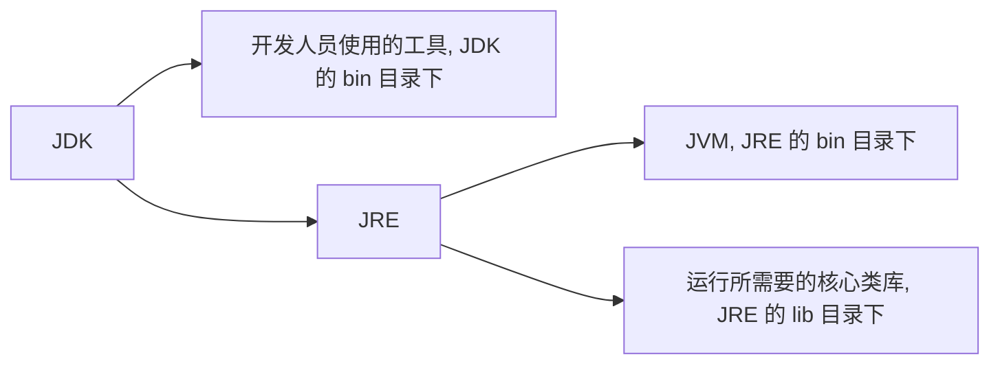
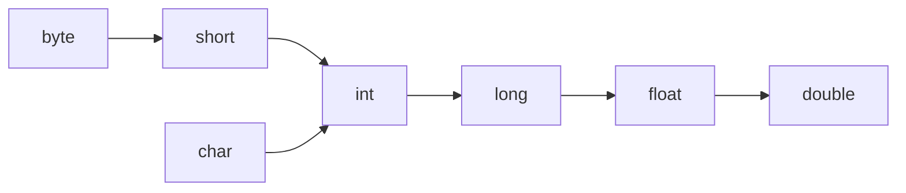
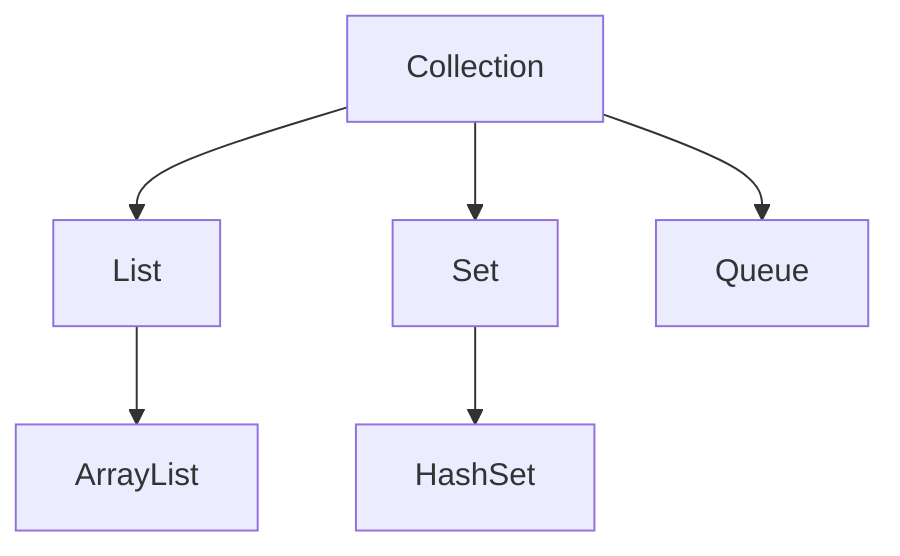
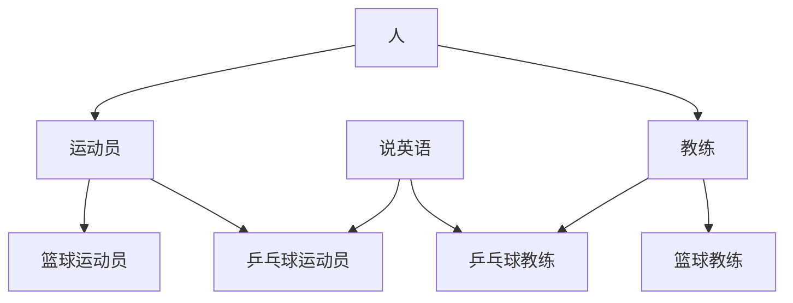
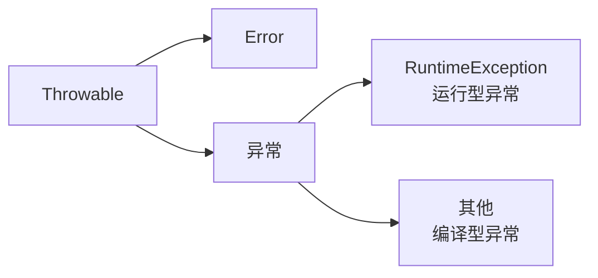
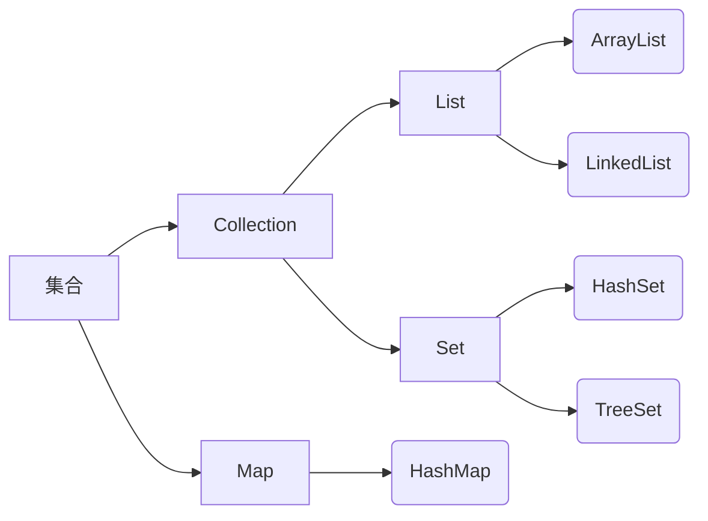
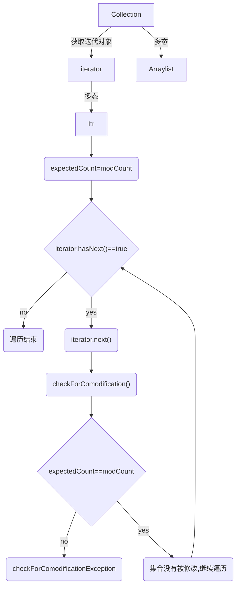

## 前言

以 [黑马程序员全套 Java 教程](https://www.bilibili.com/video/BV18J411W7cE?p=1) 网课为主。

## Java 介绍

Java 是一个可以跨平台的语言，借助 Java 虚拟机（Java Virtual Machine, JVM）能够在任意操作系统（operating system, OS）上运行。

JVM: Java Virtual Machine，在 JRE 的 bin 目录下。JVM 本质上是一个程序，使得 Java 在不同平台上运行时不需要重新编译，只需要执行保存在某字节码文件（.class）中的指令，不管什么平台，只要装有相应平台的 JVM ，字节码文件就可以在该平台上运行。

JRE: Java Runtime Environment，运行只需要 JRE 就够了。

JDK: Java Development Kit，Java 程序开发工具包。



尽管 JRE 对于运行 java 文件已经足够，作为学习肯定还是要下载 JDK 的~

JDK 的安装目录如下：

| JDK 目录名称 | 说明                                |
| ----------- | ----------------------------------- |
| bin         | 存放工具命令，如：javac, java, etc. |
| conf        | 配置文件                            |
| include     | 某些平台特定的头文件                |
| jmods       | 模块                                |
| legal       | 授权文档                            |
| lib         | 补充 JAR 包                         |
| 其他        | 说明型文档                          |

环境配置等就不多赘述了，网上好的教程太多太多。总之就是终端 javac 和 java 可以执行，最好使用 IDEA 作为 IDE。

### IDEA 环境介绍

集成环境：能够把代码编写、编译、执行、调试等功能集合到一起的开发工具。IDEA  就是 java 的集成环境之一。

创建项目-项目内创建模块（实现不同的功能）-模块 src 下创建包（类似文件夹，用于归纳区分不同的类）-包下创建类-类中编写代码。

其中，.class 文件都会放在模块同级的 out 文件夹中。


## 基础语法（重点比较与 C 的区别）

### HelloWorld 

*使用 Notepad++ 前需要设置：`设置 -- 首选项 -- 新建 -- 默认语言：Java -- 编码 ANSI`。*

新建一个 `HelloWorld.java` 文件，编辑内容：

```java
public class HelloWorld { // class 类名必须和文件名一致
    public static void main(String[] args) { //main 方法
        System.out.println("Hello World!"); // 单独输出一行的意思。注意大小写不可以出错
    }
}
```

然后在 DOS 窗口中进入当前文件所在目录，输入命令：

```
javac HelloWorld.java //编译，得到 .class 字节码文件，可以在任何支持 java 的平台上运行
java HelloWorld // .class 文件被解释执行，转化为可以直接在本地对应平台上运行的机器码文件
```

java 和 C、C++ 一样，属于 **编译型语言**（一次性翻译全部源程序，然后执行机器语言程序），而不是解释型语言（源程序逐条翻译并执行）。

### 注释

单行注释 `//` 、多行注释 `/* */` 都和 C 一样。还有一个文件注释 `/** */` 暂时用不到，之后了解。

### 关键字

字母全部小写。

### 数据类型

整数型：byte, short, int, long

浮点型：float, double

字符型：char

布尔型：boolean

变量的定义和 c 相似，`int a=10;` 不能重复定义和未初始化就使用。

```java
long l=1000000L;
float f=1.235F; //防止 long 类型和 float 类型不兼容
```

标识符命名：数字、字母（区分大小写）、_、$ 组成，数字不能开头。

*命名规范：*

*方法和变量：一个单词时，首字母大写；标识符由多个单词组成时：小驼峰命名法*

*类名：大驼峰命名法*

### 运算符

+，-，*，/，%，

+=，-=，*=，/=，%=（隐含了强制类型转换）

++，--

==，>=，<=，>，<，!=

? : 

&，|，^，!（逻辑运算符）

&&，||（短路逻辑运算符，如果左边足以判断表达式的结果，右边就不会执行）

与 C 不同的是，Java 里的 + 号可以进行字符串拼接。字符串变量碰到其他类型变量就会拼接。

```java
1+99+"string" //"100string"
"string"+1+99 //"string199"，从左往右计算
```

### 类型转换

自动类型转换：把小范围的变量赋值给大范围的变量

数据范围从小到大：




算术表达式中包含多个基本数据类型的值时，整个算术表达式的类型就会自动提升。

强制类型转换：赋值运算符中隐含。

```java
short s=10;		
s+=10;			// 正常
s=s+10;			// 错，因为右边发生了自动类型转换，变成了int型
s=(short)(s+10);// 也可以
```

### 数据输入

输入通过 Scanner 类实现。Scanner 类在 java.util 包下，要先导包才能使用。

```java
import java.util.Scanner;//导包
Scanner sc=new Scanner(System.in);//创建对象。这句话中除了 sc 是变量名可以修改，其他的都不能改。
int i=sc.nextInt();//接收数据
String s=sc.nextLine();
```

### 分支、循环语句

if - else 语句：和 C 语言一样。

switch 语句：表达式的取值可以是 byte、short、int、char，JDK5 之后可以是枚举，JDK7 之后可以是 String。其他 case break default 用法和 C 一样。

for, while, do - while 语句，及 break continue 和 C 一样。

### 随机数

Random 类，在 java.util 包下，需要导包。

```java
import java.util.Random;
Random r=new Random();
int n=r.nextInt(10);//[0,10)的范围内取随机数
```

### 数组

一次性声明大量 **同类型** 变量。

```java
int[] arr;//推荐。定义了一个 int 型的数组，数组名是 arr
int arr[];//定义了一个 int 型变量，变量名是 arr 数组

int[] arr=new int[]{1,2,3};//静态初始化
int[] arr={1,2,3};//静态初始化简化版
int[] arr=new int[3];//动态初始化，只申请了空间，系统赋予初始值
//数字类型：初始值为0.0
//布尔类型：初始值为 false
//字符串类型：初始值为""
//引用类型：初始值为 null
```

java 程序运行时需要在内存中分配空间，为了提高效率，内存空间也被划分为不同的部分。

#### 栈内存

定义的方法中的变量放在栈内存中，使用完直接消失。

如 `int a`，以及上文中定义的数组名 arr（其值是指向堆内存中数组内容的地址）。

#### 堆内存

实体、对象等的定义放在堆内存中，使用完会在垃圾回收器空闲时进行回收。

如 new 一个对象，以及上文中数组 arr 中的具体数据内容（arr [0] = 1, arr [1] = 2……）

访问数组中的内容，首先根据栈内存中数组的地址找到相应的堆内存中的位置（以及移动相应的索引步长）然后访问数据。

因此，当多个数组指向相同地址时，其中的内容是一样的，修改其中一个，另一个也会改变。

```java
int[] arr1={1,2,3};
int[] arr2=arr1;
arr2[0]=11;
arr2[1]=22;
arr2[2]=33;//这时访问 arr1[]，发现其中的数据也变成了11,22,33
```

#### 数组常见异常

1. 数组越界问题，ArrayIndexOutOfException。
2. 空指针异常问题，NullPointerException。（`arr=null`，表示数组不指向任何有效对象）

#### Array.length

数组自带属性 length，通过 `arr.length` 就能获得数组长度。

### 字符串

### 字符串输入

查看 Scanner 的帮助文档可以得知，成员方法 nextLine() 可以获取一整行内容，可用于输入接收字符串。

```java
Scanner sc=new Scanner(System.in);
String line=sc.nextLine();
//这里只输入 sc.nextLine() 然后 alt enter 代码自动补全，就会自动生成左边 String line。
```

### String

String 类型代表字符串。其内容都是被双引号引住的。

在 java.lang 包下，不用导包。

```java
String s="abc";//直接赋值
String s1=new String();//空字符串

char[] c={'a','b','c'};
String s2=new String(c);//根据字符数组创建字符串

byte[] b={97,98,99};//a, b, c 对应的 ascii 码
String s3=new String(b);
```

字符串一旦创建不能再修改。不过多个字符串的值可以共享 `s1=s2;`

*字符串在效果上像字符数组 char []，但（JDK9）以后底层实现方法其实是字节数组 byte []。*

#### 字符串比较：== 和 equals()

用 == 判断的比较，是比较 s1 和 s2 的值（即：对应字符串的地址值）是否相同。

基本类型 == 比较的是数据值是否相同，引用类型 **== ** 比较的是 ** 地址 ** 是否相同。

用字符串的成员方法 **equals()** 判断，是比较字符串 **内容** 是否相同。

```java
char[] c={'a','b','c'};
String s1=new String(c);
String s2=new String(c);
System.out.println(s1==s2);//输出 false，因为 s1 s2 地址不同，只有内容是一样的
System.out.println(s1.equals(s2));//输出 true

String s3="abc";
String s4="abc";
System.out.println(s3==s4);//输出 true，因为对于相同内容的字符串，JVM 会建立一个字符串对象（在堆内存的字符串池中）供它俩参考。
System.out.println(s3.equals(s4));//输出 true

System.out.println(s1==s3);//输出 false
System.out.println(s1.equals(s3));//输出 true
```

#### 遍历字符串：成员方法 length() 和 charAt()

`s.length()` 可以获取字符串长度。**这里注意是有括号的，和数组长度 length 区分开！** 

s.charAt(i) 可以获取索引为 i 处的字符

```java
for(int i=0;i<s.length();i++){
    System.out.println(s.charAt(i));
}
```

#### 字符串拼接

字符串可以直接用 + 号拼接。

```java
String s1="Hello ";
String s2="World";
s1=s1+s2;//Hello World
```

在内存中，字符串发生拼接后会在堆内存中新建一个字符串（有 "Hello "，"World"，"Hello World" 三个字符串，而不是直接在 "Hello " 的位置上拼接 "World"）。这样操作还是比较费时费空间的。之后介绍的另一个类——StringBuilder 可以更有效地解决这个问题。

#### endsWith()

查看字符串是否以指定子串结尾。

```java
String s1="hello world";
s1.endsWith("world");
```

#### StringBuilder 类

与 String 类相比，最主要的特点在于内容可变。

在 java.lang 包下，不用导包。

构造方法：

| 构造方法名              | 说明                                              |
| ----------------------- | ------------------------------------------------- |
| StringBuilder()         | 无参构造方法                                      |
| StringBuilder(String s) | 把给定的 String 字符串转换成 StringBuilder 类型的 |

| 成员方法名              | 说明                                          |
| ----------------------- | --------------------------------------------- |
| append(String s)        | 在结尾拼接上字符串 s                          |
| StringBuilder reverse() | 反转字符串                                    |
| String toString()       | 把 StringBuilder 类型转换为 String 类型并返回 |

用 StringBuilder 完成字符串拼接操作：

1. String 类型转换为 StringBuilder 类型
2. StringBuilder 类型通过 append() 成员方法拼接字符串
3. StringBuilder 类型通过 toString() 成员方法转换为 String 类型

```java
String s="Hello ";
StringBuilder sb=new StringBuilder(s);//或者先无参构造，再在结尾拼接 append(s)，但有点多此一举
sb.append("World");
String s1=sb.toString();

//骚操作：匿名对象，使用完立刻被垃圾回收器回收，建议少用
String s1=new StringBuilder(s).append("World").toString();
```

用 StringBuilder 完成字符串反转操作：

```java
String s="Hello World";
String sr=new StringBuilder(s).reverse().toString();
```

### 方法

java 中的方法类似 C 中的函数。只是涉及类和对象的问题，有一些小不同。

像函数一样，是有独立功能的代码块组成的集合，可以拿去调用。

```java
public static 返回值类型 方法名(形参){//和 main 方法同级
    方法体
    return 返回值;
}//定义

方法名(实参);//在 main 方法中调用。有返回值类型的方法建议用变量接收调用
```

方法不能嵌套定义。

#### 方法重载

多个方法在一个类中，有相同的方法名，但参数不完全相同。

```java
public static int max(int a, int b)
public static int max(int a, int b, int c)
```

**注意：返回值不能作为判断方法是否重载的标准！** 只有方法名和参数可以。

调用时，JVM 根据传入参数不同，来得知调用的是哪个方法。

**形参值修改不会对实参造成影响。** main() 方法存储在栈内存中，当 main() 方法调用其它方法时，其他方法进入栈内存。


但是其中的形参的值不对 main() 中的实参造成影响（除非是像数组、指针之类引用类型，根据地址去堆内存中修改数据），当 change() 方法执行完后就直接出栈了。


如图，如果是数组单元的值被修改了，实际上是堆内存中的内容被修改了， main() 方法中数组对应的地址中的内容也会被修改。

## 类和对象

### 类

类是对生活中一类具有共同属性和行为的事物的抽象。如猫类，都有毛的长短、颜色、名字等属性，也都能猫叫、吃饭等（不接受抬杠

类是对象的数据类型，是一个抽象的概念。

#### 类的定义

```java
public class 类名{
    数据类型 变量;
    数据类型 变量;
    数据类型 变量;
    
    方法1;
    方法2;
}

public class Cat{
    String name;//初始值为null或0或false或""
    int age;
    boolean tail;
    String color;
    
    public void meow(){
		System.out.println("Meow!");
    }
    public void eat(String food){
		System.out.println("Eat "+food);
    }
}
```

### 对象

类的实体化。比如罗小黑，是猫类的一个实体化。

#### 属性

对象具有的各种特征，每个对象的每个属性都有特定的值（如猫毛有长毛、短毛、无毛）

#### 行为

对象能执行的动作，如猫可以叫，可以跑。

#### 对象的使用

```java
//在 main 方法中
Cat c=new Cat();
c.name="小黑";//c 的名字
c.age=2;//2岁了
c.tail=false;//有尾巴
System.out.println(c.age);
c.meow();//行为：猫叫
c.eat("猫粮")//行为：吃饭
```

在同级目录下，类在一个文件中，main 方法在另一个文件中而且实例化了这个类，也是可以的。

对象名 c 存储在栈内存中（其值代表对象的属性在堆内存中的地址），而对象的 **属性** 等具体内容存储在 **堆内存** 中。对象中的 **方法** 调用时则加载到 **栈内存** 中，执行完毕后出栈。

### 成员变量和局部变量

成员变量：类中在方法外的变量（如上例中的属性变量）

局部变量：在类的方法中或方法声明上的变量。（如上例中 eat 方法声明的 food 局部变量）

| 成员变量           | 局部变量                                   |
| ------------------ | ------------------------------------------ |
| 类中方法外         | 方法中，或方法声明上                       |
| 堆内存中           | 栈内存中                                   |
| 对象消失时随之消失 | 方法调用完毕而消失                         |
| 有默认的初始值     | 没有默认的初始值，必须先定义、赋值才能使用 |

### 对象内存图介绍

首先老师汇总介绍了一下所有内存空间。当我们运行 Java 文件的时候系统分配一片内存空间给 JDK，里面具体是这样细分的：


元空间，或者叫方法区，负责加载字节码文件，是 JDK 8 及以后的版本从堆空间中划分出来的。

栈一般是方法，变量运行时进入。

堆是我们 new() 出来的对象的存储区域，并产生地址。

#### 单个对象的内存图

比如：`Student s=new Student();`

在这个过程中内存至少会执行以下七个步骤：

1. 加载 class 文件
2. 声明局部变量
3. 在堆内存中开辟一片空间
4. 默认初始化（将对象中的局部变量值赋值为默认值，如 `String name` 赋值就是 null, `int age` 赋值就是 0）
5. 显示初始化（如果在类定义中我们做了赋值，如 `int age=19;` 显示初始化就会重新赋值成这个我们给定的默认值）
6. 构造方法初始化（通过构造方法中的参数赋值）
7. 将堆空间中的地址值赋值给左边的局部变量


当方法执行完毕撤出栈空间的时候，没有引用堆内存中对应对象的变量时，堆内存中的对象就没有存在必要了就也被清理了。

## 封装 packaging

Java 的三大特性：封装、继承、多态。

之前定义的成员变量都可以直接对值进行修改，存在安全隐患（比如设置 age =-30）

因此我们要添加一些限制。

### private 修饰符

可以修饰成员变量、成员方法不 **直接** 被其他类使用。

```java
private String name;
private int age;
```

被 private 修饰的成员变量有两种赋值（访问）方式：构造方法和 get / set 方法。

### 构造方法

写在类中，作为类的方法。主要用于对象初始化。声明变量时 `Cat c=new Cat();` Cat() 就是一种无参构造方法。

每个类定义时系统都会给一个默认无参构造方法。如果自己给了一个无参构造方法，就会覆盖系统默认的。**建议无论是否用到构造方法，都写一个无参构造方法。**

```java
public Cat(){}//我们自己加的无参构造方法，会覆盖系统默认的
public Cat(String name){//写一部分参数的构造方法也可以
    this.name=name;//通过 this 赋给成员变量
}
public Cat(String name, int age){//写全参数的构造方法也可以
    this.name=name;
    this.age=age;
}
//main 中构造对象：
Cat c1=new Cat();
Cat c2=new Cat("小黑");
Cat c3=new Cat("小白",2);//这些都可以，与自己写的构造方法的参数相对应。
```

this 被哪个对象调用，就代表哪个对象。


然后把 "林青霞" 字符串类型传入堆内存中。

### get / set

无参构造方法后用 setXxx() 方法创建对象。

```java
public void setName(String name){//赋值
	this.name=name;
}
public void setAge(int age){
    if(age>=0&&age<=20)//在 set 中可以添加一些限制处理
	this.age=age;
}

public void getName(){//获取值
	return name;
}
public void getAge(){
	return age;
}

//在 main 方法中赋值并获取值示例：
Cat c=new Cat();
c.setName("小黑");
System.out.print(c.getName);
```

### 总结

封装将类的某些信息隐藏在类内部，不允许外部程序直接访问，而是通过该类提供的方法实现对隐藏信息的操作和访问，提高了代码安全性（在 setXxx() 方法中可以对数据进行校验）和代码复用性（封装方法可以复用）。

## 集合

集合和数组相比，就像 StringBuilder 之于 String，数组长度固定，集合长度可变。





ArrayList 就是集合的一种。

### ArrayList \< E \>

在 java.util 包下，需要导包。

\< E \> 表示泛型，限制数组中的元素只能是某一种类型（或者其子类，多态），可以在编译阶段约束操作的数据类型并进行检查（下面左边的 String）。

```java
ArrayList<String> array=new ArrayList<>();
```

泛型只能使用引用数据类型（比如包装类 Integer, Character... 或者我们自己定义的对象 Student，但是不可以使用基本数据类型 int char 这些，具体原因后面还会深入讲解）。

| 方法                        | 说明                                   |
| --------------------------- | -------------------------------------- |
| ArrayList \< E \>()            | 无参构造方法                           |
| boolean add(E e)            | 结尾添加一个元素，成功返回 true         |
| void add(index i, E e)      | 在指定索引处添加一个元素（不能越界！） |
| boolean remove(Object o)    | 删除指定对象，成功返回 true            |
| E remove(int index)         | 删除指定索引处的值，返回该值           |
| E set(int index, E element) | 修改指定索引处值，返回修改后的值       |
| E get(int index)            | 返回指定索引处元素                     |
| int size()                  | 返回集合元素个数                       |

```java
array.add(1);
array.add(3);
array.add(4);
array.add(1,2);	 // 1下标位置插入2这个元素
System.out.println(array);//输出 array：1，2，3，4
```

## 继承

有一些类有许多相同属性和方法（如猫和狗，有动物的共同特征）重复写两遍相对麻烦一些。可以把这些类的共同部分提取出来作为父类，这些类继承父类中的共有部分后再添加自己特有的内容。

```java
public class Animal{ // 父类，基类，超类
    String name;
	int age;
	boolean tail;
	String color;
}

public class Cat extends Animal{ // 子类，派生类
    public void meow(){
        System.out.println("Meow!");
    }
}

public class Dog extends Animal{
    public void bark(){
        System.out.println("Bark!");
    }
}
```

提高了代码的复用性，但是同时也提高了耦合性，如果父类修改子类也要跟着修改。

当子类属于父类的一种时，可以使用继承。

### 变量访问特点

范围越小，权限越高。

访问优先级：子类中局部变量 > 子类中成员变量 > 父类中成员变量 > 找不到就报错

如果想优先访问父类中的元素：super 关键字（使用方法类似 this，只是 this 是访问本类中的成员， super 是访问父类中的成员）


### 构造方法的访问特点

构造方法的访问优先级和变量相反。即使访问子类的构造方法，也会优先访问 **父类的无参构造方法**，再访问子类的构造方法。因为毕竟子类由父类而来，需要先构造父类再构造子类。

而在之前介绍过，如果在类中只定义了带参构造方法，就会覆盖系统默认给的无参构造方法，这时类中就没有无参构造方法了。这时再尝试使用类中的无参构造方法，就会报错。

因此，如果在父类中只定义了带参构造方法，子类使用构造方法就会报错（因为先尝试使用父类无参构造方法却发现没有）

解决方法：1. 父类中补上无参构造方法

2. 在子类构造方法中手动访问父类的带参构造方法来代替

```java
public Fu(int age)
{
    this.age=age;
}

public Zi()
{
	super(20);
}
public Zi(int age)
{
    super(age);// 子类的带参构造方法就这样传递给父类即可
}
// 不支持一个子类继承多个父类，但是允许多层基层（爷->父->子）
```

### 成员方法的访问特点

先在子类中寻找，找不到再去父类中寻找。

### 权限修饰符

public > protected > 默认 > private


### 状态修饰符

有 final 和 static。

#### final

成员变量和成员方法被 final 修饰后，不可以被重新赋值 / 重写。

类被 final 修饰后，也不可以作为父类。

*引用类型被 final 修饰后，不可以被重新赋值，指的是地址不能改变，指向的内容还是可以变的。（除了字符串类型，字符串类型内容也不可以改变）*

#### static

被 static 修饰的成员变量在所有对象里值都是一样的。

```java
public static String university;//在学生类中的静态成员变量

Student.unievrsity="北大";//统一赋值
Strudent s1=new Student();//university 变量的值是 "北大"
Strudent s2=new Student();//university 变量的值是 "北大"
```

静态成员方法则是与类本身相关（非静态的方法是和类的具体实例对象有关，静态方法是和整个类有关），调用方式也是 `类名.静态方法名`。静态方法中不能使用 this 关键字（因为没有具体的实例对象）。此外，**静态成员方法只能访问静态成员变量 / 方法！**

### 包 Package

文件夹，用于存放编译后生成的 class 文件，方便管理。

在 IDEA 中新建的 java 文件会自动生成包路径。如果要在 cmd 窗口中运行带有包路径的文件，编译照常，执行需要注明 class 文件的路径。

```java
package com.ithema;

//命令行根据路径建包
javac -d . HelloWorld.java

//编译
javac HelloWorld.java

//运行
java com.ithema.HelloWorld
```

### 导包 import

如果测试类在 src 文件夹的 A 文件夹下，要调用的类在 src 文件夹的 B 文件夹下，可以通过导包的方式来调用

`import B文件夹.要调用的类名;`

之前对于权限的学习，我们知道：只有 public 的类可以被其他跨包无关类访问；被 protected 修饰的父类对跨包的子类可见。

### 方法重写

之前学过方法重载，是函数名相同但是参数设置不同的函数。

方法重写是子类中重新定义了父类中的方法。

子类如果想访问父类中的方法，可以通过 super 来指定。

```java
@Override//注解，可以检查方法重写的正确性
public void function()
{
    System.out.println("子类中重写方法");
}
```

1. 父类的方法如果是 private 的，子类中就访问不到，也构不成方法重写一说了。
2. 子类的重写方法权限必须高于父类方法。（public > protected > 默认 > private）

## 多态

同一个对象在不同时刻表现出的形态也不同。

```java
Cat c=new Cat();
Animal a=new Cat();//父类引用指向子类对象
```

a 在内存中是 Cat 的大小，但是编译时被视作 Animal 类型。

### 多态中成员的访问特点

访问成员变量时：优先看等式左侧。如 Animal 和 Cat 中都对 age 赋值了，访问 age 得到的是 Animal 中的 age。*因为成员变量不会被重写*

访问成员方法时：优先看等式右侧。如 Cat 中重写了 eat 方法，使用 eat 方法就是使用 Cat 中的 eat 方法。

例：Animal 父类，其中含有 eat() 成员方法；Cat Dog Pig 子类，其中都重写了 eat() 成员方法。

```java
public class AnimalOperator(Animal a)
{
    a.eat();
}

//使用
Cat c=new Cat();
Dog d=new Dog();
Pig p=new Pig();
AnimalOperator(c);// 多态
AnimalOperator(d);// 多态
AnimalOperator(p);// 多态
```

调用的都是子类中重写的方法。

多态提高了程序的拓展性。对于子类重写父类中的方法，我们只需要一个操作类接口就能访问（无论子类具体是哪一种）。

但是多态无法访问子类中特有的方法。

解决这一弊端的方法就是转型。

```java
Animal a=new Cat();//向上转型，a 不能访问 Cat 类中特有的方法
Cat c=(Cat)a;//向下转型，这样 c 就可以访问 Cat 类中特有的方法了。
```

使用转型的时候注意不能随便向下转型。如本例中 a 在内存中是 Cat 类，不能转换成 Dog 类。*ClassCastException*

## Abstract, 接口

抽象方法：没有方法体的方法，待补全，请输入文本。

```java
public abstract void eat();
```

抽象类：含有抽象方法的类。

（没有抽象方法的类也可以是抽象类，但是意义何在）

抽象类不能直接创建对象，需要子类把抽象方法重写补全后才能创建对象。否则，子类也是抽象类。

### 接口

接口是一种公共的行为规范标准，只要符合规范，大家都可以使用。 java 中的接口主要是对行为的抽象。如：

```java
public interface Jumpping{ // 接口
    public abstract void Jump();
}

public class Cat implements Jumpping{ // 实现
    // 重写 Jump() 方法。如果不重写， Cat 就是一个抽象类
}
```

接口中的成员变量默认是 public static final 的，不能修改，而且可以通过 Class.成员变量 的方式直接访问。

接口中没有构造方法和非抽象方法。成员方法默认是 public abstract 的。

（但接口的实现类中可以有 super。这是因为所有没有父类的类都默认继承自 Object 类，如果接口的实现类使用 Object 类中的方法就会用到 super）

接口是抽象的，不能直接实例化，可以借助多态的方法实例化。

相较类与类之间不能多继承，只能层层继承：接口可以多实现 `implements interface1, interface2`

接口和接口之间也可以多继承 `interface1 extends interface2, interface3`

### 总结


### 设计原则

抽象类中的抽象方法所有对象中都必须有；接口则是选择性实现的。比如门这一大类，其中不管什么门，防盗门、木门、自动门，都有门的特有行为（开关门、锁门……）只是实现方法可能不一样，所以要在门父类中定义这些抽象方法，在子类中必须实现。

但是对于门来说不是必须有的抽象方法（如响铃）这种抽象方法就应该作为接口，选择性实现。有响铃功能的门实现这一接口，没有响铃功能的门不必实现。

例：有乒乓球运动员、乒乓球教练、篮球运动员、篮球教练。为了能出国交流，乒乓球运动员和教练需要会说英语。但并不是“是人就该会说英语，是运动员和教练就该会说英语”。所以说英语应当作为接口而不是人里面的抽象方法。



其中，人、运动员、教练是抽象类，说英语是接口。其他具体类需要实现接口，并重写继承的所有抽象方法。

### 抽象类 / 接口作为形参 / 返回值

类也可以作为形式参数或函数的返回值。

抽象类：如果方法的形参或函数的返回值是抽象类名，实际需要传递的是实现了该抽象类的子类的实例对象。

如函数形参是 Animal，实际需要通过多态的方法 Animal a = new Cat(); 然后把 a 传给函数。

接口作为形参/函数返回值，和抽象类一样，实际需要的是实现了该接口的类的实例对象。

## 内部类

在类中定义一个类。

### 内部类和外部类的互相使用

无论外部类的成员变量的权限修饰符是什么（private, public……）因为都在同一个类中，所以即使权限修饰符是 private 也可以相互访问。

内部类都可以 **直接** 访问外部类的全部成员变量。

而外部类如果想访问内部类的成员，需要 **先创建一个内部类对象再访问**。

### 外界使用内部类

外界使用内部类：`Outer.Inner oi=new Outer().new Inner();`

如果 inner 是私有的，或者是局部内部类，则不能通过上述方法调用。但是可以在 outer 里定义一个公开的方法，在方法中 new 一个 inner 并使用其中的成员方法。对于外部的调用者来说，他只需调用 outer 的这个方法，就可以访问 inner 的成员方法。不过对使用者来说他并不知道内部结构如此。**封装**

### 内部类的分类

在类的成员位置定义：成员内部类

在类的局部定义：局部内部类。

局部内部类不能从外界直接创建对象，只能通过调用方法来创建类

```java
public class Outer {
	private int num=10;
    public void method() {
        class Inner {
			public void show(){
                System.out.println(num);//局部内部类可以访问外部类的成员变量，或 method 方法中的局部变量
            }
        }
        Inner i=new Inner();//在方法中创建内部对象
        i.show();//创建对象之后，记得调用内部方法的成员变量
    }
}
```

### 匿名内部类

继承了另一个类，或实现了接口的子类匿名对象。

首先有一个父类/接口，其中有具体的/抽象的方法，然后匿名内部类对其进行重写/实现。

```java
//接口文件 inter.java 中：
public interface inter {
    public void show();//抽象方法
}

//外部类文件 Outer.java 中
public class Outer {
	private int num=10;
    public void method() {
        new inter {
            @Override
            public void show(){
                System.out.println("匿名内部类");
            }
        }.show();// 创建匿名对象之后，记得调用成员变量
        
        //另一种方法：
        inter i=new inter {
            @Override
            public void show(){
                System.out.println("匿名内部类");
            }
        }
        i.show();
    }
}
```

使用示例：假如我们有一个 jump 接口，有一个 jumpoperator 类，其中包含 method(Jump j) 执行 j 的 jump 。

我们要让不同动物都能 jump，就要在不同动物类中 implements jump 接口，并重写其中的抽象方法；

然后用多态的方式 `jump c=new cat(); jump d=new dog();` 新建对象并传给 method 方法。

但是可以通过匿名内部类的方法：

```java
jo.method(new jump(){
    @Override
    public void jump()
    {
        System.out.println("猫跳高");
    }
});

jo.method(new jump(){
    @Override
    public void jump()
    {
        System.out.println("狗跳高");
    }
});
```

直接传一个匿名内部类参数给 method 方法，就不用新建文件重新定义类了。

## 一些常用类

### Math

不用导包，成员变量、方法都带有 static 修饰，可以直接通过类名访问。

| 方法                                        | 说明                                     |
| ------------------------------------------- | ---------------------------------------- |
| public static int abs(int a)                | 绝对值，支持 double  float int long 类型 |
| public static double ceil(double a)         | 向上取整，返回一个 double 值             |
| public static double floor(double a)        | 向下取整，返回一个 double 值             |
| public static int round(float a)            | 四舍五入                                 |
| public static int max(int a, int b)          |                                          |
| public static int min(int a, int b)          |                                          |
| public static double pow(double a, double b) | a 的 b 次幂                              |
| public static double random()               | 随机数，范围 [0.0,1.0)                   |

随机数想要其他范围可以做算术运算。如 [0.0, 100.0)就用 `random()*100`。

### System

不用导包，不能实例化，static

| 方法                                   | 说明                                               |
| -------------------------------------- | -------------------------------------------------- |
| public static void exit(int status)    | 终止运行 JVM，非零表示非正常终止                   |
| public static long currentTimeMillis() | 返回当前时间到 1970 年 1 月 1 日的时间间隔，以毫秒为单位 |

currentTimeMillis() 可以整除求得当前年份；可以用两个 currentTimeMillis() 值做差求时间间隔等。

### Object

Object 类是所有类的根类。

| 方法                              | 说明                                                   |
| --------------------------------- | ------------------------------------------------------ |
| public String toString()          | 返回对象的字符串表示形式。建议子类全部重写该方法       |
| public boolean equals(Object obj) | 比较对象是否相等（默认比较地址）。重写可以比较对象内容 |

#### toString() 方法

Object 中包含 toString 方法

```java
public String toString() {
        return getClass().getName() + "@" + Integer.toHexString(hashCode());
}
```

输出类名@+一串哈希值。

一般重写 toString() 方法，用于输出简明扼要的类信息。IDEA 中可以像构造方法和 getter / setter 一样自动生成。类似：

```java
//手动实现
public String toString(){
return "{ Person:name=" + name +" age=" + age+"}";// name 和 age 都是本类中的成员变量
}
```

#### equals

`s1.equals(s2)` 本质上是比较两个对象的地址，肯定是 false。

一般也会重写/自动生成可以比较两个对象内容是否一致的方法。

```java
public boolean equals(Object o) {
    if (this==o) return true; //同一个对象
    if(o==null||getClass()!=o.getClass()) return false;//o是空对象，或这两个对象不属于一个类
    Student student=(Student) o;//因为调用 equals 传参的时候向上转型了，o 变成了 Object 类，要转回来
    if (age!=student.age)return false; 
    return name!=null?name.equals(student.name):student.name==null;//要么 name 都是空字符串，要么相同。equals() 方法只有非空字符串才能调用
}
```

### Arrays 类

需要导包 `java.util.Arrays`，不能创建对象，成员是 static 的。

| 方法                                   | 说明                              |
| -------------------------------------- | --------------------------------- |
| public static String toString(int [] a) | 返回形如 "[a, b, c]" 的字符串形式 |
| public static void sort(int [] a)       | 按数字顺序排列指定的数组          |

### 补充：工具类

以上工具类的特点都是：不能创建对象，但是成员方法都是 static 修饰，可以直接用类名访问。比如 `Arrays.sort(arr);`

以下这些方法不能创建对象：

```java 
public Math(){};
public Arrays(){};
public System(){};
```

因为这些类自己写了无参构造方法，会把系统默认的无参构造方法覆盖。而该方法又是私有的，因此外界无法访问创建对象。

### 基本类型包装类

其中有一些方法能更好地处理基本数据类型。

包括：Byte, Short, Integer, Long, Float, Double, Character, Boolean

#### 方法示例

| 方法                                    | 说明                          |
| --------------------------------------- | ----------------------------- |
| public static Integer valueOf(int i)    | 把 int 转换为 Integer 类型    |
| public static Integer valueOf(String s) | 把 String 转换为 Integer 类型 |

public String [] split(String regex) 把给定字符串用 regex 分隔开。

如给定字符串 s 是 "1 2 3 4"，`s.split(" ")` 就会得到 4 个字符串："1" "2" "3" "4"。

#### 基本类型转换

int -> String：

① 空字符串+int 类型 `""+123`

② `String s=String.valueOf(i);`

String -> int：

① `Integer in=Integer.valueOf(s);`

`int i=intValue(in);`

② `int i=Integer.parseInt(s);`

#### 自动装箱和拆箱

装箱：基本类型-> 对应的包装类型

拆箱：包装类型-> 基本类型

```java
Integer i=Integer.valueOf(100);//装箱
Integer ii=100;//自动装箱

ii=ii.intValue()+200;//拆箱
ii+=200;//自动拆箱

Integer i3=null;
i3+=300;//NullPointerException。因此对象使用之前最好先判断是否为 null
```

### 日期类

#### Date

Date 类，需要导包。**注意是 java.util 下的，而不是 java.sql 下的！** java.util 下的 Date 类非最终类，所以可以有子类， java.sql 下的 Date 类就是其子类。

| 方法                           | 说明                                                   |
| ------------------------------ | ------------------------------------------------------ |
| public Date()                  | 初始化一个 Date 对象，值为其被分配时的时间，精确到毫秒 |
| public Date(long Date)         | 分配一个 Date 对象，值为从标准时间起指定的毫秒数       |
| public long getTime()          | 获取日期对象从标准时间到现在的毫秒数                   |
| public void setTime(long time) | 设置时间，单位为毫秒                                   |

```java
//输出 Date 对象，得到：星期 月份 日期 时 分 秒 CST 年份

long d=1000*60*60;
Date da=new Date(d);//标准时间往后1h，即1970.1.1 上午9点（不是1点，因为 CST 有时差）

long time=System.currentTimeMillis();//可以这样获取当前时间，然后传给 Date() 或 setTime()
```

#### SimpleDateFormat

可以自己设置日期格式。

| 方法                                    | 说明                                 |
| --------------------------------------- | ------------------------------------ |
| public SimpleDateFormat()               | 构造方法，并使用系统默认的 Date 格式 |
| public SimpleDateFormat(String pattern) | 构造方法，并使用自己规定的格式       |
| public final String format(Date d)      | 将日期对象转换为相应格式的字符串     |
| public final Date parse(String s)       | 将字符串转换为日期                   |

```java
public static void main(String[] args) throws Parse Exception{//结尾要加一些东西，在 IDEA 中可以自动补全
    Date d=new Date;//被分配时的时间
    SimpleDateFormat sdf=new SimpleDateFormat("yyyy年-MM月-dd日 HH:mm:ss");
    String s=sdf.format(d);
    System.out.println(s);//输出格式就形如 2022年-05月-05日 10:24:00
    
    String ss="2022-05-05 10:24:00";
    SimpleDateFormat sdf1=new SimpleDateFormat("yyyy-MM-dd HH:mm:ss");
    Date d1=sdf1.parse(ss);
}
```

y 年 M 月 d 日

H 时 m 分 s 秒

（实际运用的时候，也可以让用户自己指定格式。比如单独写一个日期工具类，有两个方法，把 Date 转换为 String 和把 String 转换为 Date；这两个方法可以设置两个传入参数：

`public static String dateToString(Date d, String format)`

`public static String StringTodate(String s, String format)`

在方法内根据传入的字符串格式，利用 SimpleDateFormat 的方法进行转换。）

#### Calendar 类

需要导包 `java.util.Calendar`，是一个抽象类。

为某一时刻和某些日历字段的转换，以及操作日历字段提供了一些方法。

Calendar 类有一个类方法可以获取 Calendar 对象。可是 Calendar 类不是抽象类吗？

```java
Calendar rightnow=Calendar.getInstance();
```

其实这个方法和 Calendar 的直接子类有关，所以这个实例化相当于多态。

| 方法                                                 | 说明                    |
| ---------------------------------------------------- | ----------------------- |
| public int get(int field)                            | 获取给定日历字段的值    |
| public abstract void add(int field, int amount)      | 添加/减去给定的日历字段 |
| public final void set(int year, int month, int date) | 设置日历的年月日        |

```java
y=c.get(Calendar.YEAR);
m=c.get(Calendar.MONTH)+1;//month 是从0开始的，所以要+1
d=c.get(Calendar.DATE);

//例：求2020年2月有多少天?
Calendar c=Calendar.getInstance();
c.set(2020,2,1);//设置为3月1日
c.add(Calendar.DATE,-1);//倒退1天，就是2月的最后一天
System.out.println("2020年2月有"+c.get(Calendar.DATE)+"天");
```

## 异常

有时因为编译错误，会提示一些信息（如：数组越界 ArrayIndexOutOfBoundException) 其实这些提示信息也是类。

### Throwable

Throwable 是所有错误、异常的父类。



Error 程序无法处理，而异常程序可以处理。

RuntimeException：运行时异常，非受检异常， 可以先不处理，等到真的异常了再进行处理。在编译期间不会检查，其他类错误在编译期间检查。比如数组越界。

编译时异常：受检异常，不管运行会不会异常，都需要进行异常处理，不然无法编译。

### 处理异常

JVM 对异常的默认处理方式：输出异常名称、位置、原因，并停止运行。

程序员还可以有自己的处理异常方法，如 try...catch 和 throw。

#### try...catch

```java
try{
    可能出现异常的代码;
}
catch(异常类名 变量名){
    出现异常后的处理代码;
}

String s="2022-05-07";
SimpleDateFormat sdf=new SimpleDateFormat("yyyy-mm-dd");
sdf.parse(s);// 这个方法不能直接用，必须要加异常处理

try{
    sdf.parse(s);
}
catch(ParseException e){
    System.out.print("parseException!");//不管会不会发生异常，都要写
}
```

出现异常时，异常对象会被提交给 Java 运行时系统，如果和 catch 中的异常类匹配就会进行异常的处理，**处理完成后可以继续执行。**

如果异常变量命名为 e , 调用 e 的成员方法 `e.printStackTrace()` 就会输出平时出现异常时系统默认提示的信息：`java.lang.ArrayIndexOutOfBoundsException: Index 3 out of bounds for length 3  at com.ithema_02.ExceptionDemo02.method..... `

但是通过这种方法处理异常之后，异常后面的部分仍然可以执行。

#### Throwable 的成员方法

Throwable 作为超类，其所有子类都可以使用他的成员方法。

| 方法                          | 说明                              |
| ----------------------------- | --------------------------------- |
| public String getMessage()    | 返回此 Throwable 的详细消息字符串 |
| public String toString()      | 返回此可抛出的简短描述            |
| public void printStackTrace() | 把异常的错误信息输出到控制台      |

```
e.getMessage():  Index 3 out of bounds for length 3
e.toString(): java . lang.ArrayIndexOutOfBoundsException: Index 3 out of bounds for length 3
e.printStackTrace(): java.lang.ArrayIndexOutOfBoundsException: Index 3 out of bounds for length 3  at com.ithema_02.ExceptionDemo02.method.....
```

利用 Ctrl B 追根溯源可以得知， getMessage() 内部大概是这样的：

```java
public class Throwable {
    private String detailMessage;//Throwable 类中的一个成员方法
    
    public Throwable(String message){
        detailMessage=message;//构造方法。出现异常时，会通过这种方法构造一个异常对象
    }
    
    public String getMessage(){
        return detailMessage;
    }
}
```

### Throws

可以抛出异常给 try catch 处理，但是自身不能解决。

```java
throws 异常类名;

public static void main(String[] args){
    System.out.println("运行开始");
    method1();
    try{
        method2();//抛出给了 try catch 处理
    }
    catch(ParseException e)
    {
        System.out.println("运行错误");
    }
    System.out.println("运行结束");
}

public static void method1() throws ArrayIndexOutOfException{
    int[] arr={1,2,3};
    System.out.println(arr[3]);//会报错并停止运行，throws 并没有解决数组越界这个异常
}

public static void method2() throws ParseException{
    String s="2022-05-07";
	SimpleDateFormat sdf=new SimpleDateFormat("yyyy-mm-dd");
	sdf.parse(s);//因为抛出，可以使用了。如果异常，try catch 会显示“运行结束”并继续运行。
}
```

> [!WARNING]
>
> 如果一个父类没有 throws 抛异常，那继承它的方法并重写方法的子类也不能用 throws 抛异常，只能 try catch。

### 自定义异常

```java
public class 类名 extends Exception{
    无参构造
    带参构造
}

public class ScoreException extends Exception{
    public ScoreException(){}
    public ScoreException(message){
        super(message);//把 message 传给父类处理
    }
}

//异常类的使用
public class Teacher throws ScoreException{
    public void checkScore(int score)
    {
        if(score<0||score>100){
            throw new ScoreException("输入分数有误！请重新输入");//throw 不是 throws!
            /*throw 写在方法体内，throws 写在类定义里。
            throws 不一定有异常，而 throw 一定是抛出了异常。*/
        }
        else
            System.out.println("分数正常");
    }
}

public static void main(String[] args){
    Scanner sc=new Scanner(System.in);
    int score=sc.nextInt();
    Teacher t=new Teacher();
    try{//调用方法时，要处理抛过来的异常
        t.checkScore(score);
    }
    catch(ScoreException e){
        e.printStackTrace();
    }
}
//异常时就会输出：异常类型 ScoreException，异常原因"输入分数有误！请重新输入"，异常位置。
```

## 集合进阶



其中方形的是接口，圆角的是实现类。

因此先学习 Collection 和 Map 接口后，只需要学习下一级的特有的部分。

### 数据结构

- 栈：后入先出 FILO。

- 队列：先入先出 FIFO。

- 数组：可以根据索引查找，查找效率高；增删效率低。

- 链表：每个结点存储数据和下一个结点的地址值。最后一个结点地址值为空。相比数组，增删只需要修改增删处前后结点的地址值，效率更高。但是查询必须从头开始，效率低。

- 树。

- 红黑树。

  

  添加节点优先是添加红色的（不影响简单路径的黑色节点数，调整次数少）。

  

  红黑树对平衡要求性低一些（最长路径不超过最短路径的 2 倍），所以插入数据的时候需要的旋转次数平均下来更少。适用于频繁插入删除操作。

### Collection

`java.util.Collection`

`Collection` 是单例集合的最高级接口。他表示一组对象，这些对象也被称为 `Collection` W 的元素。

无法直接实现。可以用多态的方式实现。

```java
Collection<String> c=new ArrayList<String>();
//add(E e) 方法添加元素
c.add("Hello");
c.add("World");
System.out.println(c);//输出['Hello','World']，因为 ArrayList 中重写了 toString 方法，所以得到的不是一串地址
```

| 方法                       | 说明                                      |
| -------------------------- | ----------------------------------------- |
| boolean add(E e)           | 添加元素，永远返回 true                   |
| boolean remove(Object o)   | 从集合中移除指定的元素，成功移除返回 true |
| void clear()               | 清空集合中的元素                          |
| boolean contains(Object o) | 判断集合中是否存在指定的元素              |
| boolean isEmpty()          | 判断集合是否为空                          |
| int size()                 | 集合长度                                  |

快捷键：Alt+7，能看到类的所有信息

#### 迭代器 iterator

java.util.Iterator

Iterator 是一个接口。使用 Iterator 迭代器遍历集合元素。

```java
Iterator<String> it=c.iterator();//通过集合对象中的迭代方法获取对象
```

追根溯源可以得知，Collection.iterator()方法返回的是一个实现了 Iterator 接口的类：Itr.

所以实际上是通过多态的方式实例化的。

| 方法              | 说明                                                         |
| ----------------- | ------------------------------------------------------------ |
| E next()          | 返回下一个元素（越界访问：NoSuchElementException，被请求的元素不存在）并移动指针到下一个位置 |
| boolean hasNext() | 如果存在下一个元素，返回 true                                |

```java
while(it.hasNext()){
    String s=it.next();//这样更好一些，因为元素可能还要做其他操作
    System.out.println(s);
}
```

it.next() 像指针一样从 0 开始遍历。

#### 并发修改异常

当不允许这样的修改时，会抛出此方法。

如：在使用 iterator 遍历过程中，在集合中添加了新的元素。

iterator 调用 next() 方法时，会先调用 checkForComodification() 方法。

checkForComodification() 会检验 modCount 修改集合的次数和 expectedModCount 预期修改集合的次数是否相等。

modCount 来自于 ArrayList 的父类：AbstractList，初始值为 0.每次使用 add() 方法时，modCount 就会++。

expectedCount 来自于 Itr 类，且初始值为 `expectedCount=modCount`.

每次实例化一个 Iterator 类，都会调用其子类 Itr 类，使得 expectedCount 等于当前的 modCount。

然后遍历过程中每次调用 next() 方法时，都会先检查一下 `expectedCount==modCount`，即集合有没有被修改。如果没有修改就可以顺利地返回下一个元素；如果有异常 checkForComodificationException，就会终止运行。




但是通过 for 循环遍历集合，在遍历过程中对集合进行修改，不会报异常。

### List

java.util.List

继承自 Collection 类，可以使用其中的方法。

List 是有序、有索引的。相较于集合 Set，List 中的元素可以重复。

```java
List<String> l=new ArrayList<String>();
l.add("Hello");
l.add("World");
System.out.println(l);//按存储的顺序输出，["Hello","World"]
```

| 方法                          | 说明           |
| ----------------------------- | -------------- |
| void add(int index, E element) | 感觉并不用解释 |
| E remove(int index)           |                |
| E set(int index, E element)    |                |
| E get(int index)              |                |

越界报错 IndexOutOfException。

另一种遍历集合的方法是 for 循环。

```java
for(int i=0;i<l.size();i++)System.out.println(l.get(i));
```

#### List Interator

通过 List 中的 listInterator() 方法得到。可以从各个方向遍历，迭代期间可以修改列表，还可以获取列表迭代器的当前位置。

| 方法                  | 说明                                                         |
| --------------------- | ------------------------------------------------------------ |
| boolean hasNext()     |                                                              |
| E next()              |                                                              |
| boolean hasPrevious() | 反向遍历用到                                                 |
| E previous()          | 反向遍历用到                                                 |
| void add(E e)         | 添加元素，**注意是通过 listInterator 添加的，不是通过集合添加的！** |
|                       |                                                              |

```java
List<String> l=new ArrayList<String>();
l.add("Hello");
l.add("World");
l.add("java");
ListInterator<String> li=l.listInterator();//实际上是 listItr 类作为 listInterator 类的子类，通过多态实现
while(li.hasNext()){
    System.out.println(l.next());
}

while(li.hasPrevious()){
    System.out.println(l.previous());
}

while(li.hasNext()){
    String s=l.next();
    if(s.equals("World")){
        li.add("!!!");//特别注意，并不是调用了l的 add() 方法，而是 li 的 add() 方法！
    }
    System.out.println(s);
}
```

在 listItr 类中的 add() 方法，添加完元素之后，有一句 `expectedModCount=modCount;` 重新把实际修改值赋给了预期修改值。因此 next() 方法中判断 `expectedModCount==modCount`，即使添加了新元素也仍然是 true. 不会发生并发修改异常。这就是为什么要特殊强调这里的 add 和 List 自身的 add 不一样。

#### 增强 for

```java
for(E e:数组或 Collection 的集合)
{
	//在这里使用变量e，把其当做集合元素来用
}

for(int i:arr){
    System.out.println(i);
}

for(int i:list){
    System.out.println(i);
}
//内部是一个 iterator 迭代器，不可以中途修改数据，会引发并发修改异常。
```

#### 几种遍历方式的选择

单纯的遍历：增强 for 最简单。

需要用到索引：普通 for。

迭代器也要会用。

ArrayList 底层数据结构是数组，LinkedList 底层数据结构是双向链表。

用法一模一样，查询效率高就用 ArrayList，增删效率高用 LinkedList。

#### ArrayList 

实现原理：

底层先创建一个长度为 0 的数组。

添加第一个元素的时候底层扩容为一个长度为 10 的连续存储区域的数组。指针指向下一个要存入的数据的位置。

后续继续添加元素，直到装满的时候，整个数组扩容 1.5 倍（在其他地方开辟一片 1.5 倍原数组长度的区域，并且把原来的数据全部拷贝进去）。

如果一次添加多个元素超过扩容后的 1.5 倍的数量，则按照新添加元素数量来扩容数组。


方法的话没什么特殊的。

#### LinkList 

双向链表，有很多操作首尾元素的特殊方法。

| 方法                      | 说明                           |
| ------------------------- | ------------------------------ |
| public void addFirst(E e) | 这些含义都比较明显就不多赘述了 |
| public void addLast(E e)  |                                |
| public E getFirst()       |                                |
| public E getLast()        |                                |
| public void removeFirst() |                                |
| public void removeLast()  |                                |

工作原理：


### 泛型

之前在介绍 ArrayList 的时候简单介绍过，泛型用于编译阶段约束操作的数据类型，如 `ArrayList<String> arrayList=new ArrayList<>();` 就只能存入 String 包装类型了。只能存入指定的泛型数据类型或者其子类（多态）。

如果集合没有限制泛型类型，那么传入什么类型的对象都可以，`ArrayList arrayList=new ArrayList<>();` 传一个 Integer，传一个 String，传一个 Student……（默认 Object 类型，多态）

但是多态的弊端在于没法使用子类中的特有自定义方法。迭代器的类型也和泛型定义的一样。

但是其实 java 中的泛型是伪泛型。就是只在编译阶段检查，其实泛型检查相当于一个保安大爷。编译阶段会简单判断一下你传入的数据是否都符合泛型数据类型，符合才让存；但是存进去的时候还是按照 Object 类型存入的。只不过取出数据准备处理的时候多做了一步操作，就是将 Object 类型的数据再转化为对应的泛型数据类型。

为什么这样做？因为泛型的概念是 JDK 1.5 才提出的，在之前的集合是没有泛型的，而新版本要尽可能向下兼容（因为之前已经诞生了很多 java 代码了，如果全部改成按指定泛型存入数据类型，之前很多旧版本的代码就用不了了，都要改）。

*其实这也解释了为什么泛型不能设定为基本数据类型如 `int` `char` 这些，因为这些类型存入的时候无法转换为 `Object` 类型）*

#### 泛型的几种应用场景

泛型类：当不确定数据类型的时候使用。


*字母写什么都行，不过上面这四个比较常见。*

比如下面这个是一个自定义的泛型类：

```java
public class MyArrayList<E> {
    Object[] obj = new Object[10];
    int size;

    /*
     * E：表示是不确定的类型。该类型在定义类的时候已经定义过了。
     * e：形参的名字，变量名
     */

    public boolean add(E e) {
        obj[size] = e;
        size++;
        return true;
    }

    public E get(int index) {
        return (E) obj[index];
    }

    @Override
    public String toString() {
        return Arrays.toString(obj);
    }
}

```

泛型方法：如果类里面只有一个方法要用到泛型变量，推荐使用这种方法。


```java
/**
 * 参数一：集合
 * 参数二~最后：要添加的元素
 */
public static <E> void addAll(ArrayList<E> list, E e1, E e2, E e3, E e4) {
    list.add(e1);
    list.add(e2);
    list.add(e3);
    list.add(e4);
}

```

传入该数据类型的集合变量后，后续几个变量都会自动检测是否和集合变量同类型。

```java
ArrayList<String> list = new ArrayList<>();

ListUtil.addAll(list, "aaa", "bbb", "ccc", "ddd");
```

其实也可以传入可变参数 (E... e) 不限制传入参数个数。

泛型接口：


```java
public class MyArrayList2 implements List<String>{}
public class MyArrayList3<E> implements List<E> {}
```

#### 泛型不具备继承性

但是数据具备继承性。

比如定义了 `public static void method(ArrayList<Ye> arrayList)`，Ye 是 Fu 的父类，Fu 是 Zi 的子类，那么：

```java
// 创建集合的对象
ArrayList<Ye> list1 = new ArrayList<>();
ArrayList<Fu> list2 = new ArrayList<>();
ArrayList<Zi> list3 = new ArrayList<>();

// 调用 method 方法
// method(list1);
// 下面这些方法报错，泛型方法必须传入完全一样数据类型的变量
// method(list2);
// method(list3);

// 这种使用方法不报错，数据具有继承性
list1.add(new Ye());
list1.add(new Fu());
list1.add(new Zi());
```

那么怎么传入多种数据类型的变量呢？method 定义成 `method(ArrayList<E> arrayList)` 这样就什么数据类型都能传了。但是我们没法只限制某一类特殊的类，比如“我只想接收 Ye Fu Zi 类的集合”，办不到，只能所有引用类型都接收。

要想限制成部分类，需要使用泛型通配符。

`public static void method(ArrayList<? extends Ye> arrayList` 是继承自爷的所有类包括爷可以传入。

`public static void method(ArrayList<? super Ye> arrayList` 是 Fu 的所有父类包括 Fu 可以传入。

### Set

List 有序，可重复，有索引。Set 无序（存取顺序不一定一样），不重复，无索引。

#### HashSet

增删改查性能都不错。

JDK8 之前的版本底层是数组+链表实现。JDK8 之后是数组+链表+红黑树实现，做了优化。

添加元素时存储位置参考哈希值：


加载因子用于判断数组什么时候扩容，比如上例是存入了 16\*0.75 = 12 个元素之后扩容。

这也解释了为什么 Set 遍历无序（按数组顺序遍历，但是对应的是哈希值从小到大遍历，不一定是存入顺序）

默认是使用 Object 里面的 hashCode() 方法，利用对象的地址计算哈希值（不同的对象哈希值一定不同），一般会重写 hashCode 方法，根据对象属性计算哈希值（可以 IDEA 快捷生成），使得只要对象的属性相同，计算得到的哈希值就相同。

*不同的地址值或者对象属性值计算哈希值也有小概率会相等，这叫做哈希碰撞。*

*String 和 Integer 类型 在 Java 里面已经重写好了 equals 和 hashCode 方法，不需要重写。*

#### LinkedHashSet

有序（存取顺序一致），无重复，无索引。

额外用一个双链表记录元素存储顺序。

数据去重默认使用 HashSet，如果还有有序需求再使用 LinkedHashSet.

#### TreeSet

不重复，无索引，可排序。

数据存进去就默认被排序了。数值类型从小到大排序，字符类型按 ASCII 码升序排序。

但是如果是自定义的对象，直接传入 TreeSet 是无法传入的会报错，因为默认没有写比较方法，尝试使用排序函数也会获得一样的结果。

第一种排序方式：

首先要让自定义类 `implements Comparable` ，如 `public Student implements Comparable<Student>` 因为这里我们已经确定了要比较的类型就是 Student 类型所以不用泛型 E。

比较方法重写如下：

```java
@Override
public int compareTo(Student o) {
    // 指定排序的规则
    // 只看年龄，我想要按照年龄的升序进行排列
    return this.getAge() - o.getAge();
}
```

然后就可以排序了。当然也可以自己修改逻辑规则比如先按照姓名字符串排序，相等的话再按年龄……

排序的话只重写 compareTo 就可以了，不需要重写 hashCode 和 equals 方法。这两个方法是用于 HashSet 的。

排序结构是红黑树。

第二种排序方式：

创建集合对象的时候，传递比较器进行比较。

```java
/*
需求：请自行选择比较器排序和自然排序两种方式；
要求：存入四个字符串 “c”, “ab”, “df”, “qwer”
按照长度排序，如果一样长则按照首字母排序

采取第二种排序方式：比较器排序
*/

// 1. 创建集合
TreeSet<String> ts = new TreeSet<>(new Comparator<String>() {
    @Override
    public int compare(String o1, String o2) {
        // 按照长度排序
        int i = o1.length() - o2.length();
        // 如果一样长则按字母顺序
        i = i == 0 ? o1.compareTo(o2) : i;
        return i;
    }
});

// 或者 lambda 表达式：
TreeSet<String> ts = new TreeSet<>((o1, o2) -> {
    // 按照长度排序
    int i = o1.length() - o2.length();
    // 如果一样长则按照首字母排序
    i = (i == 0 ? o1.compareTo(o2) : i);
    return i;
});
```

Comparator 优先级高于 compareTo，对于 Integer 和 String java 已经定义好 compareTo 的情况我们又不想修改源码，就可以使用 Comparator 来重新设置排序方法。

### List Set 集合使用场景总结

`ArrayList`：元素可重复，随机存取。

`LinkedList`：元素可重复，且增删操作数量明显多于查询。

`HashSet`：对集合中的元素去重。

`LinkedHashSet`：去重，而且保证存取顺序。

TreeSet`：去重，且排序。

*后续也可以使用 `List` + 排序方法实现排序。*

### Map 双列集合

双列指的是键值对，添加一条数据需要同时添加键和值两个数据。键不能重复。键和值一一对应。在 Java 中键值对整体被称作”Entry 对象“。

Set 的底层源码都和 Map 有关。

Map 常用 API 一览：

| 方法签名                                                  | 说明                                                         |
| --------------------------------------------------------- | ------------------------------------------------------------ |
| `V put(K key, V value)`                                   | 添加元素. 默认返回 null，如果该键已经存在则会覆盖旧值，返回旧值 |
| `V get(K key)`                                            |                                                              |
| `V remove(Object key)` `void clear()`                     | 根据键删除键值对元素移除所有的键值对元素                     |
| `void clear()` `boolean containsKey(Object key)`          | 移除所有的键值对元素判断集合是否包含指定的键                 |
| `boolean containsKey(Object key)`                         | 判断集合是否包含指定的键                                     |
| `boolean containsValue(Object value)`                     | 判断集合是否包含指定的值                                     |
| `boolean containsValue(Object value)` `boolean isEmpty()` | 判断集合是否包含指定的值判断集合是否为空                     |
| `boolean isEmpty()` `int size()`                          | 判断集合是否为空集合的长度，即键值对的个数                   |
| `int size()`                                              | 集合的长度，即键值对的个数                                   |

和集合有些区别，比如 add 变成了 put，contains 变得复杂了。

```java
Map<String, String> map = new HashMap<>();
```

遍历方法：

```java
// 1. 获取所有键
Set<String> keys = map.keySet();
for(String key in keys){
    String value = map.get(key);
}

// 2. 获取所有键值对
Set<Map.Entry<String, String>> entries = map.entrySet();
for(Map.Entry<String, String> entry: entries){
    String key = entry.getKey();
    String value = entry.getValue();
}

// 3. lambda 表达式。底层逻辑其实也是 entrySet 获取所有键值对赋值给 k v。
map.forEach((k,v)->{
            System.out.println(k+": "+v);
});
```

#### HashMap

没啥额外方法。特点和键一样，无序不重复无索引。

底层和 `HashSet` 一样，数组+链表，JDK8 之后还有红黑树。添加一个键值对，创建 Entry 对象存储键值对，计算其索引，放入对应的哈希数组单元。如果该单元里有对应的键 则覆盖该键（和 `HashSet` 不一样，`HashSet` 是不存），如果不一样则挂到旧的键值对下面。长度超过 8 转为红黑树。

键依靠 `hashCode()` 和 `equals()` 判断是否一致，如果键是自定义对象还需要重写这两个方法。

>[!NOTE]
>
>基于这个覆盖特性，比如可以做统计。投票统计，看看 A B C D 谁的票最多。我们创建一个键为 A 或 B 或 C 或 D，值为票数的数组，每次有人投票就取出对应的键值，值++再写回。最后遍历统计。

#### LinkedHashMap

有序，不重复，无索引。有序指的是存取顺序一致，底层额外使用双链表记录顺序，类似 `LinkedHashSet`。

#### TreeMap

不重复，无索引，可排序（对键），可以自己定义排序方法，底层排序结构红黑树。类似 `TreeSet`。

#### HashMap 源码分析

如下，老师对源码做了一些简化和注释（比如一个同时包含赋值和逻辑判断的语句，老师可能会拿出来拆成先赋值再判断，但是其实看懂先后顺序逻辑的话也不是特别难），然后我再加了一些补充注释供自己理解。

```java
/*
1.看源码之前需要了解的一些内容

Node<K,V>[] table   哈希表结构中数组的名字

DEFAULT_INITIAL_CAPACITY：   数组默认长度 16

DEFAULT_LOAD_FACTOR：        默认加载因子 0.75
    
加载因子的作用：当存入数据达到数组长度*加载因子的长度时，数组就需要进行 2 倍扩容了。


HashMap里面每一个对象包含以下内容：
1.1 链表中的键值对对象
    包含：  
            int hash;         // 键的哈希值
            final K key;      // 键
            V value;          // 值
            Node<K,V> next;   // 下一个节点的地址值
          
          
1.2 红黑树中的键值对对象
    包含：
            int hash;                // 键的哈希值
            final K key;             // 键
            V value;                 // 值
            TreeNode<K,V> parent;    // 父节点的地址值
            TreeNode<K,V> left;      // 左子节点的地址值
            TreeNode<K,V> right;     // 右子节点的地址值
            boolean red;             // 节点的颜色
                


2.添加元素
HashMap<String,Integer> hm = new HashMap<>();
hm.put("aaa" , 111);
hm.put("bbb" , 222);
hm.put("ccc" , 333);
hm.put("ddd" , 444);
hm.put("eee" , 555);

添加元素的时候至少考虑三种情况：
2.1 数组位置为 null
2.2 数组位置不为 null，键不重复，挂在下面形成链表或者红黑树
2.3 数组位置不为 null，键重复，元素覆盖

*/

// 返回值：被覆盖元素的值，如果没有覆盖，返回null
public V put(K key, V value) {
    return putVal(hash(key), key, value, false, true);
}


// 利用键计算出对应的哈希值，再把哈希值进行一些额外的处理
// 简单理解：返回值就是返回键的哈希值
static final int hash(Object key) {
    int h;
    return (key == null) ? 0 : (h = key.hashCode()) ^ (h >>> 16);
}

// 参数一：键的哈希值
// 参数二：键
// 参数三：值
// 参数四：如果键重复了是否保留
//        true，表示老元素的值保留，不会覆盖
//        false，表示老元素的值不保留，会进行覆盖
// 对于 HashSet 的实现就是 true，第二次出现同样的键的数据不存
// 对于 HashMap 的实现就是 false，第二次出现同样的键的数据覆盖旧数据
final V putVal(int hash, K key, V value, boolean onlyIfAbsent, boolean evict) {
    // 定义一个局部变量，用来记录哈希表中数组的地址值。
    Node<K, V>[] tab;

    // 临时的第三方变量，用来记录键值对对象的地址值
    Node<K, V> p;

    // 表示当前数组的长度
    int n;

    // 表示索引
    int i;

    // 把哈希表中数组的地址值，赋值给局部变量 tab
    // 因为 table 数组存在堆里，我们把数据拿到函数栈的临时变量里访问速度更快。
    tab = table;

    if (tab == null || (n = tab.length) == 0) {
        // 1. 如果当前是第一次添加数据，底层会创建一个默认长度为 16，加载因子为 0.75 的数组
        // 2. 如果不是第一次添加数据，会看数组中的元素是否达到了扩容的条件
        // 如果没有达到扩容条件，底层不会做任何操作
        // 如果达到了扩容条件，底层会把数组扩容为原先的两倍，并把数据全部转移到新的哈希表中
        tab = resize();
        // 表示把当前数组的长度赋值给n
        n = tab.length;
    }

    // 拿着数组的长度跟键的哈希值进行计算，计算出当前键值对对象，在数组中应存入的位置
    i = (n - 1) & hash; // index
    // 获取数组中对应元素的数据
    p = tab[i];


    if (p == null) {
        // 如果当前数组位置为空，底层会创建一个键值对对象，直接放到数组当中
        tab[i] = newNode(hash, key, value, null);
    } else {
        // 我们用 e 表示要被添加的新节点，或者要被替换值的旧节点
        Node<K, V> e;
        K k;

        // 等号的左边：数组中键值对的哈希值
        // 等号的右边：当前要添加键值对的哈希值
        // b1 是单纯判断哈希值是否相同
        boolean b1 = p.hash == hash;
        // 哈希值相同了，键也未必相同，还要判断一下键。遍历当前哈希值位置的所有链表元素或者红黑树元素进行判断
        // 如果是同一个键，就要决定是覆盖还是跳过了
        // 如果不是同一个键，就添加新节点到链表或者红黑树中。
        // 如果链表长度过长，要转化为红黑树结构
        
        // 下面这里我们是先判断了一下链表或红黑树的头节点的键值和新插入的键值是否相同
        // 如果不同再分两种结构处理判断
        if (b1 && ((k = p.key) == key || (key != null && key.equals(k)))) {
            e = p;
        } else if (p instanceof TreeNode) {
            // 判断数组中获取出来的键值对是不是红黑树中的节点
            // 如果是，则调用方法 putTreeVal，把当前的节点按照红黑树的规则添加到树当中。
            // 这个方法如果在旧树中没有找到这个新键，就执行插入操作。返回 null。
            // 如果找到了，就返回那个已经存在的键的树节点，等待后续替换其值。
            e = ((TreeNode<K, V>) p).putTreeVal(this, tab, hash, key, value);
        } else {
            // 如果从数组中获取出来的键值对不是红黑树中的节点
            // 表示此时下面挂的是链表
            for (int binCount = 0; ; ++binCount) {
                if ((e = p.next) == null) {
                    // 说明遍历到链表结尾了，这期间所有键都和我们要插入的新键不同
                    // 此时就会创建一个新的节点，挂在下面形成链表
                    p.next = newNode(hash, key, value, null);
                    // 判断当前链表长度是否超过 8，如果超过 8，就会调用方法 treeifyBin
                    // treeifyBin 方法的底层还会继续判断
                    // 判断数组的长度是否大于等于 64
                    // 如果同时满足这两个条件，就会把这个链表转成红黑树
                    if (binCount >= TREEIFY_THRESHOLD - 1)
                        treeifyBin(tab, hash);
                    break;
                }
                //                地址    键   值
                // e：           0x0044  ddd  444
                // 要添加的元素： 0x0055  ddd  555
                // 这里还是判断一下键值是否相同（ddd == ddd）
                // 如果相同，e 被记录为新的待覆盖的节点的位置
                if (e.hash == hash && ((k = e.key) == key || (key != null && key.equals(k)))) {
                    break;
                }
                p = e;
            }
        }

        // 如果 e 为 null，表示当前不需要覆盖任何元素
        // 如果 e 不为 null，表示当前的键是一样的，值会被覆盖
        // e:0x0044  ddd  555
        // 要添加的元素： 0x0055   ddd   555
        if (e != null) {
            V oldValue = e.value;
            if (!onlyIfAbsent || oldValue == null) {
                // 等号的右边：当前要添加的值
                // 等号的左边：0x0044 的值
                // 也就是说我们并不是把原来的键值对替换成新的键值对
                // 而是更改原来的键值对里的值变为新值
                e.value = value;
            }
            // 下面这个方法是做一些子类补充扩展操作的。
            // 在 HashMap 中这个方法是空方法
            // 但是在 LinkedHashMap 中就会包含创建那个记录存储顺序的双链表等内容。
            afterNodeAccess(e);
            return oldValue;
        }
    }

    // threshold：记录的就是数组的长度 * 0.75，哈希表的扩容时机  16 * 0.75 = 12
    if (++size > threshold) {
        resize();
    }

    // 表示当前没有覆盖任何元素，返回null
    return null;
}
```

#### TreeMap 源码分析

```java
// 1.TreeMap中每一个节点的内部属性
K key;                    //键
V value;                //值
Entry<K, V> left;        //左子节点
Entry<K, V> right;        //右子节点
Entry<K, V> parent;        //父节点
boolean color;            //节点的颜色


// 2.TreeMap类中中要知道的一些成员变量

public class TreeMap<K, V> {

    //比较器对象
    private final Comparator<? super K> comparator;

    //根节点
    private transient Entry<K, V> root;

    //集合的长度
    private transient int size = 0;


// 3.空参构造

    //空参构造就是没有传递比较器对象
    public TreeMap() {
        comparator = null;
    }


// 4.带参构造

    //带参构造就是传递了比较器对象。
    public TreeMap(Comparator<? super K> comparator) {
        this.comparator = comparator;
    }


// 5.添加元素

    public V put(K key, V value) {
        return put(key, value, true);
    }

    /*参数一：键
    参数二：值
    参数三：当键重复的时候，是否需要覆盖值
    true：覆盖
    false：不覆盖*/

    private V put(K key, V value, boolean replaceOld) {
        // 获取根节点的地址值，赋值给局部变量t
        Entry<K, V> t = root;
        // 判断根节点是否为null
        // 如果为null，表示当前是第一次添加，会把当前要添加的元素，当做根节点
        // 如果不为null，表示当前不是第一次添加，跳过这个判断继续执行下面的代码
        if (t == null) {
            // 方法的底层，会创建一个Entry对象，把他传给 root 当做根节点
            addEntryToEmptyMap(key, value);
            // 表示此时没有覆盖任何的元素
            return null;
        }
        // 表示两个元素的键比较之后的结果
        int cmp;
        // 表示当前要添加节点的父节点
        Entry<K, V> parent;

        // 表示当前的比较规则
        // 如果我们是采取默认的自然排序，那么此时comparator记录的是null，cpr记录的也是null
        // 如果我们是采取比较去排序方式，那么此时comparator记录的是就是比较器
        Comparator<? super K> cpr = comparator;
        // 表示判断当前是否有比较器对象
        // 如果传递了比较器对象，就执行if里面的代码，此时以比较器的规则为准
        // 如果没有传递比较器对象，就执行else里面的代码，此时以自然排序的规则为准
        if (cpr != null) {
            do {
                parent = t;
                cmp = cpr.compare(key, t.key);
                if (cmp < 0)
                    t = t.left;
                else if (cmp > 0)
                    t = t.right;
                else {
                    V oldValue = t.value;
                    if (replaceOld || oldValue == null) {
                        t.value = value;
                    }
                    return oldValue;
                }
            } while (t != null);
        } else {
            // 把键进行强转，强转成Comparable类型的
            // 要求：键必须要实现Comparable接口，如果没有实现这个接口
            // 此时在强转的时候，就会报错。
            Comparable<? super K> k = (Comparable<? super K>) key;
            do {
                // 把根节点当做当前节点的父节点
                parent = t;
                // 调用compareTo方法，比较根节点和当前要添加节点的大小关系
                cmp = k.compareTo(t.key);

                if (cmp < 0)
                    // 如果比较的结果为负数
                    // 那么继续到根节点的左边去找
                    t = t.left;
                else if (cmp > 0)
                    // 如果比较的结果为正数
                    // 那么继续到根节点的右边去找
                    t = t.right;
                else {
                    // 如果比较的结果为0，会覆盖
                    V oldValue = t.value;
                    if (replaceOld || oldValue == null) {
                        t.value = value;
                    }
                    return oldValue;
                }
            } while (t != null);
        }
        // 就会把当前节点按照指定的规则进行添加
        addEntry(key, value, parent, cmp < 0);
        return null;
    }


    private void addEntry(K key, V value, Entry<K, V> parent, boolean addToLeft) {
        Entry<K, V> e = new Entry<>(key, value, parent);
        if (addToLeft)
            parent.left = e;
        else
            parent.right = e;
        // 添加完毕之后，需要按照红黑树的规则进行调整
        fixAfterInsertion(e);
        size++;
        modCount++;
    }


    // 这个函数用于调整红黑树节点
    private void fixAfterInsertion(Entry<K, V> x) {
        // 因为红黑树的节点默认就是红色的
        // 这里 RED 和 BLACK 是 true 和 false，用常量名修饰
        x.color = RED;

        // 按照红黑规则进行调整

        // parentOf: 获取x的父节点
        // parentOf(parentOf(x)): 获取x的爷爷节点
        // leftOf: 获取左子节点
        while (x != null && x != root && x.parent.color == RED) {


            // 判断当前节点的父节点是爷爷节点的左子节点还是右子节点
            // 目的：为了获取当前节点的叔叔节点
            if (parentOf(x) == leftOf(parentOf(parentOf(x)))) {
                // 表示当前节点的父节点是爷爷节点的左子节点
                // 那么下面就可以用rightOf获取到当前节点的叔叔节点
                Entry<K, V> y = rightOf(parentOf(parentOf(x)));
                if (colorOf(y) == RED) {
                    // 叔叔节点为红色的处理方案

                    // 把父节点设置为黑色
                    setColor(parentOf(x), BLACK);
                    // 把叔叔节点设置为黑色
                    setColor(y, BLACK);
                    // 把爷爷节点设置为红色
                    setColor(parentOf(parentOf(x)), RED);

                    // 把爷爷节点设置为当前节点
                    x = parentOf(parentOf(x));
                } else {

                    // 叔叔节点为黑色的处理方案

                    // 表示判断当前节点是否为父节点的右子节点
                    if (x == rightOf(parentOf(x))) {

                        // 表示当前节点是父节点的右子节点
                        x = parentOf(x);
                        // 左旋
                        rotateLeft(x);
                    }
                    setColor(parentOf(x), BLACK);
                    setColor(parentOf(parentOf(x)), RED);
                    rotateRight(parentOf(parentOf(x)));
                }
            } else {
                // 表示当前节点的父节点是爷爷节点的右子节点
                // 那么下面就可以用leftOf获取到当前节点的叔叔节点
                Entry<K, V> y = leftOf(parentOf(parentOf(x)));
                if (colorOf(y) == RED) {
                    setColor(parentOf(x), BLACK);
                    setColor(y, BLACK);
                    setColor(parentOf(parentOf(x)), RED);
                    x = parentOf(parentOf(x));
                } else {
                    if (x == leftOf(parentOf(x))) {
                        x = parentOf(x);
                        rotateRight(x);
                    }
                    setColor(parentOf(x), BLACK);
                    setColor(parentOf(parentOf(x)), RED);
                    rotateLeft(parentOf(parentOf(x)));
                }
            }
        }

        // 把根节点设置为黑色
        root.color = BLACK;
    }
    
    
/*    
6.课堂思考问题：
6.1TreeMap添加元素的时候，键是否需要重写hashCode和equals方法？
此时是不需要重写的。（因为比较是基于比较器比较的，其底层是红黑树而不是哈希表

6.2HashMap是哈希表结构的，JDK8开始由数组，链表，红黑树组成的。
既然有红黑树，HashMap的键是否需要实现Compareable接口或者传递比较器对象呢？
不需要的。
因为在HashMap的底层，默认是利用哈希值的大小关系来创建红黑树的

6.3TreeMap和HashMap谁的效率更高？
如果是最坏情况，添加了8个元素，这8个元素形成了链表，此时TreeMap的效率要更高
但是这种情况出现的几率非常的少。
一般而言，还是HashMap的效率要更高。

6.4你觉得在Map集合中，java会提供一个如果键重复了，不会覆盖的put方法呢？
此时putIfAbsent本身不重要。
传递一个思想：
代码中的逻辑都有两面性，如果我们只知道了其中的A面，而且代码中还发现了有变量可以控制两面性的发生。
那么该逻辑一定会有B面。

习惯：
boolean 类型的变量控制，一般只有 AB 两面，因为 boolean 只有两个值
int 类型的变量控制，一般至少有三面，因为 int 可以取多个值。

6.5三种双列集合，以后如何选择？
HashMap LinkedHashMap
TreeMap

默认：HashMap（效率最高）
如果要保证存取有序：LinkedHashMap
如果要进行排序：TreeMap
*/
```

>[!WARNING]
>
>注意和 HashMap 的区别在于，HashMap 是一个 Hash 数组，里面每个单元是链表或者红黑树的头节点的结构。
>
>而 TreeMap 底层就是一个红黑树，没有 Hash 数组结构。
>
>所以假设我们想要设置 TreeMap 的键为自定义 Object，那么我们需要实现比较器才能确保红黑树正确运行，但是不用非要实现 hashCode 和 equalsTo 方法，这俩用不到。而 HashMap 就需要实现这俩方法了，不然的话同样的键值（比如两个一样的学生）HashMap 判断不出来是同一个哈希值，就不会去同一个哈希数组单元中存数据，更不会遇到同样的旧键了。TreeMap 是直接遍历红黑树看有没有相同的旧键，而 HashMap 是先计算哈希值找到对应应该存储的哈希数组单元，然后再在里面的链表或者红黑树结构中找有没有同样的键。

### 可变参数

可以传入可变长度的参数。传入进去使用方法还是和 array 一样，这样写方便些。

```java
public class ArgsDemo4 {
    public static void main(String[] args) {

        // 可变参数的小细节：
        // 1. 在方法的形参中最多只能写一个可变参数
        // 可变参数，理解为一个大胖子，有多少吃多少

        // 2. 在方法的形参当中，如果除了可变参数以外，还有其他的形参，那么可变参数要写在最后
        getSum(1, 2, 3, 4, 5, 6, 7, 8, 9, 10);
    }

    public static int getSum(int a, int... args) {
        // 使用方式就当可变参数是个数组就行
        for( int arg : args){
            sout(arg);
        }
        return 0;
    }
}
```

### Collections 工具类

`Collections` 是集合，`Collections` 是一个工具类。

| 方法名称                                                     | 说明                            |
| ------------------------------------------------------------ | ------------------------------- |
| `public static <T> boolean addAll(Collection<T> c, T... elements)` | 批量添加元素                    |
| `public static void shuffle(List<?> list)`                   | 打乱 List 集合元素的顺序        |
| `public static <T> void sort(List<T> list)`                  | 排序                            |
| `public static <T> void sort(List<T> list, Comparator<T> c)` | 根据指定的规则进行排序          |
| `public static <T> int binarySearch(List<T> list, T key)`    | 以二分查找法查找元素            |
| `public static <T> void copy(List<T> dest, List<T> src)`     | 拷贝集合中的元素                |
| `public static <T> int fill(List<T> list, T obj)`            | 使用指定的元素填充集合          |
| `public static <T> void max/min(Collection<T> coll)`         | 根据默认的自然排序获取最大/小值 |
| `public static <T> void swap(List<?> list, int i, int j)`    | 交换集合中指定位置的元素        |

### 项目：斗地主

这个项目我就先不写了，简单总结一下思路和其中我觉得比较关键的点。

首先，真实项目里一般 main 方法只用作启动，很少写核心功能。所以这个项目中老师只在 main 里写了一个 `PokerGame()` 启动游戏。

首先 52 张牌创建集合，打乱后随机分给三个人后留下三张底牌（得到 4 个集合）。然后牌如何排序？老师的牌的字符串是类似 "♥9" “♣5” 这样的，感觉很难写比较器。所以老师用了其他排序方法。

第一种排序方式：创建了一个 `HashMap<Integer, String>` 用 1-54 的数字对应映射这些牌，这样就可以根据键进行排序了。

（牌的顺序是：四种花色的 3，四种花色的 4，四种花色的 5……）

然后我们处理数据的时候都是处理 0-53 的索引值，只有用户看到的是我们从 HashMap 中找到的对应牌面。这样整数排序也很方便。

第二种排序方式：截取字符串的第二位开始的子串（也就是只获取 9， 10 这样的数字，或者 AJQK 字母），然后写一个字母和大小王的对应分值转换表，其他的数字就直接字符串转数字就能获取其分值了。

不过这样会遇到一个问题，就是截取 `“大王”“小王”` 这两个字符串获取到的都是王。所以可以定义这两个字符串为 `” 大王” “ 小王”`，这样获取的子串就是空格后面的部分了。

*说实话总感觉这种方法不太舒服。还是索引那个好，可以直接定义不同分值的索引啊。*

别的就是一些游戏逻辑，前端设计之类的了，没什么比较特别的点，我就先跳过啦。

### 不可变集合

长度，元素都不能修改的集合。

> [!NOTE]
>
> 为啥要创建这样的集合？如果要将数据交给不可信的库处理的时候，将数据拷贝进不可变集合的方式就比较保险。

只要创建集合的时候加一个 of 就行。如 `ArrayList<String> arrayList = List.of("1", "2", "3");`

| 方法名称                                    | 说明                                 |
| ------------------------------------------- | ------------------------------------ |
| `static <E> List<E> of(E... elements)`      | 创建一个具有指定元素的 List 集合对象 |
| `static <E> Set<E> of(E... elements)`       | 创建一个具有指定元素的 Set 集合对象  |
| `static <K, V> Map<K, V> of(E... elements)` | 创建一个具有指定元素的 Map 集合对象  |

可以遍历，可以查，但是增删改都会报错。

除此之外，创建 Set 的时候出现重复元素也会报错。比如 `Set<String> set = Set.of("张三", "张三");`

Map 的键也是一样的不能有重复。

还有，Map 的 `of` 传入最多只能传入 10 个键值对 20 个数据。这么设计的原因是可变参数在一个函数的形参中只能有一个，所以 Map 的传入不可能写成 `(K...keys, V...values)` 这样的形式。所以只手动写了 1-10 个传入键值对的方法。

超过 10 个键值对也不是不能传入，可以通过 `ofEntries` 方法。

```java
HashMap<String, String> hm = new HashMap<>();
hm.put("张三", "南京");
hm.put("李四", "北京");
hm.put("王五", "上海");
// ...

// 2. 利用上面的数据来获取一个不可变的集合

// 获取到所有的键值对对象（Entry对象）
Set<Map.Entry<String, String>> entries = hm.entrySet();

// 把entries变成一个数组
Map.Entry[] arr1 = new Map.Entry[0];

// toArray方法在底层会比较集合的长度和数组的长度大小
// 如果集合的长度 > 数组的长度：数据在数组中放不下，此时会根据实际数据的个数，重新创建数组
// 如果集合的长度 <= 数组的长度：数据在数组中放得下，此时不会创建新的数组，而是直接用
Map.Entry[] arr2 = entries.toArray(arr1);

Map<String, String> hm1 = Map.ofEntries(arr2);

// 简化版：
Map<String, String> hm2 = Map.ofEntries(hm.entrySet().toArray(new Map.Entry[0]));

// 究极无敌简化版：
Map<String, String> hm3 = Map.copyOf(hm);

```

## Stream 流

结合 lambda 表达式，像流水线一样，简化集合，数组操作。

比如下面这个语句快速执行了：从 `list1` 中筛选出开头为“张”，长度为 3 的人名，最终输出。

```java
list1.stream()
     .filter(name -> name.startsWith("张"))
     .filter(name -> name.length() == 3)
     .forEach(name -> System.out.println(name));
```

### Stream 流流程

1. 获取 Stream 流。
2. 中间处理。
3. 终结处理。

| 获取方式     | 方法名                                          | 说明                                                         |
| ------------ | ----------------------------------------------- | ------------------------------------------------------------ |
| 单列集合     | `default Stream<E> stream()`                    | Collection 中的默认方法                                      |
| 双列集合     | 无                                              | 无法直接使用 stream 流<br>需要通过 keySet 或者 EntrySet 转成单列 |
| 数组         | `public static <T> Stream<T> stream(T[] array)` | Arrays 工具类中的静态方法                                    |
| 一堆零散数据 | `public static <T> Stream<T> of(T... values)`   | Stream 接口中的静态方法                                      |

```java
ArrayList<String> list = new ArrayList();
list.add("test1");
list.add("test2");

Stream<String> stream = list.stream();
stream.forEach(s -> System.out.println(s));


HashMap<String, Integer> map = new HashMap<>();
map.put("test1", 1);
map.put("test2", 2);

Stream<Map.Entry<String, Integer>> stream1 = map.entrySet().stream();
stream1.forEach(s -> System.out.println(s));

int[] arr = {1,2,3,4,5,6};
Stream<Integer> stream2 = Arrays.stream(arr);
stream2.forEach(s -> System.out.println(s));

System.out.println(Stream.of("a", "b", "c")); // 必须是同种类型的
// 此外，Stream.of() 里面也可以传递引用数据类型的数组，但是不能传递基本数据类型的数组
// 比如 Stream.of(arr) 存入的是数组地址。如果 arr 是一个 String 数组就没问题，存入每个元素
```

### 中间方法

| 名称                                               | 说明                                       |
| -------------------------------------------------- | ------------------------------------------ |
| Stream <T> `filter(Predicate<? super T> predicate)` | 过滤                                       |
| Stream <T> `limit(long maxSize)`                    | 获取前几个元素                             |
| Stream <T> `skip(long n)`                           | 跳过前几个元素                             |
| Stream <T> `distinct()`                             | 元素去重，依赖 `hashCode` 和 `equals` 方法 |
| static `<T> Stream<T> concat(Stream a, Stream b)`  | 合并 a 和 b 两个流为一个流                 |
| Stream <R> `map(Function<T, R> mapper)`             | 转换流中的数据类型                         |

```java
ArrayList<String> list = new ArrayList();
list.add("test1");
list.add("ccccc");

Stream<String> stream = list.stream();

stream.filter(new Predicate<String>() {
    @Override
    public boolean test(String s) {
        return s.startsWith("t");
    }
}).forEach(System.out::println); // 输出 test1，只保留 t 开头的

stream.filter(s -> s.startsWith("t")).forEach(System.out::println);// lambda 表达式
stream.filter(s -> (s.length() < 3).forEach(System.out::println);// 这个语句没问题，但是如果同时运行这一句和上面那一句会报错
// 提示说这个 stream 已经被操作过一次了
// 他俩可以放在同一个语句中执行但是不能先后分两句执行
       
// map 类型转换案例
ArrayList<String> list = new ArrayList();
list.add("echo-123");
list.add("blacky-456");

Stream<String> stream = list.stream();
stream.map(new Function<String, Integer>() {
    @Override
    public Integer apply(String input) {
        String[] split = input.split("-");
        return Integer.parseInt(split[1]);
    }
}).forEach(System.out::println);
              
// 再用 lambda 表达式简化上面的功能

list.stream().map(s-> Integer.parseInt(s.split("-")[1])).forEach(System.out::println);
```

### 终结方法

| 名称                            | 说明                       |
| ------------------------------- | -------------------------- |
| void `forEach(Consumer action)` | 遍历                       |
| long `count()`                  | 统计                       |
| `toArray()`                     | 收集流中的数据，放到数组中 |
| `collect(Collector collector)`  | 收集流中的数据，放到集合中 |

```java
// toArray()
// Object[] arr1 = list.stream().toArray();
// System.out.println(Arrays.toString(arr1));

// 上面的方法获取到的是 Object 泛型的数组，下面是获取指定数据类型数组的方法
// IntFunction 的泛型：具体类型的数组
// apply 的形参：流中数据的个数，要跟数组的长度保持一致
// apply 的返回值：具体类型的数组
// 方法体：就是创建数组
list.stream().toArray(new IntFunction<String[]>() {
    @Override
    public String[] apply(int value) {
        return new String[value];
    }
});

// lambda 表达式简写：

list.stream().toArray(value -> {new String[value]});

// collect
ArrayList<String> list = new ArrayList<>();
Collections.addAll(list,
    "张无忌-男-15", "周芷若-女-14", "赵敏-女-13", "张强-男-20",
    "张三丰-男-100", "张翠山-男-40", "张良-男-35", "王二麻子-男-37", "谢广坤-男-41"
);

// 收集List集合当中
// 需求：我要把所有的男性收集起来
List<String> newList1 = list.stream()
    .filter(s -> "男".equals(s.split("-")[1]))
    .collect(Collectors.toList());

// 收集Set集合当中
// 需求：我要把所有的男性收集起来
Set<String> newList2 = list.stream()
    .filter(s -> "男".equals(s.split("-")[1]))
    .collect(Collectors.toSet());
```

`toMap()` 稍微复杂一些，因为要实现两个函数式接口，分别用于指定 key 和 value。

```java
/**
Stream流的收集方法 toMap方法演示
创建一个ArrayList集合，并添加以下字符串。字符串中前面是姓名，后面是年龄
"zhangsan-23"
"lisi-24"
"wangwu-25"
保留年龄大于等于24岁的人，并将结果收集到Map集合中，姓名为键，年龄为值
*/
ArrayList<String> list = new ArrayList<>();
list.add("zhangsan-23");
list.add("lisi-24");
list.add("wangwu-25");

// 完整写其实是两个函数式接口
Map<String, Integer> map = list.stream().filter(
        s -> {
            String[] split = s.split("-");
            int age = Integer.parseInt(split[1]);
            return age >= 24;
        }
).collect(Collectors.toMap(

    new Function<String, String>() {
        @Override
        public String apply(String s) {
            // 张无忌-15
            return s.split("-")[0]; // 获取姓名
        }
    },
    new Function<String, Integer>() {
        @Override
        public Integer apply(String s) {
            return Integer.parseInt(s.split("-")[1]); // 获取年龄整数
        }
    }
));

System.out.println(map);

// lambda 表达式简洁写

Map<String, Integer> map = list.stream().filter(
        s -> {
            String[] split = s.split("-");
            int age = Integer.parseInt(split[1]);
            return age >= 24;
        }

 //   collect方法只能获取到流中剩余的每一个数据.
 //在底层不能创建容器,也不能把数据添加到容器当中

 //Collectors.toMap 创建一个map集合并将数据添加到集合当中

  // s 依次表示流中的每一个数据

  //第一个lambda表达式就是如何获取到Map中的键
  //第二个lambda表达式就是如何获取Map中的值
).collect(Collectors.toMap(
        s -> s.split(",")[0],
        s -> Integer.parseInt(s.split(",")[1])));

*/

```

> [!WARNING]
>
> 注意，toSet 对于重复元素会去重，而 toMap 遇到重复的键会报错。

## 方法引用

有的方法传入的形参需要我们实现一个函数接口。比如 `Arrays.sort` 对自定义对象排序的时候：

```java
Arrays.sort(arr, new Comparator<Integer>(){
    @Override
    public int compare(Integer o1, Integer o2){
        return o2-o1;
    }
})
    
// 当然简洁一些可以写成 lambda 表达式
Arrays.sort(arr, (o2,o1)-> o2 - o1);
```

方法引用就是我们可以不用在这个地方再实现方法，可以提前实现一个同样数据类型的形参，同样数据类型的返回值的方法，直接传入这个形参作为函数接口实现。

想使用方法引用的前提：

- 引用处必须是函数式接口；
- 被引用的方法需要已经存在，自定义的或者 java 自带的都可以；
- 形参，返回值数据类型相对应；
- 功能上满足当前需求。

比如对上面这个重写 Integer 数组排序的方法引用实现：

```java
// 此类类名：FunctionDemo1

public static void main(String[] args){
    // ...
    // 引用 FunctionDemo1 里的 substraction 方法
    // 将其作为抽象方法的方法体
    // 双冒号是方法引用符
    Arrays.sort(arr, FunctionDemo1::substraction);
}

public static int substraction(int num1, int num2){
	return num2 - num1;   
}
```


## 文件

要保存文件的位置：文件路径（注意区分绝对和相对路径）。

写入方式：IO 流。

通过 IO 流将程序数据写入硬盘。

| 方法签名                                   | 说明                                                 |
| ------------------------------------------ | ---------------------------------------------------- |
| `public File(String pathname)`             | 根据文件路径字符串创建文件对象                       |
| `public File(String parent, String child)` | 根据父路径字符串和子路径字符串创建文件对象           |
| `public File(File parent, String child)`   | 根据父路径对应的 File 对象和子路径字符串创建文件对象 |

```java
String path = "C:\\Desktop\\a.txt";
File f = new File(path);

String pathFather = "C:\\Desktop";
String pathChild = "a.txt";
File f1 = new File(pathFather, pathChild);	// 其实就是拼接，中间补了一个 //。
// 但是还是建议用构造方法拼接而不是我们自己手动拼接，因为不同os文件的路径分隔符也不一样，用构造方法会根据平台自动补不同的路径分隔符。
```

### 文件操作

| 方法名称                        | 说明                                                         |
| ------------------------------- | ------------------------------------------------------------ |
| public boolean isDirectory()    | 判断此路径名表示的File是否为文件夹                           |
| public boolean isFile()         | 判断此路径名表示的File是否为文件                             |
| public boolean exists()         | 判断此路径名表示的File是否存在                               |
| public long length()            | 返回文件的大小（字节数量）无法获取路径大小（=0）<br />可以 % 1024 获取 MB GB 等单位 |
| public String getAbsolutePath() | 返回文件的绝对路径                                           |
| public String getPath()         | 返回定义文件时使用的路径                                     |
| public String getName()         | 返回文件的名称，带后缀<br />如果是文件，就返回文件名+扩展名<br />如果是文件夹，就返回文件夹名称，无扩展名 |
| public long lastModified()      | 返回文件的最后修改时间（时间戳毫秒值）                       |

| 方法名称                       | 说明                                                         |
| ------------------------------ | ------------------------------------------------------------ |
| public boolean createNewFile() | 创建一个新的空的文件（根据当前文件路径字符串创建）<br />成功返回 true，失败（比如已存在）返回 false<br />如果父级文件夹不存在，报异常 IO Exception<br />默认创建文件，如果没有文件后缀名，会创建一个无后缀的文件，而不是文件夹 |
| public boolean mkdir()         | 创建单级文件夹（根据当前文件路径字符串创建）<br />如果已经存在路径，或存在同名文件，则无法创建<br />此外，不能创建多级文件夹 |
| public boolean mkdirs()        | 创建多级文件夹<br />也可以创建单级文件夹，所以我们只用这个方法就行<br />不过其底层还是依靠 mkdir 实现的 |
| public boolean delete()        | 删除文件、空文件夹，不走回收站                               |

| 方法名称                    | 说明                                                         |
| --------------------------- | ------------------------------------------------------------ |
| `public File[] listFiles()` | 获取当前该路径下所有内容，包括隐藏文件<br />如果是空目录，或者需要权限才能访问，返回 null |

以下方法全部是扩展补充，不常用：

| 方法名称                                       | 说明                                                         |
| ---------------------------------------------- | ------------------------------------------------------------ |
| public static File[] listRoots()               | 列出可用的文件系统根                                         |
| public String[] list()                         | 获取当前该路径下所有内容                                     |
| public String[] list(FilenameFilter filter)    | 利用文件名过滤器获取当前该路径下所有内容<br />可以传递一个 `FilenameFilter 在里面自定义规则<br />不常用 一般 listFile 手动判断多些 |
| public File[] listFiles(FileFilter filter)     | 利用文件名过滤器获取当前该路径下所有内容<br />accept 方法里形参就是一个 String 的文件路径 |
| public File[] listFiles(FilenameFilter filter) | 利用文件名过滤器获取当前该路径下所有内容<br />accept 方法里是两个形参，一个是 File 类型的文件目录<br />一个是 String 类型的文件名 |

## IO 流

存储，读取数据的写入方案。操作本地文件数据，或者从网络中读写数据，都要用到 IO 流。

按照流向可以分为：输出流（程序到文件）和输入流（文件到程序）；按照操作文件类型可以分为：字节流（可以操作任何类型的文件）和字符流（只能操作文本文件，文本文件就是用记事本打开可以正常读懂的文件，比如 docx 其实不是文本文件，如 txt, md, xml, lrc 等）。

### 输出字节流

写入：

```java
// 1. 创建对象
// 写出 输出流 OutputStream
// 本地文件 File
FileOutputStream fos = new FileOutputStream("myio\\a.txt"); // 参数可以是路径或者 File 对象
// 不存在就会创建 a.txt 文件，但是如果路径不存在不会创建路径
// 如果已经存在文件，会清空文件！
// 不过，构造方法的第二个参数是“是否续写文件”. 默认为 false
// 如果是 new FileOutputStream("myio\\a.txt", true); 这样，就不会清空文件了

// 2. 写出数据。这里参数是整数的话，会写入对应的 ASCII 字符 a
fos.write(97);
// 换行：windows 是 "\r\n"
// linux 是 "\n"
// mac 是 "\r"

// 3. 释放资源，解除对资源的占用
fos.close();

```

| 方法签名                                 | 说明                         |
| ---------------------------------------- | ---------------------------- |
| `void write(int b)`                      | 一次写一个字节数据           |
| `void write(byte[] b)`                   | 一次写一个字节数组数据       |
| `void write(byte[] b, int off, int len)` | 一次写一个字节数组的部分数据 |

### 输入字节流

```java
FileInputStream fos = new FileInputStream("myio\\a.txt");// 不存在直接报错
fis.read(); // 只读取一个字节，读出来是字节 byte 型，需要转类型。
// 如果想持续读就需要多调用几次
// 读到末尾再读，会读到 -1
fis.close();
```

循环读取：

```java
int b;
while(b = (fis.read())!= -1){
    sout((char)b);
}
fis.close;
```

文件拷贝代码示例：

```java
// 1. 创建对象
FileInputStream fis = new FileInputStream("D:\\itheima\\movie.mp4");
FileOutputStream fos = new FileOutputStream("myio\\copy.mp4");

// 2. 拷贝
int b;
while ((b = fis.read()) != -1) {
    fos.write(b);
}

// 3. 释放资源，后开的先关
fos.close();
fis.close();

```

但是这个文件拷贝速率特别慢，原因就是读一个写一个。

还有一个重构 `read(byte[] bytes)` 方法是读取到 byte[] 数组中的，每次读取会尽可能将数组装满，牺牲一定空间换取时间。返回值是 len 读取到的长度。

>[!NOTE]
>
>假设创建了一个 byte[2] 数组，我们读取一个内容为 "abcde" 的文件。
>
>第一次读取，获取到 “ab”（要转换数据类型才能看到字符，`new String(bytes)`，返回值2。
>
>第二次读取，获取到 “cd”，返回值2,。
>
>第三次读取，获取到 "ed"，这是为什么？因为只获取到 e 结尾字节，后面就没了，就不会再继续对字节数组做覆盖了。返回值1.
>
>所以读取结果转换为字符串可以这样处理：`new String(bytes, offset, length)` 
>
>```java
>int len = 0;
>byte[] bytes = new byte[2];
>while((len = fis.read(bytes))!=-1){ // 没读到内容返回 -1 长度
>    sout(new String(bytes, 0, len));// ab, cd, e
>}
>
>fis.close();
>```

> [!TIP]
>
> try catch 如何处理 IO 流操作？要记住一定要关闭 IO 流不然别的程序就无法操作文件了，所以 close 一定放在 final 里面。
>
> ```java
> // 1. 创建对象
> FileInputStream fis = null;
> FileOutputStream fos = null;
> 
> try { // 文件不存在异常
>     fis = new FileInputStream("D:\\itheima\\movie.mp4");
>     fos = new FileOutputStream("myio\\copy.mp4");
> 
>     // 2. 拷贝
>     int len;
>     byte[] bytes = new byte[1024 * 1024 * 5]; // 5MB 缓冲区
>     while ((len = fis.read(bytes)) != -1) {
>         fos.write(bytes, 0, len);
>     }
> } catch (IOException e) {
>     e.printStackTrace();
> } finally {
>     // 3. 释放资源
>     if (fos != null) { // 因为文件不存在所以指针为空，无法 close
>         try {
>             fos.close();
>         } catch (IOException e) {
>             e.printStackTrace();
>         }
>     }
> 
>     if (fis != null) {
>         try {
>             fis.close();
>         } catch (IOException e) {
>             e.printStackTrace();
>         }
>     }
> }
> 
> ```
>
> 不过，这个实现实在太抽象了。下面有简洁版。

对于实现了 AutoCloseable 接口的类，可以用如下两种方式使用，就会自动释放（一个是在 try 括号里面创建，一个是先创建再放到 try 括号里面）：


FileInputStream FileOutputStream 是已经实现了 AutoCloseable 类。

```java
try (
    FileInputStream fis = new FileInputStream("D:\\itheima\\movie.mp4");
    FileOutputStream fos = new FileOutputStream("myio\\copy.mp4")
) {
    int len;
    byte[] bytes = new byte[1024 * 1024 * 5];  // 5MB 缓冲区
    while ((len = fis.read(bytes)) != -1) {
        fos.write(bytes, 0, len);
    }
} catch (IOException e) {
    e.printStackTrace();
}

```

JDK 1.9 就是可以先定义，然后传入变量在 try 括号里。外面可能还要加一个抛出找不到文件异常。

这部分不是重点大致看看即可。

### Unicode 字符集

如果读取中文内容的文件会乱码，为什么？

计算机存储数据的最小单位是字节。

ASCII 码：主要给欧美国家使用，不支持中文。

GB2312：我国第一步支持中文的字符集。

GBK：中日韩。中文字符用两个字节存储。高位字节首位一定是1，所以转成二进制一定是负数，以此和英文区分。

Unicode：支持大多数语言。**Unicode 是字符集，其中又有UTF-8 UTF-16 UTF-32 等编码方式，这些不是字符集是编码方式！**中文字符用三个字节存储。UTF-16 是所有字符都用2-4个字节存储，UTF-32 是所有字符都用4个字节存储，UTF-8 则是根据不同的语言用不同的长度存储，比如英文还是一个字节（和 ASCII 码兼容），中文3个字节。1-4字节字符存储形式如下：


使用字节流读取数据，读取到的是底层二进制码，而且每次只读取一个字节，就会把汉字拆开读取。然后用 `new String` 直接强转数据类型，采用的编码方式是 JVM 的默认编码方式，比如  Eclipse 上是 GBK，IDEA上是 UTF-8，没法具体指定，所以用错误的编码方式解码，而且不读取完整汉字所有字节，就会读到乱码。

所以处理文本文件的正确方式是用字符流，且用正确的编码方式读取。

### Java 编解码

编码：

| 方法名                                     | 说明                              |
| ------------------------------------------ | --------------------------------- |
| public byte[] getBytes()                   | 使用默认方式进行编码              |
| public byte[] getBytes(String charsetName) | 使用指定方式进行编码，比如`"GBK"` |

解码：

| 方法名                                   | 说明                 |
| ---------------------------------------- | -------------------- |
| String(byte[] bytes)                     | 使用默认方式进行解码 |
| String(byte[] bytes, String charsetName) | 使用指定方式进行解码 |

### 输入字符流

字符流的 Reader 读取到非单个字节的字符的时候（比如 GBK UTF-8 的中文）会一次默认读取多个字节。

文件读取类：`FileReader`

| 构造方法                           | 说明                       |
| ---------------------------------- | -------------------------- |
| public FileReader(File file)       | 创建字符输入流关联本地文件 |
| public FileReader(String pathname) | 创建字符输入流关联本地文件 |

| 成员方法                       | 说明                                                         |
| ------------------------------ | ------------------------------------------------------------ |
| public int read()              | 读取数据，返回读取到的字符的十进制值<br />如果读取到中文会自动读入多个字节<br />读到末尾返回 -1 |
| public int read(char[] buffer) | 读取多个数据，并直接转成字符<br />相当于在空参 read 的基础上多做了一步。<br />空参 read 是自动读入一个字符长度的字节<br />有参 read 是再将其转换为字符存入字符数组<br />读到末尾返回 -1 |

关闭还是 `close()` 方法。

### 输出字符流

| 构造方法                                             | 说明                             |
| ---------------------------------------------------- | -------------------------------- |
| `public FileWriter(File file)`                       | 创建字符输出流关联本地文件       |
| `public FileWriter(String pathname)`                 | 创建字符输出流关联本地文件       |
| `public FileWriter(File file, boolean append)`       | 创建字符输出流关联本地文件，续写 |
| `public FileWriter(String pathname, boolean append)` | 创建字符输出流关联本地文件，续写 |

细节上和之前字节流差不多，比如可以传入字符串路径或者 File 对象，可以创建不存在的文件但是不会连着创建不存在的父级路径，还有续写开关默认 false 不打开的话创建输出字符流对象的时候就会清空文件内容。

| 成员方法                                    | 说明                                                         |
| ------------------------------------------- | ------------------------------------------------------------ |
| `void write(int c)`                         | 写出一个字符<br />传入的是字符的二进制编码<br />不过实际写入的内容是对应字符 |
| `void write(String str)`                    | 写出一个字符串                                               |
| `void write(String str, int off, int len)`  | 写出一个字符串的一部分                                       |
| `void write(char[] cbuf)`                   | 写出一个字符数组                                             |
| `void write(char[] cbuf, int off, int len)` | 写出字符数组的一部分                                         |

### 输入字符流底层原理

实际上，输入字符流在内存中有一个长度8192字节的缓冲区，每次读取的时候都会尽量填满这个缓冲区，省得硬盘和内存之间真的每次读取一个字节。

如下图，第一次 read 读取其实缓冲区中被装入了4个字节的数据，第一个代表字母 a，后三个代表汉字 我。

然后 ch 被赋值为 a 的十进制数据。

第二次阅读的时候，首先判断缓冲区中是否还有没读的数据，有三个字节，并且判断是一个中文字符。于是将这个中文字符的底层十进制传递给 ch。

第三次阅读的时候，我们发现缓冲区中已经没有数据了，于是再次去数据源中读取并覆盖缓冲区。这次读取到的是字符串的结尾值 -1，原封不动地存入缓冲区再存入 ch 数组。


有参 read 类似，就是多了一步，直接强转成 char 然后存到字符数组里了。

> [!NOTE]
>
> 如果先调用输入字符流 read 读了一次，然后创建了输出字符流，这个时候文件被清空了，但是内存中的缓冲区没有被清空，还可以继续读到清空前的2-8192字节的数据。

### 输出字符流底层原理

也是内存有一个缓冲区，写入数据的时候不是直接写到内存中的，而是先写到缓冲区中的。有三种情况会写入内存：

1. 缓冲区满了。
2. 调用了 `flush()` 方法。
3. 调用了 `close()` 方法。

close 和 flush 的区别主要就是 flush 还可以继续写。

## 多线程

进程是程序的基本执行实体，一个程序是一个进程。线程是计算机执行计算调度的最小单位。

有了多线程我们就可以同时执行多个任务。

常用于：解决拷贝，迁移大文件，以及加载大量的资源文件等软件中的耗时操作；所有的聊天软件，后台服务器也都会用到多线程。

多线程并发：单个 CPU 在多个线程之间切换执行。比如 2 核四线程计算机并发执行 16 个线程，就是这 4 个核心交替在 16 个任务中切换。

多线程并行：多个 CPU 同时执行多个线程。

### 多线程创建

1. 将类声明为 Thread 的子类，重写 Thread 的 run 方法，然后分配并启动该类的实例。优点是实现简单，可以直接使用 Thread 类中的方法，缺点是不能被继承扩展。
2. 声明实现 Runnable 接口的类，实现 run 方法，然后分配该类的实例，在创建 Thread 时作为一个参数来传递并启动。
3. 借助 Callable 赋予任务，借助 FutureTask 处理返回结果（前两种方法都没法返回结果），最后传递给 Thread 启动。

方法 1：

```java
public class ThreadDemo {
    public static void main(String[] args) {
        /*
         * 多线程的一种启动方式：
         *   1. 自定义一个类继承 Thread
         *   2. 重写 run 方法
         *   3. 创建子类的对象，并启动线程
         */
        MyThread t1 = new MyThread();
        MyThread t2 = new MyThread();

        t1.setName("线程1");
        t2.setName("线程2");

        t1.start();
        t2.start();
    }
}

public class MyThread extends Thread {
    @Override
    public void run() {
        // 编写线程要执行的代码
        for (int i = 0; i < 100; i++) {
            System.out.println(getName() + "HelloWorld");
        }
    }
}
// 输出：一会输出 线程1 helloworld，一会输出 线程2 helloworld
```

方法 2：相比方法 1 可能需要时刻判断自己被传递给了哪个线程。

```java
public class ThreadDemo {
    public static void main(String[] args) {
        /*
         * 多线程的第二种启动方式：
         *  1. 自定义一个类实现 Runnable 接口
         *  2. 重写里面的 run 方法
         *  3. 创建自己的类对象
         *  4. 创建一个 Thread 类的对象，并开启线程
         */

        // 创建 MyRun 的对象，表示多线程要执行的任务
        MyRun mr = new MyRun();

        // 创建线程对象
        Thread t1 = new Thread(mr);
        Thread t2 = new Thread(mr);

        // 给线程设置名字
        t1.setName("线程1");
        t2.setName("线程2");

        // 开启线程
        t1.start();
        t2.start();
    }
}


public class MyRun implements Runnable {
    @Override
    public void run() {
        // 编写线程要执行的代码
        for (int i = 0; i < 100; i++) {
            // 获取当前线程对象
            Thread t = Thread.currentThread();
            System.out.println(t.getName() + "：HelloWorld!");
        }
    }
}

```

第三种方法：

```java
public static void main(String[] args){
    // 创建 MyCallable 的对象（表示多线程要执行的任务）
    MyCallable mc = new MyCallable();

    // 创建 FutureTask 的对象（作用：管理多线程运行的结果）。ft 数量和 thread 数量一致
    FutureTask<Integer> ft = new FutureTask<>(mc);

    // 创建线程的对象
    Thread t1 = new Thread(ft);

    // 启动线程
    t1.start();

    // 获取多线程运行的结果
    Integer result = ft.get();
    System.out.println(result); // 输出 5050

}

public class MyCallable implements Callable<Integer> {

    @Override
    public Integer call() throws Exception {
        // 求 1~100 之间的和
        int sum = 0;
        for (int i = 1; i <= 100; i++) {
            sum = sum + i;
        }
        return sum;
    }
}

```

> [!NOTE]
>
> main 本身也是一个线程。在主程序中可以通过执行下面这个语句获取 main 线程的名字（main）：
>
> ```java
> Thread.currentThread().getName();
> ```
>
> 

### 多线程方法

| 方法名称                         | 说明                                                         |
| -------------------------------- | ------------------------------------------------------------ |
| String getName()                 | 返回此线程的名称，默认名字：`Thread-xx` 自增序号             |
| void setName(String name)        | 设置线程的名字（构造方法也可以设置名字，直接调用 Thread 父类的有参构造方法就行） |
| static Thread currentThread()    | 获取当前线程的对象                                           |
| static void sleep(long time)     | 让线程休眠指定的时间，单位为毫秒                             |
| setPriority(int newPriority)     | 设置线程的优先级                                             |
| final int getPriority()          | 获取线程的优先级                                             |
| final void setDaemon(boolean on) | 设置为守护线程                                               |
| public static void yield()       | 出让线程 / 礼让线程                                          |
| public static void join()        | 插入线程 / 插队线程                                          |

前四个方法都比较简单，我们接下来学习一下优先级。

### 线程优先级

线程调度一般有两种形式，抢占式和非抢占式。抢占式就是谁抢到给谁，随机。非抢占式就是轮流，比如每个程序运行固定的时间片长度交给下一个程序。

Java 就是抢占式，线程有 1-10 的优先级，优先级越高抢到的概率越大，默认 5.

### 守护线程

老师起了一个名字很有意思：备胎线程。非守护线程执行完毕，守护线程也没有什么存在的必要了，可能不等到执行完毕就会提前结束。

比如用聊天软件给朋友传文件，传一半我把聊天软件关了，文件传输也会终止，那文件传输就可以设置为守护线程。

### 礼让线程

之前线程抢夺纯随机，礼让线程就是让线程调度更均匀一些（虽然还是比较随机），执行 yield 方法的时候就会出让当前 CPU 资源，然后再抢一次。

```java
public class MyThread extends Thread {

    @Override
    public void run() {
        for (int i = 1; i <= 100; i++) {
            System.out.println(getName() + "@" + i);

            // 表示出让当前CPU的执行权
            Thread.yield();
        }
    }
}

```

### 插队线程

意为：当前线程执行完了再执行其他线程。比如下例，会先执行完土豆线程再执行 main 线程，如果没有 join 那一行，就会先执行完 main 再执行土豆线程。

```java
public class ThreadDemo {
    public static void main(String[] args) throws InterruptedException {
        /*
         * public final void join() 插入线程/插队线程
         */

        MyThread t = new MyThread();
        t.setName("土豆");
        t.start();

        // 表示插队这个线程，插入到当前线程之前。
        t.join();

        // 执行在 main 线程当中的
        for (int i = 0; i < 10; i++) {
            System.out.println("main线程" + i);
        }
    }
}

```

礼让 插队实际应用不多，了解即可。

### 线程的生命周期

如下图。

需要注意的是，一个线程结束 sleep 后不是立刻执行的，这个时候它有执行权了，但是还要抢到执行资格才能执行。


### 线程安全

之前的都是比较简单的线程。下面有一个涉及到安全问题的案例：

一个电影院卖票，只有 100 张票，可以分三个窗口（三个线程同时卖）。卖完了就没了。

如果我们按之前的写法，就是写三个 Thread 自定义类：

```java
public class MyThread extends Thread {

    int ticket = 0;  // 票号范围：0 ~ 99

    @Override
    public void run() {
        while (true) {
            if (ticket < 100) {
                try {
                    // 让线程睡眠100毫秒，模拟出票延迟
                    Thread.sleep(100);
                } catch (InterruptedException e) {
                    e.printStackTrace();
                }

                ticket++;
                System.out.println(getName() + " 正在卖第 " + ticket + " 张票");
            } else {
                break; // 当票数 >= 100 时，退出循环
            }
        }
    }
}

```

这样的执行结果就是三个窗口独立地卖了 100 张票。

那是不是给 ticket 加一个 static 字段就解决了呢？真实执行发现也并不是的。主要是安全问题，就比如窗口 1 输出自己卖了第 44 张票，还没来得及 ticket++，窗口 2 读取了当前票数并且说我也卖了第 44 张票，然后 ticket++。然后两个窗口都加完了，窗口三读取到第 46 张票，说我卖了第 46 张票。输出结果特别混乱，44 还有两张重复了。

#### 同步代码块

使用 `synchronized` 将要操作的对象锁住。我要操作数据的时候，把数据先锁起来自己操作，操作完了才解锁让别人能访问到。这样避免同时操作出现错误。

java 实现真的是简单到极致：

```java
public class MyThread extends Thread {

    static int ticket = 0; // 票号，多个线程共享，需加锁
    static final Object lock = new Object(); // 加锁用的共享对象

    @Override
    public void run() {
        while (true) {
            synchronized (lock) { // 加锁，确保同一时间只有一个线程进入
                if (ticket < 100) {
                    try {
                        Thread.sleep(100); // 模拟出票延迟
                    } catch (InterruptedException e) {
                        e.printStackTrace();
                    }
                    ticket++;
                    System.out.println(getName() + " 正在卖第 " + ticket + " 张票！！！");
                } else {
                    break;
                }
            }
        }
    }
}

```

注意：

1. 这里面 synchronized 要写在循环里面，不能写在循环外面。如果写在循环外面，就会线程 1 抢到之后锁住，然后卖出全部 100 张票，然后线程 2 3 才能抢。
2. 锁一定要用 **唯一** 的对象，比如这里没用 static 的 object，就会导致锁没生效（每个 MyThread 实例都自己创建了一个锁）。一般会用 `MyThread.class` 字节码文件当锁。

第二种方法实现（实现 Runnable 接口，然后 传递给 Thread 作为参数）：

```java
public class ThreadDemo {
    public static void main(String[] args) {
        /*
         * 需求：
         * 某电影院目前正在上映国产大片，共有100张票，而它有3个窗口。
         * 利用同步方法完成
         * 技巧：同步代码块
         */
        MyRunnable mr = new MyRunnable();

        Thread t1 = new Thread(mr);
        Thread t2 = new Thread(mr);
        Thread t3 = new Thread(mr);

        t1.setName("窗口1");
        t2.setName("窗口2");
        t3.setName("窗口3");

        t1.start();
        t2.start();
        t3.start();
    }
}

public class MyRunnable implements Runnable {
    int ticket = 0;

    @Override
    public void run() {
        // 1. 循环
        while (true) {
            // 2. 同步代码块，锁住类的字节码对象
            synchronized (MyRunnable.class) {
                // 3. 判断共享数据是否到底了，如果是就退出
                if (ticket == 100) {
                    break;
                } else {
                    // 4. 没到末尾则出票
                    ticket++;
                    System.out.println(Thread.currentThread().getName()
                            + " 正在卖第 " + ticket + " 张票");
                }
            }
        }
    }
}

```

有一个小细节，这里的 MyRunnable 的 ticket 没用 static 修饰，因为这里的实现方法和我们继承 Thread 的实现方法不同，那个方法我们会创建 3 个 MyThread 对象，而这里我们只需要创建一个 MyRunnable 对象，然后作为参数传递给三个 Thread 对象就行，所以他们的 ticket 变量还是共用的。而且锁不锁 MyRunnable.class 而是锁 this 也行，因为只创建了一个实例嘛。

然后其实我们还可以把要同步的部分抽象出来抽象成一个同步方法：

```java
public class MyRunnable implements Runnable {
    private int ticket = 0; // 共享资源：票数

    @Override
    public void run() {
        // 1. 循环
        while (true) {
            // 2. 调用同步方法
            if (method()) break;
        }
    }

    // 同步方法：具备互斥访问 ticket 的能力
    private synchronized boolean method() {
        // 3. 判断是否到末尾
        if (ticket == 100) {
            return true;
        } else {
            // 4. 模拟出票延迟
            try {
                Thread.sleep(10); // 模拟出票耗时
            } catch (InterruptedException e) {
                e.printStackTrace();
            }

            ticket++;
            System.out.println(Thread.currentThread().getName()
                    + " 在卖第 " + ticket + " 张票！！！");
        }

        return false;
    }
}

```

#### StringBuilder 和 StringBuffer

相比 StringBuilder，StringBuffer 就是基本每个方法前面都加了 synchronized 修饰。所以 StringBuffer 是多线程安全的。

所以，单线程的话用 StringBuilder 就行，多线程用 StringBuffer。

#### Lock

JDK5 之后有一个 lock 锁对象，可以更清晰地表示如何获得和释放锁的过程。

`void lock()` 获取锁，`void unlock()` 释放锁。不过 Lock 是接口不能直接实例化，可以用其实现类 `ReentrantLock` 来实例化，`ReentrantLock()` 来创建实例。

```java
public class MyThread extends Thread {

    static int ticket = 0;
    static Lock lock = new ReentrantLock();

    @Override
    public void run() {
        // 1. 循环
        while (true) {
            // 2. 同步代码块
            // synchronized (MyThread.class) {
            lock.lock(); // 2 // 3
            try {
                // 3. 判断
                if (ticket == 100) {
                    break;
                } else {
                    // 4. 判断
                    Thread.sleep(10);
                    ticket++;
                    System.out.println(getName() + "正在卖第" + ticket + "张票！！！");
                }
                // }
            } catch (InterruptedException e) {
                e.printStackTrace();
            } finally {
                lock.unlock();
            }
        }
    }
}

```

重点 1 是别忘记锁是 static 的，因为我们会创建多个 MyThread 实例。

重点 2 在于一定不要忘记 unlock()，不能有一种情况中途停止运行直接跳出了，没解锁，那样程序会无法退出。

#### 死锁问题

一段程序执行需要多个锁的时候可能会产生。比如两个人准备拿起一双筷子吃饭，只有拿起两支筷子才能吃，只拿到一支或者没拿到就会一直等待拿到剩余的筷子才会吃饭。如果两个人各拿到一支筷子，就会永远等对方放下筷子，永远不会自己放下筷子，产生死锁。

```java
public class MyThread extends Thread {

    static Object objA = new Object();
    static Object objB = new Object();

    @Override
    public void run() {
        // 1. 循环
        while (true) {
            if ("线程A".equals(getName())) {
                synchronized (objA) {
                    System.out.println("线程A拿到了A锁，准备拿B锁");
                    synchronized (objB) {
                        System.out.println("线程A拿到了B锁，顺利执行完一轮");
                    }
                }
            } else if ("线程B".equals(getName())) {
                if ("线程B".equals(getName())) {
                    synchronized (objB) {
                        System.out.println("线程B拿到了B锁，准备拿A锁");
                        synchronized (objA) {
                            System.out.println("线程B拿到了A锁，顺利执行完一轮");
                        }
                    }
                }
            }
        }
    }
}

```

解决方法有几种，很简单。避免使用多个锁；避免嵌套使用多个锁；如果非要嵌套使用，那么几个不同的线程获取锁的顺序要一致（比如都是先尝试获取 A 锁再尝试获取 B 锁）。

#### 等待唤醒机制：生产者和消费者实现

让两个线程交替执行。

比如生产者是厨师，消费者是顾客。

桌子上没有饭，消费者等待，唤醒生产者吃饭，生产者做饭，做好饭后唤醒消费者来吃饭；

桌子上有饭，消费者吃饭，生产者等待。

下面是代码实现。首先是桌子这个中间类：

```java
public class Desk {

    /*
     * 作用：控制生产者和消费者的执行
     */

    // 是否有面条  0：没有面条   1：有面条
    public static int foodFlag = 0;

    // 顾客最多能吃几碗面条
    public static int count = 10;

    // 锁对象，别忘了一定 static
    public static Object lock = new Object();
}

```

然后是消费者的类：

```java
public class Foodie extends Thread {

    @Override
    public void run() {
        /*
         * 写多线程代码的逻辑：
         * 1. 循环
         * 2. 同步代码块
         * 3. 判断共享数据是否到了末尾（到了末尾）
         * 4. 判断共享数据是否到了末尾（没有到末尾，执行核心逻辑）
         */
        while (true) {
            synchronized (Desk.lock) {
                if (Desk.count == 0) {
                    break;
                } else {
                    // 判断桌子上是否有面条
                    // 如果没有，就等待
                    // 如果有，就开吃
                    //
                    if(foodFlag == 0){
                        try {
                        Desk.lock.wait(); // 标识：这个要阻塞的线程是和当前对象的 Lock 锁有关联的
                        } catch (InterruptedException e) {
                            throw new RuntimeException(e);
                        }
                        // 后面相应的 lock.notifyAll() 也只会唤醒所有和这把锁有关联的阻塞线程
                    }
                    else {
                        sout("开吃，吃完这一顿还能吃" + (--Desk.count) + "顿");
                        Desk.lock.notifyAll();
                        Desk.foodFlag = 0;
                    }
                }
            }
        }
    }
}

```

然后是生产者的类：

```java
public class Cook extends Thread {

    @Override
    public void run() {
        /*
         * 1. 循环
         * 2. 同步代码块
         * 3. 判断共享数据是否到了末尾（到了末尾）
         * 4. 判断共享数据是否到了末尾（没有到末尾，执行核心逻辑）
         */
        while (true) {
            synchronized (Desk.lock) {
                if (Desk.count == 0) { // 消费者吃不下了，不用做了
                    break;
                } else {
                    // 判断桌子上是否有食物
                    if (Desk.foodFlag == 1) {
                        // 如果有，就等待
                        try {
                            Desk.lock.wait();
                        } catch (InterruptedException e) {
                            e.printStackTrace();
                        }
                    } else {
                        // 如果没有，就制作食物
                        System.out.println("厨师做了一碗面条");
                        // 修改桌子上的食物状态
                        Desk.foodFlag = 1;
                        // 唤醒等待的消费者开吃
                        Desk.lock.notifyAll();
                    }
                }
            }
        }
    }
}

```

这样就可以实现交替运行的效果了。

#### 等待唤醒机制：阻塞队列实现

生产者和消费者中间有一个管道。如果管道满了放不进去，生产者就阻塞。如果管道空了拿不出来饭，消费者就阻塞。

继承结构如下：


创建方式：在测试类里面创建阻塞队列，作为参数传递给生产者和消费者。不能在他们两个里面各自创建自己的阻塞队列。

如下是生产者和消费者的实现，非常非常简单，put 和 take 就可以。

```java
public class Cook extends Thread {
    ArrayBlockingQueue<String> queue;

    public Cook(ArrayBlockingQueue<String> queue) {
        this.queue = queue;
    }

    @Override
    public void run() {
        while (true) {
            // 不断地把面条放到阻塞队列当中
            try {
                queue.put("🍜面条");
                System.out.println("厨师放了一碗面条");
            } catch (InterruptedException e) {
                e.printStackTrace();
            }
        }
    }
}

```

```java
public class Foodie extends Thread {
    ArrayBlockingQueue<String> queue;

    public Foodie(ArrayBlockingQueue<String> queue) {
        this.queue = queue;
    }

    @Override
    public void run() {
        while (true) {
            // 不断从阻塞队列中获取面条
            try {
                String food = queue.take();
                System.out.println(food);
            } catch (InterruptedException e) {
                e.printStackTrace();
            }
        }
    }
}

```

queue 底层实现是有锁的，通过 ReentrantLock，所以我们不需要自己再创建锁了。

里面的入队出队逻辑和之前生产者消费者我们的实现差不多，如果为空 take 不到的时候 wait，否则 dequeue 出队；如果未满 put 不进的时候 wait，否则 enqueue 入队。

测试类实现也非常简单：

```java
public class ThreadDemo {
    public static void main(String[] args) {
        /*
         * 需求：
         * 利用阻塞队列完成生产者和消费者（等待唤醒机制）的代码
         * 
         * 细节：
         * 生产者和消费者必须使用同一个阻塞队列
         */

        // 1. 创建阻塞队列的对象，容量为 1
        ArrayBlockingQueue<String> queue = new ArrayBlockingQueue<>(1);

        // 2. 创建线程对象，并把阻塞队列传递过去
        Cook c = new Cook(queue);
        Foodie f = new Foodie(queue);

        // 3. 开启线程
        c.start();
        f.start();
    }
}

```

但是运行起来可能发现输出不规整，比如连续输出 2 次厨师做饭或者连续 2 次吃饭。这其实是因为 sout 定义在锁外面的（锁是在 put 和 take 里面定义），所以输出会比较不规整，比如可能有的线程一开始运行到 put 然后因为队列满阻塞了，然后唤醒的时候继续运行接着运行 sout 输出。但是队列里面的共享数据绝对是安全的，这一点不用在意。

### 线程 6 大状态

如下图。


为什么说是只有 6 个状态？因为 java 中没有定义运行态。java ThreadState 定义如下：

- 新建 NEW
- 就绪 RUNNABLE
- 阻塞 BLOCKED
- 无限等待 WAITING
- 计时等待 TIMED_WAITING
- 结束状态 TERMINATED

为什么没有定义运行态？因为运行的时候 jvm 就把线程交给 OS 执行了，不归自己管了。所以没必要定义一个状态了。

### 多线程应用题

我就光挑感觉比较有意思的，难的点总结了。

1. 抢红包问题。5 个人抢 3 个包，100 块钱随机分成 3 个包。最小金额 0.01.

​	这里第一个点在于：前三个线程抢到红包，如何随机计算钱数。前两个线程的问题在于，不能随机出 0 或者全部剩余金额（这样就没给另外两个人留下钱了）。比如线程 1 最少能抢到 0.01，顶多只能抢到 99.98，这样才能给后面俩人留下至少 0.02 的红包。所以计算公式是 `random.nextDouble(leftAmount - 0.01*(leftCount - 1)) + 0.01`

​	然后，第三个人就不用随机计算能抢到多少了，第三个人直接获得剩余的所有金额。

​	最后，抢到红包的三个人要输出自己抢到的金额，但是不能输出 double，要约到小数点后两位。老师是用了什么 BigDecimal 实现，我看到有一种比较有意思的方法是随机整数 `(0~9999)*0.01`. 

2. 多线程比较问题，比如抽奖箱问题每个抽奖箱都抽到金额不等的一系列奖券，最后我们要输出谁抢到了最大的奖券，谁的总计奖券最大。也就是说需要多线程返回结果，需要使用 `Callable` 创建多线程的方法，并且通过 FutureTask 获取返回值。

### 线程池

其实之前的线程使用方法都比较浪费，每次针对不同的任务我们都需要新建线程，任务结束再销毁线程。老师举了一个比喻很有意思，就像每次要吃饭就去买碗，吃完饭把碗摔了。

线程池可以保存线程。线程池会一口气创建完所有线程，然后所有线程进入 wait 状态阻塞。线程池负责将线程唤醒分配给任务，完成任务后继续休眠阻塞。程序关闭线程池回收，销毁所有线程。但是如果是 24 小时运行的服务器，线程池就不会关闭了。

这部分在 java 里实现非常简单：

| 方法名称                                                     | 说明                                                         |
| ------------------------------------------------------------ | ------------------------------------------------------------ |
| `public static ExecutorService newCachedThreadPool()`        | 创建一个 **没有上限** 的线程池（根据需要自动创建线程，空闲线程可复用） |
| `public static ExecutorService newFixedThreadPool(int nThreads)` | 创建一个 **有上限** 的线程池，线程数量固定为 `nThreads`        |

> [!NOTE]
>
> 第一个也并非是真的没有上限，上限是 int 的最大值。当然很少有电脑能创建到那么多。

代码实现如下。没有分配到线程的任务会排队等待。

```java
// 1. 获取线程池对象（有上限线程池）
ExecutorService pool1 = Executors.newCachedThreadPool(3);

// 2. 提交任务（Runnable 实现类）
pool1.submit(new MyRunnable());
// 重复提交，就会多次执行
pool1.submit(new MyRunnable());
pool1.submit(new MyRunnable());

// 3. 销毁线程池（不再接收新任务，已提交的任务会执行完）
pool1.shutdown();

```

### 自定义线程池

`Executors.newCachedThreadPool` 底层其实是调用 `ThreadPoolExecutor` 创建线程池，我们也可以调用这个函数创建自定义的线程池。

其构造方法最多有 7 个参数：

```java
    public ThreadPoolExecutor(int corePoolSize,//线程池的核心线程数量
                              int maximumPoolSize,//线程池的最大线程数
                              long keepAliveTime,//当线程数大于核心线程数时，多余的空闲线程存活的最长时间
                              TimeUnit unit,//时间单位
                              BlockingQueue<Runnable> workQueue,//任务队列，用来储存等待执行任务的队列，可以 new 一个新的。非空
                              ThreadFactory threadFactory,//线程工厂，用来创建线程，一般默认即可。非空
                              RejectedExecutionHandler handler//拒绝策略，当提交的任务过多而不能及时处理时，我们可以定制策略来处理任务。非空
                               );
// 摘自：https://blog.csdn.net/xu_yong_lin/article/details/117521773
```

线程池中有两种线程，一种是核心线程，有任务来时创建，随着线程池销毁而销毁。第一个参数就是核心线程最大数量。

第二种是临时线程。因为核心线程数量和阻塞队列数量有限，比如核心线程 3，阻塞队列 3，来了 7 个任务，第 7 个就没法排队了。这个时候可以创建临时线程处理任务 7，临时线程一段时间空闲后就会被销毁。第二个参数就是最大线程数 = 最多核心线程数+最多临时线程数。第三，四个参数是临时线程的 TTL 的值和单位。

第五个参数就是创建的的阻塞队列。第六个不必多说。

如果核心线程数 3，临时线程数最多 3，队列最大长度 3，来了 10 个任务，第 10 个任务怎么办？只能丢弃一个任务了。第七个参数：拒绝策略用于配置具体的拒绝策略。

| 策略名                | 行为说明                                                     | 建议                     |
| --------------------- | ------------------------------------------------------------ | ------------------------ |
| `AbortPolicy`         | **默认策略**，丢弃任务并抛出 `RejectedExecutionException` 异常<br>（第 10 个任务，没被处理也没进队的任务丢弃） | 推荐捕获处理             |
| `DiscardPolicy`       | 直接丢弃任务，不抛异常                                       | 不推荐（易丢数据）       |
| `DiscardOldestPolicy` | 丢弃队列中最旧的任务，再尝试加入新任务<br>（排队等待时间最久的任务被丢弃） | 适用于任务迭代性高的场景 |
| `CallerRunsPolicy`    | 由提交任务的 **调用线程** 执行 `run()`，降低压力（你自己想办法运行吧，别用线程池了） | 推荐用于削峰限流         |

> [!NOTE]
>
> 拒绝策略是内部类。
>
> 之前学习内部类的时候老师说过，什么时候用内部类，就是这个类单独存在没有意义必须要依托于父类的时候。线程池的拒绝策略脱离了线程池就没有存在意义。

```java
ThreadPoolExecutor pool = new ThreadPoolExecutor(
    3,                    // corePoolSize：核心线程数（可为 0）
    6,                    // maximumPoolSize：最大线程数 ≥ 核心数
    60,                   // keepAliveTime：空闲线程最大存活时间
    TimeUnit.SECONDS,     // 时间单位
    new ArrayBlockingQueue<>(3),         // 工作队列（容量 3）
    Executors.defaultThreadFactory(),    // 线程工厂
    new ThreadPoolExecutor.AbortPolicy() // 拒绝策略
);

```

那么线程池具体设置成多大比较合适？这就需要视自己电脑而定。

比如我电脑 14 核 20 线程，最大并行数就是 20.

如果是 CPU 密集型运算场景，线程池大小取最大并行数 + 1 即可（21）。

如果是 I/O 密集型运算，线程池大小取（最大并行数\*期望 CPU 利用率）\*（CPU 计算时间+等待时间）/CPU 计算时间。比如期望 CPU 利用率 100%，CPU 读取文件用时 1s 计算时间用时 1s，那么计算结果就是 20\*100%\*(2/1) = 40. CPU 计算时间和等待时间要靠工具测，比如 thread dump。

### 其他面试知识点

#### volatile

场景：一个线程的 run 方法里是对自己的成员变量进行 count++，循环 100 次。然后我们启动这个线程运行 100 次。

按理来说最终的 count 是 10000，但是有的时候程序返回结果是小于 10000 的，比如 9999.

这是为什么？这涉及到线程的工作内存这个概念。

JMM（Java Memory Model）Java 内存模型：每个线程都会开辟自己的工作内存，并不会立刻将改动写回主内存。


所以，可能线程 1 还没来得及将更改后的 count 写回主内存，线程 2 就读取旧值并++了。最后结果就是被吞了 1.

改进方法 1：main 里面每次新建线程的时候延时一下，确保前一个线程修改 count 后的值写回主内存了。但是这样比较影响运行效率。

改进方法 2：加锁。锁的机制是，该线程会重新从主内存中读取工作内存进行处理，结束处理后写回主内存后其他内存才能插手，所以确保原子性。

改进方法 3：volatile，流程如下图。第 3 步，这时候左边线程还没把 flag = true 的新值写回主内存，所以 main 线程读取到的还是旧值 false。第 4 步，这时 volatile flag = true 被写回主内存，然后 main 中的工作内存的 flag 变量副本就失效了（得到通知说有更新，自己手里现在这个是过时了的，需要更新）。然后下次 main 线程再用到 flag，就不能直接用攻错内存中的 flag 了，需要从主内存中重新读取。


volatile 可以保证不同线程对共享变量操作的可见性，即数据发生改动之后其他线程立刻知道有改动了。但是不一定保证原子性，如果就在 flag 写回主存时 main 线程已经读取完了旧 flag 值并做了修改，这个时候才得到通知说要更新 flag，那么这期间 main 做的变动就被吞了。volatile 还是不像锁一样能保证原子性。此外，volatile 只可以修饰实例变量和类变量，synchronized 可以修饰方法和代码块。

那么 volatile 既然也不保证原子性，应用场景是什么呢？

1. 状态变量。比如我们说当线程 1 将 flag 变为 false 时，线程 2 停止运行。这个时候 volatile 就可以保证另一个线程立刻看到变动。
2. 独立观察。一个线程写，多个线程读的情况（比如一个传感器采集数据，然后多个线程读取传感器数据），用 volatile 可以保证写完其他线程立刻看见新值。

#### 原子类

此外，还有专门确保变量修改原子性的原子类。比如 AtomicInteger 原子型 Integer 及其操作方法：

```java
public AtomicInteger()：	   				初始化一个默认值为0的原子型Integer
public AtomicInteger(int initialValue)： 初始化一个指定值的原子型Integer

int get():   			 				 获取值
int getAndIncrement():      			 以原子方式将当前值加1，注意，这里返回的是自增前的值。
int incrementAndGet():     				 以原子方式将当前值加1，注意，这里返回的是自增后的值。
int addAndGet(int data):				 以原子方式将输入的数值与实例中的值（AtomicInteger里的value）相加，并返回结果。
int getAndSet(int value):   			 以原子方式设置为newValue的值，并返回旧值。
```

其本质：自旋锁+CAS（Compare and Swap）。

> 自旋锁：如果一个线程没获取到锁，就继续轮询直到获取到为止。而互斥锁是没获取到的话，线程就释放自己的 CPU 资源并阻塞。
>
> 相比互斥锁，自旋锁不用切换线程上下文，始终处于用户态。但是轮询对 CPU 性能也有损耗。所以，如果明确知道锁不了多久的场景，用自旋锁锁一下比互斥锁好。（比如我在抱着一箱子东西排队，如果马上就到我了，我就不放下东西等了，因为可能刚放下就叫到我了，我还得立刻拿起来。如果还有很多个人，我就放下歇一会）还有自旋锁会引起死锁问题。

> CAS 机制：由三部分组成，内存值 V，旧预期值 A，要写入的新值 B。
>
> 旧预期值相当于“我记得这个变量上次是 xx 值。”如果读取 V 和 A 一样，说明这段时间内没其他线程做改动，我就可以安心写入新值 B 了。如果不一样，则直接返回 error，不做操作。就像抢火车票，没抢到就重试。

原子类底层源码大致就是：轮询获取当前内存值 V 作为旧预期值 A，然后再判断 V == A（可能这一小段时间内 V 变了），如果没变则写入 B（调用一条原子 CAS CPU 指令立刻执行，应该是不用担心这一瞬间值被改了的），如果变了则重新更新 A 再继续获取。

CAS 这种机制和 synchronized 分别被称为 **乐观锁和悲观锁**（乐观锁和悲观锁还有其他实现方式，这两种机制只是其中的一部分）。因为 CAS 是总是假定没被别人修改，比较乐观，除非发现值变了，否则就认为满足原子性。而 synchronized 比较悲观，无论有没有别人修改它都会上锁来防止别人修改。

CAS 的优点是不脱离用户态，所以减少上下文切换开销。缺点在于轮询长时间 CPU 性能浪费，而且可能面临 ABA 问题（一个对象 A 被改为 B 又改回 A，值没变但是其实也改了，可能会发生一些逻辑问题，比如对象引用其实指向了一个新的同样值的不一样的新对象。不过版本号乐观锁可以避免这个问题，就是如果有改动版本号就++，能看到历史版本而不是只根据值判断有无改动），适合读多写少的情况。synchronized 比较慢，有上下文切换开销，并发性能低，适合读少写多的情况。

#### HashMap 安全性问题

HashMap 是不安全的。比如两个线程同时往一个 HashMap 写入大量的值，可能就会丢数据。

解决方法可以加锁，实际上 java 中有一种 HashTable 就是加锁版的 HashMap 实现，底层很多方法都用 synchronized 修饰。但是这样效率会大大降低，因为每次读写数据都要阻塞其他线程（不过其倒可以绝对保证线程安全）。

ConcurrentHashMap 是 JDK 1.5 之后的类。

##### JDK 1.7 ConcurrentHashMap

我们先来看 1.7 版本的 ConcurrentHashMap 源码。

简单来说，就是首先整个 Hash 表被切割为多段数组：Segment，两层哈希分级。

Segment 里面的每一个表单元是一个 HashEntry 数组，存储一个链表头节点，里面放置所有对应哈希值的键值对。


然后 ConcurrentHashMap 上锁并不是对整个 Hash 表上锁，而是对 Segment 上锁。也就是只锁一段 Hash 数据，大大减少锁竞争概率，提高并发读写效率。不过 hash 操作要多做一次，第一次定位到 segment，第二次定位到 hashEntry 头节点。

> [!NOTE]
>
> ConcurrentHashMap 具体定位流程：
>
> 1. 计算 key 的 hashCode。
> 2. 根据 Segment 的长度，扰动运算（打乱 hash 值，让分布更均匀。可能有的 key 组合的 hashCode 特定位置值几乎都相等）获取高几位的 hash 值，找到对应的 Segment 位置。
> 3. 再利用低几位找到对应的 HashEntry 位置。

##### JDK 1.8 ConcurrentHashMap

1.8 之后取消了这个分段锁设计，变为更细粒度的 CAS 机制 + 局部锁。

首先数据结构上，取消了 Segment 机制，就变成一个 Hash table 数组，每个数组中存储的是链表或红黑树头节点（我们已经知道 JDK 1.8 之后 HashMap 存储机制引入了红黑树，JDK8 = JDK 1.8，命名方式问题而已）。指针的 value next 都用 volatile 修饰。

然后对于上锁实现：

- get 操作不锁，但是 volatile 修饰变量确保修改可见性。

- put 操作：锁该 Table 元素的链表或者红黑树头节点。

1. 如果这个数组位置还没有链表元素，没有头节点，则用 CAS 机制插入头节点，如果发现 V 被改了，则自旋更新 A 直到 V==A，然后采取步骤2的方法（因为这个时候已经不能直接放入头节点了，而是要采取插入方法了）；
2. 如果已经存在链表了，则用 synchronized 机制锁住头节点，暂时不让其他线程读或者写。

多线程 put 核心代码：

```java
public class ConcurrentHashMap<K,V> extends AbstractMap<K,V> implements ConcurrentMap<K,V>, Serializable {
    
    // 添加元素
    public V put(K key, V value) {
    	return putVal(key, value, false);
	}
    
    // putVal方法定义
    final V putVal(K key, V value, boolean onlyIfAbsent) {
        
        // ...
        for (Node<K,V>[] tab = table;;) {
            
            // ...
            // 哈希表如果不存在，那么此时初始化哈希表
            if (tab == null || (n = tab.length) == 0)
                tab = initTable();

            // 通过hash值计算key在table表中的索引，将其值赋值给变量i,然后根据索引找到对应的Node，如果Node为null,做出处理
            else if ((f = tabAt(tab, i = (n - 1) & hash)) == null) {

                // 新增链表头结点，cas方式添加到哈希表table
                if (casTabAt(tab, i, null, new Node<K,V>(hash, key, value, null))) break;    
                // 如果获取自旋锁成功，则原子操作 CAS 创建头节点。
                // 如果获取自旋锁失败，说明刚刚有线程已经插入新头节点了。
                // 跳过当前循环，下一轮循环走 else              
            }
            else if ((fh = f.hash) == MOVED) // 当前哈希表在扩容复制中，则帮助扩容复制操作，把操作指向新表
                tab = helpTransfer(tab, f);
            else {
                V oldVal = null;

                // f为链表头结点，使用synchronized加锁
                synchronized (f) {
                // 悲观锁锁住链表头，插入元素
                    
                // ...
            }
            
        }
        // 插入完，后面还会有链表转红黑树等判断
    }
}
```

#### CountDownLatch

比如有几个线程是必须要先完成的前置操作，可以用 CountDownLatch 来处理。具体实现是一个计数器，比如我们必须完成线程1和线程2才能继续运行主线程，则 count = 2，线程1 和 线程 2 执行完成的时候 count --，当 count == 0 的时候调用 CountDownLatch 的线程才会解除 await 阻塞状态。

线程12写法：

```java
public class CountDownLatchThread implements Runnable {

    // CountDownLatch类型成员变量
    private CountDownLatch countDownLatch ;
    public CountDownLatchThread01(CountDownLatch countDownLatch) {      // 构造方法的作用：接收CountDownLatch对象
        this.countDownLatch = countDownLatch ;
    }

    @Override
    public void run() {

        // ...
        // 调用CountDownLatch对象的countDown方法对计数器进行-1操作
        countDownLatch.countDown();

    }

}
```

主线程：

```java
public static void main(String[] args) {

    //  1. 创建一个CountDownLatch对象
    CountDownLatch countDownLatch = new CountDownLatch(2) ;                 // CountDownLatch中的计数器的默认值就是2

    //  2. 创建线程任务类对象，并且把这个CountDownLatch对象作为构造方法的参数进行传递
    CountDownLatchThread countDownLatchThread = new CountDownLatchThread(countDownLatch) ;

    //  4. 创建线程对象，并启动线程
    Thread t1 = new Thread(countDownLatchThread);
    Thread t2 = new Thread(countDownLatchThread);
    t1.start();
    t2.start();

    //  5. 在主线程中调用 CountDownLatch中的await让主线程处于阻塞状态
    try {
        countDownLatch.await();
    } catch (InterruptedException e) {
        e.printStackTrace();
    }

    //  6. 程序结束的输出
    System.out.println("主线程执行了.... 程序结束了......");
}
```

> [!NOTE]
>
> await：等待，一般和某个结束等待的条件一同使用。表示条件满足后结束等待（阻塞状态）。

#### CyclicBarrier

字面意思：循环（等待）屏障。让一组线程全部到齐了才开始执行某个线程，先到者会被阻塞，等其他没来的线程。（就像人齐了才开会）

比如：员工类：

```java
public class EmployeeThread extends Thread {

    // CyclicBarrier类型的成员变量
    private CyclicBarrier cyclicBarrier ;
    public EmployeeThread(CyclicBarrier cyclicBarrier) {        // 使用构造方法对CyclicBarrier进行初始化
        this.cyclicBarrier = cyclicBarrier ;
    }

    @Override
    public void run() {
        try {

            // ...
            // 完成操作，表示到达，开始等待
            cyclicBarrier.await();
        } catch (Exception e) {
            e.printStackTrace();
        }

    }

}
```

开会线程：所有员工线程都到达了才开始执行。

```java
public class MettingThread extends Thread {

    @Override
    public void run() {
        System.out.println("好了，人都到了，开始开会......");
    }

}
```

测试：

```java
public static void main(String[] args) {

    // 创建CyclicBarrier对象
    CyclicBarrier cyclicBarrier = new CyclicBarrier(5 , new MettingThread()) ;

    // 创建5个EmployeeThread线程对象，把第一步创建的CyclicBarrier对象作为构造方法参数传递过来
    EmployeeThread thread1 = new EmployeeThread(cyclicBarrier) ;
    EmployeeThread thread2 = new EmployeeThread(cyclicBarrier) ;
    EmployeeThread thread3 = new EmployeeThread(cyclicBarrier) ;
    EmployeeThread thread4 = new EmployeeThread(cyclicBarrier) ;
    EmployeeThread thread5 = new EmployeeThread(cyclicBarrier) ;

    // 启动5个员工线程
    thread1.start();
    thread2.start();
    thread3.start();
    thread4.start();
    thread5.start();

}
```

应用：比如统计数据。两个线程同时计算两个文件中的金额总和，写入并发 HashMap 中，运行完就 await。它俩运行完之后才运行遍历计算 HashMap 中的所有金额总和：总金额。

#### 信号量

信号量（Semaphore）控制访问特定资源的线程数。比如一个资源（摄像头）同时只能由最多两个线程使用。

创建：

```java
    // 创建一个Semaphore对象,限制只允许2个线程获取到许可证
    private Semaphore semaphore = new Semaphore(2) ;
	// new Semaphore(n, fair) : FIFO 公平获取机制
```

获取，释放信号量：

```java
sem.acquire(); // 阻塞获取
sem.tryAcquire(); // 非阻塞获取
sem.release();

// 批量获取释放
sem.acquire(n);
sem.release(n);
```

#### Exchanger

用于交换两个数据。

底层逻辑依靠 wait 和 notify 的等待机制。一个线程先处理完数据准备交换，发现另一个线程还没准备好交换，那么这个线程就先 wait。

第二个线程准备好了，检查发现第一个线程早已 wait 等待交换了，那么 notify 唤醒第一个线程，两者交换数据。

```java
public Exchanger()							// 构造方法
public V exchange(V x)						// 进行交换数据的方法，参数x表示本方数据 ，返回值v表示对方数据
```

使用：我们创建两个线程，各自都有一个 exchanger 成员对象，然后主线程创建同一个 exchanger 传递给他们两个。

这两个线程各自的使用方法都是（比如交换字符串）：`String result = exchanger.exchange("xxx");` 这样一句代码就能交换了。

通常用于数据校对，比如两个人分别录入数据，然后开两个线程读取并进行校对，看有无错误。

## 网络编程

在网络协议下，不同计算机程序之间进行数据传输。

### 常见软件架构

C/S：Client 和 Server，用户本地要下载安装客户端程序（比如 QQ），远程运行服务器端程序。主要缺点就是用户下载更新麻烦。

B/S：Browser 和 Server，通过浏览器，用户通过不同的网址访问不同的服务器。开发者不需要开发客户端，用户也可以方便用浏览器运行。但是所有资源都要通过浏览器传输（比如图片，音频等），因此不能运行太大的程序。

### 网络编程三要素

IP：用于定位对方电脑。主机在网络中的唯一标识。

端口：用于确定通信方式，比如什么软件（qq）。应用程序在设备中的唯一标识。

协议：用于统一数据格式。

### IP

互联网协议地址（Internet Protocol），如 IPv4,IPv6.

IPv4 是第一版发布的 IP 协议，32位（4字节）地址，如123.456.123.345（瞎写的）。其实底层就是32位数字，便于记忆给改成分段的点分十进制显示了。

后来不太够用了，19年就分完了。于是 IPv6 出现了，128位，8组，冒分十六进制表示。


#### 公网 私网

比如一个网吧，路由器分配一个公网 IP，网吧里的每台设备可能都被路由器分配一个私有 IP，如 192.168.x.x 这样的形式，节约 IP。

*如果有一个机子违规了，比如开挂，可能连带着整个网吧都被封了，因为这个路由器的公网地址被封了。*

不同路由器可能分配的局域网 IP 不同。

局域网 IP 查找是发到路由器，然后路由器发回给本机。

#### 本地回环地址

127.0.0.1 永远寻找本机。数据发到本机网卡，网卡自动返回来了。

#### InetAddress

Java 中的 IP 类。

没有构造方法，只能通过静态方法创建：

```java
// 1. 获取 InetAddress 对象
InetAddress address = InetAddress.getByName("DESKTOP-5OJJSAM");	// 或者 ip 地址字符串
System.out.println(address); // 输出主机名/IP组合信息

// 2. 获取主机名
String name = address.getHostName();
System.out.println(name);   // 示例输出：DESKTOP-5OJJSAM

// 3. 获取 IP 地址
String ip = address.getHostAddress();
System.out.println(ip);     // 示例输出：192.168.1.100

```

### 端口号

应用在设备中唯一的标识，一个端口只能被一个应用占用。0~1023 一般用于知名应用，我们建议用 1024 之后。

### 协议

数据传输通信的格式。如 OSI，但是太理想没推广。TCP UDP 这些使用更多。

#### OSI 七层模型

从底层到顶层：物理层，数据链路层，网络层，传输层，会话层，表示层，应用层。发送数据时，数据在我们电脑上层级由高到低（应用层 -> 物理层）传到对方电脑上然后再由低到高处理（物理层 -> 应用层）。太过简单理想化。

#### TCP IP 四层模型

应用层，传输层，网络层，物理链路层。

*其实就是物理层，数据链路层合并成物理链路层，应用层、表示层、会话层合并成应用层。*

每一层都有自己的协议，如应用层的 http，传输层的 TCP 等。

UDP协议：用户数据报协议（User Datagram Protocol）UDP是面向无连接通信协议（不管是否连接，只管发）。速度快，有大小限制（一次最多发送64K），数据不安全，易丢失数据。
TCP协议：传输控制协议TCP（Transmission Control Protocol）。TCP协议是面向连接的通信协议。数据安全，速度慢，:没有大小限制。

UDP 适用于丢失部分数据影响不大的情况，比如视频语音会议，网络游戏等。

TCP 适合数据安全性要求高的情况。

### UDP 

发送数据主要经历四个步骤：

1. 发送数据用的对象（DatagramSocket 对象）。
2. 数据打包（DatagramPacket）。
3. 发送资源。
4. 释放资源。

```java
public class SendMessageDemo {
    public static void main(String[] args) throws SocketException, UnknownHostException {
        // 1. 创建 DatagramSocket 对象（发送端）
        DatagramSocket ds = new DatagramSocket();

        // 2. 打包数据
        String str = "你好威啊！！！";
        byte[] bytes = str.getBytes();  // 数据转字节
        InetAddress address = InetAddress.getByName("127.0.0.1"); // 接收方地址
        int port = 10086;  // 接收方端口

        DatagramPacket dp = new DatagramPacket(bytes, bytes.length, address, port);

        // 3. 发送数据
        ds.send(dp);

        // 4. 释放资源
        ds.close();
    }
}

```

发完也没啥返回值反馈，也不知道发没发。

接收数据主要经历四个步骤：

1. 接收数据用的对象（DatagramSocket 对象）。
2. 接收打包数据。
3. 解包。
4. 释放资源。

```java
public class ReceiveMessageDemo {
    public static void main(String[] args) throws IOException {
        // 1. 创建 DatagramSocket 对象（接收端）并绑定端口
        DatagramSocket ds = new DatagramSocket(10086);  // 必须与发送端一致

        // 2. 准备接收数据的字节数组（缓冲区）
        byte[] bytes = new byte[1024];
        DatagramPacket dp = new DatagramPacket(bytes, bytes.length);

        // 3. 接收数据包（阻塞方法）
        ds.receive(dp);

        // 4. 解析数据包
        byte[] data = dp.getData();       // 获取原始数据
        int len = dp.getLength();         // 实际长度
        InetAddress address = dp.getAddress(); // 获取发送方地址
        int port = dp.getPort();          // 获取发送方端口

        // 5. 输出数据
        System.out.println("接收到数据：" + new String(data, 0, len));
        System.out.println("该数据是从 " + address + " 这个电脑中的 " + port + " 这个端口发出的");

        // 6. 关闭资源
        ds.close();
    }
}

```

>[!NOTE]
>
>receive 是阻塞的。

然后可以尝试开发聊天室。注意，在 send 之前必须运行 Receiver 程序，不然会接收不到。

#### 单播 组播 广播

单播：给局域网里的一个IP 发送数据。之前的实现就是单播。

组播：给一组 IP 地址发数据。224.0.0.0 ~ 239.255.255.255，其中 224.0.0.0 ~ 224.0.0.255 是预留的组播地址。

广播：给全部 IP 发数据。广播地址：255.255.255.255。

组播代码：

```java
public class MulticastSender {
    public static void main(String[] args) throws IOException {
        MulticastSocket socket = new MulticastSocket();
        String message = "你好，组播！";
        byte[] data = message.getBytes();

        InetAddress group = InetAddress.getByName("224.0.0.1"); // 组播地址（D类地址）
        int port = 10000;

        DatagramPacket packet = new DatagramPacket(data, data.length, group, port);
        socket.send(packet);

        socket.close();
    }
}
```

```java
public class MulticastReceiver {
    public static void main(String[] args) throws IOException {
        MulticastSocket socket = new MulticastSocket(10000);
        InetAddress group = InetAddress.getByName("224.0.0.1"); // 把当前地址添加到组播

        socket.joinGroup(group);

        byte[] buffer = new byte[1024];
        DatagramPacket packet = new DatagramPacket(buffer, buffer.length);
        socket.receive(packet);

        String message = new String(packet.getData(), 0, packet.getLength());
        System.out.println("接收到组播消息: " + message);

        socket.leaveGroup(group);
        socket.close();
    }
}
```

这样可以添加多个主机 / 程序到 224.0.0.1 中，他们都会收到消息（端口号要对应）。如果一个主机是 224.0.0.2，它收不到 224.0.0.1 的组播数据。

广播更简单，发送 IP 直接设置成 255.255.255.255，则所有的 IP 地址都能接收到这个消息（端口号也要对应，比如发到 10086 端口，10085 端口就接收不到了）。

### TCP

在通信两端各建立一个 Socket 对象。通信之前先确保连接已经建立，通过 Socket 产生 IO 流来进行网络通信。


客户端获取 Socket 对象（与指定服务器连接）-> 获取输出流 -> 写入数据 -> 释放资源。

服务端获取 Socket 对象-> 监听客户端连接，返回一个 Socket 对象 -> 获取输入流，读取数据 -> 释放资源。

