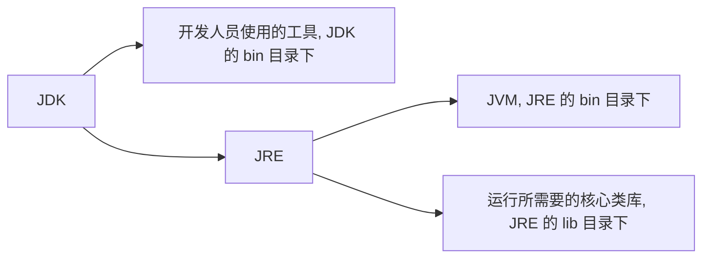
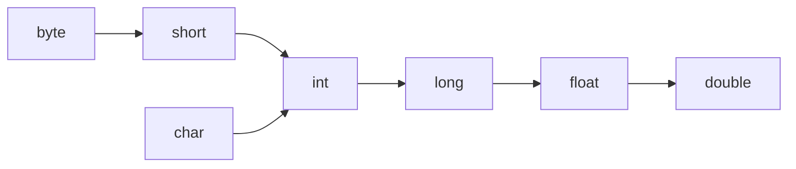
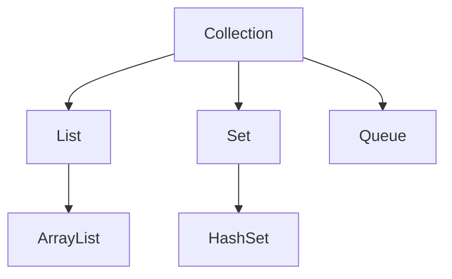
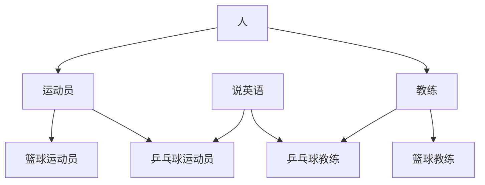
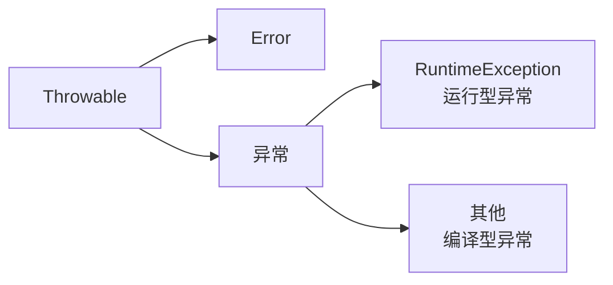
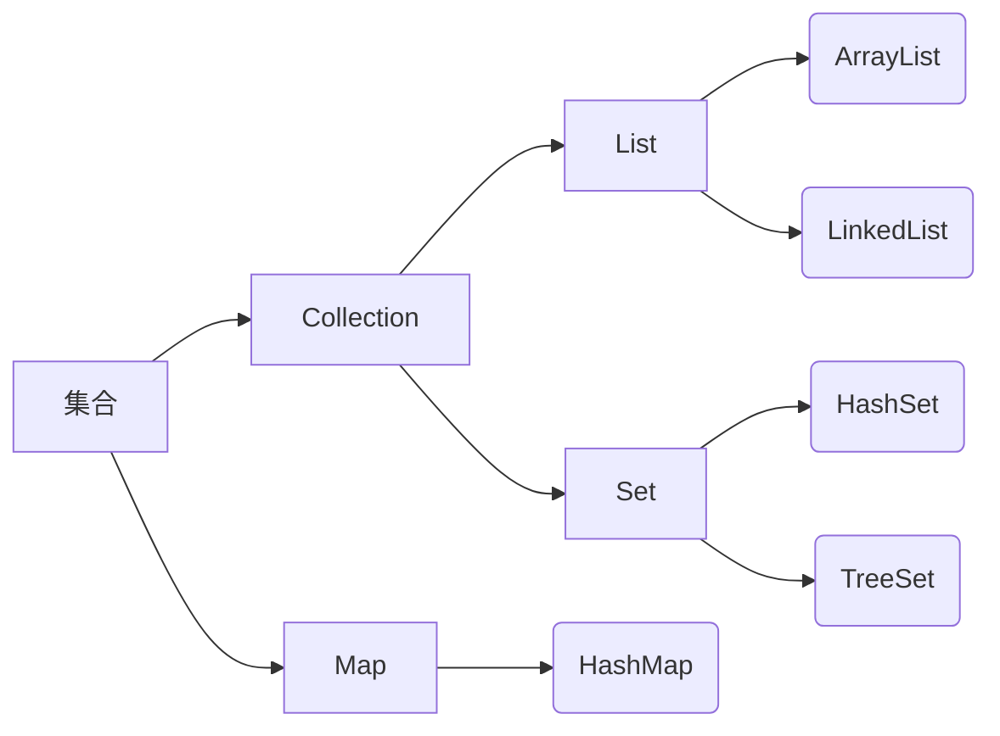
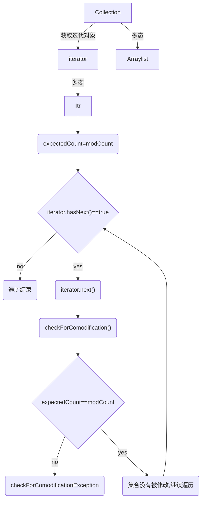

## 前言

以[黑马程序员全套Java教程](https://www.bilibili.com/video/BV18J411W7cE?p=1)网课为主。

## Java 介绍

Java是一个可以跨平台的语言，借助Java虚拟机（Java Virtual Machine, JVM）能够在任意操作系统（operating system, OS）上运行。

JVM: Java Virtual Machine，在 JRE 的 bin 目录下。JVM 本质上是一个程序，使得 Java 在不同平台上运行时不需要重新编译，只需要执行保存在某字节码文件（.class）中的指令，不管什么平台，只要装有相应平台的 JVM ，字节码文件就可以在该平台上运行。

JRE: Java Runtime Environment，运行只需要 JRE 就够了。

JDK: Java Development Kit，Java 程序开发工具包。



尽管 JRE 对于运行 java 文件已经足够，作为学习肯定还是要下载 JDK 的~

JDK 的安装目录如下：

| JDK目录名称 | 说明                                |
| ----------- | ----------------------------------- |
| bin         | 存放工具命令，如：javac, java, etc. |
| conf        | 配置文件                            |
| include     | 某些平台特定的头文件                |
| jmods       | 模块                                |
| legal       | 授权文档                            |
| lib         | 补充 JAR 包                         |
| 其他        | 说明型文档                          |

环境配置等就不多赘述了，网上好的教程太多太多。总之就是终端 javac 和 java 可以执行，最好使用 IDEA 作为 IDE。

### IDEA 环境介绍

集成环境：能够把代码编写、编译、执行、调试等功能集合到一起的开发工具。IDEA  就是 java 的集成环境之一。

创建项目-项目内创建模块（实现不同的功能）-模块 src 下创建包（类似文件夹，用于归纳区分不同的类）-包下创建类-类中编写代码。

其中，.class 文件都会放在模块同级的 out 文件夹中。


## 基础语法（重点比较与C的区别）

### HelloWorld 

*使用 Notepad++ 前需要设置：`设置 -- 首选项 -- 新建 -- 默认语言：Java -- 编码 ANSI`。*

新建一个 `HelloWorld.java` 文件，编辑内容：

```java
public class HelloWorld { // class 类名必须和文件名一致
    public static void main(String[] args) { //main 方法
        System.out.println("Hello World!"); // 单独输出一行的意思。注意大小写不可以出错
    }
}
```

然后在DOS窗口中进入当前文件所在目录，输入命令：

```
javac HelloWorld.java //编译，得到 .class 字节码文件，可以在任何支持 java 的平台上运行
java HelloWorld // .class 文件被解释执行，转化为可以直接在本地对应平台上运行的机器码文件
```

java 和 C、C++ 一样，属于**编译型语言**（一次性翻译全部源程序，然后执行机器语言程序），而不是解释型语言（源程序逐条翻译并执行）。

### 注释

单行注释 `//` 、多行注释 `/* */` 都和C一样。还有一个文件注释 `/** */`暂时用不到，之后了解。

### 关键字

字母全部小写。

### 数据类型

整数型：byte, short, int, long

浮点型：float, double

字符型：char

布尔型：boolean

变量的定义和 c 相似，`int a=10;` 不能重复定义和未初始化就使用。

```java
long l=1000000L;
float f=1.235F; //防止 long 类型和 float 类型不兼容
```

标识符命名：数字、字母（区分大小写）、_、$ 组成，数字不能开头。

*命名规范：*

*方法和变量：一个单词时，首字母大写；标识符由多个单词组成时：小驼峰命名法*

*类名：大驼峰命名法*

### 运算符

+，-，*，/，%，

+=，-=，*=，/=，%=（隐含了强制类型转换）

++，--

==，>=，<=，>，<，!=

? : 

&，|，^，!（逻辑运算符）

&&，||（短路逻辑运算符，如果左边足以判断表达式的结果，右边就不会执行）

与 C 不同的是，Java 里的 + 号可以进行字符串拼接。字符串变量碰到其他类型变量就会拼接。

```java
1+99+"string" //"100string"
"string"+1+99 //"string199"，从左往右计算
```

### 类型转换

自动类型转换：把小范围的变量赋值给大范围的变量

数据范围从小到大：




算术表达式中包含多个基本数据类型的值时，整个算术表达式的类型就会自动提升。

强制类型转换：赋值运算符中隐含。

```java
short s=10;		
s+=10;			// 正常
s=s+10;			// 错，因为右边发生了自动类型转换，变成了int型
s=(short)(s+10);// 也可以
```

### 数据输入

输入通过 Scanner 类实现。Scanner 类在 java.util 包下，要先导包才能使用。

```java
import java.util.Scanner;//导包
Scanner sc=new Scanner(System.in);//创建对象。这句话中除了 sc 是变量名可以修改，其他的都不能改。
int i=sc.nextInt();//接收数据
String s=sc.nextLine();
```

### 分支、循环语句

if - else 语句：和 C 语言一样。

switch 语句：表达式的取值可以是 byte、short、int、char，JDK5之后可以是枚举，JDK7之后可以是 String。其他 case break default 用法和 C 一样。

for, while, do - while 语句，及 break continue 和 C 一样。

### 随机数

Random 类，在 java.util 包下，需要导包。

```java
import java.util.Random;
Random r=new Random();
int n=r.nextInt(10);//[0,10)的范围内取随机数
```

### 数组

一次性声明大量**同类型**变量。

```java
int[] arr;//推荐。定义了一个 int 型的数组，数组名是 arr
int arr[];//定义了一个 int 型变量，变量名是 arr 数组

int[] arr=new int[]{1,2,3};//静态初始化
int[] arr={1,2,3};//静态初始化简化版
int[] arr=new int[3];//动态初始化，只申请了空间，系统赋予初始值
//数字类型：初始值为0.0
//布尔类型：初始值为 false
//字符串类型：初始值为""
//引用类型：初始值为 null
```

java 程序运行时需要在内存中分配空间，为了提高效率，内存空间也被划分为不同的部分。

#### 栈内存

定义的方法中的变量放在栈内存中，使用完直接消失。

如`int a`，以及上文中定义的数组名 arr（其值是指向堆内存中数组内容的地址）。

#### 堆内存

实体、对象等的定义放在堆内存中，使用完会在垃圾回收器空闲时进行回收。

如 new 一个对象，以及上文中数组 arr 中的具体数据内容（arr[0]=1, arr[1]=2……）

访问数组中的内容，首先根据栈内存中数组的地址找到相应的堆内存中的位置（以及移动相应的索引步长）然后访问数据。

因此，当多个数组指向相同地址时，其中的内容是一样的，修改其中一个，另一个也会改变。

```java
int[] arr1={1,2,3};
int[] arr2=arr1;
arr2[0]=11;
arr2[1]=22;
arr2[2]=33;//这时访问 arr1[]，发现其中的数据也变成了11,22,33
```

#### 数组常见异常

1. 数组越界问题，ArrayIndexOutOfException。
2. 空指针异常问题，NullPointerException。（`arr=null`，表示数组不指向任何有效对象）

#### Array.length

数组自带属性 length，通过`arr.length`就能获得数组长度。

### 字符串

### 字符串输入

查看 Scanner 的帮助文档可以得知，成员方法 nextLine() 可以获取一整行内容，可用于输入接收字符串。

```java
Scanner sc=new Scanner(System.in);
String line=sc.nextLine();
//这里只输入 sc.nextLine() 然后 alt enter 代码自动补全，就会自动生成左边 String line。
```

### String

String 类型代表字符串。其内容都是被双引号引住的。

在 java.lang 包下，不用导包。

```java
String s="abc";//直接赋值
String s1=new String();//空字符串

char[] c={'a','b','c'};
String s2=new String(c);//根据字符数组创建字符串

byte[] b={97,98,99};//a, b, c 对应的 ascii 码
String s3=new String(b);
```

字符串一旦创建不能再修改。不过多个字符串的值可以共享`s1=s2;`

*字符串在效果上像字符数组 char[]，但（JDK9）以后底层实现方法其实是字节数组 byte[]。*

#### 字符串比较：== 和 equals()

用==判断的比较，是比较 s1 和 s2 的值（即：对应字符串的地址值）是否相同。

基本类型 == 比较的是数据值是否相同，引用类型 **==** 比较的是**地址**是否相同。

用字符串的成员方法 **equals()** 判断，是比较字符串**内容**是否相同。

```java
char[] c={'a','b','c'};
String s1=new String(c);
String s2=new String(c);
System.out.println(s1==s2);//输出 false，因为 s1 s2 地址不同，只有内容是一样的
System.out.println(s1.equals(s2));//输出 true

String s3="abc";
String s4="abc";
System.out.println(s3==s4);//输出 true，因为对于相同内容的字符串，JVM 会建立一个字符串对象（在堆内存的字符串池中）供它俩参考。
System.out.println(s3.equals(s4));//输出 true

System.out.println(s1==s3);//输出 false
System.out.println(s1.equals(s3));//输出 true
```

#### 遍历字符串：成员方法 length() 和 charAt()

`s.length()`可以获取字符串长度。**这里注意是有括号的，和数组长度 length 区分开！** 

s.charAt(i) 可以获取索引为 i 处的字符

```java
for(int i=0;i<s.length();i++){
    System.out.println(s.charAt(i));
}
```

#### 字符串拼接

字符串可以直接用 + 号拼接。

```java
String s1="Hello ";
String s2="World";
s1=s1+s2;//Hello World
```

在内存中，字符串发生拼接后会在堆内存中新建一个字符串（有"Hello "，"World"，"Hello World"三个字符串，而不是直接在"Hello "的位置上拼接"World"）。这样操作还是比较费时费空间的。之后介绍的另一个类——StringBuilder 可以更有效地解决这个问题。

#### endsWith()

查看字符串是否以指定子串结尾。

```java
String s1="hello world";
s1.endsWith("world");
```

#### StringBuilder 类

与 String 类相比，最主要的特点在于内容可变。

在 java.lang 包下，不用导包。

构造方法：

| 构造方法名              | 说明                                              |
| ----------------------- | ------------------------------------------------- |
| StringBuilder()         | 无参构造方法                                      |
| StringBuilder(String s) | 把给定的 String 字符串转换成 StringBuilder 类型的 |

| 成员方法名              | 说明                                          |
| ----------------------- | --------------------------------------------- |
| append(String s)        | 在结尾拼接上字符串 s                          |
| StringBuilder reverse() | 反转字符串                                    |
| String toString()       | 把 StringBuilder 类型转换为 String 类型并返回 |

用 StringBuilder 完成字符串拼接操作：

1. String 类型转换为 StringBuilder 类型
2. StringBuilder 类型通过 append() 成员方法拼接字符串
3. StringBuilder 类型通过 toString() 成员方法转换为 String 类型

```java
String s="Hello ";
StringBuilder sb=new StringBuilder(s);//或者先无参构造，再在结尾拼接 append(s)，但有点多此一举
sb.append("World");
String s1=sb.toString();

//骚操作：匿名对象，使用完立刻被垃圾回收器回收，建议少用
String s1=new StringBuilder(s).append("World").toString();
```

用 StringBuilder 完成字符串反转操作：

```java
String s="Hello World";
String sr=new StringBuilder(s).reverse().toString();
```

### 方法

java 中的方法类似 C 中的函数。只是涉及类和对象的问题，有一些小不同。

像函数一样，是有独立功能的代码块组成的集合，可以拿去调用。

```java
public static 返回值类型 方法名(形参){//和 main 方法同级
    方法体
    return 返回值;
}//定义

方法名(实参);//在 main 方法中调用。有返回值类型的方法建议用变量接收调用
```

方法不能嵌套定义。

#### 方法重载

多个方法在一个类中，有相同的方法名，但参数不完全相同。

```java
public static int max(int a, int b)
public static int max(int a, int b, int c)
```

**注意：返回值不能作为判断方法是否重载的标准！**只有方法名和参数可以。

调用时，JVM 根据传入参数不同，来得知调用的是哪个方法。

**形参值修改不会对实参造成影响。**main() 方法存储在栈内存中，当 main() 方法调用其它方法时，其他方法进入栈内存。


但是其中的形参的值不对 main() 中的实参造成影响（除非是像数组、指针之类引用类型，根据地址去堆内存中修改数据），当 change() 方法执行完后就直接出栈了。


如图，如果是数组单元的值被修改了，实际上是堆内存中的内容被修改了， main() 方法中数组对应的地址中的内容也会被修改。

## 类和对象

### 类

类是对生活中一类具有共同属性和行为的事物的抽象。如猫类，都有毛的长短、颜色、名字等属性，也都能猫叫、吃饭等（不接受抬杠

类是对象的数据类型，是一个抽象的概念。

#### 类的定义

```java
public class 类名{
    数据类型 变量;
    数据类型 变量;
    数据类型 变量;
    
    方法1;
    方法2;
}

public class Cat{
    String name;//初始值为null或0或false或""
    int age;
    boolean tail;
    String color;
    
    public void meow(){
		System.out.println("Meow!");
    }
    public void eat(String food){
		System.out.println("Eat "+food);
    }
}
```

### 对象

类的实体化。比如罗小黑，是猫类的一个实体化。

#### 属性

对象具有的各种特征，每个对象的每个属性都有特定的值（如猫毛有长毛、短毛、无毛）

#### 行为

对象能执行的动作，如猫可以叫，可以跑。

#### 对象的使用

```java
//在 main 方法中
Cat c=new Cat();
c.name="小黑";//c 的名字
c.age=2;//2岁了
c.tail=false;//有尾巴
System.out.println(c.age);
c.meow();//行为：猫叫
c.eat("猫粮")//行为：吃饭
```

在同级目录下，类在一个文件中，main 方法在另一个文件中而且实例化了这个类，也是可以的。

对象名 c 存储在栈内存中（其值代表对象的属性在堆内存中的地址），而对象的**属性**等具体内容存储在**堆内存**中。对象中的**方法**调用时则加载到**栈内存**中，执行完毕后出栈。

### 成员变量和局部变量

成员变量：类中在方法外的变量（如上例中的属性变量）

局部变量：在类的方法中或方法声明上的变量。（如上例中 eat 方法声明的 food 局部变量）

| 成员变量           | 局部变量                                   |
| ------------------ | ------------------------------------------ |
| 类中方法外         | 方法中，或方法声明上                       |
| 堆内存中           | 栈内存中                                   |
| 对象消失时随之消失 | 方法调用完毕而消失                         |
| 有默认的初始值     | 没有默认的初始值，必须先定义、赋值才能使用 |

### 对象内存图介绍

首先老师汇总介绍了一下所有内存空间。当我们运行 Java 文件的时候系统分配一片内存空间给 JDK，里面具体是这样细分的：


元空间，或者叫方法区，负责加载字节码文件，是 JDK 8 及以后的版本从堆空间中划分出来的。

栈一般是方法，变量运行时进入。

堆是我们 new() 出来的对象的存储区域，并产生地址。

#### 单个对象的内存图

比如：`Student s=new Student();`

在这个过程中内存至少会执行以下七个步骤：

1. 加载 class 文件
2. 声明局部变量
3. 在堆内存中开辟一片空间
4. 默认初始化（将对象中的局部变量值赋值为默认值，如 `String name` 赋值就是 null, `int age` 赋值就是0）
5. 显示初始化（如果在类定义中我们做了赋值，如 `int age=19;` 显示初始化就会重新赋值成这个我们给定的默认值）
6. 构造方法初始化（通过构造方法中的参数赋值）
7. 将堆空间中的地址值赋值给左边的局部变量


当方法执行完毕撤出栈空间的时候，没有引用堆内存中对应对象的变量时，堆内存中的对象就没有存在必要了就也被清理了。

## 封装 packaging

Java 的三大特性：封装、继承、多态。

之前定义的成员变量都可以直接对值进行修改，存在安全隐患（比如设置 age=-30）

因此我们要添加一些限制。

### private 修饰符

可以修饰成员变量、成员方法不**直接**被其他类使用。

```java
private String name;
private int age;
```

被 private 修饰的成员变量有两种赋值（访问）方式：构造方法和 get / set 方法。

### 构造方法

写在类中，作为类的方法。主要用于对象初始化。声明变量时`Cat c=new Cat();`Cat() 就是一种无参构造方法。

每个类定义时系统都会给一个默认无参构造方法。如果自己给了一个无参构造方法，就会覆盖系统默认的。**建议无论是否用到构造方法，都写一个无参构造方法。**

```java
public Cat(){}//我们自己加的无参构造方法，会覆盖系统默认的
public Cat(String name){//写一部分参数的构造方法也可以
    this.name=name;//通过 this 赋给成员变量
}
public Cat(String name, int age){//写全参数的构造方法也可以
    this.name=name;
    this.age=age;
}
//main 中构造对象：
Cat c1=new Cat();
Cat c2=new Cat("小黑");
Cat c3=new Cat("小白",2);//这些都可以，与自己写的构造方法的参数相对应。
```

this被哪个对象调用，就代表哪个对象。


然后把"林青霞" 字符串类型传入堆内存中。

### get / set

无参构造方法后用 setXxx() 方法创建对象。

```java
public void setName(String name){//赋值
	this.name=name;
}
public void setAge(int age){
    if(age>=0&&age<=20)//在 set 中可以添加一些限制处理
	this.age=age;
}

public void getName(){//获取值
	return name;
}
public void getAge(){
	return age;
}

//在 main 方法中赋值并获取值示例：
Cat c=new Cat();
c.setName("小黑");
System.out.print(c.getName);
```

### 总结

封装将类的某些信息隐藏在类内部，不允许外部程序直接访问，而是通过该类提供的方法实现对隐藏信息的操作和访问，提高了代码安全性（在 setXxx() 方法中可以对数据进行校验）和代码复用性（封装方法可以复用）。

## 集合

集合和数组相比，就像 StringBuilder 之于 String，数组长度固定，集合长度可变。





ArrayList 就是集合的一种。

### ArrayList\<E\>

在 java.util 包下，需要导包。

\<E\> 表示泛型，限制数组中的元素只能是某一种类型（或者其子类，多态），可以在编译阶段约束操作的数据类型并进行检查（下面左边的 String）。

```java
ArrayList<String> array=new ArrayList<>();
```

泛型只能使用引用数据类型（比如包装类 Integer, Character... 或者我们自己定义的对象 Student，但是不可以使用基本数据类型 int char 这些，具体原因后面还会深入讲解）。

| 方法                        | 说明                                   |
| --------------------------- | -------------------------------------- |
| ArrayList\<E\>()            | 无参构造方法                           |
| boolean add(E e)            | 结尾添加一个元素，成功返回true         |
| void add(index i, E e)      | 在指定索引处添加一个元素（不能越界！） |
| boolean remove(Object o)    | 删除指定对象，成功返回 true            |
| E remove(int index)         | 删除指定索引处的值，返回该值           |
| E set(int index, E element) | 修改指定索引处值，返回修改后的值       |
| E get(int index)            | 返回指定索引处元素                     |
| int size()                  | 返回集合元素个数                       |

```java
array.add(1);
array.add(3);
array.add(4);
array.add(1,2);	 // 1下标位置插入2这个元素
System.out.println(array);//输出 array：1，2，3，4
```

## 继承

有一些类有许多相同属性和方法（如猫和狗，有动物的共同特征）重复写两遍相对麻烦一些。可以把这些类的共同部分提取出来作为父类，这些类继承父类中的共有部分后再添加自己特有的内容。

```java
public class Animal{ // 父类，基类，超类
    String name;
	int age;
	boolean tail;
	String color;
}

public class Cat extends Animal{ // 子类，派生类
    public void meow(){
        System.out.println("Meow!");
    }
}

public class Dog extends Animal{
    public void bark(){
        System.out.println("Bark!");
    }
}
```

提高了代码的复用性，但是同时也提高了耦合性，如果父类修改子类也要跟着修改。

当子类属于父类的一种时，可以使用继承。

### 变量访问特点

范围越小，权限越高。

访问优先级：子类中局部变量>子类中成员变量>父类中成员变量>找不到就报错

如果想优先访问父类中的元素：super 关键字（使用方法类似 this，只是 this 是访问本类中的成员， super 是访问父类中的成员）


### 构造方法的访问特点

构造方法的访问优先级和变量相反。即使访问子类的构造方法，也会优先访问**父类的无参构造方法**，再访问子类的构造方法。因为毕竟子类由父类而来，需要先构造父类再构造子类。

而在之前介绍过，如果在类中只定义了带参构造方法，就会覆盖系统默认给的无参构造方法，这时类中就没有无参构造方法了。这时再尝试使用类中的无参构造方法，就会报错。

因此，如果在父类中只定义了带参构造方法，子类使用构造方法就会报错（因为先尝试使用父类无参构造方法却发现没有）

解决方法：1. 父类中补上无参构造方法

2. 在子类构造方法中手动访问父类的带参构造方法来代替

```java
public Fu(int age)
{
    this.age=age;
}

public Zi()
{
	super(20);
}
public Zi(int age)
{
    super(age);// 子类的带参构造方法就这样传递给父类即可
}
// 不支持一个子类继承多个父类，但是允许多层基层（爷->父->子）
```

### 成员方法的访问特点

先在子类中寻找，找不到再去父类中寻找。

### 权限修饰符

public > protected > 默认 > private


### 状态修饰符

有 final 和 static。

#### final

成员变量和成员方法被 final 修饰后，不可以被重新赋值 / 重写。

类被 final 修饰后，也不可以作为父类。

*引用类型被 final 修饰后，不可以被重新赋值，指的是地址不能改变，指向的内容还是可以变的。（除了字符串类型，字符串类型内容也不可以改变）*

#### static

被 static 修饰的成员变量在所有对象里值都是一样的。

```java
public static String university;//在学生类中的静态成员变量

Student.unievrsity="北大";//统一赋值
Strudent s1=new Student();//university 变量的值是 "北大"
Strudent s2=new Student();//university 变量的值是 "北大"
```

静态成员方法则是与类本身相关（非静态的方法是和类的具体实例对象有关，静态方法是和整个类有关），调用方式也是 `类名.静态方法名`。静态方法中不能使用 this 关键字（因为没有具体的实例对象）。此外，**静态成员方法只能访问静态成员变量 / 方法！**

### 包 Package

文件夹，用于存放编译后生成的 class 文件，方便管理。

在 IDEA 中新建的 java 文件会自动生成包路径。如果要在 cmd 窗口中运行带有包路径的文件，编译照常，执行需要注明 class 文件的路径。

```java
package com.ithema;

//命令行根据路径建包
javac -d . HelloWorld.java

//编译
javac HelloWorld.java

//运行
java com.ithema.HelloWorld
```

### 导包 import

如果测试类在 src 文件夹的A文件夹下，要调用的类在 src 文件夹的B文件夹下，可以通过导包的方式来调用

`import B文件夹.要调用的类名;`

之前对于权限的学习，我们知道：只有 public 的类可以被其他跨包无关类访问；被 protected 修饰的父类对跨包的子类可见。

### 方法重写

之前学过方法重载，是函数名相同但是参数设置不同的函数。

方法重写是子类中重新定义了父类中的方法。

子类如果想访问父类中的方法，可以通过 super 来指定。

```java
@Override//注解，可以检查方法重写的正确性
public void function()
{
    System.out.println("子类中重写方法");
}
```

1. 父类的方法如果是 private 的，子类中就访问不到，也构不成方法重写一说了。
2. 子类的重写方法权限必须高于父类方法。（public > protected > 默认 > private）

## 多态

同一个对象在不同时刻表现出的形态也不同。

```java
Cat c=new Cat();
Animal a=new Cat();//父类引用指向子类对象
```

a 在内存中是 Cat 的大小，但是编译时被视作 Animal 类型。

### 多态中成员的访问特点

访问成员变量时：优先看等式左侧。如 Animal 和 Cat 中都对 age 赋值了，访问 age 得到的是 Animal 中的 age。*因为成员变量不会被重写*

访问成员方法时：优先看等式右侧。如 Cat 中重写了 eat 方法，使用 eat 方法就是使用 Cat 中的 eat 方法。

例：Animal 父类，其中含有 eat() 成员方法；Cat Dog Pig 子类，其中都重写了 eat() 成员方法。

```java
public class AnimalOperator(Animal a)
{
    a.eat();
}

//使用
Cat c=new Cat();
Dog d=new Dog();
Pig p=new Pig();
AnimalOperator(c);// 多态
AnimalOperator(d);// 多态
AnimalOperator(p);// 多态
```

调用的都是子类中重写的方法。

多态提高了程序的拓展性。对于子类重写父类中的方法，我们只需要一个操作类接口就能访问（无论子类具体是哪一种）。

但是多态无法访问子类中特有的方法。

解决这一弊端的方法就是转型。

```java
Animal a=new Cat();//向上转型，a 不能访问 Cat 类中特有的方法
Cat c=(Cat)a;//向下转型，这样 c 就可以访问 Cat 类中特有的方法了。
```

使用转型的时候注意不能随便向下转型。如本例中 a 在内存中是 Cat 类，不能转换成 Dog 类。*ClassCastException*

## Abstract, 接口

抽象方法：没有方法体的方法，待补全，请输入文本。

```java
public abstract void eat();
```

抽象类：含有抽象方法的类。

（没有抽象方法的类也可以是抽象类，但是意义何在）

抽象类不能直接创建对象，需要子类把抽象方法重写补全后才能创建对象。否则，子类也是抽象类。

### 接口

接口是一种公共的行为规范标准，只要符合规范，大家都可以使用。 java 中的接口主要是对行为的抽象。如：

```java
public interface Jumpping{ // 接口
    public abstract void Jump();
}

public class Cat implements Jumpping{ // 实现
    // 重写 Jump() 方法。如果不重写， Cat 就是一个抽象类
}
```

接口中的成员变量默认是 public static final 的，不能修改，而且可以通过 Class.成员变量 的方式直接访问。

接口中没有构造方法和非抽象方法。成员方法默认是 public abstract 的。

（但接口的实现类中可以有 super。这是因为所有没有父类的类都默认继承自 Object 类，如果接口的实现类使用 Object 类中的方法就会用到 super）

接口是抽象的，不能直接实例化，可以借助多态的方法实例化。

相较类与类之间不能多继承，只能层层继承：接口可以多实现 `implements interface1, interface2`

接口和接口之间也可以多继承 `interface1 extends interface2, interface3`

### 总结


### 设计原则

抽象类中的抽象方法所有对象中都必须有；接口则是选择性实现的。比如门这一大类，其中不管什么门，防盗门、木门、自动门，都有门的特有行为（开关门、锁门……）只是实现方法可能不一样，所以要在门父类中定义这些抽象方法，在子类中必须实现。

但是对于门来说不是必须有的抽象方法（如响铃）这种抽象方法就应该作为接口，选择性实现。有响铃功能的门实现这一接口，没有响铃功能的门不必实现。

例：有乒乓球运动员、乒乓球教练、篮球运动员、篮球教练。为了能出国交流，乒乓球运动员和教练需要会说英语。但并不是“是人就该会说英语，是运动员和教练就该会说英语”。所以说英语应当作为接口而不是人里面的抽象方法。



其中，人、运动员、教练是抽象类，说英语是接口。其他具体类需要实现接口，并重写继承的所有抽象方法。

### 抽象类 / 接口作为形参 / 返回值

类也可以作为形式参数或函数的返回值。

抽象类：如果方法的形参或函数的返回值是抽象类名，实际需要传递的是实现了该抽象类的子类的实例对象。

如函数形参是Animal，实际需要通过多态的方法Animal a=new Cat();然后把a传给函数。

接口作为形参/函数返回值，和抽象类一样，实际需要的是实现了该接口的类的实例对象。

## 内部类

在类中定义一个类。

### 内部类和外部类的互相使用

无论外部类的成员变量的权限修饰符是什么（private, public……）因为都在同一个类中，所以即使权限修饰符是 private 也可以相互访问。

内部类都可以**直接**访问外部类的全部成员变量。

而外部类如果想访问内部类的成员，需要**先创建一个内部类对象再访问**。

### 外界使用内部类

外界使用内部类：`Outer.Inner oi=new Outer().new Inner();`

如果 inner 是私有的，或者是局部内部类，则不能通过上述方法调用。但是可以在 outer 里定义一个公开的方法，在方法中 new 一个 inner 并使用其中的成员方法。对于外部的调用者来说，他只需调用 outer 的这个方法，就可以访问 inner 的成员方法。不过对使用者来说他并不知道内部结构如此。**封装**

### 内部类的分类

在类的成员位置定义：成员内部类

在类的局部定义：局部内部类。

局部内部类不能从外界直接创建对象，只能通过调用方法来创建类

```java
public class Outer {
	private int num=10;
    public void method() {
        class Inner {
			public void show(){
                System.out.println(num);//局部内部类可以访问外部类的成员变量，或 method 方法中的局部变量
            }
        }
        Inner i=new Inner();//在方法中创建内部对象
        i.show();//创建对象之后，记得调用内部方法的成员变量
    }
}
```

### 匿名内部类

继承了另一个类，或实现了接口的子类匿名对象。

首先有一个父类/接口，其中有具体的/抽象的方法，然后匿名内部类对其进行重写/实现。

```java
//接口文件 inter.java 中：
public interface inter {
    public void show();//抽象方法
}

//外部类文件 Outer.java 中
public class Outer {
	private int num=10;
    public void method() {
        new inter {
            @Override
            public void show(){
                System.out.println("匿名内部类");
            }
        }.show();// 创建匿名对象之后，记得调用成员变量
        
        //另一种方法：
        inter i=new inter {
            @Override
            public void show(){
                System.out.println("匿名内部类");
            }
        }
        i.show();
    }
}
```

使用示例：假如我们有一个 jump 接口，有一个 jumpoperator 类，其中包含 method(Jump j) 执行 j 的 jump 。

我们要让不同动物都能 jump，就要在不同动物类中 implements jump 接口，并重写其中的抽象方法；

然后用多态的方式`jump c=new cat(); jump d=new dog();` 新建对象并传给 method 方法。

但是可以通过匿名内部类的方法：

```java
jo.method(new jump(){
    @Override
    public void jump()
    {
        System.out.println("猫跳高");
    }
});

jo.method(new jump(){
    @Override
    public void jump()
    {
        System.out.println("狗跳高");
    }
});
```

直接传一个匿名内部类参数给 method 方法，就不用新建文件重新定义类了。

## 一些常用类

### Math

不用导包，成员变量、方法都带有static修饰，可以直接通过类名访问。

| 方法                                        | 说明                                     |
| ------------------------------------------- | ---------------------------------------- |
| public static int abs(int a)                | 绝对值，支持 double  float int long 类型 |
| public static double ceil(double a)         | 向上取整，返回一个 double 值             |
| public static double floor(double a)        | 向下取整，返回一个 double 值             |
| public static int round(float a)            | 四舍五入                                 |
| public static int max(int a,int b)          |                                          |
| public static int min(int a,int b)          |                                          |
| public static double pow(double a,double b) | a 的 b 次幂                              |
| public static double random()               | 随机数，范围 [0.0,1.0)                   |

随机数想要其他范围可以做算术运算。如 [0.0, 100.0)就用`random()*100`。

### System

不用导包，不能实例化，static

| 方法                                   | 说明                                               |
| -------------------------------------- | -------------------------------------------------- |
| public static void exit(int status)    | 终止运行 JVM，非零表示非正常终止                   |
| public static long currentTimeMillis() | 返回当前时间到1970年1月1日的时间间隔，以毫秒为单位 |

currentTimeMillis() 可以整除求得当前年份；可以用两个 currentTimeMillis() 值做差求时间间隔等。

### Object

Object 类是所有类的根类。

| 方法                              | 说明                                                   |
| --------------------------------- | ------------------------------------------------------ |
| public String toString()          | 返回对象的字符串表示形式。建议子类全部重写该方法       |
| public boolean equals(Object obj) | 比较对象是否相等（默认比较地址）。重写可以比较对象内容 |

#### toString() 方法

Object 中包含 toString 方法

```java
public String toString() {
        return getClass().getName() + "@" + Integer.toHexString(hashCode());
}
```

输出类名@+一串哈希值。

一般重写 toString() 方法，用于输出简明扼要的类信息。IDEA 中可以像构造方法和 getter / setter 一样自动生成。类似：

```java
//手动实现
public String toString(){
return "{ Person:name=" + name +" age=" + age+"}";// name 和 age 都是本类中的成员变量
}
```

#### equals

`s1.equals(s2)`本质上是比较两个对象的地址，肯定是 false。

一般也会重写/自动生成可以比较两个对象内容是否一致的方法。

```java
public boolean equals(Object o) {
    if (this==o) return true; //同一个对象
    if(o==null||getClass()!=o.getClass()) return false;//o是空对象，或这两个对象不属于一个类
    Student student=(Student) o;//因为调用 equals 传参的时候向上转型了，o 变成了 Object 类，要转回来
    if (age!=student.age)return false; 
    return name!=null?name.equals(student.name):student.name==null;//要么 name 都是空字符串，要么相同。equals() 方法只有非空字符串才能调用
}
```

### Arrays 类

需要导包 `java.util.Arrays`，不能创建对象，成员是 static的。

| 方法                                   | 说明                              |
| -------------------------------------- | --------------------------------- |
| public static String toString(int[] a) | 返回形如 "[a, b, c]" 的字符串形式 |
| public static void sort(int[] a)       | 按数字顺序排列指定的数组          |

### 补充：工具类

以上工具类的特点都是：不能创建对象，但是成员方法都是 static 修饰，可以直接用类名访问。比如 `Arrays.sort(arr);`

以下这些方法不能创建对象：

```java 
public Math(){};
public Arrays(){};
public System(){};
```

因为这些类自己写了无参构造方法，会把系统默认的无参构造方法覆盖。而该方法又是私有的，因此外界无法访问创建对象。

### 基本类型包装类

其中有一些方法能更好地处理基本数据类型。

包括：Byte, Short, Integer, Long, Float, Double, Character, Boolean

#### 方法示例

| 方法                                    | 说明                          |
| --------------------------------------- | ----------------------------- |
| public static Integer valueOf(int i)    | 把 int 转换为 Integer 类型    |
| public static Integer valueOf(String s) | 把 String 转换为 Integer 类型 |

public String[] split(String regex) 把给定字符串用 regex 分隔开。

如给定字符串 s 是"1 2 3 4"，`s.split(" ")`就会得到4个字符串："1""2""3""4"。

#### 基本类型转换

int -> String：

① 空字符串+int 类型 `""+123`

② `String s=String.valueOf(i);`

String -> int：

① `Integer in=Integer.valueOf(s);`

`int i=intValue(in);`

② `int i=Integer.parseInt(s);`

#### 自动装箱和拆箱

装箱：基本类型->对应的包装类型

拆箱：包装类型->基本类型

```java
Integer i=Integer.valueOf(100);//装箱
Integer ii=100;//自动装箱

ii=ii.intValue()+200;//拆箱
ii+=200;//自动拆箱

Integer i3=null;
i3+=300;//NullPointerException。因此对象使用之前最好先判断是否为 null
```

### 日期类

#### Date

Date 类，需要导包。**注意是 java.util 下的，而不是 java.sql 下的！**java.util 下的 Date 类非最终类，所以可以有子类， java.sql 下的 Date 类就是其子类。

| 方法                           | 说明                                                   |
| ------------------------------ | ------------------------------------------------------ |
| public Date()                  | 初始化一个 Date 对象，值为其被分配时的时间，精确到毫秒 |
| public Date(long Date)         | 分配一个 Date 对象，值为从标准时间起指定的毫秒数       |
| public long getTime()          | 获取日期对象从标准时间到现在的毫秒数                   |
| public void setTime(long time) | 设置时间，单位为毫秒                                   |

```java
//输出 Date 对象，得到：星期 月份 日期 时 分 秒 CST 年份

long d=1000*60*60;
Date da=new Date(d);//标准时间往后1h，即1970.1.1 上午9点（不是1点，因为 CST 有时差）

long time=System.currentTimeMillis();//可以这样获取当前时间，然后传给 Date() 或 setTime()
```

#### SimpleDateFormat

可以自己设置日期格式。

| 方法                                    | 说明                                 |
| --------------------------------------- | ------------------------------------ |
| public SimpleDateFormat()               | 构造方法，并使用系统默认的 Date 格式 |
| public SimpleDateFormat(String pattern) | 构造方法，并使用自己规定的格式       |
| public final String format(Date d)      | 将日期对象转换为相应格式的字符串     |
| public final Date parse(String s)       | 将字符串转换为日期                   |

```java
public static void main(String[] args) throws Parse Exception{//结尾要加一些东西，在 IDEA 中可以自动补全
    Date d=new Date;//被分配时的时间
    SimpleDateFormat sdf=new SimpleDateFormat("yyyy年-MM月-dd日 HH:mm:ss");
    String s=sdf.format(d);
    System.out.println(s);//输出格式就形如 2022年-05月-05日 10:24:00
    
    String ss="2022-05-05 10:24:00";
    SimpleDateFormat sdf1=new SimpleDateFormat("yyyy-MM-dd HH:mm:ss");
    Date d1=sdf1.parse(ss);
}
```

y 年 M 月 d 日

H 时 m 分 s 秒

（实际运用的时候，也可以让用户自己指定格式。比如单独写一个日期工具类，有两个方法，把 Date 转换为 String 和把String转换为Date；这两个方法可以设置两个传入参数：

`public static String dateToString(Date d, String format)`

`public static String StringTodate(String s, String format)`

在方法内根据传入的字符串格式，利用 SimpleDateFormat 的方法进行转换。）

#### Calendar 类

需要导包`java.util.Calendar`，是一个抽象类。

为某一时刻和某些日历字段的转换，以及操作日历字段提供了一些方法。

Calendar 类有一个类方法可以获取 Calendar 对象。可是 Calendar 类不是抽象类吗？

```java
Calendar rightnow=Calendar.getInstance();
```

其实这个方法和 Calendar 的直接子类有关，所以这个实例化相当于多态。

| 方法                                                 | 说明                    |
| ---------------------------------------------------- | ----------------------- |
| public int get(int field)                            | 获取给定日历字段的值    |
| public abstract void add(int field, int amount)      | 添加/减去给定的日历字段 |
| public final void set(int year, int month, int date) | 设置日历的年月日        |

```java
y=c.get(Calendar.YEAR);
m=c.get(Calendar.MONTH)+1;//month 是从0开始的，所以要+1
d=c.get(Calendar.DATE);

//例：求2020年2月有多少天?
Calendar c=Calendar.getInstance();
c.set(2020,2,1);//设置为3月1日
c.add(Calendar.DATE,-1);//倒退1天，就是2月的最后一天
System.out.println("2020年2月有"+c.get(Calendar.DATE)+"天");
```

## 异常

有时因为编译错误，会提示一些信息（如：数组越界 ArrayIndexOutOfBoundException) 其实这些提示信息也是类。

### Throwable

Throwable 是所有错误、异常的父类。



Error 程序无法处理，而异常程序可以处理。

RuntimeException：运行时异常，非受检异常， 可以先不处理，等到真的异常了再进行处理。在编译期间不会检查，其他类错误在编译期间检查。比如数组越界。

编译时异常：受检异常，不管运行会不会异常，都需要进行异常处理，不然无法编译。

### 处理异常

JVM 对异常的默认处理方式：输出异常名称、位置、原因，并停止运行。

程序员还可以有自己的处理异常方法，如 try...catch 和 throw。

#### try...catch

```java
try{
    可能出现异常的代码;
}
catch(异常类名 变量名){
    出现异常后的处理代码;
}

String s="2022-05-07";
SimpleDateFormat sdf=new SimpleDateFormat("yyyy-mm-dd");
sdf.parse(s);// 这个方法不能直接用，必须要加异常处理

try{
    sdf.parse(s);
}
catch(ParseException e){
    System.out.print("parseException!");//不管会不会发生异常，都要写
}
```

出现异常时，异常对象会被提交给 Java 运行时系统，如果和 catch 中的异常类匹配就会进行异常的处理，**处理完成后可以继续执行。**

如果异常变量命名为 e ,调用 e 的成员方法 `e.printStackTrace()` 就会输出平时出现异常时系统默认提示的信息：`java.lang.ArrayIndexOutOfBoundsException: Index 3 out of bounds for length 3  at com.ithema_02.ExceptionDemo02.method..... `

但是通过这种方法处理异常之后，异常后面的部分仍然可以执行。

#### Throwable 的成员方法

Throwable 作为超类，其所有子类都可以使用他的成员方法。

| 方法                          | 说明                              |
| ----------------------------- | --------------------------------- |
| public String getMessage()    | 返回此 Throwable 的详细消息字符串 |
| public String toString()      | 返回此可抛出的简短描述            |
| public void printStackTrace() | 把异常的错误信息输出到控制台      |

```
e.getMessage():  Index 3 out of bounds for length 3
e.toString(): java . lang.ArrayIndexOutOfBoundsException: Index 3 out of bounds for length 3
e.printStackTrace(): java.lang.ArrayIndexOutOfBoundsException: Index 3 out of bounds for length 3  at com.ithema_02.ExceptionDemo02.method.....
```

利用 Ctrl B 追根溯源可以得知， getMessage() 内部大概是这样的：

```java
public class Throwable {
    private String detailMessage;//Throwable 类中的一个成员方法
    
    public Throwable(String message){
        detailMessage=message;//构造方法。出现异常时，会通过这种方法构造一个异常对象
    }
    
    public String getMessage(){
        return detailMessage;
    }
}
```

### Throws

可以抛出异常给 try catch 处理，但是自身不能解决。

```java
throws 异常类名;

public static void main(String[] args){
    System.out.println("运行开始");
    method1();
    try{
        method2();//抛出给了 try catch 处理
    }
    catch(ParseException e)
    {
        System.out.println("运行错误");
    }
    System.out.println("运行结束");
}

public static void method1() throws ArrayIndexOutOfException{
    int[] arr={1,2,3};
    System.out.println(arr[3]);//会报错并停止运行，throws 并没有解决数组越界这个异常
}

public static void method2() throws ParseException{
    String s="2022-05-07";
	SimpleDateFormat sdf=new SimpleDateFormat("yyyy-mm-dd");
	sdf.parse(s);//因为抛出，可以使用了。如果异常，try catch 会显示“运行结束”并继续运行。
}
```

### 自定义异常

```java
public class 类名 extends Exception{
    无参构造
    带参构造
}

public class ScoreException extends Exception{
    public ScoreException(){}
    public ScoreException(message){
        super(message);//把 message 传给父类处理
    }
}

//异常类的使用
public class Teacher throws ScoreException{
    public void checkScore(int score)
    {
        if(score<0||score>100){
            throw new ScoreException("输入分数有误！请重新输入");//throw 不是 throws!
            /*throw 写在方法体内，throws 写在类定义里。
            throws 不一定有异常，而 throw 一定是抛出了异常。*/
        }
        else
            System.out.println("分数正常");
    }
}

public static void main(String[] args){
    Scanner sc=new Scanner(System.in);
    int score=sc.nextInt();
    Teacher t=new Teacher();
    try{//调用方法时，要处理抛过来的异常
        t.checkScore(score);
    }
    catch(ScoreException e){
        e.printStackTrace();
    }
}
//异常时就会输出：异常类型 ScoreException，异常原因"输入分数有误！请重新输入"，异常位置。
```

## 集合进阶



其中方形的是接口，圆角的是实现类。

因此先学习 Collection 和 Map 接口后，只需要学习下一级的特有的部分。

### 数据结构

- 栈：后入先出 FILO。

- 队列：先入先出 FIFO。

- 数组：可以根据索引查找，查找效率高；增删效率低。

- 链表：每个结点存储数据和下一个结点的地址值。最后一个结点地址值为空。相比数组，增删只需要修改增删处前后结点的地址值，效率更高。但是查询必须从头开始，效率低。

- 树。

- 红黑树。

  

  添加节点优先是添加红色的（不影响简单路径的黑色节点数，调整次数少）。

  

  红黑树对平衡要求性低一些（最长路径不超过最短路径的2倍），所以插入数据的时候需要的旋转次数平均下来更少。适用于频繁插入删除操作。

### Collection

java.util.Collection

Collection 是单例集合的最高级接口。他表示一组对象，这些对象也被称为 Collection 的元素。

无法直接实现。可以用多态的方式实现。

```java
Collection<String> c=new ArrayList<String>();
//add(E e) 方法添加元素
c.add("Hello");
c.add("World");
System.out.println(c);//输出['Hello','World']，因为 ArrayList 中重写了 toString 方法，所以得到的不是一串地址
```

| 方法                       | 说明                                      |
| -------------------------- | ----------------------------------------- |
| boolean add(E e)           | 添加元素，永远返回 true                   |
| boolean remove(Object o)   | 从集合中移除指定的元素，成功移除返回 true |
| void clear()               | 清空集合中的元素                          |
| boolean contains(Object o) | 判断集合中是否存在指定的元素              |
| boolean isEmpty()          | 判断集合是否为空                          |
| int size()                 | 集合长度                                  |

快捷键：Alt+7，能看到类的所有信息

#### 迭代器 iterator

java.util.Iterator

Iterator 是一个接口。使用 Iterator 迭代器遍历集合元素。

```java
Iterator<String> it=c.iterator();//通过集合对象中的迭代方法获取对象
```

追根溯源可以得知，Collection.iterator()方法返回的是一个实现了 Iterator 接口的类：Itr.

所以实际上是通过多态的方式实例化的。

| 方法              | 说明                                                         |
| ----------------- | ------------------------------------------------------------ |
| E next()          | 返回下一个元素（越界访问：NoSuchElementException，被请求的元素不存在）并移动指针到下一个位置 |
| boolean hasNext() | 如果存在下一个元素，返回 true                                |

```java
while(it.hasNext()){
    String s=it.next();//这样更好一些，因为元素可能还要做其他操作
    System.out.println(s);
}
```

it.next() 像指针一样从0开始遍历。

#### 并发修改异常

当不允许这样的修改时，会抛出此方法。

如：在使用 iterator 遍历过程中，在集合中添加了新的元素。

iterator 调用 next() 方法时，会先调用 checkForComodification() 方法。

checkForComodification() 会检验 modCount 修改集合的次数和expectedModCount 预期修改集合的次数是否相等。

modCount 来自于 ArrayList 的父类：AbstractList，初始值为0.每次使用 add() 方法时，modCount 就会++。

expectedCount 来自于 Itr 类，且初始值为 `expectedCount=modCount`.

每次实例化一个 Iterator 类，都会调用其子类 Itr 类，使得 expectedCount 等于当前的 modCount。

然后遍历过程中每次调用 next() 方法时，都会先检查一下`expectedCount==modCount`，即集合有没有被修改。如果没有修改就可以顺利地返回下一个元素；如果有异常 checkForComodificationException，就会终止运行。




但是通过 for 循环遍历集合，在遍历过程中对集合进行修改，不会报异常。

### List

java.util.List

继承自 Collection 类，可以使用其中的方法。

List 是有序、有索引的。相较于集合 Set，List 中的元素可以重复。

```java
List<String> l=new ArrayList<String>();
l.add("Hello");
l.add("World");
System.out.println(l);//按存储的顺序输出，["Hello","World"]
```

| 方法                          | 说明           |
| ----------------------------- | -------------- |
| void add(int index,E element) | 感觉并不用解释 |
| E remove(int index)           |                |
| E set(int index,E element)    |                |
| E get(int index)              |                |

越界报错 IndexOutOfException。

另一种遍历集合的方法是 for 循环。

```java
for(int i=0;i<l.size();i++)System.out.println(l.get(i));
```

#### List Interator

通过 List 中的 listInterator() 方法得到。可以从各个方向遍历，迭代期间可以修改列表，还可以获取列表迭代器的当前位置。

| 方法                  | 说明                                                         |
| --------------------- | ------------------------------------------------------------ |
| boolean hasNext()     |                                                              |
| E next()              |                                                              |
| boolean hasPrevious() | 反向遍历用到                                                 |
| E previous()          | 反向遍历用到                                                 |
| void add(E e)         | 添加元素，**注意是通过 listInterator 添加的，不是通过集合添加的！** |
|                       |                                                              |

```java
List<String> l=new ArrayList<String>();
l.add("Hello");
l.add("World");
l.add("java");
ListInterator<String> li=l.listInterator();//实际上是 listItr 类作为 listInterator 类的子类，通过多态实现
while(li.hasNext()){
    System.out.println(l.next());
}

while(li.hasPrevious()){
    System.out.println(l.previous());
}

while(li.hasNext()){
    String s=l.next();
    if(s.equals("World")){
        li.add("!!!");//特别注意，并不是调用了l的 add() 方法，而是 li 的 add() 方法！
    }
    System.out.println(s);
}
```

在 listItr 类中的 add() 方法，添加完元素之后，有一句`expectedModCount=modCount;`重新把实际修改值赋给了预期修改值。因此 next() 方法中判断`expectedModCount==modCount`，即使添加了新元素也仍然是 true. 不会发生并发修改异常。这就是为什么要特殊强调这里的 add 和 List 自身的 add 不一样。

#### 增强 for

```java
for(E e:数组或 Collection 的集合)
{
	//在这里使用变量e，把其当做集合元素来用
}

for(int i:arr){
    System.out.println(i);
}

for(int i:list){
    System.out.println(i);
}
//内部是一个 iterator 迭代器，不可以中途修改数据，会引发并发修改异常。
```

#### 几种遍历方式的选择

单纯的遍历：增强 for 最简单。

需要用到索引：普通 for。

迭代器也要会用。

ArrayList 底层数据结构是数组，LinkedList 底层数据结构是双向链表。

用法一模一样，查询效率高就用 ArrayList，增删效率高用 LinkedList。

#### ArrayList 

实现原理：

底层先创建一个长度为0的数组。

添加第一个元素的时候底层扩容为一个长度为10的连续存储区域的数组。指针指向下一个要存入的数据的位置。

后续继续添加元素，直到装满的时候，整个数组扩容1.5倍（在其他地方开辟一片1.5倍原数组长度的区域，并且把原来的数据全部拷贝进去）。

如果一次添加多个元素超过扩容后的1.5倍的数量，则按照新添加元素数量来扩容数组。


方法的话没什么特殊的。

#### LinkList 

双向链表，有很多操作首尾元素的特殊方法。

| 方法                      | 说明                           |
| ------------------------- | ------------------------------ |
| public void addFirst(E e) | 这些含义都比较明显就不多赘述了 |
| public void addLast(E e)  |                                |
| public E getFirst()       |                                |
| public E getLast()        |                                |
| public void removeFirst() |                                |
| public void removeLast()  |                                |

工作原理：


### 泛型

之前在介绍 ArrayList 的时候简单介绍过，泛型用于编译阶段约束操作的数据类型，如 `ArrayList<String> arrayList=new ArrayList<>();` 就只能存入 String 包装类型了。只能存入指定的泛型数据类型或者其子类（多态）。

如果集合没有限制泛型类型，那么传入什么类型的对象都可以，`ArrayList arrayList=new ArrayList<>();` 传一个 Integer，传一个 String，传一个 Student……（默认 Object 类型，多态）

但是多态的弊端在于没法使用子类中的特有自定义方法。迭代器的类型也和泛型定义的一样。

但是其实 java 中的泛型是伪泛型。就是只在编译阶段检查，其实泛型检查相当于一个保安大爷。编译阶段会简单判断一下你传入的数据是否都符合泛型数据类型，符合才让存；但是存进去的时候还是按照 Object 类型存入的。只不过取出数据准备处理的时候多做了一步操作，就是将 Object 类型的数据再转化为对应的泛型数据类型。

为什么这样做？因为泛型的概念是 JDK 1.5 才提出的，在之前的集合是没有泛型的，而新版本要尽可能向下兼容（因为之前已经诞生了很多 java 代码了，如果全部改成按指定泛型存入数据类型，之前很多旧版本的代码就用不了了，都要改）。

*其实这也解释了为什么泛型不能设定为基本数据类型如 `int` `char` 这些，因为这些类型存入的时候无法转换为 `Object` 类型）*

#### 泛型的几种应用场景

泛型类：当不确定数据类型的时候使用。


*字母写什么都行，不过上面这四个比较常见。*

比如下面这个是一个自定义的泛型类：

```java
public class MyArrayList<E> {
    Object[] obj = new Object[10];
    int size;

    /*
     * E：表示是不确定的类型。该类型在定义类的时候已经定义过了。
     * e：形参的名字，变量名
     */

    public boolean add(E e) {
        obj[size] = e;
        size++;
        return true;
    }

    public E get(int index) {
        return (E) obj[index];
    }

    @Override
    public String toString() {
        return Arrays.toString(obj);
    }
}

```

泛型方法：如果类里面只有一个方法要用到泛型变量，推荐使用这种方法。


```java
/**
 * 参数一：集合
 * 参数二~最后：要添加的元素
 */
public static <E> void addAll(ArrayList<E> list, E e1, E e2, E e3, E e4) {
    list.add(e1);
    list.add(e2);
    list.add(e3);
    list.add(e4);
}

```

传入该数据类型的集合变量后，后续几个变量都会自动检测是否和集合变量同类型。

```java
ArrayList<String> list = new ArrayList<>();

ListUtil.addAll(list, "aaa", "bbb", "ccc", "ddd");
```

其实也可以传入可变参数 (E... e) 不限制传入参数个数。

泛型接口：


```java
public class MyArrayList2 implements List<String>{}
public class MyArrayList3<E> implements List<E> {}
```

#### 泛型不具备继承性

但是数据具备继承性。

比如定义了 `public static void method(ArrayList<Ye> arrayList)`，Ye 是 Fu 的父类，Fu 是 Zi 的子类，那么：

```java
// 创建集合的对象
ArrayList<Ye> list1 = new ArrayList<>();
ArrayList<Fu> list2 = new ArrayList<>();
ArrayList<Zi> list3 = new ArrayList<>();

// 调用 method 方法
// method(list1);
// 下面这些方法报错，泛型方法必须传入完全一样数据类型的变量
// method(list2);
// method(list3);

// 这种使用方法不报错，数据具有继承性
list1.add(new Ye());
list1.add(new Fu());
list1.add(new Zi());
```

那么怎么传入多种数据类型的变量呢？method 定义成 `method(ArrayList<E> arrayList)` 这样就什么数据类型都能传了。但是我们没法只限制某一类特殊的类，比如“我只想接收 Ye Fu Zi 类的集合”，办不到，只能所有引用类型都接收。

要想限制成部分类，需要使用泛型通配符。

`public static void method(ArrayList<? extends Ye> arrayList` 是继承自爷的所有类包括爷可以传入。

`public static void method(ArrayList<? super Ye> arrayList` 是 Fu 的所有父类包括 Fu 可以传入。

### Set

List 有序，可重复，有索引。Set 无序（存取顺序不一定一样），不重复，无索引。

#### HashSet

增删改查性能都不错。

JDK8 之前的版本底层是数组+链表实现。JDK8 之后是数组+链表+红黑树实现，做了优化。

添加元素时存储位置参考哈希值：


加载因子用于判断数组什么时候扩容，比如上例是存入了 16\*0.75=12 个元素之后扩容。

这也解释了为什么 Set 遍历无序（按数组顺序遍历，但是对应的是哈希值从小到大遍历，不一定是存入顺序）

默认是使用 Object 里面的 hashCode() 方法，利用对象的地址计算哈希值（不同的对象哈希值一定不同），一般会重写 hashCode 方法，根据对象属性计算哈希值（可以 IDEA 快捷生成），使得只要对象的属性相同，计算得到的哈希值就相同。

*不同的地址值或者对象属性值计算哈希值也有小概率会相等，这叫做哈希碰撞。*

*String 和 Integer 类型 在 Java 里面已经重写好了 equals 和 hashCode 方法，不需要重写。*

#### LinkedHashSet

有序（存取顺序一致），无重复，无索引。

额外用一个双链表记录元素存储顺序。

数据去重默认使用 HashSet，如果还有有序需求再使用 LinkedHashSet.

#### TreeSet

不重复，无索引，可排序。

数据存进去就默认被排序了。数值类型从小到大排序，字符类型按 ASCII 码升序排序。

但是如果是自定义的对象，直接传入 TreeSet 是无法传入的会报错，因为默认没有写比较方法，尝试使用排序函数也会获得一样的结果。

第一种排序方式：

首先要让自定义类 `implements Comparable` ，如 `public Student implements Comparable<Student>` 因为这里我们已经确定了要比较的类型就是 Student 类型所以不用泛型 E。

比较方法重写如下：

```java
@Override
public int compareTo(Student o) {
    // 指定排序的规则
    // 只看年龄，我想要按照年龄的升序进行排列
    return this.getAge() - o.getAge();
}
```

然后就可以排序了。当然也可以自己修改逻辑规则比如先按照姓名字符串排序，相等的话再按年龄……

排序的话只重写 compareTo 就可以了，不需要重写 hashCode 和 equals 方法。这两个方法是用于 HashSet 的。

排序结构是红黑树。

第二种排序方式：

创建集合对象的时候，传递比较器进行比较。

```java
/*
需求：请自行选择比较器排序和自然排序两种方式；
要求：存入四个字符串 “c”, “ab”, “df”, “qwer”
按照长度排序，如果一样长则按照首字母排序

采取第二种排序方式：比较器排序
*/

// 1. 创建集合
TreeSet<String> ts = new TreeSet<>(new Comparator<String>() {
    @Override
    public int compare(String o1, String o2) {
        // 按照长度排序
        int i = o1.length() - o2.length();
        // 如果一样长则按字母顺序
        i = i == 0 ? o1.compareTo(o2) : i;
        return i;
    }
});

// 或者 lambda 表达式：
TreeSet<String> ts = new TreeSet<>((o1, o2) -> {
    // 按照长度排序
    int i = o1.length() - o2.length();
    // 如果一样长则按照首字母排序
    i = i == 0 ? o1.compareTo(o2) : i;
    return i;
});
```

Comparator 优先级高于 compareTo，对于 Integer 和 String java 已经定义好 compareTo 的情况我们又不想修改源码，就可以使用 Comparator 来重新设置排序方法。

### List Set 集合使用场景总结

ArrayList：元素可重复，随机存取。

LinkedList：元素可重复，且增删操作数量明显多于查询。

HashSet：对集合中的元素去重。

LinkedHashSet：去重，而且保证存取顺序。

TreeSet：去重，且排序。

*后续也可以使用 List + 排序方法实现排序。*

### Map 双列集合

双列指的是键值对，添加一条数据需要同时添加键和值两个数据。键不能重复。键和值一一对应。在 Java 中键值对整体被称作”Entry 对象“。

Set 的底层源码都和 Map 有关。

Map 常用 API 一览：

| 方法签名                              | 说明                                                         |
| ------------------------------------- | ------------------------------------------------------------ |
| `V put(K key, V value)`               | 添加元素. 默认返回 null，如果该键已经存在则会覆盖旧值，返回旧值 |
| `V remove(Object key)`                | 根据键删除键值对元素                                         |
| `void clear()`                        | 移除所有的键值对元素                                         |
| `boolean containsKey(Object key)`     | 判断集合是否包含指定的键                                     |
| `boolean containsValue(Object value)` | 判断集合是否包含指定的值                                     |
| `boolean isEmpty()`                   | 判断集合是否为空                                             |
| `int size()`                          | 集合的长度，即键值对的个数                                   |

和集合有些区别，比如 add 变成了 put，contains 变得复杂了。

```java
Map<String, String> m = new HashMap<>();
```

