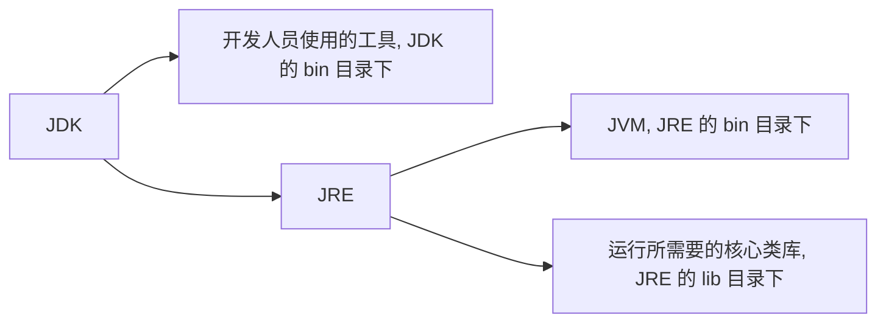
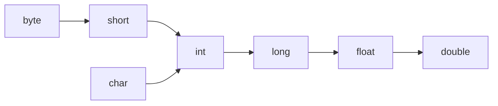
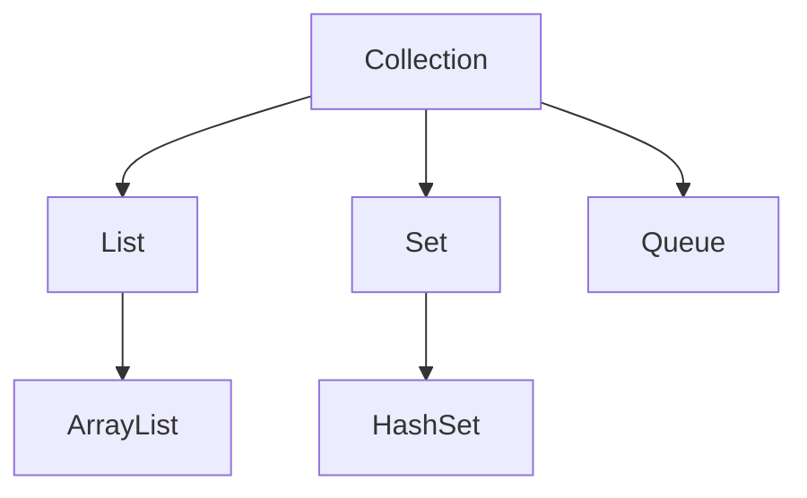
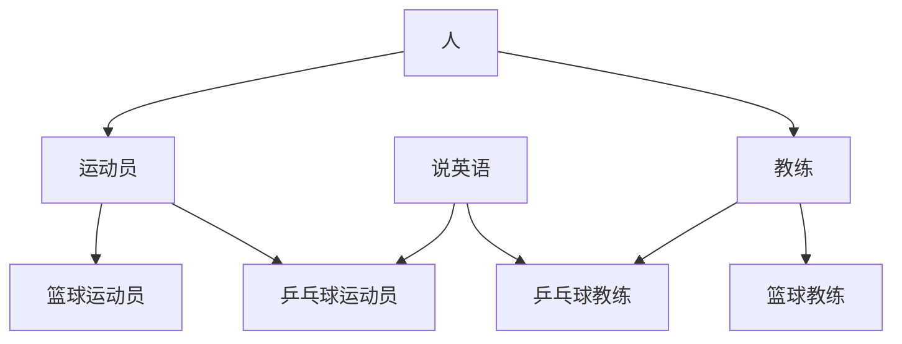
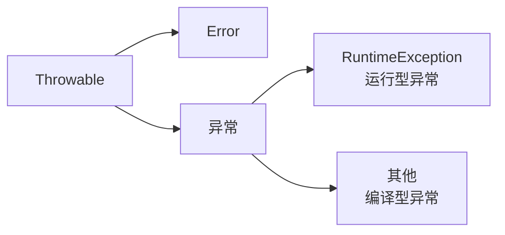
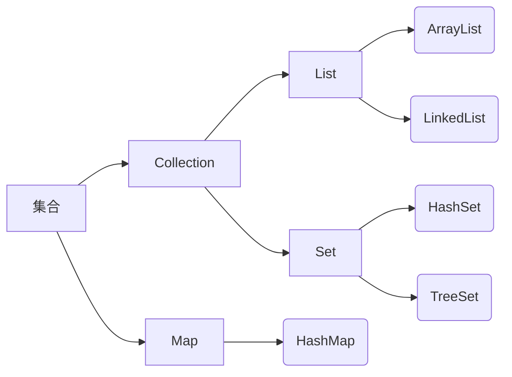
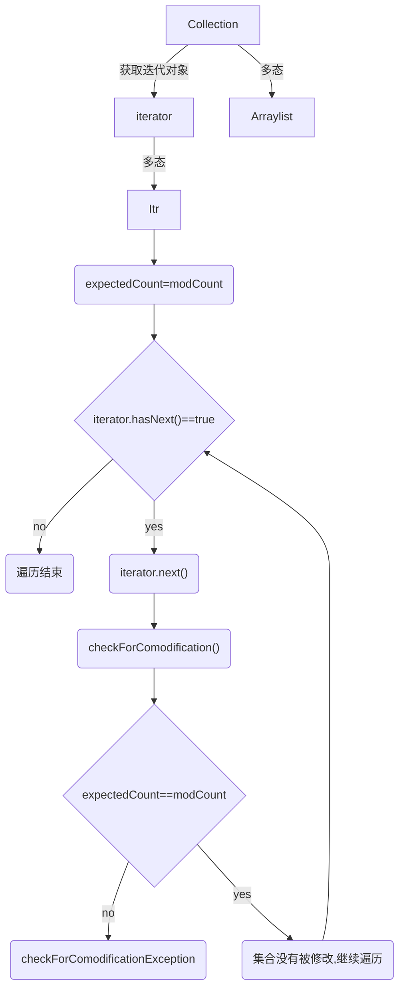

## 前言

以 [黑马程序员全套 Java 教程](https://www.bilibili.com/video/BV18J411W7cE?p=1) 网课为主。

## Java 介绍

Java 是一个可以跨平台的语言，借助 Java 虚拟机（Java Virtual Machine, JVM）能够在任意操作系统（operating system, OS）上运行。

JVM: Java Virtual Machine，在 JRE 的 bin 目录下。JVM 本质上是一个程序，使得 Java 在不同平台上运行时不需要重新编译，只需要执行保存在某字节码文件（.class）中的指令，不管什么平台，只要装有相应平台的 JVM ，字节码文件就可以在该平台上运行。

JRE: Java Runtime Environment，运行只需要 JRE 就够了。

JDK: Java Development Kit，Java 程序开发工具包。



尽管 JRE 对于运行 java 文件已经足够，作为学习肯定还是要下载 JDK 的~

JDK 的安装目录如下：

| JDK 目录名称 | 说明                                |
| ----------- | ----------------------------------- |
| bin         | 存放工具命令，如：javac, java, etc. |
| conf        | 配置文件                            |
| include     | 某些平台特定的头文件                |
| jmods       | 模块                                |
| legal       | 授权文档                            |
| lib         | 补充 JAR 包                         |
| 其他        | 说明型文档                          |

环境配置等就不多赘述了，网上好的教程太多太多。总之就是终端 javac 和 java 可以执行，最好使用 IDEA 作为 IDE。

### IDEA 环境介绍

集成环境：能够把代码编写、编译、执行、调试等功能集合到一起的开发工具。IDEA  就是 java 的集成环境之一。

创建项目-项目内创建模块（实现不同的功能）-模块 src 下创建包（类似文件夹，用于归纳区分不同的类）-包下创建类-类中编写代码。

其中，.class 文件都会放在模块同级的 out 文件夹中。


## 基础语法（重点比较与 C 的区别）

### HelloWorld 

*使用 Notepad++ 前需要设置：`设置 -- 首选项 -- 新建 -- 默认语言：Java -- 编码 ANSI`。*

新建一个 `HelloWorld.java` 文件，编辑内容：

```java
public class HelloWorld { // class 类名必须和文件名一致
    public static void main(String[] args) { //main 方法
        System.out.println("Hello World!"); // 单独输出一行的意思。注意大小写不可以出错
    }
}
```

然后在 DOS 窗口中进入当前文件所在目录，输入命令：

```
javac HelloWorld.java //编译，得到 .class 字节码文件，可以在任何支持 java 的平台上运行
java HelloWorld // .class 文件被解释执行，转化为可以直接在本地对应平台上运行的机器码文件
```

java 和 C、C++ 一样，属于 **编译型语言**（一次性翻译全部源程序，然后执行机器语言程序），而不是解释型语言（源程序逐条翻译并执行）。

### 注释

单行注释 `//` 、多行注释 `/* */` 都和 C 一样。还有一个文件注释 `/** */` 暂时用不到，之后了解。

### 关键字

字母全部小写。

### 数据类型

整数型：byte, short, int, long

浮点型：float, double

字符型：char

布尔型：boolean

变量的定义和 c 相似，`int a=10;` 不能重复定义和未初始化就使用。

```java
long l=1000000L;
float f=1.235F; //防止 long 类型和 float 类型不兼容
```

标识符命名：数字、字母（区分大小写）、_、$ 组成，数字不能开头。

*命名规范：*

*方法和变量：一个单词时，首字母大写；标识符由多个单词组成时：小驼峰命名法*

*类名：大驼峰命名法*

### 运算符

+，-，*，/，%，

+=，-=，*=，/=，%=（隐含了强制类型转换）

++，--

==，>=，<=，>，<，!=

? : 

&，|，^，!（逻辑运算符）

&&，||（短路逻辑运算符，如果左边足以判断表达式的结果，右边就不会执行）

与 C 不同的是，Java 里的 + 号可以进行字符串拼接。字符串变量碰到其他类型变量就会拼接。

```java
1+99+"string" //"100string"
"string"+1+99 //"string199"，从左往右计算
```

### 类型转换

自动类型转换：把小范围的变量赋值给大范围的变量

数据范围从小到大：




算术表达式中包含多个基本数据类型的值时，整个算术表达式的类型就会自动提升。

强制类型转换：赋值运算符中隐含。

```java
short s=10;		
s+=10;			// 正常
s=s+10;			// 错，因为右边发生了自动类型转换，变成了int型
s=(short)(s+10);// 也可以
```

### 数据输入

输入通过 Scanner 类实现。Scanner 类在 java.util 包下，要先导包才能使用。

```java
import java.util.Scanner;//导包
Scanner sc=new Scanner(System.in);//创建对象。这句话中除了 sc 是变量名可以修改，其他的都不能改。
int i=sc.nextInt();//接收数据
String s=sc.nextLine();
```

### 分支、循环语句

if - else 语句：和 C 语言一样。

switch 语句：表达式的取值可以是 byte、short、int、char，JDK5 之后可以是枚举，JDK7 之后可以是 String。其他 case break default 用法和 C 一样。

for, while, do - while 语句，及 break continue 和 C 一样。

### 随机数

Random 类，在 java.util 包下，需要导包。

```java
import java.util.Random;
Random r=new Random();
int n=r.nextInt(10);//[0,10)的范围内取随机数
```

### 数组

一次性声明大量 **同类型** 变量。

```java
int[] arr;//推荐。定义了一个 int 型的数组，数组名是 arr
int arr[];//定义了一个 int 型变量，变量名是 arr 数组

int[] arr=new int[]{1,2,3};//静态初始化
int[] arr={1,2,3};//静态初始化简化版
int[] arr=new int[3];//动态初始化，只申请了空间，系统赋予初始值
//数字类型：初始值为0.0
//布尔类型：初始值为 false
//字符串类型：初始值为""
//引用类型：初始值为 null
```

java 程序运行时需要在内存中分配空间，为了提高效率，内存空间也被划分为不同的部分。

#### 栈内存

定义的方法中的变量放在栈内存中，使用完直接消失。

如 `int a`，以及上文中定义的数组名 arr（其值是指向堆内存中数组内容的地址）。

#### 堆内存

实体、对象等的定义放在堆内存中，使用完会在垃圾回收器空闲时进行回收。

如 new 一个对象，以及上文中数组 arr 中的具体数据内容（arr [0] = 1, arr [1] = 2……）

访问数组中的内容，首先根据栈内存中数组的地址找到相应的堆内存中的位置（以及移动相应的索引步长）然后访问数据。

因此，当多个数组指向相同地址时，其中的内容是一样的，修改其中一个，另一个也会改变。

```java
int[] arr1={1,2,3};
int[] arr2=arr1;
arr2[0]=11;
arr2[1]=22;
arr2[2]=33;//这时访问 arr1[]，发现其中的数据也变成了11,22,33
```

#### 数组常见异常

1. 数组越界问题，ArrayIndexOutOfException。
2. 空指针异常问题，NullPointerException。（`arr=null`，表示数组不指向任何有效对象）

#### Array.length

数组自带属性 length，通过 `arr.length` 就能获得数组长度。

### 字符串

### 字符串输入

查看 Scanner 的帮助文档可以得知，成员方法 nextLine() 可以获取一整行内容，可用于输入接收字符串。

```java
Scanner sc=new Scanner(System.in);
String line=sc.nextLine();
//这里只输入 sc.nextLine() 然后 alt enter 代码自动补全，就会自动生成左边 String line。
```

### String

String 类型代表字符串。其内容都是被双引号引住的。

在 java.lang 包下，不用导包。

```java
String s="abc";//直接赋值
String s1=new String();//空字符串

char[] c={'a','b','c'};
String s2=new String(c);//根据字符数组创建字符串

byte[] b={97,98,99};//a, b, c 对应的 ascii 码
String s3=new String(b);
```

字符串一旦创建不能再修改。不过多个字符串的值可以共享 `s1=s2;`

*字符串在效果上像字符数组 char []，但（JDK9）以后底层实现方法其实是字节数组 byte []。*

#### 字符串比较：== 和 equals()

用 == 判断的比较，是比较 s1 和 s2 的值（即：对应字符串的地址值）是否相同。

基本类型 == 比较的是数据值是否相同，引用类型 **== ** 比较的是 ** 地址 ** 是否相同。

用字符串的成员方法 **equals()** 判断，是比较字符串 **内容** 是否相同。

```java
char[] c={'a','b','c'};
String s1=new String(c);
String s2=new String(c);
System.out.println(s1==s2);//输出 false，因为 s1 s2 地址不同，只有内容是一样的
System.out.println(s1.equals(s2));//输出 true

String s3="abc";
String s4="abc";
System.out.println(s3==s4);//输出 true，因为对于相同内容的字符串，JVM 会建立一个字符串对象（在堆内存的字符串池中）供它俩参考。
System.out.println(s3.equals(s4));//输出 true

System.out.println(s1==s3);//输出 false
System.out.println(s1.equals(s3));//输出 true
```

#### 遍历字符串：成员方法 length() 和 charAt()

`s.length()` 可以获取字符串长度。**这里注意是有括号的，和数组长度 length 区分开！** 

s.charAt(i) 可以获取索引为 i 处的字符

```java
for(int i=0;i<s.length();i++){
    System.out.println(s.charAt(i));
}
```

#### 字符串拼接

字符串可以直接用 + 号拼接。

```java
String s1="Hello ";
String s2="World";
s1=s1+s2;//Hello World
```

在内存中，字符串发生拼接后会在堆内存中新建一个字符串（有 "Hello "，"World"，"Hello World" 三个字符串，而不是直接在 "Hello " 的位置上拼接 "World"）。这样操作还是比较费时费空间的。之后介绍的另一个类——StringBuilder 可以更有效地解决这个问题。

#### endsWith()

查看字符串是否以指定子串结尾。

```java
String s1="hello world";
s1.endsWith("world");
```

#### StringBuilder 类

与 String 类相比，最主要的特点在于内容可变。

在 java.lang 包下，不用导包。

构造方法：

| 构造方法名              | 说明                                              |
| ----------------------- | ------------------------------------------------- |
| StringBuilder()         | 无参构造方法                                      |
| StringBuilder(String s) | 把给定的 String 字符串转换成 StringBuilder 类型的 |

| 成员方法名              | 说明                                          |
| ----------------------- | --------------------------------------------- |
| append(String s)        | 在结尾拼接上字符串 s                          |
| StringBuilder reverse() | 反转字符串                                    |
| String toString()       | 把 StringBuilder 类型转换为 String 类型并返回 |

用 StringBuilder 完成字符串拼接操作：

1. String 类型转换为 StringBuilder 类型
2. StringBuilder 类型通过 append() 成员方法拼接字符串
3. StringBuilder 类型通过 toString() 成员方法转换为 String 类型

```java
String s="Hello ";
StringBuilder sb=new StringBuilder(s);//或者先无参构造，再在结尾拼接 append(s)，但有点多此一举
sb.append("World");
String s1=sb.toString();

//骚操作：匿名对象，使用完立刻被垃圾回收器回收，建议少用
String s1=new StringBuilder(s).append("World").toString();
```

用 StringBuilder 完成字符串反转操作：

```java
String s="Hello World";
String sr=new StringBuilder(s).reverse().toString();
```

### 方法

java 中的方法类似 C 中的函数。只是涉及类和对象的问题，有一些小不同。

像函数一样，是有独立功能的代码块组成的集合，可以拿去调用。

```java
public static 返回值类型 方法名(形参){//和 main 方法同级
    方法体
    return 返回值;
}//定义

方法名(实参);//在 main 方法中调用。有返回值类型的方法建议用变量接收调用
```

方法不能嵌套定义。

#### 方法重载

多个方法在一个类中，有相同的方法名，但参数不完全相同。

```java
public static int max(int a, int b)
public static int max(int a, int b, int c)
```

**注意：返回值不能作为判断方法是否重载的标准！** 只有方法名和参数可以。

调用时，JVM 根据传入参数不同，来得知调用的是哪个方法。

**形参值修改不会对实参造成影响。** main() 方法存储在栈内存中，当 main() 方法调用其它方法时，其他方法进入栈内存。


但是其中的形参的值不对 main() 中的实参造成影响（除非是像数组、指针之类引用类型，根据地址去堆内存中修改数据），当 change() 方法执行完后就直接出栈了。


如图，如果是数组单元的值被修改了，实际上是堆内存中的内容被修改了， main() 方法中数组对应的地址中的内容也会被修改。

## 类和对象

### 类

类是对生活中一类具有共同属性和行为的事物的抽象。如猫类，都有毛的长短、颜色、名字等属性，也都能猫叫、吃饭等（不接受抬杠

类是对象的数据类型，是一个抽象的概念。

#### 类的定义

```java
public class 类名{
    数据类型 变量;
    数据类型 变量;
    数据类型 变量;
    
    方法1;
    方法2;
}

public class Cat{
    String name;//初始值为null或0或false或""
    int age;
    boolean tail;
    String color;
    
    public void meow(){
		System.out.println("Meow!");
    }
    public void eat(String food){
		System.out.println("Eat "+food);
    }
}
```

### 对象

类的实体化。比如罗小黑，是猫类的一个实体化。

#### 属性

对象具有的各种特征，每个对象的每个属性都有特定的值（如猫毛有长毛、短毛、无毛）

#### 行为

对象能执行的动作，如猫可以叫，可以跑。

#### 对象的使用

```java
//在 main 方法中
Cat c=new Cat();
c.name="小黑";//c 的名字
c.age=2;//2岁了
c.tail=false;//有尾巴
System.out.println(c.age);
c.meow();//行为：猫叫
c.eat("猫粮")//行为：吃饭
```

在同级目录下，类在一个文件中，main 方法在另一个文件中而且实例化了这个类，也是可以的。

对象名 c 存储在栈内存中（其值代表对象的属性在堆内存中的地址），而对象的 **属性** 等具体内容存储在 **堆内存** 中。对象中的 **方法** 调用时则加载到 **栈内存** 中，执行完毕后出栈。

### 成员变量和局部变量

成员变量：类中在方法外的变量（如上例中的属性变量）

局部变量：在类的方法中或方法声明上的变量。（如上例中 eat 方法声明的 food 局部变量）

| 成员变量           | 局部变量                                   |
| ------------------ | ------------------------------------------ |
| 类中方法外         | 方法中，或方法声明上                       |
| 堆内存中           | 栈内存中                                   |
| 对象消失时随之消失 | 方法调用完毕而消失                         |
| 有默认的初始值     | 没有默认的初始值，必须先定义、赋值才能使用 |

### 对象内存图介绍

首先老师汇总介绍了一下所有内存空间。当我们运行 Java 文件的时候系统分配一片内存空间给 JDK，里面具体是这样细分的：


元空间，或者叫方法区，负责加载字节码文件，是 JDK 8 及以后的版本从堆空间中划分出来的。

栈一般是方法，变量运行时进入。

堆是我们 new() 出来的对象的存储区域，并产生地址。

#### 单个对象的内存图

比如：`Student s=new Student();`

在这个过程中内存至少会执行以下七个步骤：

1. 加载 class 文件
2. 声明局部变量
3. 在堆内存中开辟一片空间
4. 默认初始化（将对象中的局部变量值赋值为默认值，如 `String name` 赋值就是 null, `int age` 赋值就是 0）
5. 显示初始化（如果在类定义中我们做了赋值，如 `int age=19;` 显示初始化就会重新赋值成这个我们给定的默认值）
6. 构造方法初始化（通过构造方法中的参数赋值）
7. 将堆空间中的地址值赋值给左边的局部变量


当方法执行完毕撤出栈空间的时候，没有引用堆内存中对应对象的变量时，堆内存中的对象就没有存在必要了就也被清理了。

## 封装 packaging

Java 的三大特性：封装、继承、多态。

之前定义的成员变量都可以直接对值进行修改，存在安全隐患（比如设置 age =-30）

因此我们要添加一些限制。

### private 修饰符

可以修饰成员变量、成员方法不 **直接** 被其他类使用。

```java
private String name;
private int age;
```

被 private 修饰的成员变量有两种赋值（访问）方式：构造方法和 get / set 方法。

### 构造方法

写在类中，作为类的方法。主要用于对象初始化。声明变量时 `Cat c=new Cat();` Cat() 就是一种无参构造方法。

每个类定义时系统都会给一个默认无参构造方法。如果自己给了一个无参构造方法，就会覆盖系统默认的。**建议无论是否用到构造方法，都写一个无参构造方法。**

```java
public Cat(){}//我们自己加的无参构造方法，会覆盖系统默认的
public Cat(String name){//写一部分参数的构造方法也可以
    this.name=name;//通过 this 赋给成员变量
}
public Cat(String name, int age){//写全参数的构造方法也可以
    this.name=name;
    this.age=age;
}
//main 中构造对象：
Cat c1=new Cat();
Cat c2=new Cat("小黑");
Cat c3=new Cat("小白",2);//这些都可以，与自己写的构造方法的参数相对应。
```

this 被哪个对象调用，就代表哪个对象。


然后把 "林青霞" 字符串类型传入堆内存中。

### get / set

无参构造方法后用 setXxx() 方法创建对象。

```java
public void setName(String name){//赋值
	this.name=name;
}
public void setAge(int age){
    if(age>=0&&age<=20)//在 set 中可以添加一些限制处理
	this.age=age;
}

public void getName(){//获取值
	return name;
}
public void getAge(){
	return age;
}

//在 main 方法中赋值并获取值示例：
Cat c=new Cat();
c.setName("小黑");
System.out.print(c.getName);
```

### 总结

封装将类的某些信息隐藏在类内部，不允许外部程序直接访问，而是通过该类提供的方法实现对隐藏信息的操作和访问，提高了代码安全性（在 setXxx() 方法中可以对数据进行校验）和代码复用性（封装方法可以复用）。

## 集合

集合和数组相比，就像 StringBuilder 之于 String，数组长度固定，集合长度可变。





ArrayList 就是集合的一种。

### ArrayList \< E \>

在 java.util 包下，需要导包。

\< E \> 表示泛型，限制数组中的元素只能是某一种类型（或者其子类，多态），可以在编译阶段约束操作的数据类型并进行检查（下面左边的 String）。

```java
ArrayList<String> array=new ArrayList<>();
```

泛型只能使用引用数据类型（比如包装类 Integer, Character... 或者我们自己定义的对象 Student，但是不可以使用基本数据类型 int char 这些，具体原因后面还会深入讲解）。

| 方法                        | 说明                                   |
| --------------------------- | -------------------------------------- |
| ArrayList \< E \>()            | 无参构造方法                           |
| boolean add(E e)            | 结尾添加一个元素，成功返回 true         |
| void add(index i, E e)      | 在指定索引处添加一个元素（不能越界！） |
| boolean remove(Object o)    | 删除指定对象，成功返回 true            |
| E remove(int index)         | 删除指定索引处的值，返回该值           |
| E set(int index, E element) | 修改指定索引处值，返回修改后的值       |
| E get(int index)            | 返回指定索引处元素                     |
| int size()                  | 返回集合元素个数                       |

```java
array.add(1);
array.add(3);
array.add(4);
array.add(1,2);	 // 1下标位置插入2这个元素
System.out.println(array);//输出 array：1，2，3，4
```

## 继承

有一些类有许多相同属性和方法（如猫和狗，有动物的共同特征）重复写两遍相对麻烦一些。可以把这些类的共同部分提取出来作为父类，这些类继承父类中的共有部分后再添加自己特有的内容。

```java
public class Animal{ // 父类，基类，超类
    String name;
	int age;
	boolean tail;
	String color;
}

public class Cat extends Animal{ // 子类，派生类
    public void meow(){
        System.out.println("Meow!");
    }
}

public class Dog extends Animal{
    public void bark(){
        System.out.println("Bark!");
    }
}
```

提高了代码的复用性，但是同时也提高了耦合性，如果父类修改子类也要跟着修改。

当子类属于父类的一种时，可以使用继承。

### 变量访问特点

范围越小，权限越高。

访问优先级：子类中局部变量 > 子类中成员变量 > 父类中成员变量 > 找不到就报错

如果想优先访问父类中的元素：super 关键字（使用方法类似 this，只是 this 是访问本类中的成员， super 是访问父类中的成员）


### 构造方法的访问特点

构造方法的访问优先级和变量相反。即使访问子类的构造方法，也会优先访问 **父类的无参构造方法**，再访问子类的构造方法。因为毕竟子类由父类而来，需要先构造父类再构造子类。

而在之前介绍过，如果在类中只定义了带参构造方法，就会覆盖系统默认给的无参构造方法，这时类中就没有无参构造方法了。这时再尝试使用类中的无参构造方法，就会报错。

因此，如果在父类中只定义了带参构造方法，子类使用构造方法就会报错（因为先尝试使用父类无参构造方法却发现没有）

解决方法：1. 父类中补上无参构造方法

2. 在子类构造方法中手动访问父类的带参构造方法来代替

```java
public Fu(int age)
{
    this.age=age;
}

public Zi()
{
	super(20);
}
public Zi(int age)
{
    super(age);// 子类的带参构造方法就这样传递给父类即可
}
// 不支持一个子类继承多个父类，但是允许多层基层（爷->父->子）
```

### 成员方法的访问特点

先在子类中寻找，找不到再去父类中寻找。

### 权限修饰符

public > protected > 默认 > private


### 状态修饰符

有 final 和 static。

#### final

成员变量和成员方法被 final 修饰后，不可以被重新赋值 / 重写。

类被 final 修饰后，也不可以作为父类。

*引用类型被 final 修饰后，不可以被重新赋值，指的是地址不能改变，指向的内容还是可以变的。（除了字符串类型，字符串类型内容也不可以改变）*

#### static

被 static 修饰的成员变量在所有对象里值都是一样的。

```java
public static String university;//在学生类中的静态成员变量

Student.unievrsity="北大";//统一赋值
Strudent s1=new Student();//university 变量的值是 "北大"
Strudent s2=new Student();//university 变量的值是 "北大"
```

静态成员方法则是与类本身相关（非静态的方法是和类的具体实例对象有关，静态方法是和整个类有关），调用方式也是 `类名.静态方法名`。静态方法中不能使用 this 关键字（因为没有具体的实例对象）。此外，**静态成员方法只能访问静态成员变量 / 方法！**

### 包 Package

文件夹，用于存放编译后生成的 class 文件，方便管理。

在 IDEA 中新建的 java 文件会自动生成包路径。如果要在 cmd 窗口中运行带有包路径的文件，编译照常，执行需要注明 class 文件的路径。

```java
package com.ithema;

//命令行根据路径建包
javac -d . HelloWorld.java

//编译
javac HelloWorld.java

//运行
java com.ithema.HelloWorld
```

### 导包 import

如果测试类在 src 文件夹的 A 文件夹下，要调用的类在 src 文件夹的 B 文件夹下，可以通过导包的方式来调用

`import B文件夹.要调用的类名;`

之前对于权限的学习，我们知道：只有 public 的类可以被其他跨包无关类访问；被 protected 修饰的父类对跨包的子类可见。

### 方法重写

之前学过方法重载，是函数名相同但是参数设置不同的函数。

方法重写是子类中重新定义了父类中的方法。

子类如果想访问父类中的方法，可以通过 super 来指定。

```java
@Override//注解，可以检查方法重写的正确性
public void function()
{
    System.out.println("子类中重写方法");
}
```

1. 父类的方法如果是 private 的，子类中就访问不到，也构不成方法重写一说了。
2. 子类的重写方法权限必须高于父类方法。（public > protected > 默认 > private）

## 多态

同一个对象在不同时刻表现出的形态也不同。

```java
Cat c=new Cat();
Animal a=new Cat();//父类引用指向子类对象
```

a 在内存中是 Cat 的大小，但是编译时被视作 Animal 类型。

### 多态中成员的访问特点

访问成员变量时：优先看等式左侧。如 Animal 和 Cat 中都对 age 赋值了，访问 age 得到的是 Animal 中的 age。*因为成员变量不会被重写*

访问成员方法时：优先看等式右侧。如 Cat 中重写了 eat 方法，使用 eat 方法就是使用 Cat 中的 eat 方法。

例：Animal 父类，其中含有 eat() 成员方法；Cat Dog Pig 子类，其中都重写了 eat() 成员方法。

```java
public class AnimalOperator(Animal a)
{
    a.eat();
}

//使用
Cat c=new Cat();
Dog d=new Dog();
Pig p=new Pig();
AnimalOperator(c);// 多态
AnimalOperator(d);// 多态
AnimalOperator(p);// 多态
```

调用的都是子类中重写的方法。

多态提高了程序的拓展性。对于子类重写父类中的方法，我们只需要一个操作类接口就能访问（无论子类具体是哪一种）。

但是多态无法访问子类中特有的方法。

解决这一弊端的方法就是转型。

```java
Animal a=new Cat();//向上转型，a 不能访问 Cat 类中特有的方法
Cat c=(Cat)a;//向下转型，这样 c 就可以访问 Cat 类中特有的方法了。
```

使用转型的时候注意不能随便向下转型。如本例中 a 在内存中是 Cat 类，不能转换成 Dog 类。*ClassCastException*

## Abstract, 接口

抽象方法：没有方法体的方法，待补全，请输入文本。

```java
public abstract void eat();
```

抽象类：含有抽象方法的类。

（没有抽象方法的类也可以是抽象类，但是意义何在）

抽象类不能直接创建对象，需要子类把抽象方法重写补全后才能创建对象。否则，子类也是抽象类。

### 接口

接口是一种公共的行为规范标准，只要符合规范，大家都可以使用。 java 中的接口主要是对行为的抽象。如：

```java
public interface Jumpping{ // 接口
    public abstract void Jump();
}

public class Cat implements Jumpping{ // 实现
    // 重写 Jump() 方法。如果不重写， Cat 就是一个抽象类
}
```

接口中的成员变量默认是 public static final 的，不能修改，而且可以通过 Class.成员变量 的方式直接访问。

接口中没有构造方法和非抽象方法。成员方法默认是 public abstract 的。

（但接口的实现类中可以有 super。这是因为所有没有父类的类都默认继承自 Object 类，如果接口的实现类使用 Object 类中的方法就会用到 super）

接口是抽象的，不能直接实例化，可以借助多态的方法实例化。

相较类与类之间不能多继承，只能层层继承：接口可以多实现 `implements interface1, interface2`

接口和接口之间也可以多继承 `interface1 extends interface2, interface3`

### 总结


### 设计原则

抽象类中的抽象方法所有对象中都必须有；接口则是选择性实现的。比如门这一大类，其中不管什么门，防盗门、木门、自动门，都有门的特有行为（开关门、锁门……）只是实现方法可能不一样，所以要在门父类中定义这些抽象方法，在子类中必须实现。

但是对于门来说不是必须有的抽象方法（如响铃）这种抽象方法就应该作为接口，选择性实现。有响铃功能的门实现这一接口，没有响铃功能的门不必实现。

例：有乒乓球运动员、乒乓球教练、篮球运动员、篮球教练。为了能出国交流，乒乓球运动员和教练需要会说英语。但并不是“是人就该会说英语，是运动员和教练就该会说英语”。所以说英语应当作为接口而不是人里面的抽象方法。



其中，人、运动员、教练是抽象类，说英语是接口。其他具体类需要实现接口，并重写继承的所有抽象方法。

### 抽象类 / 接口作为形参 / 返回值

类也可以作为形式参数或函数的返回值。

抽象类：如果方法的形参或函数的返回值是抽象类名，实际需要传递的是实现了该抽象类的子类的实例对象。

如函数形参是 Animal，实际需要通过多态的方法 Animal a = new Cat(); 然后把 a 传给函数。

接口作为形参/函数返回值，和抽象类一样，实际需要的是实现了该接口的类的实例对象。

## 内部类

在类中定义一个类。

### 内部类和外部类的互相使用

无论外部类的成员变量的权限修饰符是什么（private, public……）因为都在同一个类中，所以即使权限修饰符是 private 也可以相互访问。

内部类都可以 **直接** 访问外部类的全部成员变量。

而外部类如果想访问内部类的成员，需要 **先创建一个内部类对象再访问**。

### 外界使用内部类

外界使用内部类：`Outer.Inner oi=new Outer().new Inner();`

如果 inner 是私有的，或者是局部内部类，则不能通过上述方法调用。但是可以在 outer 里定义一个公开的方法，在方法中 new 一个 inner 并使用其中的成员方法。对于外部的调用者来说，他只需调用 outer 的这个方法，就可以访问 inner 的成员方法。不过对使用者来说他并不知道内部结构如此。**封装**

### 内部类的分类

在类的成员位置定义：成员内部类

在类的局部定义：局部内部类。

局部内部类不能从外界直接创建对象，只能通过调用方法来创建类

```java
public class Outer {
	private int num=10;
    public void method() {
        class Inner {
			public void show(){
                System.out.println(num);//局部内部类可以访问外部类的成员变量，或 method 方法中的局部变量
            }
        }
        Inner i=new Inner();//在方法中创建内部对象
        i.show();//创建对象之后，记得调用内部方法的成员变量
    }
}
```

### 匿名内部类

继承了另一个类，或实现了接口的子类匿名对象。

首先有一个父类/接口，其中有具体的/抽象的方法，然后匿名内部类对其进行重写/实现。

```java
//接口文件 inter.java 中：
public interface inter {
    public void show();//抽象方法
}

//外部类文件 Outer.java 中
public class Outer {
	private int num=10;
    public void method() {
        new inter {
            @Override
            public void show(){
                System.out.println("匿名内部类");
            }
        }.show();// 创建匿名对象之后，记得调用成员变量
        
        //另一种方法：
        inter i=new inter {
            @Override
            public void show(){
                System.out.println("匿名内部类");
            }
        }
        i.show();
    }
}
```

使用示例：假如我们有一个 jump 接口，有一个 jumpoperator 类，其中包含 method(Jump j) 执行 j 的 jump 。

我们要让不同动物都能 jump，就要在不同动物类中 implements jump 接口，并重写其中的抽象方法；

然后用多态的方式 `jump c=new cat(); jump d=new dog();` 新建对象并传给 method 方法。

但是可以通过匿名内部类的方法：

```java
jo.method(new jump(){
    @Override
    public void jump()
    {
        System.out.println("猫跳高");
    }
});

jo.method(new jump(){
    @Override
    public void jump()
    {
        System.out.println("狗跳高");
    }
});
```

直接传一个匿名内部类参数给 method 方法，就不用新建文件重新定义类了。

## 一些常用类

### Math

不用导包，成员变量、方法都带有 static 修饰，可以直接通过类名访问。

| 方法                                        | 说明                                     |
| ------------------------------------------- | ---------------------------------------- |
| public static int abs(int a)                | 绝对值，支持 double  float int long 类型 |
| public static double ceil(double a)         | 向上取整，返回一个 double 值             |
| public static double floor(double a)        | 向下取整，返回一个 double 值             |
| public static int round(float a)            | 四舍五入                                 |
| public static int max(int a, int b)          |                                          |
| public static int min(int a, int b)          |                                          |
| public static double pow(double a, double b) | a 的 b 次幂                              |
| public static double random()               | 随机数，范围 [0.0,1.0)                   |

随机数想要其他范围可以做算术运算。如 [0.0, 100.0)就用 `random()*100`。

### System

不用导包，不能实例化，static

| 方法                                   | 说明                                               |
| -------------------------------------- | -------------------------------------------------- |
| public static void exit(int status)    | 终止运行 JVM，非零表示非正常终止                   |
| public static long currentTimeMillis() | 返回当前时间到 1970 年 1 月 1 日的时间间隔，以毫秒为单位 |

currentTimeMillis() 可以整除求得当前年份；可以用两个 currentTimeMillis() 值做差求时间间隔等。

### Object

Object 类是所有类的根类。

| 方法                              | 说明                                                   |
| --------------------------------- | ------------------------------------------------------ |
| public String toString()          | 返回对象的字符串表示形式。建议子类全部重写该方法       |
| public boolean equals(Object obj) | 比较对象是否相等（默认比较地址）。重写可以比较对象内容 |

#### toString() 方法

Object 中包含 toString 方法

```java
public String toString() {
        return getClass().getName() + "@" + Integer.toHexString(hashCode());
}
```

输出类名@+一串哈希值。

一般重写 toString() 方法，用于输出简明扼要的类信息。IDEA 中可以像构造方法和 getter / setter 一样自动生成。类似：

```java
//手动实现
public String toString(){
return "{ Person:name=" + name +" age=" + age+"}";// name 和 age 都是本类中的成员变量
}
```

#### equals

`s1.equals(s2)` 本质上是比较两个对象的地址，肯定是 false。

一般也会重写/自动生成可以比较两个对象内容是否一致的方法。

```java
public boolean equals(Object o) {
    if (this==o) return true; //同一个对象
    if(o==null||getClass()!=o.getClass()) return false;//o是空对象，或这两个对象不属于一个类
    Student student=(Student) o;//因为调用 equals 传参的时候向上转型了，o 变成了 Object 类，要转回来
    if (age!=student.age)return false; 
    return name!=null?name.equals(student.name):student.name==null;//要么 name 都是空字符串，要么相同。equals() 方法只有非空字符串才能调用
}
```

### Arrays 类

需要导包 `java.util.Arrays`，不能创建对象，成员是 static 的。

| 方法                                   | 说明                              |
| -------------------------------------- | --------------------------------- |
| public static String toString(int [] a) | 返回形如 "[a, b, c]" 的字符串形式 |
| public static void sort(int [] a)       | 按数字顺序排列指定的数组          |

### 补充：工具类

以上工具类的特点都是：不能创建对象，但是成员方法都是 static 修饰，可以直接用类名访问。比如 `Arrays.sort(arr);`

以下这些方法不能创建对象：

```java 
public Math(){};
public Arrays(){};
public System(){};
```

因为这些类自己写了无参构造方法，会把系统默认的无参构造方法覆盖。而该方法又是私有的，因此外界无法访问创建对象。

### 基本类型包装类

其中有一些方法能更好地处理基本数据类型。

包括：Byte, Short, Integer, Long, Float, Double, Character, Boolean

#### 方法示例

| 方法                                    | 说明                          |
| --------------------------------------- | ----------------------------- |
| public static Integer valueOf(int i)    | 把 int 转换为 Integer 类型    |
| public static Integer valueOf(String s) | 把 String 转换为 Integer 类型 |

public String [] split(String regex) 把给定字符串用 regex 分隔开。

如给定字符串 s 是 "1 2 3 4"，`s.split(" ")` 就会得到 4 个字符串："1" "2" "3" "4"。

#### 基本类型转换

int -> String：

① 空字符串+int 类型 `""+123`

② `String s=String.valueOf(i);`

String -> int：

① `Integer in=Integer.valueOf(s);`

`int i=intValue(in);`

② `int i=Integer.parseInt(s);`

#### 自动装箱和拆箱

装箱：基本类型-> 对应的包装类型

拆箱：包装类型-> 基本类型

```java
Integer i=Integer.valueOf(100);//装箱
Integer ii=100;//自动装箱

ii=ii.intValue()+200;//拆箱
ii+=200;//自动拆箱

Integer i3=null;
i3+=300;//NullPointerException。因此对象使用之前最好先判断是否为 null
```

### 日期类

#### Date

Date 类，需要导包。**注意是 java.util 下的，而不是 java.sql 下的！** java.util 下的 Date 类非最终类，所以可以有子类， java.sql 下的 Date 类就是其子类。

| 方法                           | 说明                                                   |
| ------------------------------ | ------------------------------------------------------ |
| public Date()                  | 初始化一个 Date 对象，值为其被分配时的时间，精确到毫秒 |
| public Date(long Date)         | 分配一个 Date 对象，值为从标准时间起指定的毫秒数       |
| public long getTime()          | 获取日期对象从标准时间到现在的毫秒数                   |
| public void setTime(long time) | 设置时间，单位为毫秒                                   |

```java
//输出 Date 对象，得到：星期 月份 日期 时 分 秒 CST 年份

long d=1000*60*60;
Date da=new Date(d);//标准时间往后1h，即1970.1.1 上午9点（不是1点，因为 CST 有时差）

long time=System.currentTimeMillis();//可以这样获取当前时间，然后传给 Date() 或 setTime()
```

#### SimpleDateFormat

可以自己设置日期格式。

| 方法                                    | 说明                                 |
| --------------------------------------- | ------------------------------------ |
| public SimpleDateFormat()               | 构造方法，并使用系统默认的 Date 格式 |
| public SimpleDateFormat(String pattern) | 构造方法，并使用自己规定的格式       |
| public final String format(Date d)      | 将日期对象转换为相应格式的字符串     |
| public final Date parse(String s)       | 将字符串转换为日期                   |

```java
public static void main(String[] args) throws Parse Exception{//结尾要加一些东西，在 IDEA 中可以自动补全
    Date d=new Date;//被分配时的时间
    SimpleDateFormat sdf=new SimpleDateFormat("yyyy年-MM月-dd日 HH:mm:ss");
    String s=sdf.format(d);
    System.out.println(s);//输出格式就形如 2022年-05月-05日 10:24:00
    
    String ss="2022-05-05 10:24:00";
    SimpleDateFormat sdf1=new SimpleDateFormat("yyyy-MM-dd HH:mm:ss");
    Date d1=sdf1.parse(ss);
}
```

y 年 M 月 d 日

H 时 m 分 s 秒

（实际运用的时候，也可以让用户自己指定格式。比如单独写一个日期工具类，有两个方法，把 Date 转换为 String 和把 String 转换为 Date；这两个方法可以设置两个传入参数：

`public static String dateToString(Date d, String format)`

`public static String StringTodate(String s, String format)`

在方法内根据传入的字符串格式，利用 SimpleDateFormat 的方法进行转换。）

#### Calendar 类

需要导包 `java.util.Calendar`，是一个抽象类。

为某一时刻和某些日历字段的转换，以及操作日历字段提供了一些方法。

Calendar 类有一个类方法可以获取 Calendar 对象。可是 Calendar 类不是抽象类吗？

```java
Calendar rightnow=Calendar.getInstance();
```

其实这个方法和 Calendar 的直接子类有关，所以这个实例化相当于多态。

| 方法                                                 | 说明                    |
| ---------------------------------------------------- | ----------------------- |
| public int get(int field)                            | 获取给定日历字段的值    |
| public abstract void add(int field, int amount)      | 添加/减去给定的日历字段 |
| public final void set(int year, int month, int date) | 设置日历的年月日        |

```java
y=c.get(Calendar.YEAR);
m=c.get(Calendar.MONTH)+1;//month 是从0开始的，所以要+1
d=c.get(Calendar.DATE);

//例：求2020年2月有多少天?
Calendar c=Calendar.getInstance();
c.set(2020,2,1);//设置为3月1日
c.add(Calendar.DATE,-1);//倒退1天，就是2月的最后一天
System.out.println("2020年2月有"+c.get(Calendar.DATE)+"天");
```

## 异常

有时因为编译错误，会提示一些信息（如：数组越界 ArrayIndexOutOfBoundException) 其实这些提示信息也是类。

### Throwable

Throwable 是所有错误、异常的父类。



Error 程序无法处理，而异常程序可以处理。

RuntimeException：运行时异常，非受检异常， 可以先不处理，等到真的异常了再进行处理。在编译期间不会检查，其他类错误在编译期间检查。比如数组越界。

编译时异常：受检异常，不管运行会不会异常，都需要进行异常处理，不然无法编译。

### 处理异常

JVM 对异常的默认处理方式：输出异常名称、位置、原因，并停止运行。

程序员还可以有自己的处理异常方法，如 try...catch 和 throw。

#### try...catch

```java
try{
    可能出现异常的代码;
}
catch(异常类名 变量名){
    出现异常后的处理代码;
}

String s="2022-05-07";
SimpleDateFormat sdf=new SimpleDateFormat("yyyy-mm-dd");
sdf.parse(s);// 这个方法不能直接用，必须要加异常处理

try{
    sdf.parse(s);
}
catch(ParseException e){
    System.out.print("parseException!");//不管会不会发生异常，都要写
}
```

出现异常时，异常对象会被提交给 Java 运行时系统，如果和 catch 中的异常类匹配就会进行异常的处理，**处理完成后可以继续执行。**

如果异常变量命名为 e , 调用 e 的成员方法 `e.printStackTrace()` 就会输出平时出现异常时系统默认提示的信息：`java.lang.ArrayIndexOutOfBoundsException: Index 3 out of bounds for length 3  at com.ithema_02.ExceptionDemo02.method..... `

但是通过这种方法处理异常之后，异常后面的部分仍然可以执行。

#### Throwable 的成员方法

Throwable 作为超类，其所有子类都可以使用他的成员方法。

| 方法                          | 说明                              |
| ----------------------------- | --------------------------------- |
| public String getMessage()    | 返回此 Throwable 的详细消息字符串 |
| public String toString()      | 返回此可抛出的简短描述            |
| public void printStackTrace() | 把异常的错误信息输出到控制台      |

```
e.getMessage():  Index 3 out of bounds for length 3
e.toString(): java . lang.ArrayIndexOutOfBoundsException: Index 3 out of bounds for length 3
e.printStackTrace(): java.lang.ArrayIndexOutOfBoundsException: Index 3 out of bounds for length 3  at com.ithema_02.ExceptionDemo02.method.....
```

利用 Ctrl B 追根溯源可以得知， getMessage() 内部大概是这样的：

```java
public class Throwable {
    private String detailMessage;//Throwable 类中的一个成员方法
    
    public Throwable(String message){
        detailMessage=message;//构造方法。出现异常时，会通过这种方法构造一个异常对象
    }
    
    public String getMessage(){
        return detailMessage;
    }
}
```

### Throws

可以抛出异常给 try catch 处理，但是自身不能解决。

```java
throws 异常类名;

public static void main(String[] args){
    System.out.println("运行开始");
    method1();
    try{
        method2();//抛出给了 try catch 处理
    }
    catch(ParseException e)
    {
        System.out.println("运行错误");
    }
    System.out.println("运行结束");
}

public static void method1() throws ArrayIndexOutOfException{
    int[] arr={1,2,3};
    System.out.println(arr[3]);//会报错并停止运行，throws 并没有解决数组越界这个异常
}

public static void method2() throws ParseException{
    String s="2022-05-07";
	SimpleDateFormat sdf=new SimpleDateFormat("yyyy-mm-dd");
	sdf.parse(s);//因为抛出，可以使用了。如果异常，try catch 会显示“运行结束”并继续运行。
}
```

### 自定义异常

```java
public class 类名 extends Exception{
    无参构造
    带参构造
}

public class ScoreException extends Exception{
    public ScoreException(){}
    public ScoreException(message){
        super(message);//把 message 传给父类处理
    }
}

//异常类的使用
public class Teacher throws ScoreException{
    public void checkScore(int score)
    {
        if(score<0||score>100){
            throw new ScoreException("输入分数有误！请重新输入");//throw 不是 throws!
            /*throw 写在方法体内，throws 写在类定义里。
            throws 不一定有异常，而 throw 一定是抛出了异常。*/
        }
        else
            System.out.println("分数正常");
    }
}

public static void main(String[] args){
    Scanner sc=new Scanner(System.in);
    int score=sc.nextInt();
    Teacher t=new Teacher();
    try{//调用方法时，要处理抛过来的异常
        t.checkScore(score);
    }
    catch(ScoreException e){
        e.printStackTrace();
    }
}
//异常时就会输出：异常类型 ScoreException，异常原因"输入分数有误！请重新输入"，异常位置。
```

## 集合进阶



其中方形的是接口，圆角的是实现类。

因此先学习 Collection 和 Map 接口后，只需要学习下一级的特有的部分。

### 数据结构

- 栈：后入先出 FILO。

- 队列：先入先出 FIFO。

- 数组：可以根据索引查找，查找效率高；增删效率低。

- 链表：每个结点存储数据和下一个结点的地址值。最后一个结点地址值为空。相比数组，增删只需要修改增删处前后结点的地址值，效率更高。但是查询必须从头开始，效率低。

- 树。

- 红黑树。

  

  添加节点优先是添加红色的（不影响简单路径的黑色节点数，调整次数少）。

  

  红黑树对平衡要求性低一些（最长路径不超过最短路径的 2 倍），所以插入数据的时候需要的旋转次数平均下来更少。适用于频繁插入删除操作。

### Collection

`java.util.Collection`

`Collection` 是单例集合的最高级接口。他表示一组对象，这些对象也被称为 `Collection` W 的元素。

无法直接实现。可以用多态的方式实现。

```java
Collection<String> c=new ArrayList<String>();
//add(E e) 方法添加元素
c.add("Hello");
c.add("World");
System.out.println(c);//输出['Hello','World']，因为 ArrayList 中重写了 toString 方法，所以得到的不是一串地址
```

| 方法                       | 说明                                      |
| -------------------------- | ----------------------------------------- |
| boolean add(E e)           | 添加元素，永远返回 true                   |
| boolean remove(Object o)   | 从集合中移除指定的元素，成功移除返回 true |
| void clear()               | 清空集合中的元素                          |
| boolean contains(Object o) | 判断集合中是否存在指定的元素              |
| boolean isEmpty()          | 判断集合是否为空                          |
| int size()                 | 集合长度                                  |

快捷键：Alt+7，能看到类的所有信息

#### 迭代器 iterator

java.util.Iterator

Iterator 是一个接口。使用 Iterator 迭代器遍历集合元素。

```java
Iterator<String> it=c.iterator();//通过集合对象中的迭代方法获取对象
```

追根溯源可以得知，Collection.iterator()方法返回的是一个实现了 Iterator 接口的类：Itr.

所以实际上是通过多态的方式实例化的。

| 方法              | 说明                                                         |
| ----------------- | ------------------------------------------------------------ |
| E next()          | 返回下一个元素（越界访问：NoSuchElementException，被请求的元素不存在）并移动指针到下一个位置 |
| boolean hasNext() | 如果存在下一个元素，返回 true                                |

```java
while(it.hasNext()){
    String s=it.next();//这样更好一些，因为元素可能还要做其他操作
    System.out.println(s);
}
```

it.next() 像指针一样从 0 开始遍历。

#### 并发修改异常

当不允许这样的修改时，会抛出此方法。

如：在使用 iterator 遍历过程中，在集合中添加了新的元素。

iterator 调用 next() 方法时，会先调用 checkForComodification() 方法。

checkForComodification() 会检验 modCount 修改集合的次数和 expectedModCount 预期修改集合的次数是否相等。

modCount 来自于 ArrayList 的父类：AbstractList，初始值为 0.每次使用 add() 方法时，modCount 就会++。

expectedCount 来自于 Itr 类，且初始值为 `expectedCount=modCount`.

每次实例化一个 Iterator 类，都会调用其子类 Itr 类，使得 expectedCount 等于当前的 modCount。

然后遍历过程中每次调用 next() 方法时，都会先检查一下 `expectedCount==modCount`，即集合有没有被修改。如果没有修改就可以顺利地返回下一个元素；如果有异常 checkForComodificationException，就会终止运行。




但是通过 for 循环遍历集合，在遍历过程中对集合进行修改，不会报异常。

### List

java.util.List

继承自 Collection 类，可以使用其中的方法。

List 是有序、有索引的。相较于集合 Set，List 中的元素可以重复。

```java
List<String> l=new ArrayList<String>();
l.add("Hello");
l.add("World");
System.out.println(l);//按存储的顺序输出，["Hello","World"]
```

| 方法                          | 说明           |
| ----------------------------- | -------------- |
| void add(int index, E element) | 感觉并不用解释 |
| E remove(int index)           |                |
| E set(int index, E element)    |                |
| E get(int index)              |                |

越界报错 IndexOutOfException。

另一种遍历集合的方法是 for 循环。

```java
for(int i=0;i<l.size();i++)System.out.println(l.get(i));
```

#### List Interator

通过 List 中的 listInterator() 方法得到。可以从各个方向遍历，迭代期间可以修改列表，还可以获取列表迭代器的当前位置。

| 方法                  | 说明                                                         |
| --------------------- | ------------------------------------------------------------ |
| boolean hasNext()     |                                                              |
| E next()              |                                                              |
| boolean hasPrevious() | 反向遍历用到                                                 |
| E previous()          | 反向遍历用到                                                 |
| void add(E e)         | 添加元素，**注意是通过 listInterator 添加的，不是通过集合添加的！** |
|                       |                                                              |

```java
List<String> l=new ArrayList<String>();
l.add("Hello");
l.add("World");
l.add("java");
ListInterator<String> li=l.listInterator();//实际上是 listItr 类作为 listInterator 类的子类，通过多态实现
while(li.hasNext()){
    System.out.println(l.next());
}

while(li.hasPrevious()){
    System.out.println(l.previous());
}

while(li.hasNext()){
    String s=l.next();
    if(s.equals("World")){
        li.add("!!!");//特别注意，并不是调用了l的 add() 方法，而是 li 的 add() 方法！
    }
    System.out.println(s);
}
```

在 listItr 类中的 add() 方法，添加完元素之后，有一句 `expectedModCount=modCount;` 重新把实际修改值赋给了预期修改值。因此 next() 方法中判断 `expectedModCount==modCount`，即使添加了新元素也仍然是 true. 不会发生并发修改异常。这就是为什么要特殊强调这里的 add 和 List 自身的 add 不一样。

#### 增强 for

```java
for(E e:数组或 Collection 的集合)
{
	//在这里使用变量e，把其当做集合元素来用
}

for(int i:arr){
    System.out.println(i);
}

for(int i:list){
    System.out.println(i);
}
//内部是一个 iterator 迭代器，不可以中途修改数据，会引发并发修改异常。
```

#### 几种遍历方式的选择

单纯的遍历：增强 for 最简单。

需要用到索引：普通 for。

迭代器也要会用。

ArrayList 底层数据结构是数组，LinkedList 底层数据结构是双向链表。

用法一模一样，查询效率高就用 ArrayList，增删效率高用 LinkedList。

#### ArrayList 

实现原理：

底层先创建一个长度为 0 的数组。

添加第一个元素的时候底层扩容为一个长度为 10 的连续存储区域的数组。指针指向下一个要存入的数据的位置。

后续继续添加元素，直到装满的时候，整个数组扩容 1.5 倍（在其他地方开辟一片 1.5 倍原数组长度的区域，并且把原来的数据全部拷贝进去）。

如果一次添加多个元素超过扩容后的 1.5 倍的数量，则按照新添加元素数量来扩容数组。


方法的话没什么特殊的。

#### LinkList 

双向链表，有很多操作首尾元素的特殊方法。

| 方法                      | 说明                           |
| ------------------------- | ------------------------------ |
| public void addFirst(E e) | 这些含义都比较明显就不多赘述了 |
| public void addLast(E e)  |                                |
| public E getFirst()       |                                |
| public E getLast()        |                                |
| public void removeFirst() |                                |
| public void removeLast()  |                                |

工作原理：


### 泛型

之前在介绍 ArrayList 的时候简单介绍过，泛型用于编译阶段约束操作的数据类型，如 `ArrayList<String> arrayList=new ArrayList<>();` 就只能存入 String 包装类型了。只能存入指定的泛型数据类型或者其子类（多态）。

如果集合没有限制泛型类型，那么传入什么类型的对象都可以，`ArrayList arrayList=new ArrayList<>();` 传一个 Integer，传一个 String，传一个 Student……（默认 Object 类型，多态）

但是多态的弊端在于没法使用子类中的特有自定义方法。迭代器的类型也和泛型定义的一样。

但是其实 java 中的泛型是伪泛型。就是只在编译阶段检查，其实泛型检查相当于一个保安大爷。编译阶段会简单判断一下你传入的数据是否都符合泛型数据类型，符合才让存；但是存进去的时候还是按照 Object 类型存入的。只不过取出数据准备处理的时候多做了一步操作，就是将 Object 类型的数据再转化为对应的泛型数据类型。

为什么这样做？因为泛型的概念是 JDK 1.5 才提出的，在之前的集合是没有泛型的，而新版本要尽可能向下兼容（因为之前已经诞生了很多 java 代码了，如果全部改成按指定泛型存入数据类型，之前很多旧版本的代码就用不了了，都要改）。

*其实这也解释了为什么泛型不能设定为基本数据类型如 `int` `char` 这些，因为这些类型存入的时候无法转换为 `Object` 类型）*

#### 泛型的几种应用场景

泛型类：当不确定数据类型的时候使用。


*字母写什么都行，不过上面这四个比较常见。*

比如下面这个是一个自定义的泛型类：

```java
public class MyArrayList<E> {
    Object[] obj = new Object[10];
    int size;

    /*
     * E：表示是不确定的类型。该类型在定义类的时候已经定义过了。
     * e：形参的名字，变量名
     */

    public boolean add(E e) {
        obj[size] = e;
        size++;
        return true;
    }

    public E get(int index) {
        return (E) obj[index];
    }

    @Override
    public String toString() {
        return Arrays.toString(obj);
    }
}

```

泛型方法：如果类里面只有一个方法要用到泛型变量，推荐使用这种方法。


```java
/**
 * 参数一：集合
 * 参数二~最后：要添加的元素
 */
public static <E> void addAll(ArrayList<E> list, E e1, E e2, E e3, E e4) {
    list.add(e1);
    list.add(e2);
    list.add(e3);
    list.add(e4);
}

```

传入该数据类型的集合变量后，后续几个变量都会自动检测是否和集合变量同类型。

```java
ArrayList<String> list = new ArrayList<>();

ListUtil.addAll(list, "aaa", "bbb", "ccc", "ddd");
```

其实也可以传入可变参数 (E... e) 不限制传入参数个数。

泛型接口：


```java
public class MyArrayList2 implements List<String>{}
public class MyArrayList3<E> implements List<E> {}
```

#### 泛型不具备继承性

但是数据具备继承性。

比如定义了 `public static void method(ArrayList<Ye> arrayList)`，Ye 是 Fu 的父类，Fu 是 Zi 的子类，那么：

```java
// 创建集合的对象
ArrayList<Ye> list1 = new ArrayList<>();
ArrayList<Fu> list2 = new ArrayList<>();
ArrayList<Zi> list3 = new ArrayList<>();

// 调用 method 方法
// method(list1);
// 下面这些方法报错，泛型方法必须传入完全一样数据类型的变量
// method(list2);
// method(list3);

// 这种使用方法不报错，数据具有继承性
list1.add(new Ye());
list1.add(new Fu());
list1.add(new Zi());
```

那么怎么传入多种数据类型的变量呢？method 定义成 `method(ArrayList<E> arrayList)` 这样就什么数据类型都能传了。但是我们没法只限制某一类特殊的类，比如“我只想接收 Ye Fu Zi 类的集合”，办不到，只能所有引用类型都接收。

要想限制成部分类，需要使用泛型通配符。

`public static void method(ArrayList<? extends Ye> arrayList` 是继承自爷的所有类包括爷可以传入。

`public static void method(ArrayList<? super Ye> arrayList` 是 Fu 的所有父类包括 Fu 可以传入。

### Set

List 有序，可重复，有索引。Set 无序（存取顺序不一定一样），不重复，无索引。

#### HashSet

增删改查性能都不错。

JDK8 之前的版本底层是数组+链表实现。JDK8 之后是数组+链表+红黑树实现，做了优化。

添加元素时存储位置参考哈希值：


加载因子用于判断数组什么时候扩容，比如上例是存入了 16\*0.75 = 12 个元素之后扩容。

这也解释了为什么 Set 遍历无序（按数组顺序遍历，但是对应的是哈希值从小到大遍历，不一定是存入顺序）

默认是使用 Object 里面的 hashCode() 方法，利用对象的地址计算哈希值（不同的对象哈希值一定不同），一般会重写 hashCode 方法，根据对象属性计算哈希值（可以 IDEA 快捷生成），使得只要对象的属性相同，计算得到的哈希值就相同。

*不同的地址值或者对象属性值计算哈希值也有小概率会相等，这叫做哈希碰撞。*

*String 和 Integer 类型 在 Java 里面已经重写好了 equals 和 hashCode 方法，不需要重写。*

#### LinkedHashSet

有序（存取顺序一致），无重复，无索引。

额外用一个双链表记录元素存储顺序。

数据去重默认使用 HashSet，如果还有有序需求再使用 LinkedHashSet.

#### TreeSet

不重复，无索引，可排序。

数据存进去就默认被排序了。数值类型从小到大排序，字符类型按 ASCII 码升序排序。

但是如果是自定义的对象，直接传入 TreeSet 是无法传入的会报错，因为默认没有写比较方法，尝试使用排序函数也会获得一样的结果。

第一种排序方式：

首先要让自定义类 `implements Comparable` ，如 `public Student implements Comparable<Student>` 因为这里我们已经确定了要比较的类型就是 Student 类型所以不用泛型 E。

比较方法重写如下：

```java
@Override
public int compareTo(Student o) {
    // 指定排序的规则
    // 只看年龄，我想要按照年龄的升序进行排列
    return this.getAge() - o.getAge();
}
```

然后就可以排序了。当然也可以自己修改逻辑规则比如先按照姓名字符串排序，相等的话再按年龄……

排序的话只重写 compareTo 就可以了，不需要重写 hashCode 和 equals 方法。这两个方法是用于 HashSet 的。

排序结构是红黑树。

第二种排序方式：

创建集合对象的时候，传递比较器进行比较。

```java
/*
需求：请自行选择比较器排序和自然排序两种方式；
要求：存入四个字符串 “c”, “ab”, “df”, “qwer”
按照长度排序，如果一样长则按照首字母排序

采取第二种排序方式：比较器排序
*/

// 1. 创建集合
TreeSet<String> ts = new TreeSet<>(new Comparator<String>() {
    @Override
    public int compare(String o1, String o2) {
        // 按照长度排序
        int i = o1.length() - o2.length();
        // 如果一样长则按字母顺序
        i = i == 0 ? o1.compareTo(o2) : i;
        return i;
    }
});

// 或者 lambda 表达式：
TreeSet<String> ts = new TreeSet<>((o1, o2) -> {
    // 按照长度排序
    int i = o1.length() - o2.length();
    // 如果一样长则按照首字母排序
    i = (i == 0 ? o1.compareTo(o2) : i);
    return i;
});
```

Comparator 优先级高于 compareTo，对于 Integer 和 String java 已经定义好 compareTo 的情况我们又不想修改源码，就可以使用 Comparator 来重新设置排序方法。

### List Set 集合使用场景总结

`ArrayList`：元素可重复，随机存取。

`LinkedList`：元素可重复，且增删操作数量明显多于查询。

`HashSet`：对集合中的元素去重。

`LinkedHashSet`：去重，而且保证存取顺序。

TreeSet`：去重，且排序。

*后续也可以使用 `List` + 排序方法实现排序。*

### Map 双列集合

双列指的是键值对，添加一条数据需要同时添加键和值两个数据。键不能重复。键和值一一对应。在 Java 中键值对整体被称作”Entry 对象“。

Set 的底层源码都和 Map 有关。

Map 常用 API 一览：

| 方法签名                                                   | 说明                                                         |
| ---------------------------------------------------------- | ------------------------------------------------------------ |
| `V put(K key, V value)`                                    | 添加元素. 默认返回 null，如果该键已经存在则会覆盖旧值，返回旧值 |
| `V get(K key)`                                             |                                                              |
| `V remove(Object key)` `void clear()`                      | 根据键删除键值对元素移除所有的键值对元素                     |
| `void clear()` `boolean containsKey(Object key)`           | 移除所有的键值对元素判断集合是否包含指定的键                 |
| `boolean containsKey(Object key)`                          | 判断集合是否包含指定的键                                     |
| `boolean containsValue(Object value)`                      | 判断集合是否包含指定的值                                     |
| ``boolean containsValue(Object value)` `boolean isEmpty()` | 判断集合是否包含指定的值判断集合是否为空                     |
| `boolean isEmpty()` `int size()`                           | 判断集合是否为空集合的长度，即键值对的个数                   |
| `int size()`                                               | 集合的长度，即键值对的个数                                   |

和集合有些区别，比如 add 变成了 put，contains 变得复杂了。

```java
Map<String, String> map = new HashMap<>();
```

遍历方法：

```java
// 1. 获取所有键
Set<String> keys = map.keySet();
for(String key in keys){
    String value = map.get(key);
}

// 2. 获取所有键值对
Set<Map.Entry<String, String>> entries = map.entrySet();
for(Map.Entry<String, String> entry: entries){
    String key = entry.getKey();
    String value = entry.getValue();
}

// 3. lambda 表达式。底层逻辑其实也是 entrySet 获取所有键值对赋值给 k v。
map.forEach((k,v)->{
            System.out.println(k+": "+v);
});
```

#### HashMap

没啥额外方法。特点和键一样，无序不重复无索引。

底层和 `HashSet` 一样，数组+链表，JDK8 之后还有红黑树。添加一个键值对，创建 Entry 对象存储键值对，计算其索引，放入对应的哈希数组单元。如果该单元里有对应的键 则覆盖该键（和 `HashSet` 不一样，`HashSet` 是不存），如果不一样则挂到旧的键值对下面。长度超过 8 转为红黑树。

键依靠 `hashCode()` 和 `equals()` 判断是否一致，如果键是自定义对象还需要重写这两个方法。

>[!NOTE]
>
>基于这个覆盖特性，比如可以做统计。投票统计，看看 A B C D 谁的票最多。我们创建一个键为 A 或 B 或 C 或 D，值为票数的数组，每次有人投票就取出对应的键值，值++再写回。最后遍历统计。

#### LinkedHashMap

有序，不重复，无索引。有序指的是存取顺序一致，底层额外使用双链表记录顺序，类似 `LinkedHashSet`。

#### TreeMap

不重复，无索引，可排序（对键），可以自己定义排序方法，底层排序结构红黑树。类似 `TreeSet`。

#### HashMap 源码分析

如下，老师对源码做了一些简化和注释（比如一个同时包含赋值和逻辑判断的语句，老师可能会拿出来拆成先赋值再判断，但是其实看懂先后顺序逻辑的话也不是特别难），然后我再加了一些补充注释供自己理解。

```java
/*
1.看源码之前需要了解的一些内容

Node<K,V>[] table   哈希表结构中数组的名字

DEFAULT_INITIAL_CAPACITY：   数组默认长度 16

DEFAULT_LOAD_FACTOR：        默认加载因子 0.75
    
加载因子的作用：当存入数据达到数组长度*加载因子的长度时，数组就需要进行 2 倍扩容了。


HashMap里面每一个对象包含以下内容：
1.1 链表中的键值对对象
    包含：  
            int hash;         // 键的哈希值
            final K key;      // 键
            V value;          // 值
            Node<K,V> next;   // 下一个节点的地址值
          
          
1.2 红黑树中的键值对对象
    包含：
            int hash;                // 键的哈希值
            final K key;             // 键
            V value;                 // 值
            TreeNode<K,V> parent;    // 父节点的地址值
            TreeNode<K,V> left;      // 左子节点的地址值
            TreeNode<K,V> right;     // 右子节点的地址值
            boolean red;             // 节点的颜色
                


2.添加元素
HashMap<String,Integer> hm = new HashMap<>();
hm.put("aaa" , 111);
hm.put("bbb" , 222);
hm.put("ccc" , 333);
hm.put("ddd" , 444);
hm.put("eee" , 555);

添加元素的时候至少考虑三种情况：
2.1 数组位置为 null
2.2 数组位置不为 null，键不重复，挂在下面形成链表或者红黑树
2.3 数组位置不为 null，键重复，元素覆盖

*/

// 返回值：被覆盖元素的值，如果没有覆盖，返回null
public V put(K key, V value) {
    return putVal(hash(key), key, value, false, true);
}


// 利用键计算出对应的哈希值，再把哈希值进行一些额外的处理
// 简单理解：返回值就是返回键的哈希值
static final int hash(Object key) {
    int h;
    return (key == null) ? 0 : (h = key.hashCode()) ^ (h >>> 16);
}

// 参数一：键的哈希值
// 参数二：键
// 参数三：值
// 参数四：如果键重复了是否保留
//        true，表示老元素的值保留，不会覆盖
//        false，表示老元素的值不保留，会进行覆盖
// 对于 HashSet 的实现就是 true，第二次出现同样的键的数据不存
// 对于 HashMap 的实现就是 false，第二次出现同样的键的数据覆盖旧数据
final V putVal(int hash, K key, V value, boolean onlyIfAbsent, boolean evict) {
    // 定义一个局部变量，用来记录哈希表中数组的地址值。
    Node<K, V>[] tab;

    // 临时的第三方变量，用来记录键值对对象的地址值
    Node<K, V> p;

    // 表示当前数组的长度
    int n;

    // 表示索引
    int i;

    // 把哈希表中数组的地址值，赋值给局部变量 tab
    // 因为 table 数组存在堆里，我们把数据拿到函数栈的临时变量里访问速度更快。
    tab = table;

    if (tab == null || (n = tab.length) == 0) {
        // 1. 如果当前是第一次添加数据，底层会创建一个默认长度为 16，加载因子为 0.75 的数组
        // 2. 如果不是第一次添加数据，会看数组中的元素是否达到了扩容的条件
        // 如果没有达到扩容条件，底层不会做任何操作
        // 如果达到了扩容条件，底层会把数组扩容为原先的两倍，并把数据全部转移到新的哈希表中
        tab = resize();
        // 表示把当前数组的长度赋值给n
        n = tab.length;
    }

    // 拿着数组的长度跟键的哈希值进行计算，计算出当前键值对对象，在数组中应存入的位置
    i = (n - 1) & hash; // index
    // 获取数组中对应元素的数据
    p = tab[i];


    if (p == null) {
        // 如果当前数组位置为空，底层会创建一个键值对对象，直接放到数组当中
        tab[i] = newNode(hash, key, value, null);
    } else {
        // 我们用 e 表示要被添加的新节点，或者要被替换值的旧节点
        Node<K, V> e;
        K k;

        // 等号的左边：数组中键值对的哈希值
        // 等号的右边：当前要添加键值对的哈希值
        // b1 是单纯判断哈希值是否相同
        boolean b1 = p.hash == hash;
        // 哈希值相同了，键也未必相同，还要判断一下键。遍历当前哈希值位置的所有链表元素或者红黑树元素进行判断
        // 如果是同一个键，就要决定是覆盖还是跳过了
        // 如果不是同一个键，就添加新节点到链表或者红黑树中。
        // 如果链表长度过长，要转化为红黑树结构
        
        // 下面这里我们是先判断了一下链表或红黑树的头节点的键值和新插入的键值是否相同
        // 如果不同再分两种结构处理判断
        if (b1 && ((k = p.key) == key || (key != null && key.equals(k)))) {
            e = p;
        } else if (p instanceof TreeNode) {
            // 判断数组中获取出来的键值对是不是红黑树中的节点
            // 如果是，则调用方法 putTreeVal，把当前的节点按照红黑树的规则添加到树当中。
            // 这个方法如果在旧树中没有找到这个新键，就执行插入操作。返回 null。
            // 如果找到了，就返回那个已经存在的键的树节点，等待后续替换其值。
            e = ((TreeNode<K, V>) p).putTreeVal(this, tab, hash, key, value);
        } else {
            // 如果从数组中获取出来的键值对不是红黑树中的节点
            // 表示此时下面挂的是链表
            for (int binCount = 0; ; ++binCount) {
                if ((e = p.next) == null) {
                    // 说明遍历到链表结尾了，这期间所有键都和我们要插入的新键不同
                    // 此时就会创建一个新的节点，挂在下面形成链表
                    p.next = newNode(hash, key, value, null);
                    // 判断当前链表长度是否超过 8，如果超过 8，就会调用方法 treeifyBin
                    // treeifyBin 方法的底层还会继续判断
                    // 判断数组的长度是否大于等于 64
                    // 如果同时满足这两个条件，就会把这个链表转成红黑树
                    if (binCount >= TREEIFY_THRESHOLD - 1)
                        treeifyBin(tab, hash);
                    break;
                }
                //                地址    键   值
                // e：           0x0044  ddd  444
                // 要添加的元素： 0x0055  ddd  555
                // 这里还是判断一下键值是否相同（ddd == ddd）
                // 如果相同，e 被记录为新的待覆盖的节点的位置
                if (e.hash == hash && ((k = e.key) == key || (key != null && key.equals(k)))) {
                    break;
                }
                p = e;
            }
        }

        // 如果 e 为 null，表示当前不需要覆盖任何元素
        // 如果 e 不为 null，表示当前的键是一样的，值会被覆盖
        // e:0x0044  ddd  555
        // 要添加的元素： 0x0055   ddd   555
        if (e != null) {
            V oldValue = e.value;
            if (!onlyIfAbsent || oldValue == null) {
                // 等号的右边：当前要添加的值
                // 等号的左边：0x0044 的值
                // 也就是说我们并不是把原来的键值对替换成新的键值对
                // 而是更改原来的键值对里的值变为新值
                e.value = value;
            }
            // 下面这个方法是做一些子类补充扩展操作的。
            // 在 HashMap 中这个方法是空方法
            // 但是在 LinkedHashMap 中就会包含创建那个记录存储顺序的双链表等内容。
            afterNodeAccess(e);
            return oldValue;
        }
    }

    // threshold：记录的就是数组的长度 * 0.75，哈希表的扩容时机  16 * 0.75 = 12
    if (++size > threshold) {
        resize();
    }

    // 表示当前没有覆盖任何元素，返回null
    return null;
}
```

#### TreeMap 源码分析

```java
// 1.TreeMap中每一个节点的内部属性
K key;                    //键
V value;                //值
Entry<K, V> left;        //左子节点
Entry<K, V> right;        //右子节点
Entry<K, V> parent;        //父节点
boolean color;            //节点的颜色


// 2.TreeMap类中中要知道的一些成员变量

public class TreeMap<K, V> {

    //比较器对象
    private final Comparator<? super K> comparator;

    //根节点
    private transient Entry<K, V> root;

    //集合的长度
    private transient int size = 0;


// 3.空参构造

    //空参构造就是没有传递比较器对象
    public TreeMap() {
        comparator = null;
    }


// 4.带参构造

    //带参构造就是传递了比较器对象。
    public TreeMap(Comparator<? super K> comparator) {
        this.comparator = comparator;
    }


// 5.添加元素

    public V put(K key, V value) {
        return put(key, value, true);
    }

    /*参数一：键
    参数二：值
    参数三：当键重复的时候，是否需要覆盖值
    true：覆盖
    false：不覆盖*/

    private V put(K key, V value, boolean replaceOld) {
        // 获取根节点的地址值，赋值给局部变量t
        Entry<K, V> t = root;
        // 判断根节点是否为null
        // 如果为null，表示当前是第一次添加，会把当前要添加的元素，当做根节点
        // 如果不为null，表示当前不是第一次添加，跳过这个判断继续执行下面的代码
        if (t == null) {
            // 方法的底层，会创建一个Entry对象，把他传给 root 当做根节点
            addEntryToEmptyMap(key, value);
            // 表示此时没有覆盖任何的元素
            return null;
        }
        // 表示两个元素的键比较之后的结果
        int cmp;
        // 表示当前要添加节点的父节点
        Entry<K, V> parent;

        // 表示当前的比较规则
        // 如果我们是采取默认的自然排序，那么此时comparator记录的是null，cpr记录的也是null
        // 如果我们是采取比较去排序方式，那么此时comparator记录的是就是比较器
        Comparator<? super K> cpr = comparator;
        // 表示判断当前是否有比较器对象
        // 如果传递了比较器对象，就执行if里面的代码，此时以比较器的规则为准
        // 如果没有传递比较器对象，就执行else里面的代码，此时以自然排序的规则为准
        if (cpr != null) {
            do {
                parent = t;
                cmp = cpr.compare(key, t.key);
                if (cmp < 0)
                    t = t.left;
                else if (cmp > 0)
                    t = t.right;
                else {
                    V oldValue = t.value;
                    if (replaceOld || oldValue == null) {
                        t.value = value;
                    }
                    return oldValue;
                }
            } while (t != null);
        } else {
            // 把键进行强转，强转成Comparable类型的
            // 要求：键必须要实现Comparable接口，如果没有实现这个接口
            // 此时在强转的时候，就会报错。
            Comparable<? super K> k = (Comparable<? super K>) key;
            do {
                // 把根节点当做当前节点的父节点
                parent = t;
                // 调用compareTo方法，比较根节点和当前要添加节点的大小关系
                cmp = k.compareTo(t.key);

                if (cmp < 0)
                    // 如果比较的结果为负数
                    // 那么继续到根节点的左边去找
                    t = t.left;
                else if (cmp > 0)
                    // 如果比较的结果为正数
                    // 那么继续到根节点的右边去找
                    t = t.right;
                else {
                    // 如果比较的结果为0，会覆盖
                    V oldValue = t.value;
                    if (replaceOld || oldValue == null) {
                        t.value = value;
                    }
                    return oldValue;
                }
            } while (t != null);
        }
        // 就会把当前节点按照指定的规则进行添加
        addEntry(key, value, parent, cmp < 0);
        return null;
    }


    private void addEntry(K key, V value, Entry<K, V> parent, boolean addToLeft) {
        Entry<K, V> e = new Entry<>(key, value, parent);
        if (addToLeft)
            parent.left = e;
        else
            parent.right = e;
        // 添加完毕之后，需要按照红黑树的规则进行调整
        fixAfterInsertion(e);
        size++;
        modCount++;
    }


    // 这个函数用于调整红黑树节点
    private void fixAfterInsertion(Entry<K, V> x) {
        // 因为红黑树的节点默认就是红色的
        // 这里 RED 和 BLACK 是 true 和 false，用常量名修饰
        x.color = RED;

        // 按照红黑规则进行调整

        // parentOf: 获取x的父节点
        // parentOf(parentOf(x)): 获取x的爷爷节点
        // leftOf: 获取左子节点
        while (x != null && x != root && x.parent.color == RED) {


            // 判断当前节点的父节点是爷爷节点的左子节点还是右子节点
            // 目的：为了获取当前节点的叔叔节点
            if (parentOf(x) == leftOf(parentOf(parentOf(x)))) {
                // 表示当前节点的父节点是爷爷节点的左子节点
                // 那么下面就可以用rightOf获取到当前节点的叔叔节点
                Entry<K, V> y = rightOf(parentOf(parentOf(x)));
                if (colorOf(y) == RED) {
                    // 叔叔节点为红色的处理方案

                    // 把父节点设置为黑色
                    setColor(parentOf(x), BLACK);
                    // 把叔叔节点设置为黑色
                    setColor(y, BLACK);
                    // 把爷爷节点设置为红色
                    setColor(parentOf(parentOf(x)), RED);

                    // 把爷爷节点设置为当前节点
                    x = parentOf(parentOf(x));
                } else {

                    // 叔叔节点为黑色的处理方案

                    // 表示判断当前节点是否为父节点的右子节点
                    if (x == rightOf(parentOf(x))) {

                        // 表示当前节点是父节点的右子节点
                        x = parentOf(x);
                        // 左旋
                        rotateLeft(x);
                    }
                    setColor(parentOf(x), BLACK);
                    setColor(parentOf(parentOf(x)), RED);
                    rotateRight(parentOf(parentOf(x)));
                }
            } else {
                // 表示当前节点的父节点是爷爷节点的右子节点
                // 那么下面就可以用leftOf获取到当前节点的叔叔节点
                Entry<K, V> y = leftOf(parentOf(parentOf(x)));
                if (colorOf(y) == RED) {
                    setColor(parentOf(x), BLACK);
                    setColor(y, BLACK);
                    setColor(parentOf(parentOf(x)), RED);
                    x = parentOf(parentOf(x));
                } else {
                    if (x == leftOf(parentOf(x))) {
                        x = parentOf(x);
                        rotateRight(x);
                    }
                    setColor(parentOf(x), BLACK);
                    setColor(parentOf(parentOf(x)), RED);
                    rotateLeft(parentOf(parentOf(x)));
                }
            }
        }

        // 把根节点设置为黑色
        root.color = BLACK;
    }
    
    
/*    
6.课堂思考问题：
6.1TreeMap添加元素的时候，键是否需要重写hashCode和equals方法？
此时是不需要重写的。（因为比较是基于比较器比较的，其底层是红黑树而不是哈希表

6.2HashMap是哈希表结构的，JDK8开始由数组，链表，红黑树组成的。
既然有红黑树，HashMap的键是否需要实现Compareable接口或者传递比较器对象呢？
不需要的。
因为在HashMap的底层，默认是利用哈希值的大小关系来创建红黑树的

6.3TreeMap和HashMap谁的效率更高？
如果是最坏情况，添加了8个元素，这8个元素形成了链表，此时TreeMap的效率要更高
但是这种情况出现的几率非常的少。
一般而言，还是HashMap的效率要更高。

6.4你觉得在Map集合中，java会提供一个如果键重复了，不会覆盖的put方法呢？
此时putIfAbsent本身不重要。
传递一个思想：
代码中的逻辑都有两面性，如果我们只知道了其中的A面，而且代码中还发现了有变量可以控制两面性的发生。
那么该逻辑一定会有B面。

习惯：
boolean 类型的变量控制，一般只有 AB 两面，因为 boolean 只有两个值
int 类型的变量控制，一般至少有三面，因为 int 可以取多个值。

6.5三种双列集合，以后如何选择？
HashMap LinkedHashMap
TreeMap

默认：HashMap（效率最高）
如果要保证存取有序：LinkedHashMap
如果要进行排序：TreeMap
*/
```

>[!WARNING]
>
>注意和 HashMap 的区别在于，HashMap 是一个 Hash 数组，里面每个单元是链表或者红黑树的头节点的结构。
>
>而 TreeMap 底层就是一个红黑树，没有 Hash 数组结构。
>
>所以假设我们想要设置 TreeMap 的键为自定义 Object，那么我们需要实现比较器才能确保红黑树正确运行，但是不用非要实现 hashCode 和 equalsTo 方法，这俩用不到。而 HashMap 就需要实现这俩方法了，不然的话同样的键值（比如两个一样的学生）HashMap 判断不出来是同一个哈希值，就不会去同一个哈希数组单元中存数据，更不会遇到同样的旧键了。TreeMap 是直接遍历红黑树看有没有相同的旧键，而 HashMap 是先计算哈希值找到对应应该存储的哈希数组单元，然后再在里面的链表或者红黑树结构中找有没有同样的键。

### 可变参数

可以传入可变长度的参数。传入进去使用方法还是和 array 一样，这样写方便些。

```java
public class ArgsDemo4 {
    public static void main(String[] args) {

        // 可变参数的小细节：
        // 1. 在方法的形参中最多只能写一个可变参数
        // 可变参数，理解为一个大胖子，有多少吃多少

        // 2. 在方法的形参当中，如果除了可变参数以外，还有其他的形参，那么可变参数要写在最后
        getSum(1, 2, 3, 4, 5, 6, 7, 8, 9, 10);
    }

    public static int getSum(int a, int... args) {
        // 使用方式就当可变参数是个数组就行
        for( int arg : args){
            sout(arg);
        }
        return 0;
    }
}
```

### Collections 工具类

`Collections` 是集合，`Collections` 是一个工具类。

| 方法名称                                                     | 说明                            |
| ------------------------------------------------------------ | ------------------------------- |
| `public static <T> boolean addAll(Collection<T> c, T... elements)` | 批量添加元素                    |
| `public static void shuffle(List<?> list)`                   | 打乱 List 集合元素的顺序        |
| `public static <T> void sort(List<T> list)`                  | 排序                            |
| `public static <T> void sort(List<T> list, Comparator<T> c)` | 根据指定的规则进行排序          |
| `public static <T> int binarySearch(List<T> list, T key)`    | 以二分查找法查找元素            |
| `public static <T> void copy(List<T> dest, List<T> src)`     | 拷贝集合中的元素                |
| `public static <T> int fill(List<T> list, T obj)`            | 使用指定的元素填充集合          |
| `public static <T> void max/min(Collection<T> coll)`         | 根据默认的自然排序获取最大/小值 |
| `public static <T> void swap(List<?> list, int i, int j)`    | 交换集合中指定位置的元素        |

### 项目：斗地主

这个项目我就先不写了，简单总结一下思路和其中我觉得比较关键的点。

首先，真实项目里一般 main 方法只用作启动，很少写核心功能。所以这个项目中老师只在 main 里写了一个 `PokerGame()` 启动游戏。

首先 52 张牌创建集合，打乱后随机分给三个人后留下三张底牌（得到 4 个集合）。然后牌如何排序？老师的牌的字符串是类似 "♥9" “♣5” 这样的，感觉很难写比较器。所以老师用了其他排序方法。

第一种排序方式：创建了一个 `HashMap<Integer, String>` 用 1-54 的数字对应映射这些牌，这样就可以根据键进行排序了。

（牌的顺序是：四种花色的 3，四种花色的 4，四种花色的 5……）

然后我们处理数据的时候都是处理 0-53 的索引值，只有用户看到的是我们从 HashMap 中找到的对应牌面。这样整数排序也很方便。

第二种排序方式：截取字符串的第二位开始的子串（也就是只获取 9， 10 这样的数字，或者 AJQK 字母），然后写一个字母和大小王的对应分值转换表，其他的数字就直接字符串转数字就能获取其分值了。

不过这样会遇到一个问题，就是截取 `“大王”“小王”` 这两个字符串获取到的都是王。所以可以定义这两个字符串为 `” 大王” “ 小王”`，这样获取的子串就是空格后面的部分了。

*说实话总感觉这种方法不太舒服。还是索引那个好，可以直接定义不同分值的索引啊。*

别的就是一些游戏逻辑，前端设计之类的了，没什么比较特别的点，我就先跳过啦。

### 不可变集合

长度，元素都不能修改的集合。

> [!NOTE]
>
> 为啥要创建这样的集合？如果要将数据交给不可信的库处理的时候，将数据拷贝进不可变集合的方式就比较保险。

只要创建集合的时候加一个 of 就行。如 `ArrayList<String> arrayList = List.of("1", "2", "3");`

| 方法名称                                    | 说明                                 |
| ------------------------------------------- | ------------------------------------ |
| `static <E> List<E> of(E... elements)`      | 创建一个具有指定元素的 List 集合对象 |
| `static <E> Set<E> of(E... elements)`       | 创建一个具有指定元素的 Set 集合对象  |
| `static <K, V> Map<K, V> of(E... elements)` | 创建一个具有指定元素的 Map 集合对象  |

可以遍历，可以查，但是增删改都会报错。

除此之外，创建 Set 的时候出现重复元素也会报错。比如 `Set<String> set = Set.of("张三", "张三");`

Map 的键也是一样的不能有重复。

还有，Map 的 `of` 传入最多只能传入 10 个键值对 20 个数据。这么设计的原因是可变参数在一个函数的形参中只能有一个，所以 Map 的传入不可能写成 `(K...keys, V...values)` 这样的形式。所以只手动写了 1-10 个传入键值对的方法。

超过 10 个键值对也不是不能传入，可以通过 `ofEntries` 方法。

```java
HashMap<String, String> hm = new HashMap<>();
hm.put("张三", "南京");
hm.put("李四", "北京");
hm.put("王五", "上海");
// ...

// 2. 利用上面的数据来获取一个不可变的集合

// 获取到所有的键值对对象（Entry对象）
Set<Map.Entry<String, String>> entries = hm.entrySet();

// 把entries变成一个数组
Map.Entry[] arr1 = new Map.Entry[0];

// toArray方法在底层会比较集合的长度和数组的长度大小
// 如果集合的长度 > 数组的长度：数据在数组中放不下，此时会根据实际数据的个数，重新创建数组
// 如果集合的长度 <= 数组的长度：数据在数组中放得下，此时不会创建新的数组，而是直接用
Map.Entry[] arr2 = entries.toArray(arr1);

Map<String, String> hm1 = Map.ofEntries(arr2);

// 简化版：
Map<String, String> hm2 = Map.ofEntries(hm.entrySet().toArray(new Map.Entry[0]));

// 究极无敌简化版：
Map<String, String> hm3 = Map.copyOf(hm);

```

## Stream 流

结合 lambda 表达式，像流水线一样，简化集合，数组操作。

比如下面这个语句快速执行了：从 `list1` 中筛选出开头为“张”，长度为 3 的人名，最终输出。

```java
list1.stream()
     .filter(name -> name.startsWith("张"))
     .filter(name -> name.length() == 3)
     .forEach(name -> System.out.println(name));
```

### Stream 流流程

1. 获取 Stream 流。
2. 中间处理。
3. 终结处理。

| 获取方式     | 方法名                                          | 说明                                                         |
| ------------ | ----------------------------------------------- | ------------------------------------------------------------ |
| 单列集合     | `default Stream<E> stream()`                    | Collection 中的默认方法                                      |
| 双列集合     | 无                                              | 无法直接使用 stream 流<br>需要通过 keySet 或者 EntrySet 转成单列 |
| 数组         | `public static <T> Stream<T> stream(T[] array)` | Arrays 工具类中的静态方法                                    |
| 一堆零散数据 | `public static <T> Stream<T> of(T... values)`   | Stream 接口中的静态方法                                      |

```java
ArrayList<String> list = new ArrayList();
list.add("test1");
list.add("test2");

Stream<String> stream = list.stream();
stream.forEach(s -> System.out.println(s));


HashMap<String, Integer> map = new HashMap<>();
map.put("test1", 1);
map.put("test2", 2);

Stream<Map.Entry<String, Integer>> stream1 = map.entrySet().stream();
stream1.forEach(s -> System.out.println(s));

int[] arr = {1,2,3,4,5,6};
Stream<Integer> stream2 = Arrays.stream(arr);
stream2.forEach(s -> System.out.println(s));

System.out.println(Stream.of("a", "b", "c")); // 必须是同种类型的
// 此外，Stream.of() 里面也可以传递引用数据类型的数组，但是不能传递基本数据类型的数组
// 比如 Stream.of(arr) 存入的是数组地址。如果 arr 是一个 String 数组就没问题，存入每个元素
```

### 中间方法

| 名称                                               | 说明                                       |
| -------------------------------------------------- | ------------------------------------------ |
| Stream <T> `filter(Predicate<? super T> predicate)` | 过滤                                       |
| Stream <T> `limit(long maxSize)`                    | 获取前几个元素                             |
| Stream <T> `skip(long n)`                           | 跳过前几个元素                             |
| Stream <T> `distinct()`                             | 元素去重，依赖 `hashCode` 和 `equals` 方法 |
| static `<T> Stream<T> concat(Stream a, Stream b)`  | 合并 a 和 b 两个流为一个流                 |
| Stream <R> `map(Function<T, R> mapper)`             | 转换流中的数据类型                         |

```java
ArrayList<String> list = new ArrayList();
list.add("test1");
list.add("ccccc");

Stream<String> stream = list.stream();

stream.filter(new Predicate<String>() {
    @Override
    public boolean test(String s) {
        return s.startsWith("t");
    }
}).forEach(System.out::println); // 输出 test1，只保留 t 开头的

stream.filter(s -> s.startsWith("t")).forEach(System.out::println);// lambda 表达式
stream.filter(s -> (s.length() < 3).forEach(System.out::println);// 这个语句没问题，但是如果同时运行这一句和上面那一句会报错
// 提示说这个 stream 已经被操作过一次了
// 他俩可以放在同一个语句中执行但是不能先后分两句执行
       
// map 类型转换案例
ArrayList<String> list = new ArrayList();
list.add("echo-123");
list.add("blacky-456");

Stream<String> stream = list.stream();
stream.map(new Function<String, Integer>() {
    @Override
    public Integer apply(String input) {
        String[] split = input.split("-");
        return Integer.parseInt(split[1]);
    }
}).forEach(System.out::println);
              
// 再用 lambda 表达式简化上面的功能

list.stream().map(s-> Integer.parseInt(s.split("-")[1])).forEach(System.out::println);
```

### 终结方法

## Stream 流的终结方法（部分）

| 名称                            | 说明                       |
| ------------------------------- | -------------------------- |
| void `forEach(Consumer action)` | 遍历                       |
| long `count()`                  | 统计                       |
| `toArray()`                     | 收集流中的数据，放到数组中 |
| `collect(Collector collector)`  | 收集流中的数据，放到集合中 |

```java
// toArray()
// Object[] arr1 = list.stream().toArray();
// System.out.println(Arrays.toString(arr1));

// 上面的方法获取到的是 Object 泛型的数组，下面是获取指定数据类型数组的方法
// IntFunction 的泛型：具体类型的数组
// apply 的形参：流中数据的个数，要跟数组的长度保持一致
// apply 的返回值：具体类型的数组
// 方法体：就是创建数组
list.stream().toArray(new IntFunction<String[]>() {
    @Override
    public String[] apply(int value) {
        return new String[value];
    }
});

// lambda 表达式简写：

list.stream().toArray(value -> {new String[value]});

// collect
ArrayList<String> list = new ArrayList<>();
Collections.addAll(list,
    "张无忌-男-15", "周芷若-女-14", "赵敏-女-13", "张强-男-20",
    "张三丰-男-100", "张翠山-男-40", "张良-男-35", "王二麻子-男-37", "谢广坤-男-41"
);

// 收集List集合当中
// 需求：我要把所有的男性收集起来
List<String> newList1 = list.stream()
    .filter(s -> "男".equals(s.split("-")[1]))
    .collect(Collectors.toList());

// 收集Set集合当中
// 需求：我要把所有的男性收集起来
Set<String> newList2 = list.stream()
    .filter(s -> "男".equals(s.split("-")[1]))
    .collect(Collectors.toSet());
```

`toMap()` 稍微复杂一些，因为要实现两个函数式接口，分别用于指定 key 和 value。

```java
/**
Stream流的收集方法 toMap方法演示
创建一个ArrayList集合，并添加以下字符串。字符串中前面是姓名，后面是年龄
"zhangsan-23"
"lisi-24"
"wangwu-25"
保留年龄大于等于24岁的人，并将结果收集到Map集合中，姓名为键，年龄为值
*/
ArrayList<String> list = new ArrayList<>();
list.add("zhangsan-23");
list.add("lisi-24");
list.add("wangwu-25");

// 完整写其实是两个函数式接口
Map<String, Integer> map = list.stream().filter(
        s -> {
            String[] split = s.split("-");
            int age = Integer.parseInt(split[1]);
            return age >= 24;
        }
).collect(Collectors.toMap(

    new Function<String, String>() {
        @Override
        public String apply(String s) {
            // 张无忌-15
            return s.split("-")[0]; // 获取姓名
        }
    },
    new Function<String, Integer>() {
        @Override
        public Integer apply(String s) {
            return Integer.parseInt(s.split("-")[1]); // 获取年龄整数
        }
    }
));

System.out.println(map);

// lambda 表达式简洁写

Map<String, Integer> map = list.stream().filter(
        s -> {
            String[] split = s.split("-");
            int age = Integer.parseInt(split[1]);
            return age >= 24;
        }

 //   collect方法只能获取到流中剩余的每一个数据.
 //在底层不能创建容器,也不能把数据添加到容器当中

 //Collectors.toMap 创建一个map集合并将数据添加到集合当中

  // s 依次表示流中的每一个数据

  //第一个lambda表达式就是如何获取到Map中的键
  //第二个lambda表达式就是如何获取Map中的值
).collect(Collectors.toMap(
        s -> s.split(",")[0],
        s -> Integer.parseInt(s.split(",")[1])));

*/

```

> [!WARNING]
>
> 注意，toSet 对于重复元素会去重，而 toMap 遇到重复的键会报错。

