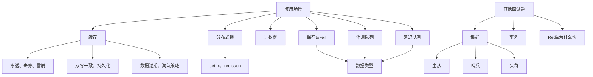

## 简历筛选

HR 筛选：学历，院校，经验，年龄，跳槽频率等。

部门筛选：技术栈是否符合当前业务；是否符合当前业务条件；额外加分项（高可用，高并发，基于公有云的开发经验，团队管理经验等）。

简历中比较重要的就是职业技能和项目经历。

职业技能：重中之重，= 必要的技术+第三方技术。要有针对性地准备，引导面试官针对性提问。

项目描述：项目个数按工作经历为准，太长的可以只写标题或者不写。要能体现出深度，是否主导设计过某模块开发，尽可能展现指标数据。

项目怎么找：搜索开源项目进行学习。

- 技术选型选择一些通用模块，

- 学习方式多方位参考，深入挖掘业务和技术。

- 学习程度主要针对三个问题：功能实现，常见问题，系统设计。

  ## 面试流程

  一般是多轮技术面+终面。技术面主要作用是初步筛选符合条件的人，终面最终挑出最符合方向的人。

  HR：辅助业务部门考察候选人的性格，沟通能力，合作能力，学习能力等。

  资深开发人员：一般参与首轮面试，考察技术能力。

  业务部门经理：技术一般，一般参与终面，根据你的思考能力和抗压能力决定薪资。

  

## Redis



### 项目中怎么用的 Redis？

验证项目真实性的同时，作为面试的一个切入点。


### 缓存

#### 缓存穿透

缓存穿透：查询数据库里没有的数据，或者空数据，每次都会跳过 Redis 去查数据库。

解决方案 1：Redis 添加空数据缓存。但是第一，消耗一定内存。第二，可能一致性差，就是后面我们真的添加了这条数据，Redis 里面的缓存没有更新，这就造成数据不一致。

解决方案 2：在缓存前添加一个布隆过滤器，利用哈希算法建立一个对 bitmap 位图的映射，只简单判断哪些数据存在（因为并不存储实际数据，只是用 01 记录这个商户是否存在并用一定的哈希算法映射，所以占用存储不大）。优点在于相比缓存大量空数据，内存占用较小，没有多余的 key；缺点在于实现相对复杂，而且存在误判可能（哈希可能有冲突，布隆过滤器说存在的可能不存在）。

#### 缓存击穿

少部分高并发的缓存失效，以及重建业务复杂的缓存失效（比如 MySQL 联合多表查询才能得到的数据）。

解决方案 1：互斥锁，线程 1 如果查询缓存没命中，就获取互斥锁，去数据库查询数据并写回缓存。这期间其他线程获取互斥锁失败，就休眠等着线程 1 释放锁才能查。缺点可能其他线程等待时间较长，都要排队。

解决方案 2：逻辑过期，就是并不是直接给 Redis 设置 TTL 的而是里面存了一个字段叫做 expire 记录了过期时间。如果这个数据过期了，那么该线程获取锁，开启一个新线程开始查询数据库并写入缓存，原线程直接返回旧数据；而其他线程在线程 2 写入的时候，发现数据过期了也试图去获取锁，获取失败就返回旧数据。

方法 1 一致性好，但是性能差。方法 2 性能好些，一致性差。

#### 缓存雪崩

大量缓存同时过期。

解决方法 1：TTL 设置随机值，让批量同时添加的缓存减小同时失效的概率。

解决方法 2：Redis 集群，实现数据备份，鲁棒性好。

解决方法 3：给缓存业务添加降级限流策略，适当让部分请求失败。

解决方法 4：多级缓存，比如 Nginx 缓存，JVM 缓存，数据库缓存等。

#### 双写一致性：Redis 和 MySQL 同步

**一定要先介绍业务背景！！！一致性高，或者延迟一致的需求要选择不同方案。比如：我的点评系统对一致性要求没那么高所以采用异步通知方法。然后面试官肯定会再问异步通知具体实现。**

1. MySQL 改完数据，Redis 同步改。性能差而且无效更改多。
2. Redis 直接删了，等下次查询再添加缓存。这里涉及到先后顺序的问题，先做那个都有风险，最好的方式是先删缓存 然后更新 MySQL 然后延时再删一次缓存（延时双删，防脏数据，但不能完全防止，因为延时时间也不好确定）。延时再删是为了让集群数据库同步更新更改数据。
3. 还有一种性能比较好的方式：加锁。读锁（共享锁）添加后其他线程也可以读但是不能写；读写锁（排他锁）添加后其他线程都不能读写。读的时候添加读锁，写的时候添加排他锁。

一致性要求高：加锁。

延迟一致场景（更多）：可以采取下面的异步通知方法。


使用 MQ 中间中间件，更新数据之后，通知缓存删除。
利用 canal 中间件，不需要修改业务代码，伪装为 mysql 的一个从节点，canal 通过读取 binlog 数据更新缓存。

#### 数据持久化

##### RDB

Redis 数据备份文件（Redis Database Backup File）也叫数据快照，就是把内存中数据记录到磁盘中，Redis 故障重启的时候恢复快照。

可以运行 `save` `bgsave` 命令手动执行（第一个是主进程，备份完前会阻塞所有命令；第二个是子进程执行，避免主进程受到影响），或者在 `redis.conf` 里面设置触发机制，如 `save 900 10` 就是 900s 内如果至少有 10 个 key 被修改就执行 `bgsave`。

底层原理：如下，子进程拷贝页表进行备份。这期间主进程写操作会复制出来一份数据进行读写，避免脏数据。


##### AOF

追加文件（Append Only File）记录 AOF 的所有写命令的日志。

默认关闭，需要在 redis.conf 中字段 `appendonly yes` 打开。`appendfsync` 可以配置频率为 always everysec 和 no，从左到右可靠性下降但是性能变好。

但是我们知道可能 redis 里有多次写操作，只有最后一次才有效（对同一个键）。可以执行 `bgrewriteaof` 命令执行重写功能，用最少的命令达到相同的效果。这个命令会手动将现有的 AOF 文件整合简化，比如对于同一个键的多次操作就会整合为一次，对于多个键的操作也可能整合为一条 `mset` 命令。

除了手动 `bgrewriteaof` 命令，redis 也会自动在触发阈值的时候重写 AOF 文件，比如文件长度比上次超出多少百分比的时候重写，或者文件体积最小多大才触发重写。


相比 RDB，AOF 完整性更好，文件体积更大。文件恢复因此变慢，不过文件恢复优先级更高（因为更完整）。AOF 平时的时候占用磁盘资源低，不过重写的时候占用 CPU 和内存资源比较多。

对数据安全性要求较高的时候用 AOF。

#### 数据过期策略

Q：Redis 数据过期后会立刻删除吗？

##### 惰性删除

过期的时候不管他，再访问的时候，发现过期了，这个时候再删掉。

对 CPU 友好，但是对内存不友好。

##### 定期删除

定期检查删除过期 key。

SLOW：10hz 频率（100ms 周期），每次不超过 25ms（尽量少影响主进程。没清理完就下次再清理）

FAST：频率不固定但间隔 2ms，每次耗时不超过 1ms

难以确定操作执行的时长和频率。

真实应用的时候建议这两种配合使用。

#### 数据淘汰策略

内存不够用又添加新的 key 的时候怎么淘汰旧 key。

- noeviction：不淘汰旧 key，不写入新数据，并且报错。
- volatile-ttl：设置了 TTL 且越小的先淘汰。
- allkeys-random：全部随机淘汰。
- volatile-random：设置了 TTL 的随机淘汰。
- allkeys-lru：LRU 算法，最近最少使用，最后一次用的时候距离现在时间越长越容易被删。（顺带一提 LFU 是最近一段时间内使用频率最小的被删，比如最近 5s 内用的最少的先被删）。
- volatile-lru：设置了 TTL 的用 LRU 算法删。
- allkeys-lfu
- volatile-lfu

优先 all-lru，留存热点数据。

如果数据访问频率差别不大，没有明显冷热数据区分，建议用 all-random

业务中有置顶需求，就 volatile-lru，置顶数据不设置 TTL。

业务中有短时高频访问的数据，可以用 allkeys-lfu 或者 volatile-lfu。

*所以内存满了之后会发生什么，具体要看策略。*

### 分布式锁

比如：定时任务，抢单，幂等场景。

简单锁就是 synchronized 套一下执行的代码。但是这个是基于 jvm 的，所以同一个 jvm 下可以解决多线程问题，但是多个 jvm 比如 localhost: 8080 和 localhost: 8081 的两个线程就不是同一个锁了。

所以我们需要一个独立于 jvm 的外部的，分布式锁。集群实现必须用。

Redis 实现：使用 setnx 命令。

```shell
set lock value nx ex 10
```

要设置过期时间防止死锁问题。放到一条命令中，保证原子性。

```shell
del key
```

如果业务执行时间比较长 超过了锁的 TTL 怎么办？

一种是长业务我们可以预估执行时间，一种是我们可以给锁续期。

redission 会自动生成一个线程监控当前线程执行并自动续期（watch dog，每隔过期时间/3 的时间续期一次，比如默认 30s，那每次续期 10s）。而且对于其他等待分布式锁的无限循环的线程，redission 还可以限制其循环次数，太久就让第二个线程直接退出。

```java
public class MyThread extends Thread {

    static Object objA = new Object();
    static Object objB = new Object();

    @Override
    public void run() {
        // 1. 循环
        while (true) {
            if ("线程A".equals(getName())) {
                synchronized (objA) {
                    System.out.println("线程A拿到了A锁，准备拿B锁");
                    synchronized (objB) {
                        System.out.println("线程A拿到了B锁，顺利执行完一轮");
                    }
                }
            } else if ("线程B".equals(getName())) {
                if ("线程B".equals(getName())) {
                    synchronized (objB) {
                        System.out.println("线程B拿到了B锁，准备拿A锁");
                        synchronized (objA) {
                            System.out.println("线程B拿到了A锁，顺利执行完一轮");
                        }
                    }
                }
            }
        }
    }
}

```

> [!NOTE]
>
> redis 基于 LUA 脚本，可以调用 redis 命令实现多条命令的原子性。

#### 可重入

同一个线程可以重入，已经获取到该分布式锁的情况下再次获取。

Redis 里具体实现是建立了一个 hash 结构，key 是锁名，value 中的 field 是线程名字，value 是重入次数。随着重入和释放次数增减。


不过分布式锁目前还不能解决集群 Redis 服务器的问题。

#### RedLock

红锁不只在一个 Redis 实例上创建锁，而是在多个 redis 实例上创建锁（n/2+1，就是至少一半的节点）但是实现复杂，性能差，运维繁琐。

*非要保证数据强一致性，建议使用 zookeeper 实现的分布式锁。*

### 集群

集群目的还是为了进一步提升 Redis 节点的并发能力。

#### 主从集群

一般主节点负责写操作，从节点负责读操作。

同步流程：全量同步：第一次同步。从节点发自己的 repid 给主节点，主节点一看和自己的不一样，就知道了从节点是第一次同步。就把整个 RDB 发给从节点，同时记录 RDB 之后的 repl-backlog 增量执行的新命令用于后面的增量同步。

*offset 用于记录的是版本增量，比如从节点的是 30，主节点的是 50，那么下次增量同步主节点就知道该发 30-50 这部分新命令给从节点了。*


增量同步：判断发现不是第一次同步后，就只执行增量部分的 repl-backlog.


#### 哨兵集群

主从集群主要问题是主节点宕机了就无法恢复。

哨兵集群则可以实现故障恢复。

1. 监控主从节点是否正常工作。
2. 如果主节点宕机，提升一个从节点为主节点。旧主节点恢复工作了，也以新主节点为主。
3. 给 Redis 客户端发送服务状态变更通知，通知老大换人了。


监控方式：定期（1s）给实例发 ping 命令。如果实例回复 pong 说明正常工作，不回说明不正常。并且从节点会回复主节点状态。

主观下线：一个哨兵（sentinel）发现某实例一段时间内没回复。

客观下线：超过一定数量（quorom）的哨兵都认为该实例没回复（如一半以上）。

选新的主节点的优先级：

1. 判断主节点和从节点断开时间，如果太长了就不选该从节点。
2. 从节点有一个 slave-priority 属性，越高越容易被选。
3. 按 offset 越大越靠前越先选。
4. 按 id 越小越先选。

脑裂问题：因为某些原因，主从之间处于不同网络分区，但是主节点仍然正常工作：


然后一个从节点被提升为主节点，但是仍然没法正常工作因为原来的主节点还在正常工作。网络恢复之后，旧主节点被强制降级为从节点，反倒数据被清空了。

为了避免脑裂，要求提升新的主节点的从节点必须满足：1. 最少有一定数量的 slave 节点（如1个）；2. 它和从节点数据同步和复制延迟不能低于5s。不满足，就拒绝提升。

#### 分片集群

主从和哨兵可以解决高可用，高并发读取的问题。但是海量数据存储，高并发写还没解决。

分片结构如下，有多个 master，彼此之间通过心跳互相检测。


至于读取，客户端可以访问集群任意节点，Redis 集群之间会彼此路由导到正确的集群。

Redis 集群有上万个 hash 槽，这些槽被均匀分布给三个 master，存储对应计算得到的哈希值的键值对。比如我们新建了一个键值对，这个新的键值对就按照键的哈希规则被放到对应的 master 节点中。读取的时候也是。

我们新建键值对的时候也可以自定义规则将其放到指定的想要放入的 master 节点中`set {aaa}name value` 这里的aaa就是规则。

### Redis 为什么快？

1. 基于内存
2. 单线程，避免不必要的上下文切换可竞争条件，也安全
3. 多路 IO 复用模型，非阻塞 IO

IO 模型具体解释：Redis 执行速度非常快，瓶颈主要在网络延迟上。

如下是 Linux 的用户空间 内核空间的图解。用户空间的执行命令，资源调用权限有限，内核空间则可以调用一切资源。读写操作是硬盘数据拷贝到内核再拷贝到用户空间，或用户空间缓冲数据拷贝到内核空间再拷贝到硬盘。比如别人给我发微信，是网卡->内核空间->用户空间。


等待和拷贝就是两个主要的时间浪费源。

阻塞 IO：比如上面那个例子，一开始数据尚未到达，recvfrom 阻塞等待内核空间拿到数据，内核空间也在等待数据。然后数据来了，拷贝到内核缓冲区，内核缓冲区再拷贝到用户缓冲区，这期间用户空间一直在阻塞。这个实现用户空间几乎一直在阻塞。阻塞 IO 一次只能处理一个 socket，如果数据没来进程就被阻塞了。

非阻塞 IO：内核没有数据的时候，面对用户空间的请求会返回异常，recvfrom 就返回 error 然后继续等待获取。一直到内核空间有数据了，然后用户空间阻塞等待完成拷贝，拷贝完成后用户空间接触阻塞，处理数据。这个实现用户空间一开始返回 error，只有等待拷贝的时候才阻塞。但是这样性能也不高，因为用户空间一直在轮询，CPU 空转。

多路复用 IO：用户空间指定多个要监听的 socket 集合，内核空间监听这些 socket。一旦其中一个数据就绪了立刻返回 readable，这期间用户进程阻塞。然后用户找到对应的 socket，调用 recvfrom 拷贝数据，这期间也是阻塞的。

阻塞 IO 就好像一直拿着电话等来电话；非阻塞 IO 是每隔一秒去找电话员问问“我电话来没来”，来了就接通，累；多路复用 IO 是告诉电话员我哪些电话可能有人打电话过来，电话员看到这些线路来电就通知我让我接电话。前两个方法主要就是一直在调用 recvfrom。

多路复用 IO 有三种实现方式：早期的 select 和 poll 只会通知用户“有socket就绪了”，用户还不知道是哪个，得挨个检查。就像只知道有顾客叫了服务员但是不知道是谁叫的，每桌每桌地问。

第三种方式是 epoll，通知用户 socket 就绪的时候也会将就绪的 socket 写入用户空间。相当于用户按下按钮叫服务员，服务员能看到是几号桌叫了他。

下图是 Redis 的网络模型，使用 IO 复用结合事件处理器来同时应对多个 socket 的请求，IO 多路复用通知用户 socket 就绪后，派发不同的事件处理器进行处理，比如应答连接，回复命令（写），命令请求（读）等。


> [!NOTE]
>
> Redis 6.0 之后引入了多线程，主要就是解决红色的命令回复处理器部分和右下角的命令请求处理器的命令转换部分，提高速度。命令执行的时候仍然是单线程。

## MySQL

### 定位慢查询

表现就是页面加载过慢，接口压测响应时间过长（超过1s）。

具体涉及到 MySQL 的原因可能是：聚合查询，多表查询，表数据量过大查询，深度分页查询。

我们可以使用一些压测工具（skywalking）定位问题具体是出现在哪个接口上或者是不是 mysql 上，以及 mysql 自带的慢查询日志定位。

还可以利用 MySQL 自带的 explain 分析工具进行分析。

- key 和 key_len：指明使用的索引和索引大小，我们可以根据这个判断是否命中索引。
- extra：提供一些额外优化建议。比如 using index condition，说明使用了索引，但是还是回表查询了，可能是索引需要优化。
- type：看 sql 是否有进一步的优化空间，是否出现了全盘扫描（all）或者全索引扫描（index）。

### 索引

MySQL 底层的B+树数据结构对特定字段进行优化查找。比如查找55岁的人，正常查找就是从表最上面到下面查找，对年龄字段生成 B+树之后就可以高效查找。

B 树：


B+ 树：只有叶子节点存储数据，路径节点只是用于定位。而且所有的叶子节点组成了一个双向链表。因此，磁盘读写代价更低，查找效率更加稳定，便于扫库和查询。


MySQL 暂停。

## 框架

### Spring 单例 bean 是线程安全的吗？

不是。

首先 Spring 的 bean 默认在 Spring IOC 中是单实例的（`@Scope("singleton")`）。可以声明为 prototype 的多实例。

然后Spring 对 bean 没有做任何自动加锁或者并发控制的安全操作。单例 bean 全局共享。除非其内只有工具方法，无状态（不能被修改）或者自己实现了同步控制等，不然是不安全的。


### AOP

AOP称为面向切面编程，用于将那些与业务无关，但却对多个对象产生影响的公共行为和逻辑，抽取并封装为一个可重用的模块，这个模块被命名为“切面”(Aspect)，减少系统中的重复代码，降低了模块间的耦合度，同时提高了系统的可维护性。

- 记录日志
- 缓存业务
- Spring 内部的事务处理（声明式：方法执行之前开启事务，执行完成后关闭事务，环绕式）

### Spring 事务失效的几种场景

1. 如果用 try catch 自己处理了异常没有抛出，spring 事务不会回滚。所以 catch 里面要抛一下 runtime error exception.
2. 只能在抛出非检查异常时回滚，检查异常不会回滚。可以 `@Transactional(rollbackFor = "Exception.class")` 声明所有异常都回滚。
3. 非 public 方法无法回滚。Spring 为方法创建代理，添加事务通知只能处理 public 方法。

