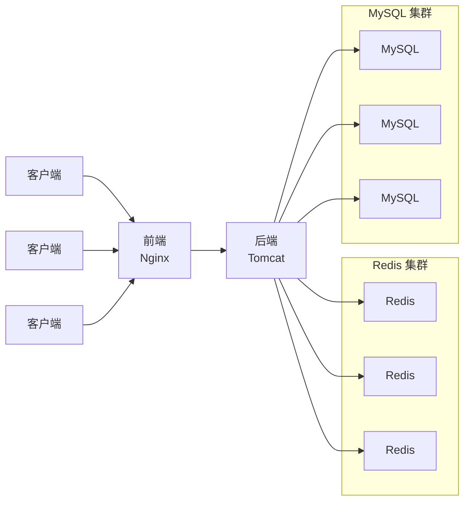
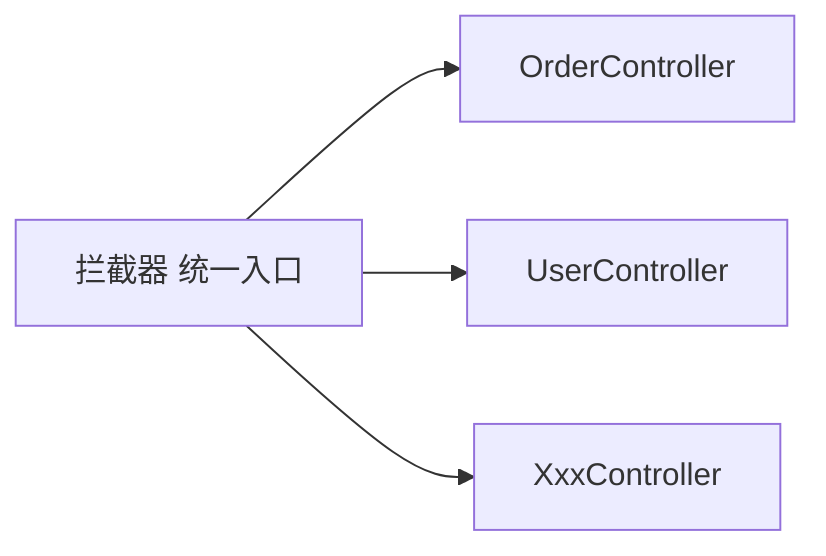
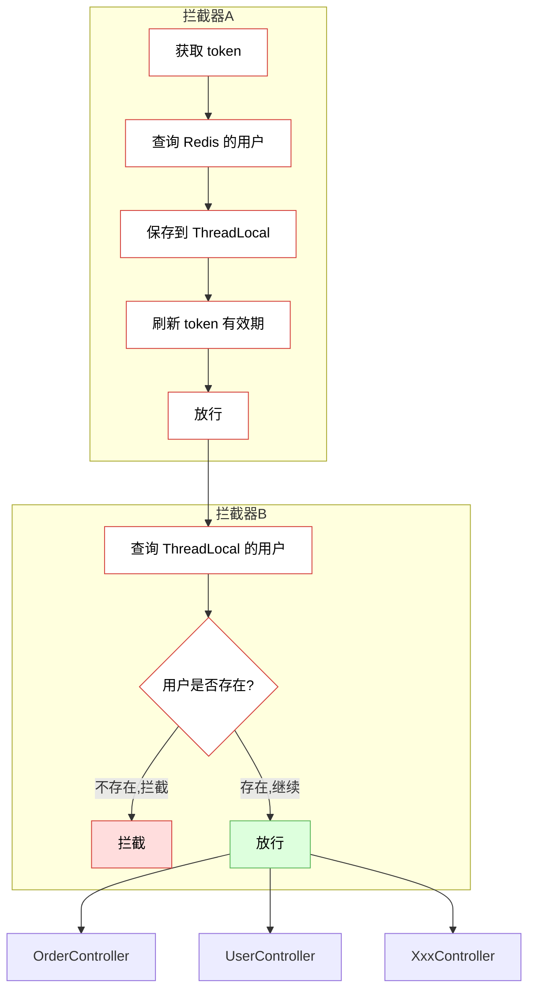
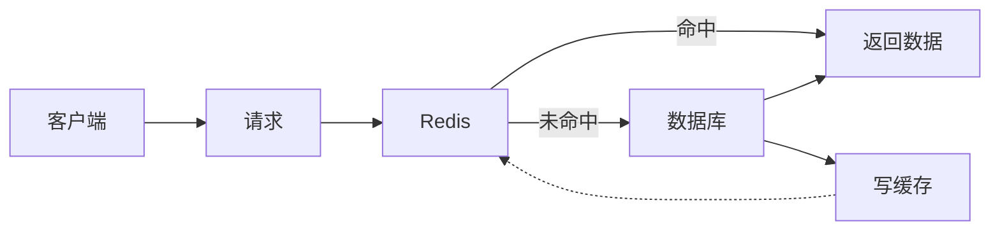
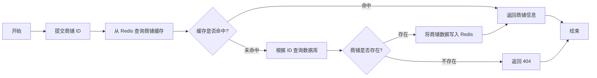
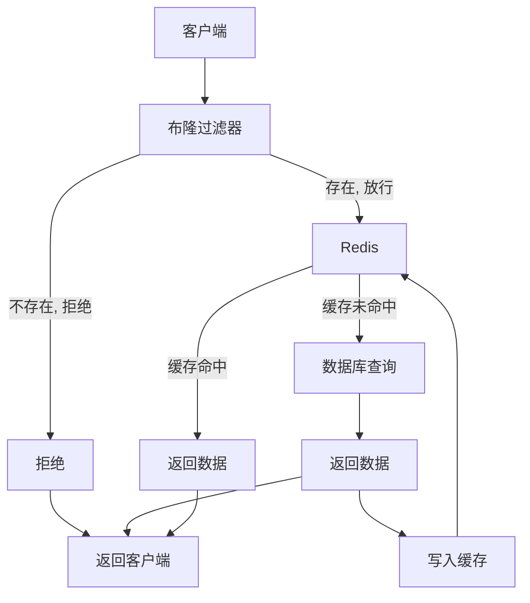
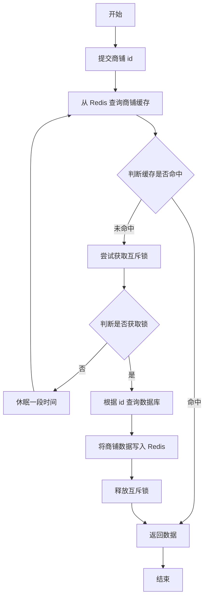
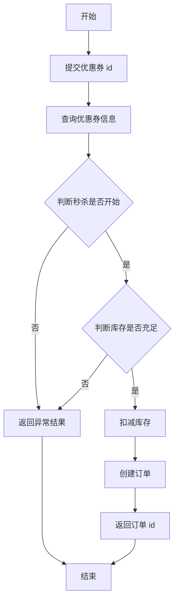

## 黑马点评项目介绍

类似大众点评。

要实现的功能：


## 项目导入

基础代码，数据库等，不过多赘述。


## 项目架构

不是微服务是单体架构模式，因为重点还是在 Redis 学习上。Springboot 那个课涉及微服务实战，我后面应该也会学习一下。

架构图如下，前后端分离，开发完成后前后端分别部署在 Nginx 和 Tomcat 上。



后期这个项目可能还会做一些水平横向扩展，比如多 Tomcat 集群数据共享等，后面再扩展。

导入 nginx 前端，mysql 数据库及 java 后端服务器运行后就可以看到如下所示：


## 短信登录

### Session 实现

首先用 Session 尝试实现一下。

```mermaid
graph TD

%% 校验登录状态
subgraph 校验登录状态
    C1[开始] --> C2[请求并携带 cookie]
    C2 --> C3[从 session 获取用户]
    C3 --> C4{判断用户是否存在}
    C4 -- 有 --> C5[保存用户到 ThreadLocal]
    C5 --> C6[放行]
    C6 --> C7[结束]
    C4 -- 没有 --> C8[拦截]
    C8 --> C7
end

%% 短信验证码登录/注册
subgraph 短信验证码登录/注册
    B1[开始] --> B2[提交手机号和验证码]
    B2 --> B3{校验验证码}
    B3 -- 不一致 --> B2
    B3 -- 一致 --> B4[根据手机号查询用户]
    B4 --> B5{用户是否存在}
    B5 -- 不存在 --> B6[创建新用户]
    B6 --> B7[保存用户到数据库]
    B7 --> B8[保存用户到 session]
    B5 -- 存在 --> B8
    B8 --> B9[结束]
end

%% 发送短信验证码
subgraph 发送短信验证码
    A1[开始] --> A2[提交手机号]
    A2 --> A3{校验手机号}
    A3 -- 不符合 --> A2
    A3 -- 符合 --> A4[生成验证码]
    A4 --> A5[保存验证码到 session]
    A5 --> A6[发送验证码]
    A6 --> A7[结束]
end

```




其他地方都比较好理解。保存用户到 ThreadLocal 是因为不然每次访问用户信息都要访问 session。

### 发送短信验证码

点击用户登录界面，输入手机号尝试发送短信，根据发送链接 `xxx/user/code?phone=xxx` 可以看出请求路径是 `/user/code`，请求参数是电话号码，无返回值。

在 `UserController` 类文件中可以看到这个待完成的函数 `public Result SendCode`，具体的发送短信请求还是交给 `userService` 去实现的，所以我们这里补全这个函数将任务交给 `userService`：

```java
// controller/UserController.java
@Resource
private IUserService userService;

@Resource
private IUserInfoService userInfoService;

/**
 * 发送手机验证码
 */
@PostMapping("code")
public Result sendCode(@RequestParam("phone") String phone, HttpSession session) {
    // TODO 发送短信验证码并保存验证码
    return userService.sendCode(phone, session);
}
```

源代码中，有一个 `IUserService` 接口里面声明了所有需要实现的 `UserService` 方法（目前是空的），然后 `UserServiceImpl` 类继承自 `ServiceImpl` 类实现了 `IUserService`。所以通过 IDEA 快速补全，我们先在 `IUserService` 里面添加一个待实现的 `sendCode `方法，然后再在 `UserServiceImpl` 里面实现。

```java
// service/IUserService.java
public interface IUserService extends IService<User> {

    Result sendCode(String phone, HttpSession session);
}
```

```java
// service/impl/UserServiceImpl.java
@Service
@Slf4j // 用于 log.debug 传递多个参数
public class UserServiceImpl extends ServiceImpl<UserMapper, User> implements IUserService {

    @Override
    public Result sendCode(String phone, HttpSession session) {
        // 根据流程图分析步骤
        // 1. 校验手机号
        // 2. 如果不符合，返回错误信息
        // 在老师提供的 utils 工具类里面有校验手机号的正则表达式
        if(RegexUtils.isPhoneInvalid(phone)){
            return Result.fail("手机号格式错误");
        }

        // 3， 如果符合，生成验证码
        // 随机生成6位数字
        String code = RandomUtil.randomNumbers(6);

        // 4. 保存验证码到 session
        session.setAttribute("code", code);

        // 5. 发送验证码
        // 这里就和具体的运营商服务平台等等有关了，其实不算什么重点，就随便写一下代替一下
        log.debug("发送验证码成功，验证码：{}", code);

        // 6. 返回 ok
        return Result.ok();

    }
}
```


### 登录

现在可以发送验证码了，用户收到验证码之后怎么校验登录呢？

```java
// controller/UserController.java
/**
 * 登录功能
 * @param loginForm 登录参数，包含手机号、验证码；或者手机号、密码
 */
@PostMapping("/login")
public Result login(@RequestBody LoginFormDTO loginForm, HttpSession session){
    // TODO 实现登录功能
    return userService.login(loginForm, session);
}
```

```java
// service/IUserService.java
public interface IUserService extends IService<User> {

    Result sendCode(String phone, HttpSession session);

    Result login(LoginFormDTO loginForm, HttpSession session);
}
```

```java
// service/impl/UserServiceImpl.java
@Override
public Result login(LoginFormDTO loginForm, HttpSession session) {
    // 1. 校验手机号。虽然之前发送验证码的时候已经校验过了，
    // 但是现在用户填写完成验证码又改了一个错误的手机号再提交也是有可能的。所以有必要二次验证
    String phone = loginForm.getPhone();
    if(RegexUtils.isPhoneInvalid(phone)){
        return Result.fail("手机号格式错误");
    }

    // 2. 校验验证码
    Object cacheCode = session.getAttribute("code");
    String code = loginForm.getCode();

    if(cacheCode == null || !code.equals(cacheCode.toString())){
        // 3. 不一致，报错
        // 反向嵌套，避免越嵌套越深
        return Result.fail("验证码错误");
    }

    // 4. 一致，根据手机号查询用户 select * from user where phone = xxx
    // 这个类继承自 ServiceImpl，由 mybatisplus 提供，可以实现方便的单表增删改查。
    // 我们已经在 User 里面注解了对应的 MySQL 表是 tb_user，传给 ServiceImpl 就可以实现方便的 MySQL 操作
    Object user = query().eq("phone", phone).one();

    // 5. 判断用户是否存在
    if(user == null){
        // 6. 不存在，创建新用户，保存用户到数据库
        // 其实创建用户大多数字段都不需要知道，先手机号，然后随机生成一个昵称就行了
        user = createUserwithPhone(phone);
    }

    // 7. 保存用户到 session
    session.setAttribute("user", user);
    // return 就不需要给用户 token 了，因为 session id 已经自动存在 cookie 里面了，用户带着 cookie 就能校验
    return  Result.ok();
}

private Object createUserwithPhone(String phone) {
    User user = new User();
    user.setPhone(phone);
    user.setNickName(USER_NICK_NAME_PREFIX + RandomUtil.randomString(10));

    // mybatis 修改数据库命令：
    save(user);
    return null;
}
```

这样就可以实现登录校验功能了，不过我们会发现用户登录信息没有被成功保存，登陆之后再点击用户，还是需要输入手机号发验证码登录验证。

### 登录校验拦截器

`xxx/user/me` 是登录校验的请求，查询是否已经登录。

按理来说我们应该在每个 Controller 里面补全代码，根据获取到的 cookie 里携带的 session id 去找到对应的 session，进而获取到对应的用户数据。但是有很多 Controller 可能都需要这样获取用户信息，所以这种写法就不太好。

我们可以用拦截器处理：



然后拦截器校验完，按我们之前说的，把用户信息缓存到 ThreadLocal 里面供这些控制类取用。

拦截器可以写在 utils 里面：

```java
// utils/LoginInterceptor.java

public class LoginInterceptor implements HandlerInterceptor {
    // preHandle 实现：到达 Controller 之前执行，进行登录校验
    @Override
    public boolean preHandle(HttpServletRequest request, HttpServletResponse response, Object handler) throws Exception {
        // 1. 获取 session
        HttpSession session = request.getSession();

        // 2. 获取 session 中的用户信息
        Object user = session.getAttribute("user");

        // 3. 判断用户是否存在
        if(user == null){
            // 4. 不存在，拦截。最好加一些标识.401 状态码表示未授权
            response.setStatus(401);
            return false;
        }


        // 5. 存在，保存用户信息到 ThreadLocal。老师已经写好了：
        UserHolder.saveUser((User) user);

        // 6. 放行

        return true;
    }

    // postHandle 实现：Controller 执行完成之后执行，销毁用户数据避免内存泄露
    @Override
    public void postHandle(HttpServletRequest request, HttpServletResponse response, Object handler, ModelAndView modelAndView) throws Exception {
        UserHolder.removeUser();
    }
}

```

拦截器做好了，接下来需要配置一个 MVC 使其生效。

```java
// config/MvcConfig.java

@Configuration
public class MvcConfig implements WebMvcConfigurer {
    // 添加拦截器，并且除外一些不需要拦截的路径
    @Override
    public void addInterceptors(InterceptorRegistry registry) {
        registry.addInterceptor(new LoginInterceptor())
                .excludePathPatterns(
                        // 其实有挺多用不到用户信息的，随便写一些做个示范。
                        // 比如店铺信息，热门博客，用户发送验证码，用户登录这些其实都用不到用户的信息
                        "shop/xx",
                        "shop-type/xx",
                        "blog/hot",
                        "/user/code",
                        "/user/login"
                        );
    }
}
```

最后，再回到对应的控制类里面完善代码：

```java
// controller/UserController.java

    @GetMapping("/me")
    public Result me(){
        // 获取当前登录的用户并返回
        User user = UserHolder.getUser();
        return Result.ok(user);
    }
```

运行，现在登录完就可以看到用户信息了：


但是目前这样实现有一个非常严重的问题：


是的密码也会返回。

### 隐藏用户敏感信息

我们再捋一下用户信息泄露的整个过程：

1. 用户信息在数据库里。
2. 登录校验后，从数据库中取得用户信息，存到 session 也就是 Tomcat 的内存空间里面，方便后续使用。
3. 校验登录状态：根据 cookie 传来的 session id，在 session 中找到对应存在的用户后，存到 ThreadLocal 里面方便后续使用。

要不直接就不把密码什么的无用或者敏感信息存到 session 里面，也能节约内存空间，也安全？

这里老师直接定义了一个类：UserDTO，里面只有用户 id 昵称 头像三个属性。所以我们存数据到 session 里面之前需要将 User 转成 UserDTO 类型。这里也可以直接用工具类实现：

```java
// service/impl/UserServiceImpl.java
// public Result login(LoginFormDTO loginForm, HttpSession session)
session.setAttribute("user", BeanUtil.copyProperties(user, UserDTO.class));
```

相应的，取用户信息的时候也应该用 UserDTO 类型接着。包括 ThreadLocal 里面也应该改成存入 UserDTO 信息。

这部分我就不一一阐述了，记不太清都有哪些要改了，反正就顺着改类型就行，UserDTO 也有 getId() 等方法。

现在在开发者模式看获取到的 UserDTO 信息格式如下：


### Session 共享问题

Session 是存在服务器自身的内存空间的，所以多台 Tomcat 不共享 Session。

所以可能上一秒用户请求被负载均衡到服务器1，成功登陆，下一秒被负载均衡到服务器2又要重新登陆，非常影响使用体验。

解决方法：其实也不难嘛，多服务器 session 拷贝就行吗？并不是，会有很多内存和时间上的损失，拷贝过程中如果用户发送请求可能也会出错。

那么就需要找到 session 的替代方案，这个替代品需要满足：

1. 数据共享，因为我们就想解决这个问题。
2. 内存存储，因为要和 session 有差不多的性能。
3. 键值对形式，因为这种实现方法比较简单。

答案就是 Redis 了。

### Redis 实现

我们先盘点一下 Redis 实现相较 Session 实现的，不一样的问题：

1. 键值对设计。比如验证码，session 里面是让键=code 值=对应验证码数字，redis 我们可以让 String 表示验证码数字字符串，但是 key 不可以="code"，因为 session 对于每个不同的客户端都不一样，所以不同客户端的 session 验证码属性都叫 code 也不冲突，但是 redis 是一个键唯一的数据库，所以不能不同客户端的 key 都叫 "code"。可以用手机号代替，手机号也是唯一标识："phone:xxx" 这样。
2. 之前将用户数据保存到 session，我们的实现非常简单，直接存到 session，浏览器自动就把 session id 写到 cookie 里面，下次发过来的时候我们用 session id 去查找对应的 session 非常方便，但是换成 redis 这些部分就没有自动实现了，需要我们再根据用户提交的手机号作为 key 去 redis 数据库里查询。这个过程其实也顺带校验了手机号是否存在，因为把手机号作为 key，直接去 redis 里面查询 value，如果找不到对应的键值对，也说明了手机号错误。
3. 存储用户数据用什么数据类型？存储对象常见两种方式，一种是 String JSON 形式，另一种是 Hash 存储每个字段。推荐 Hash 方法，因为可以对每个字段进行 CRUD，并且内存占用更少。
4. 存储用户数据，键用什么？也可以用手机号，不过更推荐用 token （生成一个随机字符串）。当然，相比 session （浏览器自动将 session id 存入 cookie）的实现，我们还需要加一步，手动将 token 传回给前端保存，这样用户下次校验登录状态时该客户端才能拿着一样的 token 来取数据。而且相较于手机号更安全，前端可见。


修改代码部分，首先我们要将 `UserServiceImpl.java` 里面的 session 实现转化为 Redis 实现，主要还是之前说的问题，Redis 里面的键值怎么存，怎么保存到浏览器中。

```java
// service/impl/UserServiceImpl.java
@Override
public Result sendCode(String phone, HttpSession session) {
    //...
    
    // 4. 保存验证码到 redis  // set key value ex 120
    // stringRedisTemplate.opsForValue().set("login:code:" + phone, code, 2, TimeUnit.MINUTES);
    // 不过这里我们在 RedisConstant 里定义一下常量，这样方便一些
    stringRedisTemplate.opsForValue().set(LOGIN_CODE_KEY + phone, code, LOGIN_CODE_TTL, TimeUnit.MINUTES);
    
	//...

}

@Override
public Result login(LoginFormDTO loginForm, HttpSession session) {
    // ...

    // 2. 校验验证码
    String cacheCode = stringRedisTemplate.opsForValue().get(LOGIN_CODE_KEY + phone);
    String code = loginForm.getCode();

    if(cacheCode == null || !code.equals(cacheCode)){
        // 3. 不一致，报错
        // 反向嵌套，避免越嵌套越深
        return Result.fail("验证码错误");
    }

    // ...

    // 7. 保存用户到 redis
    // 7.1 随机生成 token，作为登录令牌
    String token = UUID.randomUUID().toString(true);
    // 7.2 将 User 对象转为 Hash 存储
    UserDTO userDTO =  BeanUtil.copyProperties(loginForm, UserDTO.class);
    Map<String, Object> userMap = BeanUtil.beanToMap(userDTO);
    // 7.3 存储
    stringRedisTemplate.opsForHash().putAll(LOGIN_USER_KEY+token, userMap);
    // 7.4 设置有效期
    stringRedisTemplate.expire(LOGIN_USER_KEY+token, LOGIN_USER_TTL, TimeUnit.MINUTES);
    // return 返回 token
    return  Result.ok(token);
}
```

这里还有一个额外的问题，就是 token 有效期这里我们设定的是登录过后30分钟过期，实际上一般 session 的默认配置是“30分钟无活动后过期”，比如我登陆之后访问一下“我的”用户界面，这就算有一次活动，重新计时30分钟后再过期，只不过之前这部分是 session 自动完成，我们需要手动修改。

也就是每次访问用户状态，都要重新更新 token 有效期，很明显这部分代码在拦截器中实现。

```java
// utils/LoginInterceptor.java

public class LoginInterceptor implements HandlerInterceptor {

    private StringRedisTemplate stringRedisTemplate;
    
    public LoginInterceptor(StringRedisTemplate stringRedisTemplate) {
        this.stringRedisTemplate = stringRedisTemplate;
    }

    // preHandle 实现：到达 Controller 之前执行，进行登录校验
    @Override
    public boolean preHandle(HttpServletRequest request, HttpServletResponse response, Object handler) throws Exception {
        // 1. 获取请求头中的 token
        String token = request.getHeader("authorization");

        if (StrUtil.isBlank(token)) {
            response.setStatus(401);
            return false;
        }

        // 2. 基于 token 获取 redis 中的用户信息
        Map<Object, Object> userMap = stringRedisTemplate.opsForHash().entries(RedisConstants.LOGIN_USER_KEY+token);

        // 3. 判断用户是否存在
        if(userMap.isEmpty()){
            // 4. 不存在，拦截。最好加一些标识.401 状态码表示未授权
            response.setStatus(401);
            return false;
        }

        // 5. 将查询到的 Hash 数据转化为 UesrDTO 对象
        UserDTO userDTO = BeanUtil.fillBeanWithMap(userMap, new UserDTO(), false);
        
        // 6. 存在，保存用户信息到 ThreadLocal。老师已经写好了：
        UserHolder.saveUser(userDTO);

        // 7. 刷新 token 有效期
        stringRedisTemplate.expire(RedisConstants.LOGIN_USER_KEY+token, RedisConstants.LOGIN_USER_TTL, TimeUnit.MINUTES);

        // 8. 放行

        return true;
    }

    // postHandle 实现未修改，仍然就是一个简单的 UserHolder remove
}
```

总结一下 Redis 实现需要注意的几个点，1 在于数据类型选择（key String, value Hash 因为可以单独对字段修改，占用内存空间小）；2  在于选择合适的 key 标识（`user:login:token:xxx`），自己可以方便找到；3 在于合适的存储粒度，`UserDTO` 并不是存储全部 User 信息的，节省内存空间的同时也更安全。

### 状态登录刷新问题

不过目前还有一个问题。我们这个拦截器是只有“和用户信息有关的请求”才会工作，比如我访问商户信息，这个用户信息拦截器不工作，没问题吧。

但是我们的 token 刷新机制是写在拦截器里面的，也就是说：

1. 用户不断访问用户信息页面，则 token 不断刷新，一直登录，没问题。
2. 用户一直没有访问用户信息界面，比如用户一直在看商家信息，则 token 一直没刷新直到过期退出登录了，这样其实也挺影响用户体验的，用户说我一直在用 app 怎么还给我退出登录了。

解决方式：我们可以加两个拦截器。一级拦截器实际上不拦截任何东西，他只是会处理一些所有请求都会触发的工作，像 token 刷新这种所有请求都会触发的方法就放在一级拦截器中。还有查询 Redis 用户，不存在则创建，然后放到 ThreadLocal 缓存里这种操作也可以放到一级拦截器里面。二级拦截器才处理和用户信息有关的请求，在 ThreadLocal 里面查询对应用户，不存在则拦截。




新建一个拦截器 `RefreshTokenInterceptor`，把查询用户，缓存，Token 刷新，Controller 执行完成后删除缓存的功能全放进去（并且不需要拦截了，比如如果用户为空，直接放行，给 `LoginInterceptor` 让它判断是否拦截）：

```java
// utils/RefreshTokenInterceptor.java

public class RefreshTokenInterceptor implements HandlerInterceptor {
    private StringRedisTemplate stringRedisTemplate;

    public RefreshTokenInterceptor(StringRedisTemplate stringRedisTemplate) {
        this.stringRedisTemplate = stringRedisTemplate;
    }

    // preHandle 实现：到达 Controller 之前执行，进行登录校验
    @Override
    public boolean preHandle(HttpServletRequest request, HttpServletResponse response, Object handler) throws Exception {
        // 1. 获取请求头中的 token
        String token = request.getHeader("authorization");

        if (StrUtil.isBlank(token)) {
            return true;
        }

        // 2. 基于 token 获取 redis 中的用户信息
        Map<Object, Object> userMap = stringRedisTemplate.opsForHash().entries(RedisConstants.LOGIN_USER_KEY+token);

        // 3. 判断用户是否存在
        if(userMap.isEmpty()){
            return true;
        }

        // 5. 将查询到的 Hash 数据转化为 UesrDTO 对象
        UserDTO userDTO = BeanUtil.fillBeanWithMap(userMap, new UserDTO(), false);
        
        // 6. 存在，保存用户信息到 ThreadLocal。老师已经写好了：
        UserHolder.saveUser(userDTO);

        // 7. 刷新 token 有效期
        stringRedisTemplate.expire(RedisConstants.LOGIN_USER_KEY+token, RedisConstants.LOGIN_USER_TTL, TimeUnit.MINUTES);

        // 8. 放行
        return true;
    }

    // postHandle 实现：Controller 执行完成之后执行，销毁用户数据避免内存泄露
    @Override
    public void postHandle(HttpServletRequest request, HttpServletResponse response, Object handler, ModelAndView modelAndView) throws Exception {
        UserHolder.removeUser();
    }
}
```

而 `LoginInterceptor` 就简单多了：

```java
// utils/LoginInterceptor.java

public class LoginInterceptor implements HandlerInterceptor {
    // preHandle 实现：到达 Controller 之前执行，进行登录校验
    @Override
    public boolean preHandle(HttpServletRequest request, HttpServletResponse response, Object handler) throws Exception {
        // 1. 获取请求头中的 token
        if(UserHolder.getUser()==null){
            // 4. 不存在，拦截。最好加一些标识.401 状态码表示未授权
            response.setStatus(401);
            return false;
        }
        // 8. 放行

        return true;
    }
}
```

MVC Config：

```java
// config/MvcConfig.java

@Configuration
public class MvcConfig implements WebMvcConfigurer {

    @Resource
    private StringRedisTemplate stringRedisTemplate;

    // 添加拦截器，并且除外一些不需要拦截的路径
    // 这里我们期望 RefreshTokenInterceptor 是一级拦截器，LoginInterceptor 是二级拦截器
    // RefreshTokenInterceptor 优先级 > LoginInterceptor
    // 如何实现？其实默认添加拦截器的时候，优先级都是0，默认按照添加顺序优先添加的优先级更大
    // 这里为了保险，老师还是单独给每个拦截器赋值优先级了
    @Override
    public void addInterceptors(InterceptorRegistry registry) {
        // 登录拦截器
        registry.addInterceptor(new LoginInterceptor())
                .excludePathPatterns(
                        // 其实有挺多用不到用户信息的，随便写一些做个示范。
                        // 比如店铺信息，热门博客，用户发送验证码，用户登录这些其实都用不到用户的信息
                        "shop/xx",
                        "shop-type/xx",
                        "blog/hot",
                        "/user/code",
                        "/user/login"
                        ).order(1);
        // token 刷新拦截器
        registry.addInterceptor(new RefreshTokenInterceptor(stringRedisTemplate)).addPathPatterns("/**").order(0);
    }
}
```

现在，即便是在商户页面刷新，也可以看到 Redis 里面 Token TTL 时长也是恢复到30分钟后才过期了。

## 商户查询缓存

### 缓存介绍

缓存就是数据交换的临时缓冲区，数据读写效率较高。比如 CPU 中的缓存区域读写速度远大于内存，硬盘；前端概念上，浏览器也可以缓存一些图片等内容，大大降低加载时间，缓存未命中的内容才会去 Tomcat 找。

Tomcat 应用层上也可以添加一些缓存，比如典型的 Redis 数据库。没命中的数据才会去 MySQL 里面查询。

MySQL 里面也可以建立缓存，也就是索引。建立索引后查找速度大大提高。

然后最终数据查找还是落到 CPU 和磁盘，CPU 也有多级缓存，磁盘也有读写缓存……

缓存的好处非常明显，如降低后端负载，提高读写效率等。但随之而来的成本也会提高。如数据一致性成本，数据库数据更新了缓存中数据也要实时更新确保一致性；代码维护成本，缓存击穿等问题；运维成本，集群服务器维护，硬件等……

所以对于中小型企业可能缓存并不必要。

### 商户查询流程分析

### 添加缓存

我们打开一个商户页面，可以看到：


`shop/商户id` 就是对应的接口，里面 data 数据还是挺多的，我们需要给这个接口添加缓存。

那么我们去对应的 `ShopController.java` 文件里面查看对应代码：

```java
@Resource
public IShopService shopService;

/**
 * 根据id查询商铺信息
 * @param id 商铺id
 * @return 商铺详情数据
 */
@GetMapping("/{id}")
public Result queryShopById(@PathVariable("id") Long id) {
    return Result.ok(shopService.getById(id));
}
```

这里也是基于 mybatis 的 MySQL 查询。

我们的缓存逻辑就是：

缓存作用模型：



查询流程: 根据 ID 查询商铺缓存



实现起来也并不难：

```java
// controller/ShopController.java

    /**
     * 根据id查询商铺信息
     * @param id 商铺id
     * @return 商铺详情数据
     */
    @GetMapping("/{id}")
    public Result queryShopById(@PathVariable("id") Long id) {
        // 还是给对应的服务类处理
        return shopService.queryById(id);
    }
```

```java
// service/impl/ShopServiceImpl.java

@Service
public class ShopServiceImpl extends ServiceImpl<ShopMapper, Shop> implements IShopService {

    @Resource
    private StringRedisTemplate stringRedisTemplate;

    public ShopServiceImpl(StringRedisTemplate stringRedisTemplate) {
        this.stringRedisTemplate = stringRedisTemplate;
    }

    @Override
    public Result queryById(Long id) {
        // 1. 从 Redis 查询商铺缓存
        // 这里为什么改用 String，完全是老师为了每种方法都让我们看一遍，hash 还是优于 string 的
        String shopJson = stringRedisTemplate.opsForValue().get(CACHE_SHOP_KEY + id);

        // 2. 判断是否存在
        if(StrUtil.isNotBlank(shopJson)){
            // 3. 存在，直接返回
            Shop shop = JSONUtil.toBean(shopJson, Shop.class);
            return Result.ok(shop);
        }

        // 4. 不存在，查数据库判断是否存在
        Shop shop = getById(id);

        // 5. 不存在，返回错误
        if(shop == null){
            return Result.fail("商户不存在！");
        }

        // 6. 存在，添加到 Redis 商铺缓存中，并返回
        stringRedisTemplate.opsForValue().set(CACHE_SHOP_KEY + id, JSONUtil.toJsonStr(shop));

        return Result.ok(shop);
    }
}
```

说实话加载速度优化没看出来（毕竟其实还有一个同时查询优惠券的操作，那个是一定会去 MySQL 里面查询的），反正 Redis 里是缓存了数据了，证明正确运行了。


然后老师布置的作业是自己把首页的 shop-list 设置缓存机制，就是这10个图标：


因为这些是静态不变的所以特别适合被做成缓存。

没啥难点，非要说的话其实就是它们的数据类型是 Collection 集合类型，需要琢磨一下类型转换。

```java
// service/impl/ShopTypeServiceImpl.java

@Service
public class ShopTypeServiceImpl extends ServiceImpl<ShopTypeMapper, ShopType> implements IShopTypeService {

    private final StringRedisTemplate stringRedisTemplate;

    public ShopTypeServiceImpl(StringRedisTemplate stringRedisTemplate) {
        this.stringRedisTemplate = stringRedisTemplate;
    }

    @Override
    public Result queryTypeList() {
        String shopTypeJson = stringRedisTemplate.opsForValue().get("cache:shop-type-list");

        if (StrUtil.isNotBlank(shopTypeJson)) {
            List<ShopType> typeList = JSONUtil.toList(shopTypeJson, ShopType.class);
            return Result.ok(typeList);
        }
        List<ShopType> typeList = this.query().orderByAsc("sort").list();
        if(typeList == null || typeList.isEmpty()){
            return Result.fail("未查询到商店类型列表！");
        }
        stringRedisTemplate.opsForValue().set("cache:shop-type-list", JSONUtil.toJsonStr(typeList));
        return Result.ok(typeList);
    }
}
```

### 缓存更新策略

数据库中数据更新，缓存数据也要及时更新不然查出来可能是错的。

缓存更新策略对比：

| 策略     | 内存淘汰                                                     | 超时删除                                                     | 主动更新                                     |
| -------- | ------------------------------------------------------------ | ------------------------------------------------------------ | -------------------------------------------- |
| 说明     | 不用自己维护，利用 Redis 的内存淘汰机制，当内存不足时自动淘汰部分数据。下次查询时更新缓存。 | 给缓存数据添加 TTL 时间，到期后自动删除缓存。下次查询时更新缓存。 | 编写业务逻辑，在修改数据库的同时，更新缓存。 |
| 一致性   | 差                                                           | 一般                                                         | 好                                           |
| 维护成本 | 无                                                           | 低                                                           | 高                                           |

推荐业务场景：

- 低一致性需求：使用内存淘汰机制。例如：店铺列表类型的查询缓存，几乎不改。
- 高一致性需求：主动更新，并以超时删除作为兜底方案。例如：店铺详情查询的缓存，店家更新完希望用户那边实时更新。

主动更新的几种实现方法：

#### 主动更新策略对比

| 编号 | 策略名称                     | 简要说明                                                     |
| ---- | ---------------------------- | ------------------------------------------------------------ |
| 01   | Cache Aside Pattern          | 由缓存的**调用者**在更新数据库的同时更新缓存。               |
| 02   | Read/Write Through Pattern   | 缓存与数据库整合为一个服务，由服务**自动维护一致性**，调用者无需关心缓存。 |
| 03   | Write Behind Caching Pattern | 调用者**只操作缓存**，由其他线程**异步**将数据持久化到数据库，保证最终一致。 |

方法1就是我们自己写代码实现。

方法2找这种服务很难，实现也比较难，维护成本高，但是实现完了很方便。

方法3好处在于：比如多个数据修改，最后一次写入；包括一个数据修改多次，最终也只将最后的结果写入，效率比较高。但是一致性比较差（比如一个缓存修改了几次还没写入，这时候数据库中的数据就不是最新的，或者万一缓存宕机那更新就没了；而且这个异步任务要实时监控缓存中的变化也比较难）。

所以总而言之，方法1比较可控，企业里常用。

#### 更新缓存机制

选用第一种策略（即我们自己手动编写代码实现主动更新缓存）后还有一些需要确定的细节。

1. 数据库数据更新后，缓存中的数据是随之更新呢，还是删除，等待下次查找时添加进缓存呢？删除处理方式比较好，因为如果数据多次更新第一种方式无效写操作较多。
2. 如何确保缓存和数据库同时更新？单体数据库用事务实现，分布式系统用 TCC 等分布式事务方案。
3. 先操作数据库还是先删除缓存？两种方案都有安全问题。先删除缓存，还没更新数据库的时候这时候有其他线程来访问，访问到的就是旧的数据；先更新数据库，还没来得及删除缓存然后另一个线程来访问，访问到缓存里面旧的数据了。但是总体而言第二种方法发生可能性更低因为缓存操作速度远快于数据库操作。

具体实现：

```java
// controller/ShopController.java

/**
 * 更新商铺信息
 * @param shop 商铺数据
 * @return 无
 */
@PutMapping
public Result updateShop(@RequestBody Shop shop) {
    // 写入数据库
    return shopService.update(shop);
}
```

```java
// service/impl/ShopServiceImpl.java

@Override
public Result update(Shop shop) {
    Long id = shop.getId();
    if(id == null){
        return Result.fail("店铺 id 不能为空！");
    }

    // 1. 更新数据库
    updateById(shop);
    // 2. 删除缓存
    stringRedisTemplate.delete(CACHE_SHOP_KEY+ id);

    return Result.ok();
}
```

然后因为客户端其实没写商店端，所以这里我们用 Postman 来实现发送请求。首先在 Header 里面加一个 Authorization 请求头（具体值是我们的 token 值），然后发送 put 数据：


发送完之后区 RESP 里面看数据发现缓存消失了，然后刷新页面缓存被更新成最新的内容了。

### 缓存穿透

比如用户一直在查询一个不存在的商户信息，这个查询每次都会穿透缓存去数据库里面查询，但是每次因为数据库里面不存在这个数据所以每次都不会缓存到 Redis 里面。

- 解决方法1：缓存一个空对象。缺点在于占用内存空间，并且可能会造成短期不一致（刚查询完缓存得知商户不存在的瞬间，刚好插入了商户数据，不过问题应该不是特别大）。
- 解决方法2：在 Redis 之前建立一个布隆过滤器，利用哈希算法只简单判断哪些数据存在（因为并不存储实际商户数据，只是用01记录这个商户是否存在并用一定的哈希算法映射，所以占用存储不大）。但是哈希可能有冲突，所以布隆过滤器说不存在的一定不存在，但是布隆过滤器说存在的可能不存在。优点在于相比缓存大量空数据，内存占用较小，没有多余的 key；缺点在于实现相对复杂，而且存在误判可能。



黑马点评这个项目里，我们尝试使用缓存空对象方法（实际企业应用可能使用大部分布隆过滤器+小部分的缓存空对象的结合方法）。

在原有缓存逻辑上，修改两点：

1. 数据库没查到的话不是直接返回 404 了，而是需要先将空对象存到 Redis 里面。
2. Redis 缓存命中之后，我们还要进一步判断是不是空对象。如果不是返回数据，如果是返回404.

```java
// service/impl/ShopServiceImpl.java

@Override
public Result queryById(Long id) {
    ...

    // 2. 判断是否存在
    // isNotBlank 指的是判断不为 Null，不为空值。
    // Null 表示我们的缓存里没有这个数据，未命中，需要进一步去数据库里查找之后再缓存。
    // 空值表示缓存里面有这个数据，并且记录了这是一个不存在的商户。
    if(StrUtil.isNotBlank(shopJson)){
        // 3. 存在，直接返回
        Shop shop = JSONUtil.toBean(shopJson, Shop.class);
        return Result.ok(shop);
    }
	
    // 缓存里有记录这是一个不存在商户
    if(shopJson!=null){
        return Result.fail("商户不存在！");
    }

    // 4. 缓存未命中，查数据库判断是否存在
    Shop shop = getById(id);

    // 5. 商户在数据库中不存在，将空值写入 Redis 再返回错误
    if(shop == null){
        stringRedisTemplate.opsForValue().set(CACHE_SHOP_KEY + id, "", CACHE_NULL_TTL, TimeUnit.MINUTES); // 空值2分钟，短一些
        return Result.fail("商户不存在！");
    }

    // 6. 存在，添加到 Redis 商铺缓存中，并返回
    ...
}
```

现在我们发送请求查询 1000 号商户的信息：


缓存里面也存入了这个空值：


除了这两种方法，也可以增加 id 的复杂度，避免被别人猜到 id 规律，错误的 id 请求就直接不查。现在我们的商户信息就是简单的 `shop/xx` 数字形式。

还可以加一些校验，比如 `shop/0` 这种肯定不存在，或者可以设定 id>10000 这样的直接不查，软件逻辑上拦截一下。

以及用户权限管理，不能让任何用户都能访问到一些特殊业务。

以及热点参数的限流（见老师的 springCloud 微服务课）。

### 缓存雪崩

在同一时间段内大量缓存 key 同时失效或者 Redis 宕机，导致大量请求到达数据库，带来巨大压力。

*正常是大部分缓存命中，少部分请求到达数据库。*

解决方案：

1. TTL 添加随机值。比如30~35分钟，波动大小可以调整。
2. 利用 Redis 集群提高服务的可用性。主从 Redis 实现，不仅可以实现数据备份，也可以在主 Redis 宕机的时候从 Redis 顶上，在 Redis 高级部分知识会涉及。
3. 给缓存业务添加降级限流策略。比如 Redis 整个服务器挂了，不要把所有查询压力都放到数据库，可以适当的服务降级让一些请求失败。*详见老师的 springCloud 微服务课，笑死啦*
4. 多级缓存。Nginx 缓存，JVM 缓存，数据库缓存……*详见 springCloud 课程。*

这部分就不实现了，234都比较进阶，1太简单了一个随机数就完事了。

### 缓存击穿

缓存雪崩是大量缓存失效，而缓存击穿是少部分高并发以及缓存重建业务较复杂（比如多表查询联合运算得到，可能需要上百毫秒）的关键 key 失效，也会给数据库带来较大的冲击。


解决方法1：互斥锁，排队。缺点在于等待时间比较长，比如1k个线程同时访问。


解决方法2：逻辑过期，首先我们并没有给缓存键值对直接设置 expire 过期时间，而是在键值里面标注了过期时间：


也就是说相当于这个键值对是永不过期的。如果我们取出数据校验后发现，value 里面存的过期时间提示已经过期了，我们再用代码去修改并且重写入 Reids 进行更新或者删除。

重写的过程中，访问数据的线程获取到的将会是没有更新的过期的旧数据（下图中的1,3。1线程发现过期后，不自己更新数据，而是新开一个线程2更新数据，自己返回过期数据，保证速度性能）。虽然一致性有所降低，但是这样的访问方式比数据库崩掉要好吧。


逻辑过期一般用于某些商品活动实现。

互斥锁实现简单，一致性好，但是线程等待可能时间长，性能受影响，且可能有死锁风险。

逻辑过期线程无需等待，性能较好，实现复杂，有额外内存消耗，一致性低。

CAP 理论，Consistency 一致性和 Availablity 可用性的抉择。

#### 互斥锁实现

互斥锁我们可以利用 Redis 的 `setnx` 命令实现。这个命令是如果不存在这个键才插入键值对并返回1证明插入成功，如果存在则不插入并返回0表示插入失败。那么我们直接执行 `setnx lock x` 命令就直接设置好锁了。

此外，如果获取互斥锁的线程出问题导致没有及时 del 互斥锁那么也会出现问题。为了避免这个问题可以给互斥锁设置一个 expire 有效期。有效期一般几十倍，比如设置成10s就可以。



代码实现：首先我们写 Redis 加锁和解锁的方法：

```java
// service/impl/ShopServiceImpl.java

private boolean tryLock(String key){
    Boolean b = stringRedisTemplate.opsForValue().setIfAbsent(key, "1", LOCK_SHOP_TTL, TimeUnit.SECONDS);
    return Boolean.TRUE.equals(b);
}

private void unlock(String key){
    stringRedisTemplate.delete(LOCK_SHOP_KEY + key);
}
```

然后修改原来的查询方法：

```java
// service/impl/ShopServiceImpl.java

@Override
public Result queryById(Long id) {
    // 缓存击穿，先把原来的查询代码全复制过去然后修改未命中实现
    Shop shop = queryWithMutex(id);
    return Result.ok(shop);
}

public Shop queryWithMutex(Long id){
    // 1. 从 Redis 查询商铺缓存
    // 这里为什么改用 String，完全是老师为了每种方法都让我们看一遍
    String shopJson = stringRedisTemplate.opsForValue().get(CACHE_SHOP_KEY + id);

    // 2. 判断是否存在
    // isNotBlank 指的是判断不为 Null，不为空值。
    // Null 表示我们的缓存里没有这个数据，未命中，需要进一步去数据库里查找之后再缓存。
    // 空值表示缓存里面有这个数据，并且记录了这是一个不存在的商户。
    if(StrUtil.isNotBlank(shopJson)){
        // 3. 存在，直接返回
        Shop shop = JSONUtil.toBean(shopJson, Shop.class);
        return shop;
    }

    // 缓存里有记录这是一个不存在商户
    if(shopJson!=null){
        return null;
    }

    // 4. 缓存未命中，实现缓存重建
    // 4.1 获取互斥锁
    Shop shop = null;
    try {
        boolean isLock = tryLock(LOCK_SHOP_KEY + id);
        // 4.2 判断是否获取成功
        if (!isLock) {
            // 4.3 失败，则休眠并重试
            Thread.sleep(50);
            return queryWithMutex(id);
        }
        // 4.4 成功，根据 id 查询数据库
        // 这里其实应该再访问一下缓存的 DoubleCheck，如果访问到了说明就在上锁的时候有线程更新了。我们就不需要重建缓存了
        shop = getById(id);
        // 这里其实我们的获取操作过于简单可能不一定会引发缓存击穿，所以我们这里特地让数据库访问线程延时200ms这样其他并发线程就很容易被互斥锁阻塞了，方便我们实现。
        // 比如我们压测同时启动1k个线程查询商店信息，第一个线程会拿到互斥锁然后去数据库查询数据，但是可能很快就查完了。现在我们让这第一个线程拿数据的时间增加200毫秒这样其他很多线程都因为缓存未命中且拿不到互斥锁而进入等待状态，以此判断我们的代码是否生效。
        Thread.sleep(200);

        // 5. 商户在数据库中不存在，将空值写入 Redis 再返回错误
        if(shop == null){
            stringRedisTemplate.opsForValue().set(CACHE_SHOP_KEY + id, "", CACHE_NULL_TTL, TimeUnit.MINUTES); // 空值2分钟，短一些
            return null;
        }

        // 6. 存在，添加到 Redis 商铺缓存中，并返回
        stringRedisTemplate.opsForValue().set(CACHE_SHOP_KEY + id, JSONUtil.toJsonStr(shop),CACHE_SHOP_TTL, TimeUnit.MINUTES);
    } catch (InterruptedException e) {
        throw new RuntimeException(e);
    } finally {
        // 7. 释放互斥锁
        unlock(LOCK_SHOP_KEY + id);
    }
    return shop;
}
```

使用 JMeter 压测，我这边的报告如下：


不过所有线程都拿到数据了，而且 IDEA 里面调试信息输出显示确实是只查询了一次数据库。


#### 逻辑过期实现

首先想办法添加一个 expire 字段到要存储的缓存键值对中。注意尽量不要修改原来的业务，比如直接在 Shop 商店类里面加一个字段这种行为并不可取。

在 utils 里面添加 RedisData.java，老师已经实现：

```java
// utils/RedisData.java

@Data
public class RedisData {
    private LocalDateTime expireTime;
    private Object data;
}
```

一般有两种实现方式，一种是 RedisData 里面只有 expireTime，然后让 shop 继承它，不过这样也比较有侵入性；另一种方式就是上面这种写法，在其中加入一个 data 对象，和 Shop 绑定。

首先我们尝试拼接一下 expireTime 

```java
// service/impl/ShopServiceImpl.java

public void saveShop2Redis(Long id, Long expireSeconds){
        // 1. 查询店铺数据
        Shop shop = getById(id);
        // 睡眠来引发异常
        Thread.sleep(200);
        // 2. 封装逻辑过期时间
        RedisData redisData = new RedisData();
        redisData.setData(shop);
        redisData.setExpireTime(LocalDateTime.now().plusSeconds(expireSeconds));
        // 3. 导入 Redis
        stringRedisTemplate.opsForValue().set(CACHE_SHOP_KEY + id, JSONUtil.toJsonStr(redisData));
    }
```

然后尝试写一个测试用例并运行，插入一条热点数据：

```java
// test/HmDianPingApplicationTests.java

@SpringBootTest
class HmDianPingApplicationTests {
    @Resource
    private ShopServiceImpl shopService;

    @Test
    void testSaveShop() throws InterruptedException {
        shopService.saveShop2Redis(1L, 10L);
    }

}
```

编写缓存穿透代码：

```java
// service/impl/ShopServiceImpl.java

private static final ExecutorService CACHE_REBUILD_EXECUTOR = Executors.newFixedThreadPool(10);
public Shop queryWithLogicalExpire( Long id ) {
    String key = CACHE_SHOP_KEY + id;
    // 1.从redis查询商铺缓存
    String json = stringRedisTemplate.opsForValue().get(key);
    // 2.判断是否存在
    if (StrUtil.isBlank(json)) {
        // 3. 不存在，直接返回，因为热点数据只存在 redis 里数据库中没有
        return null;
    }
    // 4.命中，需要先把json反序列化为对象
    RedisData redisData = JSONUtil.toBean(json, RedisData.class);
    Shop shop = JSONUtil.toBean((JSONObject) redisData.getData(), Shop.class);
    LocalDateTime expireTime = redisData.getExpireTime();
    // 5.判断是否过期
    if(expireTime.isAfter(LocalDateTime.now())) {
        // 5.1.未过期，直接返回店铺信息
        return shop;
    }
    // 5.2.已过期，需要缓存重建
    // 6.缓存重建
    // 6.1.获取互斥锁
    String lockKey = LOCK_SHOP_KEY + id;
    boolean isLock = tryLock(lockKey);
    // 6.2.判断是否获取锁成功
    if (isLock){
        CACHE_REBUILD_EXECUTOR.submit( ()->{

            try{
                //重建缓存
                this.saveShop2Redis(id,20L);
            }catch (Exception e){
                throw new RuntimeException(e);
            }finally {
                unlock(lockKey);
            }
        });
    }
    // 6.4.返回过期的商铺信息
    return shop;
}
```

Redis 里面现在存储的是 101 茶餐厅，我们在数据库里改成 105 茶餐厅，然后运行代码并查询餐厅名称（我们设置的热点过期时间很短，10s）。

使用 JMeter 压测会发现一定线程后数据才更新为新数据，IDEA 里面 mybatis 执行的数据库查询语句只有一条。

### 缓存工具类封装

主要要封装的四个常用方法：


在 utils 文件夹里新建方法：

```java
// utils/CacheClient.java

package com.hmdp.utils;

import cn.hutool.core.util.StrUtil;
import cn.hutool.json.JSONObject;
import cn.hutool.json.JSONUtil;
import com.hmdp.entity.Shop;
import lombok.extern.slf4j.Slf4j;
import org.springframework.data.redis.core.StringRedisTemplate;
import org.springframework.stereotype.Component;

import java.time.LocalDateTime;
import java.util.concurrent.ExecutorService;
import java.util.concurrent.Executors;
import java.util.concurrent.TimeUnit;
import java.util.function.Function;

import static com.hmdp.utils.RedisConstants.*;

@Slf4j
@Component
public class CacheClient {

    private final StringRedisTemplate stringRedisTemplate;
    public CacheClient(StringRedisTemplate stringRedisTemplate) {
        this.stringRedisTemplate = stringRedisTemplate;
    }

    // 缓存添加正常值并且带一个 TTL 过期时间
    public void set(String key, Object value, Long expireTime, TimeUnit unit) {
        stringRedisTemplate.opsForValue().set(key, JSONUtil.toJsonStr(value), expireTime, unit);
    }

    // 添加逻辑过期值
    public void setWithLogicalExpire(String key, Object value, Long expireTime, TimeUnit unit) {
        RedisData redisData = new RedisData();
        redisData.setData(value);
        redisData.setExpireTime(LocalDateTime.now().plusSeconds(unit.toSeconds(expireTime)));

        stringRedisTemplate.opsForValue().set(key, JSONUtil.toJsonStr(redisData));
    }

    public <R, ID> R queryWithPassThrough(String keyPrefix, ID id, Class<R> type, Function<ID, R> dbFallback, Long expireTime, TimeUnit unit) {
        String key = keyPrefix + id;
        String json = stringRedisTemplate.opsForValue().get(key);

        // 缓存命中且有值
        if(StrUtil.isNotBlank(json)){
            return JSONUtil.toBean(json, type);
        }

        // 缓存命中且为空值
        if(json != null){
            return null;
        }

        // 缓存未命中，数据库查询
        // 不过这里并不确定要查询的是什么类型
        // 所以需要传入查询函数
        R r = dbFallback.apply(id);
        if(r == null){
            stringRedisTemplate.opsForValue().set(key, "", CACHE_NULL_TTL, TimeUnit.MINUTES);
            return null;
        }
        this.set(key, r, expireTime, unit);
        return r;
    }

    private boolean tryLock(String key){
        Boolean b = stringRedisTemplate.opsForValue().setIfAbsent(key, "1", LOCK_SHOP_TTL, TimeUnit.SECONDS);
        return Boolean.TRUE.equals(b);
    }

    private void unlock(String key){
        stringRedisTemplate.delete(LOCK_SHOP_KEY + key);
    }

    private static final ExecutorService CACHE_REBUILD_EXECUTOR = Executors.newFixedThreadPool(10);

    public <R, ID> R queryWithLogicalExpire(String keyPrefix, ID id, Class<R> type, Function<ID, R> dbFallback, Long time, TimeUnit unit) {
        String key = keyPrefix + id;
        // 1.从redis查询商铺缓存
        String json = stringRedisTemplate.opsForValue().get(key);
        // 2.判断是否存在
        if (StrUtil.isBlank(json)) {
            // 3. 不存在，直接返回
            return null;
        }
        // 4.命中，需要先把json反序列化为对象
        RedisData redisData = JSONUtil.toBean(json, RedisData.class);
        R r = JSONUtil.toBean((JSONObject) redisData.getData(), type);
        LocalDateTime expireTime = redisData.getExpireTime();
        // 5.判断是否过期
        if(expireTime.isAfter(LocalDateTime.now())) {
            // 5.1.未过期，直接返回店铺信息
            return r;
        }
        // 5.2.已过期，需要缓存重建
        // 6.缓存重建
        // 6.1.获取互斥锁
        String lockKey = LOCK_SHOP_KEY + id;
        boolean isLock = tryLock(lockKey);
        // 6.2.判断是否获取锁成功
        if (isLock){
            CACHE_REBUILD_EXECUTOR.submit( ()->{
                try{
                    // 重建缓存
                    R r1 = dbFallback.apply(id);
                    // 写入 redis
                    this.setWithLogicalExpire(key, r1, time, unit);
                }catch (Exception e){
                    throw new RuntimeException(e);
                }finally {
                    unlock(lockKey);
                }
            });
        }
        // 6.4.返回过期的商铺信息
        return r;
    }
}
```

## 优惠券秒杀

### 全局唯一 ID

商店发布优惠券，用户抢购的时候就会使用订单并保存到 `tb_voucher_order` 表中。但是表的 id 不建议使用自增 id，因为：

1. 会泄露信息给用户，比如用户今天下单的订单id1，明天id100，用户可以知道我们昨天一天有100单优惠券订单。
2. 数据量太大，单表存储有限制。所以订单数据往往采用多表存储，但是多表存储自增 id 很难保证不出现重复。

而订单业务有需要 id 唯一。

我们需要有一个全局 ID 生成器：用于分布式系统生成全局唯一 id，生成的 id 一定是当前业务内唯一的。

这个 ID 生成器需要满足：

1. 唯一性，不用多说。
2. 高可用，访问的时候快速获取。
3. 高性能，创建也要快一些。
4. 递增性，便于数据库建立索引。
5. 安全性，不能被轻易找到规律从而获取公司信息。

我们可以借助 Redis 的自增命令实现，同时为了确保安全性再拼接一些其他数据：


*当然也可以用一些其他策略，如 UUID 但是是十六进制的字符串，而且并非单调递增的；还有 snowflake 雪花算法。但是需要维护机器内部的自增 id。还有就是数据库自增，但性能也不如 Redis 自增。*

```java
// utils/RedisIdWorker

@Component
public class RedisIdWorker  {
    /**
     * 开始时间戳，这个是老师通过当前时间获取的
     */
    private static final long BEGIN_TIMESTAMP = 1640995200L;

    /**
     * 序列号位数
     */
    private static final long COUNT_BITS = 32L;

    @Resource
    private StringRedisTemplate stringRedisTemplate;

    public long nextId(String keyPrefix){
        // 1. 生成时间戳
        LocalDateTime now = LocalDateTime.now();
        long nowSecond = now.toEpochSecond(ZoneOffset.UTC);
        long timestamp = nowSecond + BEGIN_TIMESTAMP;
        
        // 2. 生成序列号
        // Redis 自增是基于键自增的，长度2^32的话，一个业务的总订单数可能会超过这个数值
        // 所以结尾加上一个当前日期拼接，效果就变成：每天自增序列号上限为2^32
        // 此外分层级的 key 也方便查找
        String date = now.format(DateTimeFormatter.ofPattern("yyyy:MM:dd"));
        Long count = stringRedisTemplate.opsForValue().increment("icr:" + keyPrefix + ":" + date);

        // 3. 拼接并返回
        return timestamp << COUNT_BITS | count;
    }
}

```

### 添加优惠券

主要分为两种：普通券（折扣较低）和特价秒杀券（折扣较高，但限量）。

分别对应数据库表的 `tb_voucher` 和 `tb_seckill_voucher` 。

表详情如下：

```mysql
CREATE TABLE `tb_voucher` (
  `id` bigint unsigned NOT NULL AUTO_INCREMENT COMMENT '主键',
  `shop_id` bigint unsigned DEFAULT NULL COMMENT '商铺id',
  `title` varchar(255) CHARACTER SET utf8mb4 COLLATE utf8mb4_general_ci NOT NULL COMMENT '代金券标题',
  `sub_title` varchar(255) CHARACTER SET utf8mb4 COLLATE utf8mb4_general_ci DEFAULT NULL COMMENT '副标题',
  `rules` varchar(1024) CHARACTER SET utf8mb4 COLLATE utf8mb4_general_ci DEFAULT NULL COMMENT '使用规则',
  `pay_value` bigint unsigned NOT NULL COMMENT '支付金额，单位是分。例如200代表2元',
  `actual_value` bigint NOT NULL COMMENT '抵扣金额，单位是分。例如200代表2元',
  `type` tinyint unsigned NOT NULL DEFAULT '0' COMMENT '0,普通券；1,秒杀券',
  `status` tinyint unsigned NOT NULL DEFAULT '1' COMMENT '1,上架; 2,下架; 3,过期',
  `create_time` timestamp NOT NULL DEFAULT CURRENT_TIMESTAMP COMMENT '创建时间',
  `update_time` timestamp NOT NULL DEFAULT CURRENT_TIMESTAMP ON UPDATE CURRENT_TIMESTAMP COMMENT '更新时间',
  PRIMARY KEY (`id`) USING BTREE
) ENGINE=InnoDB AUTO_INCREMENT=10 DEFAULT CHARSET=utf8mb4 COLLATE=utf8mb4_general_ci ROW_FORMAT=COMPACT
```

```mysql
CREATE TABLE `tb_seckill_voucher` (
  `voucher_id` bigint unsigned NOT NULL COMMENT '关联的优惠券的id',
  `stock` int NOT NULL COMMENT '库存',
  `create_time` timestamp NOT NULL DEFAULT CURRENT_TIMESTAMP COMMENT '创建时间',
  `begin_time` timestamp NOT NULL DEFAULT CURRENT_TIMESTAMP COMMENT '生效时间',
  `end_time` timestamp NOT NULL DEFAULT CURRENT_TIMESTAMP COMMENT '失效时间',
  `update_time` timestamp NOT NULL DEFAULT CURRENT_TIMESTAMP ON UPDATE CURRENT_TIMESTAMP COMMENT '更新时间',
  PRIMARY KEY (`voucher_id`) USING BTREE
) ENGINE=InnoDB DEFAULT CHARSET=utf8mb4 COLLATE=utf8mb4_general_ci ROW_FORMAT=COMPACT COMMENT='秒杀优惠券表，与优惠券是一对一关系'
```

目前茶餐厅里面只有一个普通优惠券没有秒杀券。


我们首先需要添加一些秒杀优惠券。老师已经写好方法了，`/voucher/seckill` 路径（注意要给登录拦截器里写上这个放行一下）。我们直接 postman 发送请求就能添加：


（这里其实要改一下，把 endTime 改成在你当前时间之后。这样才能在前端看到优惠券）


不过现在没法点击抢购，会显示功能未完成。请求 URL 为：`http://localhost:8080/api/voucher-order/seckill/10`

实现优惠券抢购的逻辑如下：



